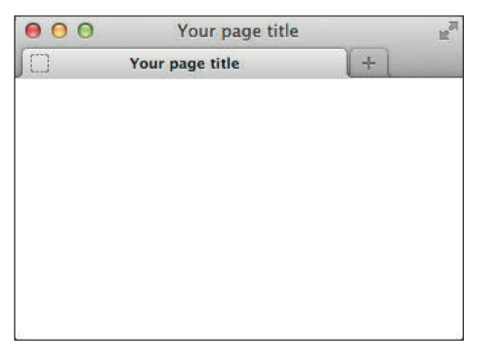

## 简单示例

- 每个网页都包含 DOCTYPE、html、head 和 body 元素， 它们是网页的基础。

  ```html
  <!DOCTYPE html>
  <html lang="en">
  
  <head>
      <meta charset="utf-8" />
      <title>Your page title</title>
  </head>
  
  <body>
  
  </body>
  
  </html>
  ```

- 浏览器中能看到的内容就是 body 元素

- `<html lang="en">` 定义了网页的语言，如果用 chrome 我们可能会看到提示我们是否需要翻译，使用中文的话就是 `<html lang="zh-CN">`

- `<title>Your page title</title>` 定义的是网页标题

  

- 大部分标签都有开始和结束，例如 `<body> xxxContent </body>`，有的标签只有开始没有结束，例如 `<meta />`，在 HTML5 中，空元素结尾处的空格和斜杠是可选的

- `<!DOCTYPE html>` 告诉浏览器这是 HTML5 页面，应该始终位于第一行


## 标签

标签由三部分组成：

- 元素 element
- 属性 attribute
- 值 value

按照惯例， 元素的名称都用小写字母。（大写字母也可以用，但是这种是不推荐的做法）

