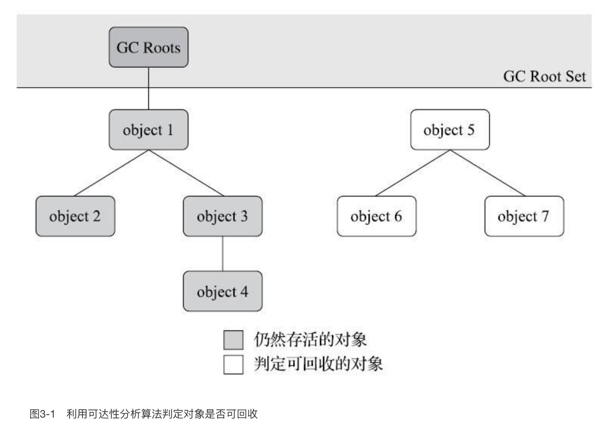

## 为什么栈上没有内存回收

程序计数器、虚拟机栈、本地方法栈3个区域随线程而生，随线程而灭。栈帧随着方法的执行和返回而进入和退出虚拟机栈，所以对于这些内存来说，垃圾收集器不需要去回收他们。随着线程的执行他们都是有条不紊的在使用和回收内存，方法结束了栈帧就自动被回收了，线程结束了虚拟机栈、程序计数器、本地方法栈也就自动被回收了，全程都不需要垃圾收集器来掺和。

## 堆和方法区需要内存回收

Java堆和方法区这两个区域则有着很显著的不确定性：一个接口的多个实现类需要的内存可能会不一样，一个方法所执行的不同条件分支所需要的内存也可能不一样，只有处于运行期间，我们才能知道程序究竟会创建哪些对象，创建多少个对象，这部分内存的分配和回收是动态的。垃圾收集器所关注的正是这部分内存该如何管理，本文后续讨论中的“内存”分配与回收也仅仅特指这一部分内存。

## 引用计数法（并未使用）

原理很简单，就是对象会给自身记录一个引用次数，每有一个指针指向它，引用次数加1，如果引用次数是0，就将对象回收。

但是有个致命的缺点，无法处理循环引用的情况。所以主流的 Java 虚拟机都没有使用这种方法

## 可达性分析算法

现在主流的回收算法，都是通过可达性分析来进行的。这个算法的基本思路就是通过一系列称为“GC Roots”的根对象作为起始节点集，从这些节点开始，根据引用关系向下搜索，搜索过程所走过的路径称为“引用链”（Reference Chain），如果某个对象到GC Roots间没有任何引用链相连，或者用图论的话来说就是从GC Roots到这个对象不可达时，则证明此对象是不可能再被使用的。

> 说白了就是：有一些引用作为根节点，这些根节点一级一级的往下引用，能够引用到的就是还活着的对象，引用不到的就是需要回收的对象
>
> 所谓一级一级引用，它的意思是：一个引用，引用它的对象，然后引用这个对象里面的属性对象，属性对象再引用自己的属性对象

如图

对象object 5、object 6、object 7虽然互有关联，但是它们到GC Roots是不可达的，因此它们将会被判定为可回收的对象。

> GC Roots 走下来的时候，找不到它们，所以它们属于需要回收的对象

GC Roots 包括以下几种：

- 在虚拟机栈（栈帧中的本地变量表）中引用的对象，譬如各个线程被调用的方法堆栈中使用到的参数、局部变量、临时变量等。

  > 这里指的是所有的栈帧，而不是最顶层正在执行的栈帧。只有栈帧滚蛋了，栈帧里引用的对象才能被回收

- 在方法区中类静态属性引用的对象，譬如Java类的引用类型静态变量。

  > 顺带一提，方法区里面存储的静态变量，存的是它的引用值，引用指向的对象依然还是在堆中的

- 在方法区中常量引用的对象，也就是类中使用 `static final` 定义的静态常量（没毛病，跟着类被加载的时候放进方法区）

- 在本地方法栈中JNI（即通常所说的Native方法）引用的对象。（实际来说跟虚拟机栈是一个意思）

- Java虚拟机内部的引用，如基本数据类型对应的Class对象，一些常驻的异常对象（比如NullPointExcepiton、OutOfMemoryError）等，还有系统类加载器。

  > 这些引用都是 JVM 自己单独保留的，对于我们来说基本没有什么讨论的必要。
  >
  > 这一块儿的意思是：JVM（C++代码）中保留了堆里的一个内存地址（C++ 里有个指针变量指向了堆的某个内存地址），而这个内存地址处存着一个 JAVA 对象

- 所有被同步锁（synchronized关键字）持有的对象。
- 反映Java虚拟机内部情况的JMXBean、JVMTI中注册的回调、本地代码缓存等

## 回收前的标记 finalize

> 注意：finalize 方法不推荐使用，以下只是解释其原理，了解即可，最好不要自己去使用

finalize 方法可以使得对象进行自救，如果对象已经是不可达的了，那么虚拟机在以下情况下会执行它的 finalize 方法：

- 对象重写了自己的 finalize 方法
- 对象的 finalize 方法之前没有被虚拟机调用过

> 也就是说，finalize 方法只能调用一次，对象只能自救一次

虚拟机会将对象放置在一个名为F-Queue的队列之中，并在稍后由一条由虚拟机自动建立的、低调度优先级的Finalizer线程去执行它们的finalize()方法。

> 注意：虚拟机仅仅是触发执行对象的 finalize 方法，但并不保证会将其执行完毕，有可能执行了一半提前就不执行了。
>
> 因为如果某个对象的finalize()方法执行缓慢，或者更极端地发生了死循环，将很可能导致F-Queue队列中的其他对象永久处于等待，甚至导致整个内存回收子系统的崩溃

如果对象要在finalize()中成功拯救自己——只要重新与引用链上的任何一个对象建立关联即可，譬如把自己（this关键字）赋值给某个类变量或者对象的成员变量。那么对象就自救成功了，逃过了本轮的回收。

> 但是下一轮就没这么幸运了，finalize 方法最多只会被 JVM 执行一次

## 回收方法区

方法区的垃圾收集主要回收两部分内容：废弃的常量和不再使用的类型。

判定一个类型是否属于“不再被使用的类”的条件就十分苛刻。需要同时满足下面三个条件：

- 该类所有的实例都已经被回收，也就是Java堆中不存在该类及其任何派生子类的实例。
- 加载该类的类加载器已经被回收，这个条件除非是经过精心设计的可替换类加载器的场景，如OSGi、JSP的重加载等，否则通常是很难达成的。
- 该类对应的 java.lang.Class 对象没有在任何地方被引用，无法在任何地方通过反射访问该类的方法。

> Java虚拟机被允许对满足上述三个条件的无用类进行回收，这里说的仅仅是“被允许”，而并不是和对象一样，没有引用了就必然会回收。

相关的 VM 参数

| VM 参数                  | 定义                                        |
| ------------------------ | ------------------------------------------- |
| -Xnoclassgc              | 不进行类型的回收                            |
| -verbose:class           | 跟踪类的加载和卸载信息 （Product版JVM可用） |
| -XX:+TraceClassLoading   | 跟踪类的加载信息 （Product版JVM可用）       |
| -XX:+TraceClassUnloading | 跟踪类的卸载信息 （FastDebug版JVM可用）     |

在大量使用反射、动态代理、CGLib等字节码框架，动态生成JSP以及OSGi这类频繁自定义类加载器的场景中，通常都需要Java虚拟机具备类型卸载的能力，以保证不会对方法区造成过大的内存压力