## Java 堆溢出

Java堆用于储存对象实例，我们只要不断地创建对象，并且保证GC Roots到对象之间有可达路径来避免垃圾回收机制清除这些对象，那么随着对象数量的增加，总容量触及最大堆的容量限制后就会产生内存溢出异常。

```java
public class App {
    static class OOMObject {

    }

    public static void main(String[] args) {
        List<OOMObject> list = new ArrayList<OOMObject>();

        while (true) {
            list.add(new OOMObject());
        }
    }
}
```

我们不停的 new 新对象，加入到 list 后无法被回收，因此终将会导致堆内存溢出

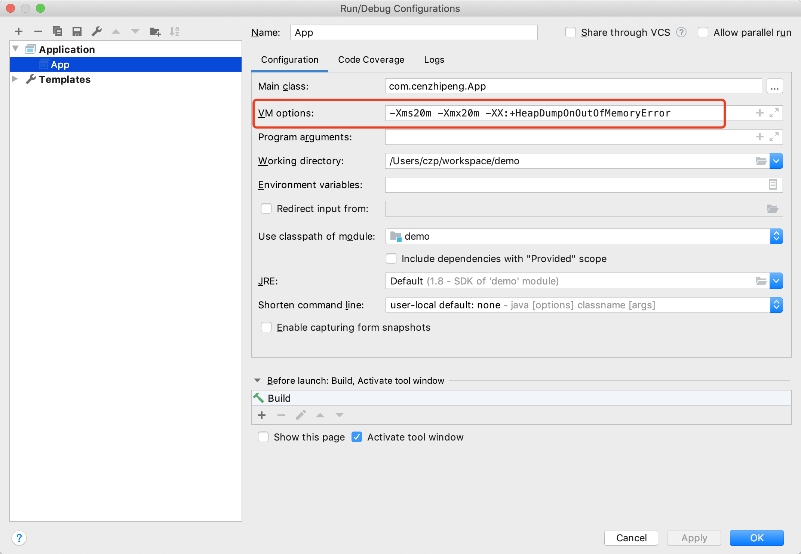

如上 idea 的运行配置，添加了虚拟机参数：

- -Xms20m 表示堆内存最小 20M
- -Xmx20m 表示堆内存最大 20M，如此一来，堆内存就固定 20M，不会动态扩展。一般生产环境都会这样设置，java 进程就不会有申请内存时的波动
- -XX:+HeapDumpOnOutOfMemoryError 表示虚拟机在出现内存溢出异常的时候Dump出当前的内存堆转储快照以便进行事后分析（内存溢出后，生成一个 hprof 文件，里面记录了溢出前的堆内存信息）

此时我们执行这个程序，结果如下

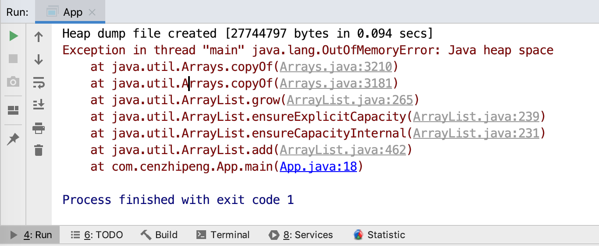

我们会发现，项目根目录下会生成一个 hprof 文件

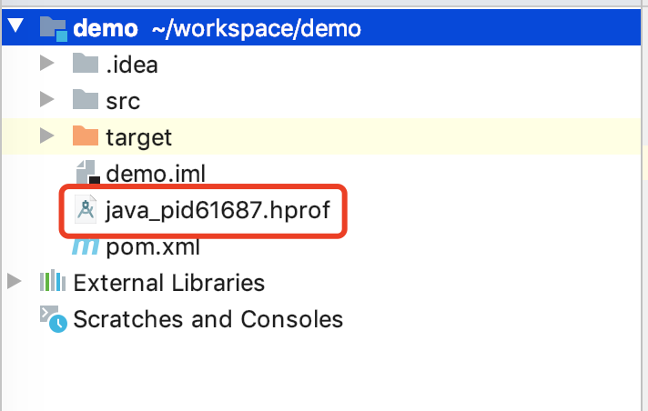

这个文件里记录了堆内存的详情，我们可以使用 JDK 自带的工具 jvisualvm 来查看分析这个文件，在命令行输入

`(py3.5) czp@:~/workspace$ jvisualvm`

将会打开这个 GUI 工具，如图

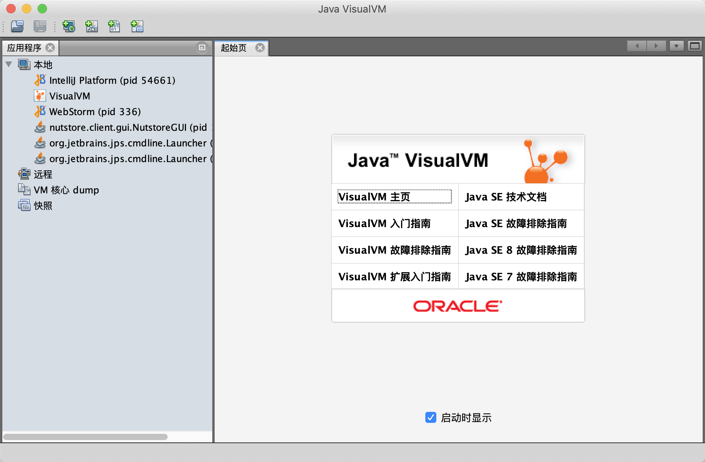

我们可以选择左上角，点击装入快照，然后选择文件格式堆Dump，最后选择我们的 hprof 文件，如下图所示

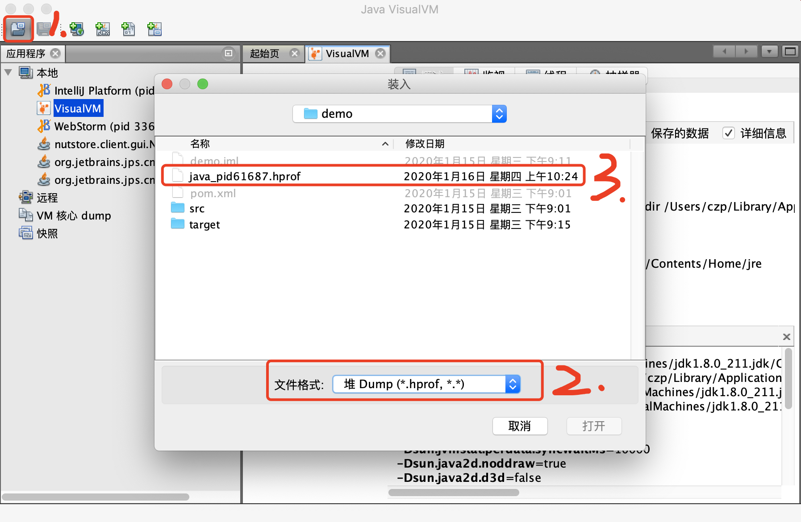

打开类信息，可以看到堆内存中的类和实例的详情

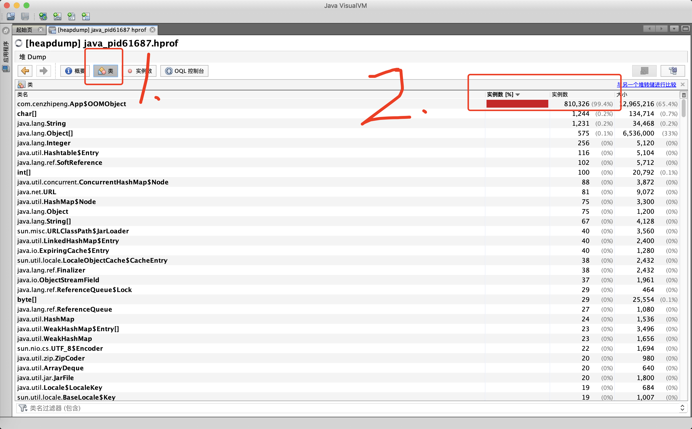

可以看到 OOMObject 这个类的实例数量占了所有实例的 99.4%，这样，我们几乎可以肯定就是这个类导致的 OOM。

然后我们看看概要信息，可以看到导致 OOM 的线程是主线程

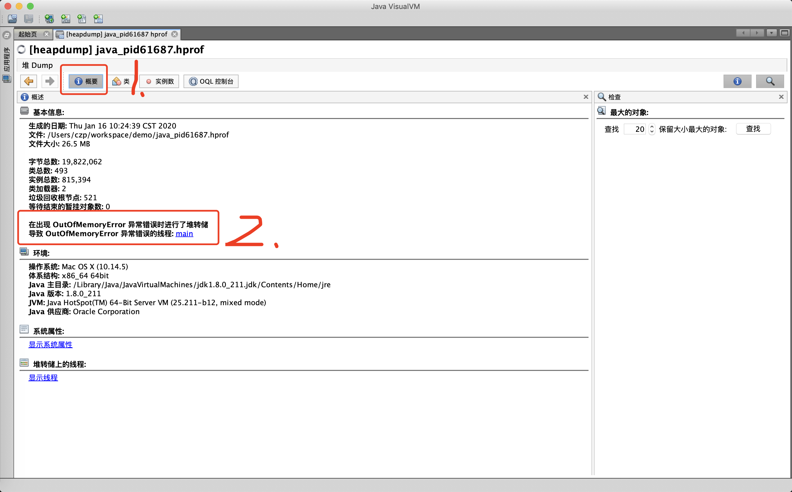


## 虚拟机栈和本地方法栈溢出

由于HotSpot虚拟机中并不区分虚拟机栈和本地方法栈，因此对于HotSpot来说，-Xoss参数（设置本地方法栈大小）虽然存在，但实际上是没有任何效果的，栈容量只能由-Xss参数来设定。（HotSpot 将两种栈合二为一了）

关于虚拟机栈和本地方法栈，在《Java虚拟机规范》中描述了两种异常：

- 如果线程请求的栈深度大于虚拟机所允许的最大深度，将抛出StackOverflowError异常。
- 如果虚拟机的栈内存允许动态扩展，当扩展栈容量无法申请到足够的内存时，将抛出OutOfMemoryError异常。

《Java虚拟机规范》明确允许Java虚拟机实现自行选择是否支持栈的动态扩展，而HotSpot虚拟机的选择是不支持扩展，所以除非在创建线程申请内存时就因无法获得足够内存而出现OutOfMemoryError异常，否则在线程运行时是不会因为扩展而导致内存溢出的，只会因为栈容量无法容纳新的栈帧而导致StackOverflowError异常。

> HotSpot 要么创建线程的时候申请栈内存就 OOM 了，要么线程执行时，达到了栈内存的最大值导致 StackOverflowError

我们使用 2 种方式来测试：

- 使用-Xss参数减少栈内存容量
- 定义大量的本地变量，增大此方法帧中本地变量表的长度

首先测试第一种，调整 -Xss：

```java
public class App {
    private int stackLength = 1;

    public void stackLeak() {
        stackLength++;
        stackLeak();
    }

    public static void main(String[] args) throws Throwable {
        App oom = new App();
        try {
            oom.stackLeak();
        } catch (Throwable e) {
            System.out.println("stack length:" + oom.stackLength);
            throw e;
        }
    }
}
```

VM 参数：-Xss160k

输出：

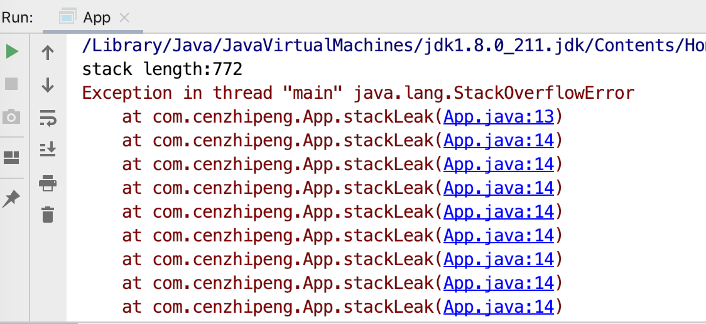

VM 参数：-Xss10M

输出：

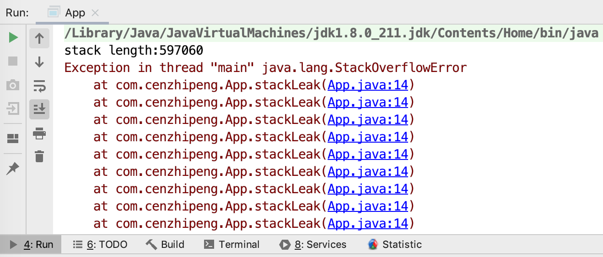

> 可以看到，当我们增大了 -Xss 后，栈的深度明显增加了


接着测试第二种，调整栈帧的大小：

```java
public class App {
    private static int stackLength = 0;

    public static void test() {
        long unused1, unused2, unused3, unused4, unused5,
                unused6, unused7, unused8, unused9, unused10,
                unused11, unused12, unused13, unused14, unused15,
                unused16, unused17, unused18, unused19, unused20,
                unused21, unused22, unused23, unused24, unused25,
                unused26, unused27, unused28, unused29, unused30,
                unused31, unused32, unused33, unused34, unused35,
                unused36, unused37, unused38, unused39, unused40,
                unused41, unused42, unused43, unused44, unused45,
                unused46, unused47, unused48, unused49, unused50,
                unused51, unused52, unused53, unused54, unused55,
                unused56, unused57, unused58, unused59, unused60,
                unused61, unused62, unused63, unused64, unused65,
                unused66, unused67, unused68, unused69, unused70,
                unused71, unused72, unused73, unused74, unused75,
                unused76, unused77, unused78, unused79, unused80,
                unused81, unused82, unused83, unused84, unused85,
                unused86, unused87, unused88, unused89, unused90,
                unused91, unused92, unused93, unused94, unused95,
                unused96, unused97, unused98, unused99, unused100;

        stackLength++;
        test();

        unused1 = unused2 = unused3 = unused4 = unused5 =
        unused6 = unused7 = unused8 = unused9 = unused10 =
        unused11 = unused12 = unused13 = unused14 = unused15 =
        unused16 = unused17 = unused18 = unused19 = unused20 =
        unused21 = unused22 = unused23 = unused24 = unused25 =
        unused26 = unused27 = unused28 = unused29 = unused30 =
        unused31 = unused32 = unused33 = unused34 = unused35 =
        unused36 = unused37 = unused38 = unused39 = unused40 =
        unused41 = unused42 = unused43 = unused44 = unused45 =
        unused46 = unused47 = unused48 = unused49 = unused50 =
        unused51 = unused52 = unused53 = unused54 = unused55 =
        unused56 = unused57 = unused58 = unused59 = unused60 =
        unused61 = unused62 = unused63 = unused64 = unused65 =
        unused66 = unused67 = unused68 = unused69 = unused70 =
        unused71 = unused72 = unused73 = unused74 = unused75 =
        unused76 = unused77 = unused78 = unused79 = unused80 =
        unused81 = unused82 = unused83 = unused84 = unused85 =
        unused86 = unused87 = unused88 = unused89 = unused90 =
        unused91 = unused92 = unused93 = unused94 = unused95 =
        unused96 = unused97 = unused98 = unused99 = unused100 = 0;
    }

    public static void main(String[] args) {
        try {
            test();
        } catch (Error e) {
            System.out.println("stack length:" + stackLength);
            throw e;
        }
    }
}
```

十分丑陋，哈哈。方法里定义了一大堆局部变量，来看看执行结果。

VM 参数：-Xss160k

输出：

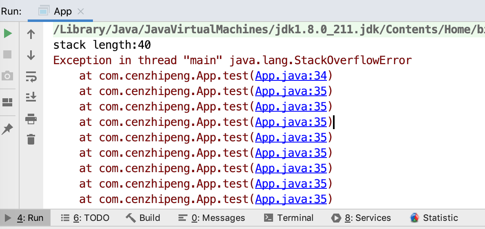

可以看到，栈的深度才40，比第一次相同 -Xss 配置下的 772 少了一个数量级

继续执行第二次，

VM 参数：-Xss10M

输出：

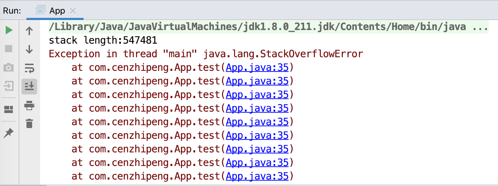

可以看到，栈的深度接近 55w，比第一次相同 -Xss 配置下的 59w 没啥区别，很可能是经过了一些虚拟机的优化


总之，以上测试都表明，HotSpot 在栈内存不足时，抛出的错误都是 StackOverflowError

通过不断建立线程的方式，在HotSpot上也是可以产生内存溢出异常的。但是这样产生的内存溢出异常和栈空间是否足够并不存在任何直接的关系，主要取决于操作系统本身的内存使用状态。甚至可以说，在这种情况下，给每个线程的栈分配的内存越大，反而越容易产生内存溢出异常。（线程栈内存越大，在总内存不变的情况下，显然是能够创建的线程越少）

原因其实不难理解，操作系统分配给每个进程的内存是有限制的，譬如32位Windows的单个进程最大内存限制为2GB。HotSpot虚拟机提供了参数可以控制Java堆和方法区这两部分的内存的最大值，那剩余的内存即为2GB（操作系统限制）减去最大堆容量，再减去最大方法区容量，由于程序计数器消耗内存很小，可以忽略掉，如果把直接内存和虚拟机进程本身耗费的内存也去掉的话，剩下的内存就由虚拟机栈和本地方法栈来分配了。因此为每个线程分配到的栈内存越大，可以建立的线程数量自然就越少，建立线程时就越容易把剩下的内存耗尽。

```java
public class App {
    private void dontStop() {
        while (true) {
        }
    }

    public void stackLeakByThread() {
        while (true) {
            Thread thread = new Thread(new Runnable() {
                @Override
                public void run() {
                    dontStop();
                }
            });
            thread.start();
        }
    }

    public static void main(String[] args) throws Throwable {
        App oom = new App();
        oom.stackLeakByThread();
    }
}
```

VM 参数：-Xss2G （栈内存大的夸张的值）

输出：

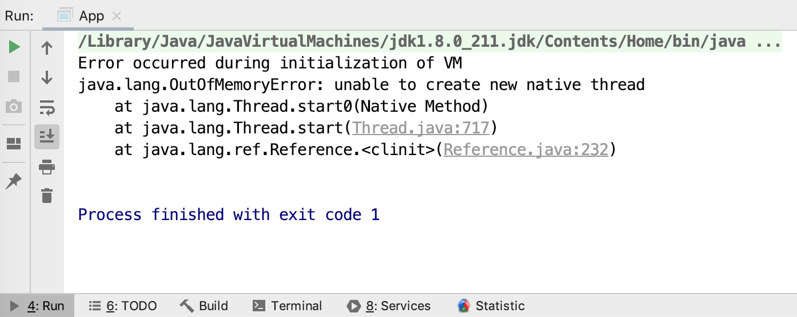

可以看到，无法创建线程了，因为OOM了，主要是因为申请的栈内存太大了

> 如果是建立过多线程导致的内存溢出，在不能减少线程数量或者更换64位虚拟机的情况下，就只能通过减少最大堆和减少栈容量来换取更多的线程。这种通过“减少内存”的手段来解决内存溢出的方式，如果没有这方面处理经验，一般比较难以想到


## 方法区和运行时常量池溢出

方法区和运行时常量池转移到了元空间中，因此，我们想要模拟方法区和运行时常量池的溢出，需要撑爆元空间。元空间里存储的都是类信息，因此我们只有不停的加载很多的类，才有可能撑爆元空间，可以使用动态代理的方式来进行。

```java
public class App {
    public static void main(String[] args) {
        while (true) {
            Enhancer enhancer = new Enhancer();
            enhancer.setSuperclass(OOMObject.class);
            enhancer.setUseCache(false);
            enhancer.setCallback(new MethodInterceptor() {
                public Object intercept(Object obj, Method method, Object[] args, MethodProxy proxy) throws Throwable {
                    return proxy.invokeSuper(obj, args);
                }
            });
            enhancer.create();
        }
    }

    static class OOMObject {
    }
}
```

我们使用CGlib，不停的生成新的类型，JVM就不停的装在类型到方法区(JDK8 元空间)

VM 参数：-XX:MaxMetaspaceSize=30M

输出

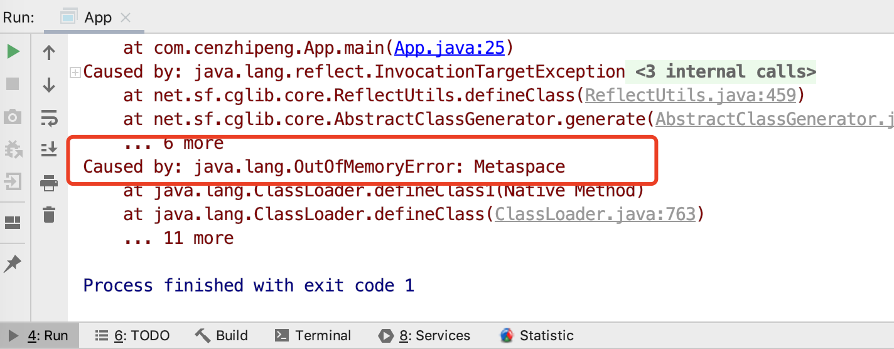

> 如果我们不加 -XX:MaxMetaspaceSize=30M，默认元空间的大小是没有限制的，也就是物理机还剩多少内存，元空间就能扩展到多少内存


## 本机直接内存溢出

直接内存（Direct Memory）的容量大小可通过 -XX：MaxDirectMemorySize 参数来指定，如果不去指定，则默认与 Java 堆最大值（由-Xmx指定）一致。

我们可以使用 Unsafe 来模拟分配直接内存的过程

```java
public class App {
    private static final int _1MB = 1024 * 1024;

    public static void main(String[] args) throws Exception {
        Field unsafeField = Unsafe.class.getDeclaredFields()[0];
        unsafeField.setAccessible(true);
        Unsafe unsafe = (Unsafe) unsafeField.get(null);
        while (true) {
            unsafe.allocateMemory(_1MB);
        }
    }
}
```

VM 参数：-XX:MaxDirectMemorySize=1GB

输出

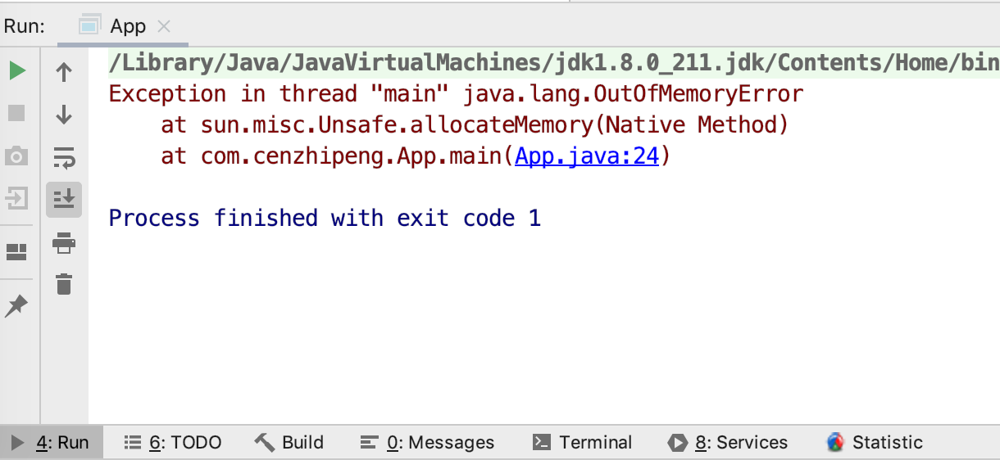

> 由直接内存导致的内存溢出，一个明显的特征是在Heap Dump文件中不会看见有什么明显的异常情况，如果读者发现内存溢出之后产生的Dump文件很小，而程序中又直接或间接使用了DirectMemory（典型的间接使用就是NIO），那就可以考虑重点检查一下直接内存方面的原因了。


