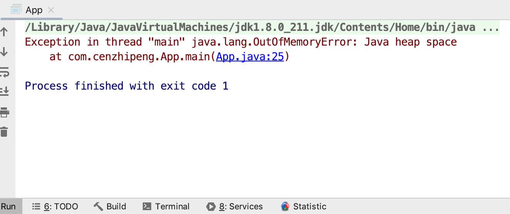
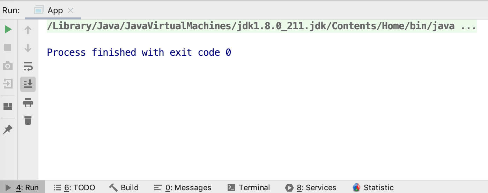
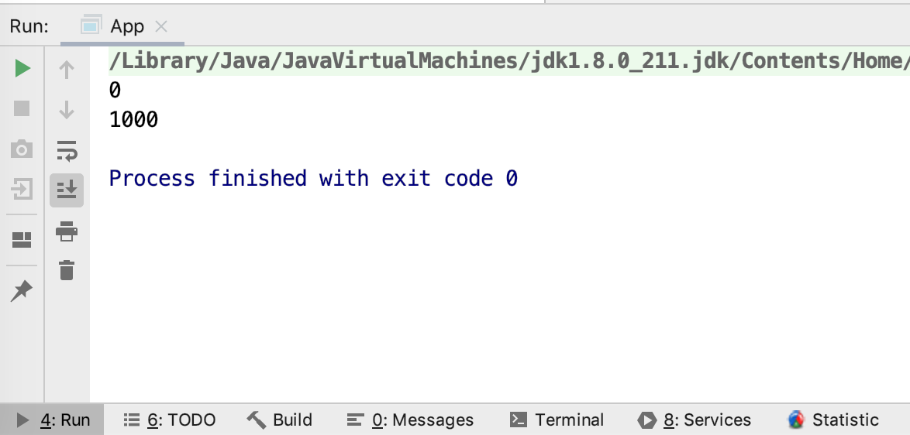
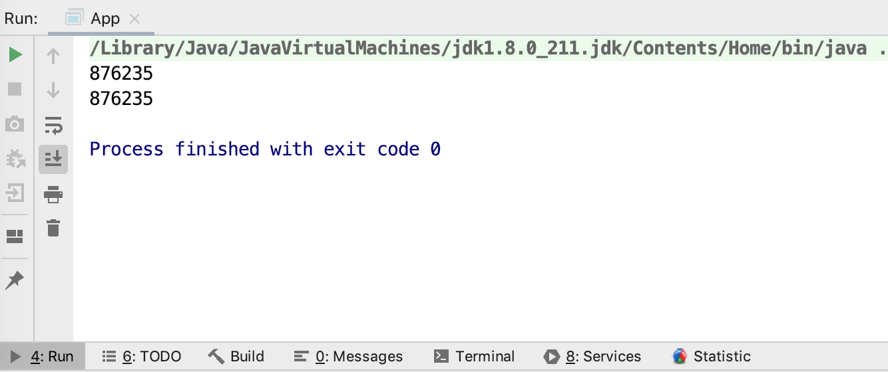

## 四大引用

从 JDK1.2 开始，对象的引用被划分为4种级别，从而使程序能更加灵活地控制对象的生命周期。四大引用分别是：强引用、软引用、弱引用、虚引用

> 也就是说，不同级别的引用，可以控制垃圾收集时不同的行为。从而使得垃圾回收策略可以更加灵活，我们在代码中可以对垃圾收集进行一定的干预

| 引用级别&nbsp;&nbsp;&nbsp;&nbsp;&nbsp;&nbsp;&nbsp;&nbsp;&nbsp;&nbsp;&nbsp;&nbsp;&nbsp;&nbsp;&nbsp;&nbsp;&nbsp;&nbsp;&nbsp;&nbsp;&nbsp;&nbsp; | 对象存活时间                                                 | 如何使用                                                 |
| ------------------------------------------------------------ | ------------------------------------------------------------ | -------------------------------------------------------- |
| 强引用                                                       | 只要强引用存在，被引用的对象一直存活                         | `Object obj=new Object()`                                |
| 软引用                                                       | 只有在即将发生OOM时，被引用的对象才可能会被回收（回收了一部分发现不会OOM了，可能就会剩下一部分不回收） | `SoftReference ref = new SoftReference(obj)`             |
| 弱引用                                                       | 只要垃圾收集器工作时发现了弱引用的对象，就会将其回收，不管内存够不够用，都会回收。 | `WeakReference ref = new WeakReference(obj)`             |
| 虚引用                                                       | 虚引用对引用对象的存活时间毫无影响，有没有虚引用都一样，唯一的作用是可以获知对象何时被回收了 | `PhantomReference ref = new PhantomReference(obj,queue)` |


## 强引用

强引用是最传统的“引用”的定义，是指在程序代码之中普遍存在的引用赋值，即类似“Object obj=new Object()”这种引用关系。无论任何情况下，只要强引用关系还存在，垃圾收集器就永远不会回收掉被引用的对象。当内存空间不足时，JVM 宁愿抛出`OutOfMemoryError`，使程序异常终止，也不会靠随意回收具有强引用的对象来解决内存不足的问题。

显式地设置强引用为 `null`，或让其超出对象的生命周期范围，则垃圾回收器认为该对象不存在引用，就会回收这个对象。具体什么时候收集这要取决于具体的垃圾回收器。

> 栈上只要还存在着 obj 这个引用，那么 obj 引用的对象就绝对不会被回收


## 软引用

软引用是用来描述一些还有用，但非必须的对象。只被软引用关联着的对象，**在系统将要发生内存溢出异常前，会把这些对象列进回收范围之中进行第二次回收**，如果这次回收还没有足够的内存，才会抛出内存溢出异常。在JDK 1.2版之后提供了SoftReference类来实现软引用。

下面我们先来一个强引用版本的代码，妥妥的内存溢出

```java
public class App {
    // 100 个字节
    public static final String s = "00000000000000000000000000000000000000000000000000" +
            "00000000000000000000000000000000000000000000000000";

    public static void main(String[] args) throws Exception {
        // 100w 个字符串 (1M 个)
        String[] strs = new String[1000_000];
        for (int i = 0; i < 1000_000; i++) {
            strs[i] = new String(s + i);
        }
    }
}
```

VM 参数：-Xmx100M -XX:-UseGCOverheadLimit

解释：设置堆最大是100M，然后取消 GC 超时的检查，默认有这个检查，检测到超过98%的时间用来做GC并且回收了不到2%的堆内存时，会提前抛出错误：GC overhead limit exceeded，相当于提前预测将会发生 OOM。（实际此时还没有真正 OOM）

输出



> 可以看到，妥妥的内存溢出了，我们定义了100w 个字符串引用，每个引用都是强引用，引用的都是不同的字符串对象，每个大概 100 个字节，加上一些乱七八糟的内存，堆内存妥妥的超过了 100M，而且由于这些字符串都被强引用引用着，所以无法被回收，直接OOM了

接下来，看看软引用的版本，妥妥的内存不会溢出

```java
public class App {
    // 100 个字节
    public static final String s = "00000000000000000000000000000000000000000000000000" +
            "00000000000000000000000000000000000000000000000000";

    public static void main(String[] args) throws Exception {
        // 100w 个字符串 (1M 个)
        SoftReference<String>[] strs = new SoftReference[1000_000];
        for (int i = 0; i < 1000_000; i++) {
            strs[i] = new SoftReference<>(new String(s + i));
        }
    }
}
```

VM 参数：-Xmx100M -XX:-UseGCOverheadLimit

输出



> 可以看到，程序正常结束了，没有爆出 OOM，这个原因就是当内存不足，需要垃圾收集器工作时，碰到只有软引用的对象，会将其进行回收。
>
> 也就是说：软引用的对象，在内存不足时会被回收。如果回收后内存还是不够，才会爆出 OOM

软引用的使用场景多是`内存敏感的高速缓存`。具体来说，就是我们希望将数据存放到缓存中，这样可以快速进行读取。但是，当 JVM 中内存不够用时，我们又不希望缓存数据会占用到 JVM 的内存。


## 弱引用

弱引用也是用来描述那些非必须对象，但是它的强度比软引用更弱一些，被弱引用关联的对象只能生存到下一次垃圾收集发生为止。当垃圾收集器开始工作，**无论当前内存是否足够，都会回收掉只被弱引用关联的对象**。在JDK 1.2版之后提供了WeakReference类来实现弱引用。

不过，由于垃圾回收器是一个优先级很低的线程，因此不一定会很快发现那些只具有弱引用的对象。

下面我们来一个弱引用版本的演示

```java
public class App {
    // 100 个字节
    public static final String s = "00000000000000000000000000000000000000000000000000" +
            "00000000000000000000000000000000000000000000000000";

    public static void main(String[] args) throws Exception {

        // 1000 个字符串
        WeakReference<String>[] strs = new WeakReference[1000];
        for (int i = 0; i < 1000; i++) {
            strs[i] = new WeakReference<>(new String(s + i));
        }
        int count = 0;
        for (int i = 0; i < 1000; i++) {
            if (strs[i].get() == null) {
                count++;
            }
        }
        System.out.println(count);
        System.gc();
        Thread.sleep(1000);
        count = 0;
        for (int i = 0; i < 1000; i++) {
            if (strs[i].get() == null) {
                count++;
            }
        }
        System.out.println(count);
    }
}
```

VM 参数：-Xmx1000M -XX:-UseGCOverheadLimit

输出



> 我们首先第一遍统计被 GC 了的弱引用对象时，输出是 0，也就是全都没被回收
>
> 第二遍统计之前，先调用 `System.gc()` 通知 JVM 进行 GC，这个方法的含义大致是：JVM ，我这里有垃圾了，派人来扫一下。JVM 收到通知后，可能会立刻派人来扫垃圾，也可能会过一会儿来扫垃圾。总之是不一定会立刻开始 GC。
>
> 然后等待 1 秒，再次统计被 GC 了的弱引用对象时，输出是 1000，也就是说，全都被回收了。实际来说，此时堆内存还是相当充足的，但是依然会回收弱引用对象


## 虚引用

虚引用也称为“幽灵引用”或者“幻影引用”，它是最弱的一种引用关系。一个对象是否有虚引用的存在，完全不会对其生存时间构成影响，也无法通过虚引用来取得一个对象实例。为一个对象设置虚引用关联的唯一目的只是为了能在这个对象被收集器回收时收到一个系统通知。在JDK 1.2版之后提供了PhantomReference类来实现虚引用。

> 虚引用的作用，仅仅是在它引用的对象被回收时，咱们能够获取这个消息。有没有虚引用完全不影响对象是否被回收的行为。
>
> 所以虚引用必须配合引用队列来使用，否则虚引用完全没有意义

```java
String str = new String("abc");
    ReferenceQueue queue = new ReferenceQueue();
    // 创建虚引用，要求必须与一个引用队列关联
    PhantomReference pr = new PhantomReference(str, queue);
```

> 注意这里，我们通过虚引用是完全不可能取到这个对象的，仅仅是我们使用 `queue.poll` 时，可以知道哪些虚引用的引用对象被回收了


## 引用队列

引用队列 ReferenceQueue 可以在引用对应的对象被回收后，将引用加入到引用队列中。例如：软引用 ref1 对应的对象 obj1 被回收了，那么 ref1 这个引用本身则会进入到引用队列中，可以被从队列中取出来。**这样子，我们就可以从引用队列中获知到：该引用对应的对象被回收了**

```java
public class App {
    // 100 个字节
    public static final String s = "00000000000000000000000000000000000000000000000000" +
            "00000000000000000000000000000000000000000000000000";

    public static void main(String[] args) throws Exception {
        ReferenceQueue<String> queue = new ReferenceQueue<>();
        // 100w 个字符串 (1M 个)
        SoftReference<String>[] strs = new SoftReference[1000_000];
        for (int i = 0; i < 1000_000; i++) {
            strs[i] = new SoftReference<>(new String(s + i), queue);
        }
        int count = 0;
        // 等它回收内存
        Thread.sleep(3000);
        while (queue.poll() != null) {
            count++;
        }
        int count2 = 0;
        for (int i = 0; i < 1000_000; i++) {
            if (strs[i].get() == null) {
                count2++;
            }
        }
        System.out.println(count);
        System.out.println(count2);
    }
}
```

VM 参数：-Xmx100M -XX:-UseGCOverheadLimit

输出



> 可以看到，有一部分软引用对应的对象被回收了，而且被回收的对象的软引用都进入到了引用队列中。
>
> 注意：这里引用队列仅仅是保存了软引用，软引用所引用的对象的确已经被回收了，所以如果我们取出引用队列里的软引用，调用它的 `get` 方法想获取引用的对象时，获取到的是 null，因为对象已经被回收了


## WeakHashMap

简单原理如下：

- 所有的 key 在内部的 entry 中都保留的是一个弱引用，所有 key 的弱引用都关联到一个引用队列 queue
- 我们存入 WeakHashMap 的 key 由于是弱引用，所以 key 随时会被回收
- 当我们调用 WeakHashMap 的 set、get、size 等方法时，内部最终会调用一个方法叫做 `expungeStaleEntries`，该方法会遍历 queue，然后取出被回收了的 key 对应的 entry
- 在 WeakHashMap 中去掉该 entry，entry 的 value 置为 null，从而达到回收 value 的效果

> 也就是说，如果我们不调用 WeakHashMap 的这些触发回收 value 的方法，那么即使 key 被回收了，map 中的 value 依然不会被回收，依然会有强引用指向它们

