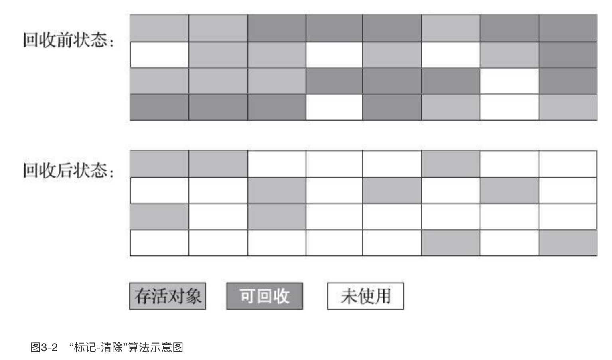
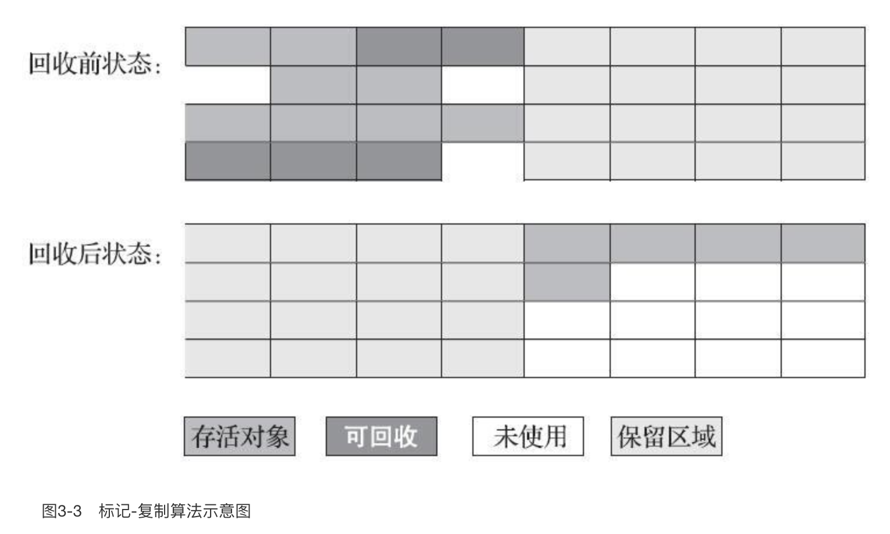
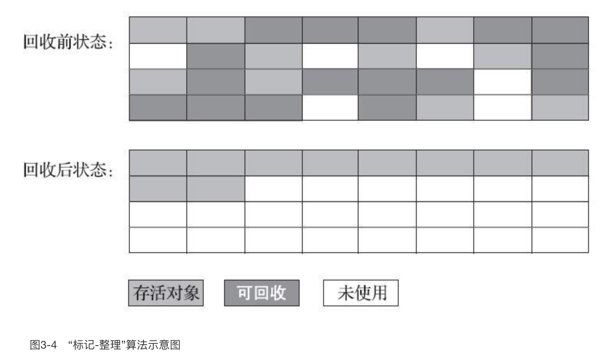

## GC 的种类

- 部分收集（Partial GC）：指目标不是完整收集整个Java堆的垃圾收集，其中又分为：

  - 新生代收集（Minor GC/Young GC）：指目标只是新生代的垃圾收集。

  - 老年代收集（Major GC/Old GC）：指目标只是老年代的垃圾收集。

    > 目前只有CMS收集器会有单独收集老年代的行为。另外请注意“Major GC”这个说法现在有点混淆，在不同资料上常有不同所指，读者需按上下文区分到底是指老年代的收集还是整堆收集。

  - 混合收集（Mixed GC）：指目标是收集整个新生代以及部分老年代的垃圾收集。目前只有G1收集器会有这种行为。

- 整堆收集（Full GC）：收集整个Java堆和方法区的垃圾收集。

## 分代收集的经验

分代收集算法建立在一些假说上：

- 弱分代假说（Weak Generational Hypothesis）：绝大多数对象都是朝生夕灭的。

- 强分代假说（Strong Generational Hypothesis）：熬过越多次垃圾收集过程的对象就越难以消亡。

- 跨代引用假说（Intergenerational Reference Hypothesis）：跨代引用相对于同代引用来说仅占极少数。

  > 这条假说是指：老年代很少引用新生代对象，新生代很少引用老年代对象
  >
  > 隐含推论：存在互相引用关系的两个对象，是应该倾向于同时生存或者同时消亡的

  

这些分代假说共同奠定了多款常用的垃圾收集器的一致的设计原则：收集器应该将Java堆划分出不同的区域，然后将回收对象依据其年龄（年龄即对象熬过垃圾收集过程的次数）分配到不同的区域之中存储。

在Java堆划分出不同的区域之后，垃圾收集器才可以每次只回收其中某一个或者某些部分的区域——因而才有了“Minor GC”“Major GC”“Full GC”这样的回收类型的划分；也才能够针对不同的区域安排与里面存储对象存亡特征相匹配的垃圾收集算法——因而发展出了“标记-复制算法”“标记-清除算法”“标记-整理算法”等针对性的垃圾收集算法。

商用的 JVM 里，设计者一般至少会把Java堆划分为新生代（Young Generation）和老年代（Old Generation）两个区域。顾名思义，在新生代中，每次垃圾收集时都发现有大批对象死去，而每次回收后存活的少量对象，将会逐步晋升到老年代中存放。

> 也就是：对象一开始都在新生代，回收了几轮了还没被回收的对象，慢慢的就滚到老年代去了，等老年代满了，就一次性去搞一下老年代的对象。
>
> 这样回收老年代的频率就降低了：老年代的回收效果又差，速度又慢，所以回收次数越少越好

## 标记-清除算法

如它的名字一样，算法分为“标记”和“清除”两个阶段：

- 首先标记出所有需要回收的对象，在标记完成后，
- 统一回收掉所有被标记的对象，

也可以反过来，标记存活的对象，统一回收所有未被标记的对象。标记过程就是对象是否属于垃圾的判定过程，这在前一节讲述垃圾对象标记判定算法时其实已经介绍过了。

它的主要缺点有两个：

- 第一个是执行效率不稳定，如果Java堆中包含大量对象，而且其中大部分是需要被回收的，这时必须进行大量标记和清除的动作，导致标记和清除两个过程的执行效率都随对象数量增长而降低；
- 第二个是内存空间的碎片化问题，标记、清除之后会产生大量不连续的内存碎片，空间碎片太多可能会导致当以后在程序运行过程中需要分配较大对象时无法找到足够的连续内存而不得不提前触发另一次垃圾收集动作。

标记-清除算法的执行过程如图所示

可以看到，回收后，堆内存破破烂烂的，东一块西一块，不是一块完整的内存。

## 标记-复制算法

这种算法将可用内存按容量划分为大小相等的两块，每次只使用其中的一块。当这一块的内存用完了，就将还存活着的对象复制到另外一块上面，然后再把已使用过的内存空间一次清理掉。

如果内存中多数对象都是存活的，这种算法将会产生大量的内存间复制的开销，但对于多数对象都是可回收的情况，算法需要复制的就是占少数的存活对象，而且每次都是针对整个半区进行内存回收，分配内存时也就不用考虑有空间碎片的复杂情况，只要移动堆顶指针，按顺序分配即可。这样实现简单，运行高效，不过其缺陷也显而易见，这种复制回收算法的代价是将可用内存缩小为了原来的一半，空间浪费未免太多了一点。

> 优点：简单、而且内存是连续的
>
> 缺点：浪费了一半的内存，如果每次回收的对象少的话，内存复制的开销非常大

标记-复制算法的执行过程如图所示

可以看到，回收后的内存是连续的，主要的缺点是浪费的内存太多

IBM公司曾有一项专门研究对新生代“朝生夕灭”的特点做了更量化的诠释——新生代中的对象有98%熬不过第一轮收集。因此并不需要按照1∶1的比例来划分新生代的内存空间。

## 优化后的标记-复制算法 （JVM采用的方法）

上面的算法，明显内存空间浪费太多了。由于新生代的对象存活实际上来说是非常少的，所以其实有可以优化的方法：

- 把新生代分为一块较大的Eden空间和两块较小的Survivor空间
- 每次分配内存只使用Eden和其中一块Survivor
- 发生垃圾搜集时，将Eden和Survivor中仍然存活的对象一次性复制到另外一块Survivor空间上
- 然后直接清理掉Eden和已用过的那块Survivor空间

> 也就是说，把新生代分为 1大2小的空间，比例是 8:1:1
>
> 也即每次新生代中可用内存空间为整个新生代容量的90%（Eden的80%加上一个Survivor的10%），只有一个Survivor空间，即10%的新生代是会被“浪费”的

当出现极端一点的情况：新生代内存回收后，存活的对象大小大于一个 Survivor 的大小，这时候就把放不下的直接扔到老年代去了。（所以老年代是会慢慢堆积的，而不会直接在老年代进行内存分配）这种情况被称为分配担保（Handle Promotion）。

## 标记-整理算法

标记-复制算法在对象存活率较高时就要进行较多的复制操作，效率将会降低。更关键的是，如果不想浪费50%的空间，就需要有额外的空间进行分配担保，以应对被使用的内存中所有对象都100%存活的极端情况，所以在老年代一般不能直接选用这种算法。

针对老年代对象的存亡特征，1974年Edward Lueders提出了另外一种有针对性的“标记-整理”（Mark-Compact）算法，其中的标记过程仍然与“标记-清除”算法一样，但后续步骤不是直接对可回收对象进行清理，而是让所有存活的对象都向内存空间一端移动，然后直接清理掉边界以外的内存，“标记-整理”算法的示意图如图所示。

> 说白了就是：标记清除后，将内存再重新整成一整块儿，杜绝了内存的碎片化趋势

如果移动存活对象，尤其是在老年代这种每次回收都有大量对象存活区域，移动存活对象并更新所有引用这些对象的地方将会是一种极为负重的操作，而且这种对象移动操作必须全程暂停用户应用程序才能进行，这就更加让使用者不得不小心翼翼地权衡其弊端了，像这样的停顿被最初的虚拟机设计者形象地描述为“Stop The World”。（所以说，触发老年代的回收是真的麻烦）

