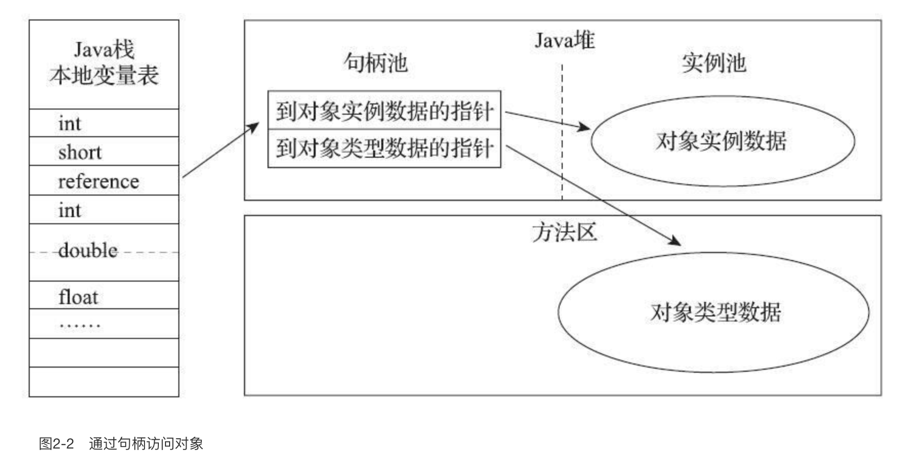

## 对象的创建过程

一般主要过程如下：

- new 指令，生成类的对象的指令
- 检查类是否加载、解析、初始化过
- 在堆上分配一个对象的固定内存大小出来（编译时就可以知道这个对象本身需要占用多少内存）
- 将这片内存全部赋值为零值
- 设置对象头
- 执行初始化方法

### 类加载检查

当Java虚拟机遇到一条字节码new指令时，首先将去检查这个指令的参数是否能在常量池中定位到一个类的符号引用，并且**检查这个符号引用代表的类是否已被加载、解析和初始化过**。如果没有，那必须先执行相应的类加载过程。

在类加载检查通过后，接下来虚拟机将为新生对象**分配内存**。对象所需内存的大小在类加载完成后便可完全确定：

- 原始类型：按照原始类型的固定值计算，很简单，例如布尔值一个字节，整数值四个字节
- 引用类型：按照指针大小计算，一般是八个或者四个字节
  - 同时再在引用的地址上分配引用的这个对象本身所占用的内存，类似一个递归的过程
  - 一直到最终的底层对象，全部都是原始值，或者是一个字符串常量，占用的内存大小是确定的

### 对象在堆上的内存划分

为对象分配空间的任务实际上便等同于把一块确定大小的内存块从Java堆中划分出来，这种划分有分两种情况：

- 如果Java堆中内存是绝对规整的，所有被使用过的内存都被放在一边，空闲的内存被放在另一边，中间放着一个指针作为分界点的指示器，那所分配内存就仅仅是把那个指针向空闲空间方向挪动一段与对象大小相等的距离，这种分配方式称为“指针碰撞”
- 如果Java堆中的内存并不是规整的，已被使用的内存和空闲的内存相互交错在一起，那就没有办法简单地进行指针碰撞了，虚拟机就必须维护一个列表，记录上哪些内存块是可用的，在分配的时候从列表中找到一块足够大的空间划分给对象实例，并更新列表上的记录，这种分配方式称为“空闲列表”

因此，选择何种划分主要取决于堆是否规整，而堆是否规整又取决于垃圾收集器，是否具有压缩整理功能。最简单的标记清除方式，即使一开始堆是规整的，经过垃圾回收后，也会变的不规整，因为必然有的对象被回收有的没有被回收。

因此，当使用Serial、ParNew等带压缩整理过程的收集器时，系统采用的分配算法是指针碰撞，既简单又高效；而当使用CMS这种基于清除（Sweep）算法的收集器时，理论上就只能采用较为复杂的空闲列表来分配内存。

> 强调“理论上”是因为在CMS的实现里面，为了能在多数情况下分配得更快，设计了一个叫作Linear Allocation Buffer的分配缓冲区，通过空闲列表拿到一大块分配缓冲区之后，在它里面仍然可以使用指针碰撞方式来分配。

### 对象创建的并发问题

对象是在堆中创建的，堆是所有线程共享的内存区域，那么当我们多个线程执行时，多个线程都会想要在堆上分配内存去创建对象。这时，就会出现一个问题：多个线程同时去操作堆的分界指针，或者是空闲列表，导致了创建对象的并发的问题。可能出现正在给对象A分配内存，指针还没来得及修改，对象B又同时使用了原来的指针来分配内存的情况。

解决这个问题有两种可选方案：

- 一种是对分配内存空间的动作进行同步处理——实际上虚拟机是采用CAS配上失败重试的方式保证更新操作的原子性；

- 另外一种是把内存分配的动作按照线程划分在不同的空间之中进行，即每个线程在Java堆中预先分配一小块内存，称为本地线程分配缓冲（Thread Local Allocation Buffer，TLAB），哪个线程要分配内存，就在哪个线程的本地缓冲区中分配，只有本地缓冲区用完了，分配新的缓存区时才需要同步锁定。虚拟机是否使用TLAB，可以通过-XX：+/-UseTLAB参数来设定。

  > 这种方式就是说：堆上有属于各个线程自己的一片空间，线程为自己新创建的对象分配内存时，先分配自己的堆空间，此时不需要竞争。如果自己的堆空间不够了，再去全局的堆空间上分配，此时需要使用CAS来竞争

### 对象内存空间赋零值

内存分配完成之后，虚拟机必须将分配到的内存空间（但不包括对象头）都初始化为零值，如果使用了TLAB的话，这一项工作也可以提前至TLAB分配时顺便进行。这步操作保证了对象的实例字段在Java代码中可以不赋初始值就直接使用，使程序能访问到这些字段的数据类型所对应的零值。

### 设置对象头

接下来，Java虚拟机还要对对象进行必要的设置，例如这个对象是哪个类的实例、如何才能找到类的元数据信息、对象的哈希码（实际上对象的哈希码会延后到真正调用Object::hashCode()方法时才计算）、对象的GC分代年龄等信息。这些信息存放在对象的对象头（Object Header）之中。根据虚拟机当前运行状态的不同，如是否启用偏向锁等，对象头会有不同的设置方式。关于对象头的具体内容，稍后会详细介绍。

### 执行初始化方法

在上面工作都完成之后，从虚拟机的视角来看，一个新的对象已经产生了。但是从Java程序的视角看来，对象创建才刚刚开始——构造函数，即Class文件中的< init >()方法还没有执行，所有的字段都为默认的零值，对象需要的其他资源和状态信息也还没有按照预定的意图构造好。一般来说（由字节码流中new指令后面是否跟随invokespecial指令所决定，Java编译器会在遇到new关键字的地方同时生成这两条字节码指令，但如果直接通过其他方式产生的则不一定如此），new指令之后会接着执行< init >()方法，按照程序员的意愿对对象进行初始化，这样一个真正可用的对象才算完全被构造出来。

## 对象的内存布局

在HotSpot虚拟机里，对象在堆内存中的存储布局可以划分为三个部分：对象头（Header）、实例数据（Instance Data）和对齐填充（Padding）。

### 对象头

HotSpot虚拟机中，对象头有两类数据，一类是对象本身的运行时数据，另一类是类型指针。

**运行时数据**

- hash 码
- GC 分代年龄
- 锁状态标志
- 线程持有的锁
- 偏向线程 ID
- 偏向时间戳等

以上这些数据，长度在32位和64位的虚拟机（未开启压缩指针）中分别为32个比特和64个比特，官方称它为“Mark Word”

这些数据加起来其实已经超过了32位或者64位，为了更高效的空间存储，Mark Word被设计成一个有着动态定义的数据结构，以便在极小的空间内存储尽量多的数据，根据对象的状态复用自己的存储空间。

例如在32位的HotSpot虚拟机中，如对象未被同步锁锁定的状态下，Mark Word的32个比特存储空间中的25个比特用于存储对象哈希码，4个比特用于存储对象分代年龄，2个比特用于存储锁标志位，1个比特固定为0

在其他状态（轻量级锁定、重量级锁定、GC标记、可偏向）下对象的存储内容如表所示

> 也就是说，对象处于不同的状态时，对象头的 Mark Word 存储的内容都是不一样的
>
> 如上所说：
>
> - 对象没被锁标记时，存储的是 hash码、分代年龄、锁标志位 01、固定的0
> - 对象被轻量级锁定时，存储的是 指向锁记录的指针、锁标志位 00
> - 重量级锁时，存储的是 指向重量级锁的指针、锁标志位 10
> - GC 标记时，存储的是 空内容、锁标志位 11
> - 可偏向锁时，存储的是 偏向线程ID、偏向时间戳、分代年龄、锁标志位 01
>
> 也就是说，我们首先根据锁标志位，可以判断对象处于什么状态，然后根据不同的状态，可以得到对象的不同的数据，例如分代年龄、偏向线程ID、hash码等等

**类型指针**

即对象指向它的类型元数据的指针，Java虚拟机通过这个指针来确定该对象是哪个类的实例。（HotSpot是如此实现的，别的虚拟机不一定是这样实现的）

此外，如果对象是一个Java数组，那在对象头中还必须有一块用于记录数组长度的数据，因为虚拟机可以通过普通Java对象的元数据信息确定Java对象的大小，但是如果数组的长度是不确定的，将无法通过元数据中的信息推断出数组的大小。（对象元数据记录了对象类型，而通过类型是可以知道一个对象占用多少内存的）

### 实例数据

实例数据是对象存储的真正有效的信息，也就是我们定义的字段。无论是从父类继承下来的，还是在子类中定义的字段都在这里进行存储。

这部分的存储顺序会受到虚拟机分配策略参数（-XX：FieldsAllocationStyle参数）和字段在Java源码中定义顺序的影响。

HotSpot虚拟机默认的分配顺序为longs/doubles、ints、shorts/chars、bytes/booleans、oops（Ordinary Object Pointers，OOPs）

> 首先存储原始类型，从长到短存储。
>
> 然后是按照字典序，存储指针类型。

在满足这个前提条件的情况下，在父类中定义的变量会出现在子类之前。如果HotSpot虚拟机的+XX：CompactFields参数值为true（默认就为true），那子类之中较窄的变量也允许插入父类变量的空隙之中，以节省出一点点空间。

### 对齐填充

这并不是必然存在的，也没有特别的含义，它仅仅起着占位符的作用。由于HotSpot虚拟机的自动内存管理系统要求对象起始地址必须是8字节的整数倍，换句话说就是任何对象的大小都必须是8字节的整数倍。对象头部分已经被精心设计成正好是8字节的倍数（1倍或者2倍），因此，如果对象实例数据部分没有对齐的话，就需要通过对齐填充来补全。

## 对象的访问

我们写代码的时候，都是通过一个引用去使用这个引用代表的对象。引用其实是处于虚拟机栈上的栈帧的局部变量表里。引用本身的大小是固定的，8个字节（没有开启指针压缩的时候），可以理解成一个类似于数字的值。

实际上来说，虚拟机要做的工作就是从这个引用值，定位到这个引用值代表的对象，一共有2种方式：

- 直接指针，也就是说引用记录的值就是对象在内存中的地址（进程的内存空间地址），那么根据这个内存地址的值，就可以索引到引用的对象了，也就是说：引用 ---> 对象

  

- 句柄，也就是说 Java 堆专门开辟了一块儿空间用来存储句柄，一个句柄记录了一个对象的内存地址信息，而我们的引用则是记录了句柄的内存地址，也就是说：引用 ---> 句柄 ---> 对象

  

这两种方式有各自不同的优缺点：

- 使用直接指针，速度更快。因为少了一次索引的过程，指针可以直接索引到对象。（HotSpot 主要就使用这种方式）但是缺点是当垃圾回收后，需要去修改引用的值，因为对象的内存地址经过垃圾回收后可能发生了变化
- 使用句柄，当垃圾回收后，引用不需要修改，只需要修改句柄即可。也就是说引用的值是稳定的

