## CSS 注释

使用 `/* 注释内容 */` 来进行注释


## 字体样式

| 属性值      | 说明     |
| ----------- | -------- |
| font-family | 字体类型 |
| font-size   | 字体大小 |
| font-weight | 字体粗细 |
| font-style  | 字体斜体 |
| color       | 字体颜色 |

### font-family

语法：`font-family: 字体1,字体2,字体3;`

> 可以指定多种字体，按照顺序进行排序，直到遇到第一个客户端可以使用的字体

### font-size

语法：`font-size: 关键字/像素值;`

> 有两种赋值方式，关键字和像素值px

**以关键字为属性值**

| 属性值   | 说明 |
| -------- | ---- |
| xx-small | 最小 |
| x-small  | 较小 |
| small    | 小   |
| medium   | 中等 |
| large    | 大   |
| x-large  | 较大 |
| xx-large | 最大 |

更流行的方式是用 px 作为单位来赋值。一个 px 就是屏幕的一个像素点。对于不同尺寸的屏幕，像素点的大小可能不一样：比如100寸和10寸的屏幕，面积相差100倍，如果都是100w像素，那么100寸屏幕的像素点肯定是10寸屏幕的像素点的面积的100倍。

一般 15px 是较为正常的文字大小

### color

语法：`color: 颜色值;`

颜色值是关键字，或者是16进账的 RGB 值

关键字就是颜色单词例如：red、blue、green等

16进制 RGB 就是类似于 `#FBF9D0` 这种值，分别表示红绿蓝三种颜色的大小（三原色）

### font-weight

语法：`font-weight: 关键字/100-900的数值;`

**关键字有**

| 属性值  | 说明 |
| ------- | ---- |
| normal  | 正常 |
| lighter | 较细 |
| bold    | 较粗 |
| bolder  | 很粗 |

400 是 normal

700 是 bold

### font-style

语法：`font-style: 关键字;`

**关键字有**

| 属性值  | 说明                                                         |
| ------- | ------------------------------------------------------------ |
| normal  | 正常                                                         |
| italic  | 斜体                                                         |
| oblique | 将字体倾斜（有的字体没有 italic 属性，要使用 oblique，这类字体可能只有正常的字体，没有倾斜的字体，使用 oblique 强制显示倾斜） |


## 文本样式

| 属性值          | 说明                                                 |
| --------------- | ---------------------------------------------------- |
| text-decoration | 下划线、删除线、顶划线 三种                          |
| text-transform  | 文本大小写                                           |
| font-variant    | 将英文文本转换为"小型"大写字母（就是显示的时候变小） |
| text-indent     | 段落首行缩进                                         |
| text-align      | 文本水平对齐方式                                     |
| line-height     | 行高                                                 |
| letter-spacing  | 字距                                                 |
| word-spacing    | 词距                                                 |

### text-decoration

语法：`text-decoration: 属性值`

**属性值有**

| 属性值       | 说明                     |
| ------------ | ------------------------ |
| none         | 默认值，就是三种线都没有 |
| underline    | 下划线                   |
| line-through | 删除线                   |
| overline     | 顶划线                   |

> a 标签的文本默认有下划线，使用 `text-decoration: none` 可以去除（基本都是这么使用的）

### text-transform

语法：`text-transform: 属性值`

**属性值有**

| 属性值     | 说明           |
| ---------- | -------------- |
| none       | 默认值，不转换 |
| uppercase  | 转换成大写     |
| lowercase  | 转换成小写     |
| capitalize | 单词首字母大写 |

### font-variant

语法：`font-variant: normal/small-caps`

| 属性值     | 说明           |
| ---------- | -------------- |
| normal     | 默认值，没变化 |
| small-caps | 小型大写字母   |

> 很少用到

### text-indent

语法：`text-indent: 像素值;`

> 表示段落的首行缩进值，要缩进 2 个字的距离，就应该设置为 font-size 的两倍

### text-align

语法：`text-align 属性值;`

| 属性值 | 说明           |
| ------ | -------------- |
| left   | 默认值，左对齐 |
| center | 中间对齐       |
| right  | 右对齐         |

> 只能针对文本文字和 img 标签，其它标签无效

### line-height

语法：`line-height: 像素值;`

表示的是一行的高度，与行间距是不一样的

### letter-spacing 和 word-spacing

语法：`letter-spacing: 像素值;`

语法：`word-spacing: 像素值;`

一个是字间距(字符间距)，一个是词间距(每个空格隔开的表示为一个词)


## 边框样式

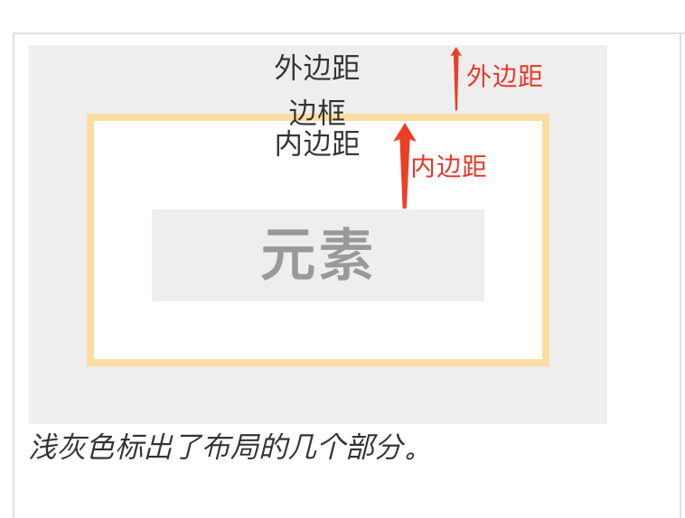

边框就是上面的黄色区域，边框宽度 border-width 就是黄色的区域的宽度（黄色的线宽），border-style 就是线的样式（这里是实线，可以设置为虚线），border-color 就是这里的黄线的黄色。

| 属性值       | 说明       |
| ------------ | ---------- |
| border-width | 边框的宽度 |
| border-style | 边框的外观 |
| border-color | 边框的颜色 |

> 对于一个元素，必须同时设置这三个属性，才会显示出边框的效果

### border-width

语法：`border-width: 像素值;`

### border-style

语法：`border-style: 属性值;`

**属性值有**

| 属性值 | 说明                                                         |
| ------ | ------------------------------------------------------------ |
| none   | 无样式                                                       |
| hidden | 与 none 相同，但是在处理 table 元素时不一样。修饰 table 时，用于解决边框冲突 |
| solid  | 实线                                                         |
| dashed | 虚线                                                         |
| dotted | 点线                                                         |
| double | 双线，双线的宽度等于 border-width                            |

### border-color

语法：`border-color: 颜色值;`

就是常规的颜色的取法

### 简便写法

我们要同时设置三个属性，有简单的写法

语法：`border: width style color`

例如：`border: 5px solid Red`

### 局部边框

就是单独控制一条边，比如 border-top、border-bottom、border-left、border-right

我们可以使用简单写法设置 `border-left: 5px solid Red` ，也可以使用 `border-left-color` 这种来单个设置属性


## 背景样式

背景样式主要有两种，一个是 background-color ，一个是 background-image

| 属性值                | 说明                                         |
| --------------------- | -------------------------------------------- |
| background-color      | 定义背景颜色                                 |
| background-image      | 定义背景图片的路径                           |
| background-repeat     | 定义背景图片的显示方式：纵向平铺、横向平铺等 |
| background-position   | 定义背景图片在元素哪个位置                   |
| background-attachment | 定义背景图片是否随内容滚动                   |

### background-color

语法：`background-color: 颜色值;`

> 相当于元素底下铺了一张这种颜色的图片

### background-image

语法：`background-image: 图片路径;`

> 其实就是引用这张图片作为背景图片，具体如何显示，还需要对后面的几个属性设置

### background-repeat

语法：`background-repeat:属性值;`

**属性值有**

| 属性值    | 说明                           |
| --------- | ------------------------------ |
| no-repeat | 表示不平铺                     |
| repeat    | 默认值，表示在 X 和 Y 轴都平铺 |
| repeat-x  | X 轴平铺                       |
| repeat-y  | Y 轴平铺                       |

> 说白了就是：元素宽度和高度如果大于图片的时候，图片是否需要重复的贴上去
>
> X 轴平铺的意思就是第一次放一张图片，发现图片宽度小于元素宽度，立刻在图片右边再贴一张图片，重复这个过程直到铺满宽度为止

### background-position

语法：`background-position: 像素值/关键字`

例如：`background-position: 12px 24px`  表示背景图片离左边框 12px，上边框 24px

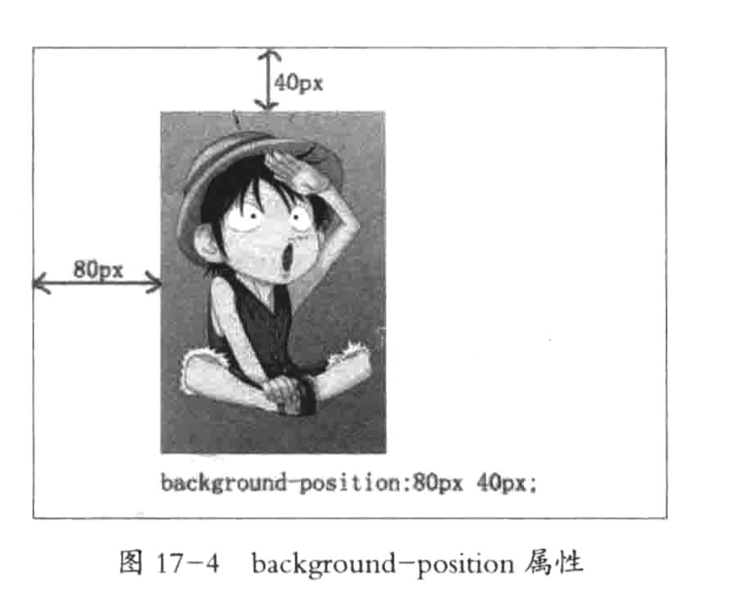

如果取值为关键字，则有以下关键字

| 属性值        | 说明     |
| ------------- | -------- |
| top left      | 左上     |
| top center    | 靠上居中 |
| top right     | 右上     |
| left center   | 靠左居中 |
| center center | 居中     |
| right center  | 靠右居中 |
| bottom left   | 左下     |
| bottom center | 靠下居中 |
| bottom right  | 右下     |

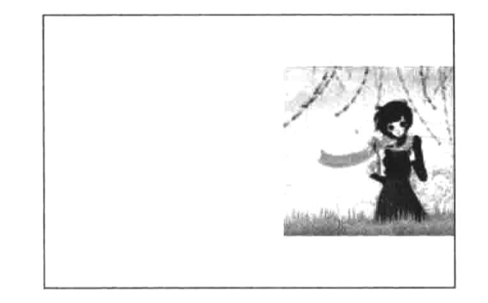

上面的效果就是 right center

### background-attachment

语法：`background-attachment: scroll/fixed`

scroll 就是背景随着滚动一起滚动

fixed 就是背景完全固定，滚动内容的时候背景不变


## 超链接样式

我们可以通过超链接伪类来定义超链接在不同时期（未点击、点击、悬浮、已点击）的样式

| 属性值    | 说明                                       |
| --------- | ------------------------------------------ |
| a:link    | 定义 a 标签未点击时的样式                  |
| a:visited | 定义 a 标签访问后的样式                    |
| a:hover   | 定义 a 标签悬停时的样式（鼠标经过 a 标签） |
| a:actived | 定义 a 标签被点击的瞬间的样式              |

> 定义标签样式的时候，必须按照这四种顺序来定义（顺序不能改）
>
> 一般我们只需要定义 link 和 hover 即可，也就是下面的方式（a 就代表了 a:link）
>
> a{}
>
> a:hover{}


## hover 伪类

任何元素都有 hover 类，都代表鼠标经过该元素时的样式


## 鼠标样式

语法：`cursor: 属性值`

默认是 default，指针式是 pointer，其它的还有一大堆，查表吧，反正也用的很少


## 图片样式

### 图片大小 width 和 height

对于 img 元素而言，我们使用 width 和 height 可以控制元素的大小，同时这也是里面的图片的大小

语法：`width: 像素值;` `height: 像素值;`

> 不管图片实际多大，都可以使用这种方式控制图片的大小，也就是说图片可能会被拉伸

### 图片水平对齐

语法：`text-align: left/center/right`

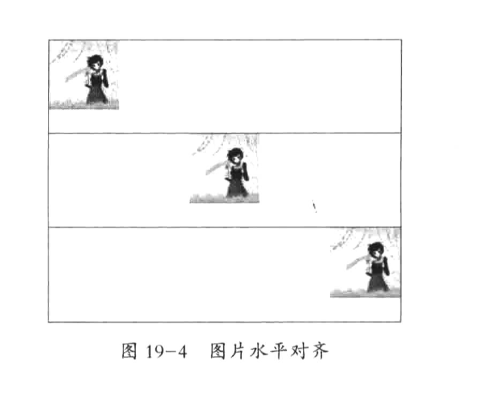

> 注意：需要在 image 的父元素进行设置 text-align，而不是对 image 本身进行设置

### 图片垂直对齐 vertical-align

语法：`vertical-align: 属性值`

**属性值有**

| 属性值   | 说明     |
| -------- | -------- |
| top      | 顶部对齐 |
| middle   | 中部对齐 |
| baseline | 基线对齐 |
| bottom   | 底部对齐 |

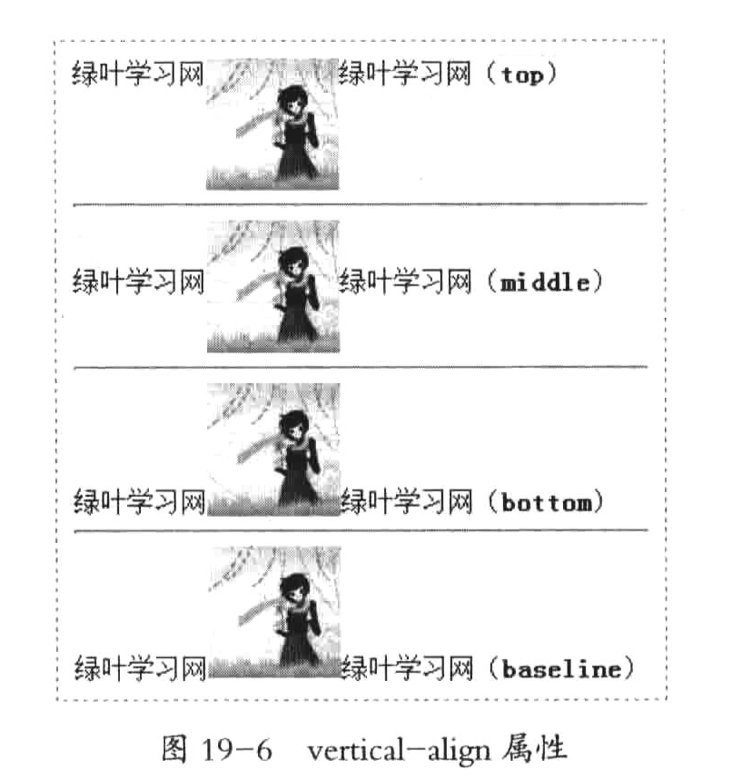

> 该属性是定义在 img 中的，表示的是行内元素相对于该元素的垂直对齐方式
>
> 人话就是：同一行的其它元素，相对于我（img），的垂直对齐方式

### 文字环绕效果 float

语法：`float:属性值;`

**属性值有**

| 属性值 | 说明         |
| ------ | ------------ |
| left   | 元素向左浮动 |
| right  | 元素向右浮动 |

默认情况下，元素是不浮动的

> 左浮动就是说这个元素自己浮到左边去了，也就是说 `float:left` 时，图片在左边，反之在右边

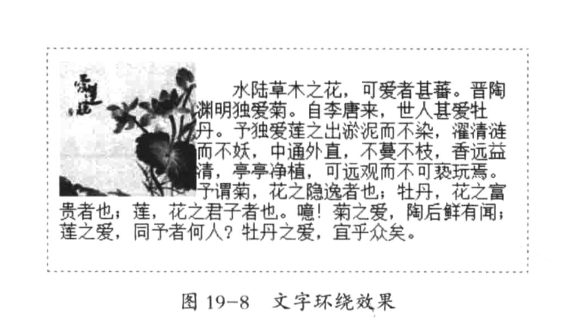

我们会发现文字顶部不对齐，这个是 p 标签的默认样式造成的，要使得顶部对齐，需要去除 p 标签的默认样式

### 定义图片与文字间距 margin

就是 margin 的普通运用，也就是定义外边距。


## 列表样式

### 列表项的前缀 list-style-type

#### type 属性

**有序列表**


**属性值有**

| 属性值 | 说明                   |
| ------ | ---------------------- |
| 1      | 数字1、2、3            |
| a      | 小写字母a、b、c        |
| A      | 大写字母A、B、C        |
| i      | 小写罗马数字i、ii、iii |
| I      | 大写罗马数字I、II、III |

**无序列表**

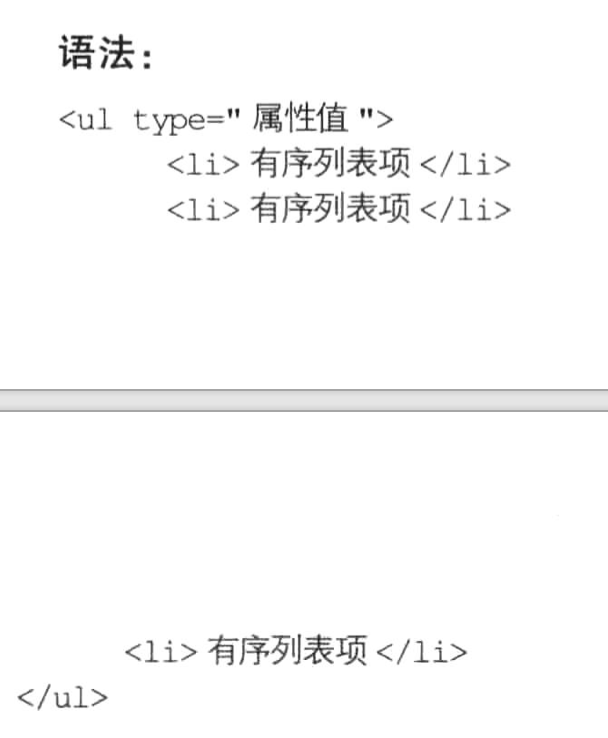

**属性值有**

| 属性值 | 说明             |
| ------ | ---------------- |
| disc   | 默认值，实心圆 ● |
| circle | 空心圆 ○         |
| square | 实心正方形 ■     |

#### list-style-type 属性

上面的 type 属性是在 HTML 标签中定义的。在 CSS 中我们应该使用 list-style-type 来定义列表项前缀符号（无序列表和有序列表都是这个属性）

语法：`list-style-type: 属性值;`

**有序列表的属性值有**

| 属性值      | 说明           |
| ----------- | -------------- |
| decimal     | 数字123        |
| lower-roman | 小写罗马数字   |
| upper-roman | 大写罗马数字   |
| lower-alpha | 小写字母       |
| upper-alpha | 大写字母       |
| none        | 去除列表项符号 |

**无序列表的属性值有**

| 属性值 | 说明             |
| ------ | ---------------- |
| disc   | 默认值，实心圆 ● |
| circle | 空心圆 ○         |
| square | 实心正方形 ■     |
| none   | 去除列表项符号   |

### 自定义列表项符号 list-style-image

语法：`list-style-image: url(图像地址);`


## 表格样式

### 表格边框合并 border-collapse

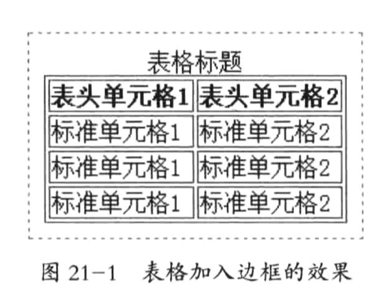

上面是表格将边框显示出来之后的样式

在 CSS 中，我们可以使用 border-collapse 来去除单元格之间的空隙

语法：`border-collapse: 属性值;`

border-collapse 是表格独有的属性，其它元素是没有这个属性的，它的属性值有

| 属性值   | 说明                               |
| -------- | ---------------------------------- |
| separate | 边框分开，不合并，这是默认值       |
| collapse | 边框合并，如果相邻，则共用一个边框 |

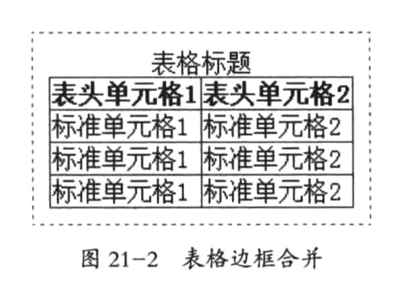

> 我们只需要对 table 元素的 border-collapse 属性进行定义即可，单元格是不需要设置的

### 表格边框间距 border-spacing

有的时候，我们不是要合并表格边框，而是定义表格边框的间距，可以使用 border-spacing

语法：`border-spacing: 像素值;`

例如: `border-spacing: 5px 6px`

> 只指定一个像素值时，表示横向和纵向间距都是这个值，指定两个像素值时，第一个表示横向间距，第二个表示纵向间距
>
> 我们也是在 table 元素定义这个属性即可，不需要在 th td 等元素中定义

### 表格标题位置 caption-side

默认情况下，表格的标题在表格的上方，可以通过 caption-side 来控制标题位置

语法：`caption-side: 属性值;`

**属性值有**

| 属性值 | 说明               |
| ------ | ------------------ |
| top    | 默认值，标题在顶部 |
| bottom | 标题在底部         |

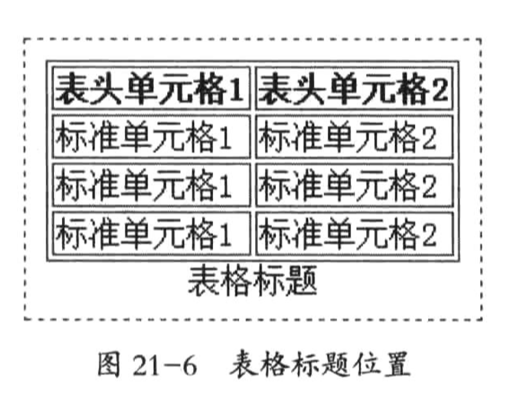

> 依然是在 table 元素中设置


## CSS 盒子的样式

### width 和 height

**width 和 height 是定义内容区的大小的，它不包含 padding。**

> 只有块元素能设置 width 和 height，行内元素无法设置这两个值。
>
> 行内元素的内容区大小是由内容本身的多少来控制的，比如100个字，那么宽度就是100个字的宽度
>
> 块元素的内容区大小是由 width 和 height 控制的，在没有设置 overflow 的时候，即使内容特别多，也不会扩大内容区大小，多出来的内容会被隐藏
>
> 使用 display 属性可以将元素切换成 块状元素、行内元素、两者性质都有的元素

### 边框 border

语法：`border: 像素值 边框类型 颜色值`

### 内边距 padding

内边距就是内容区到边框的距离，分为 padding-top、right、bottom、left

语法：

- `padding: 20px` 表示四个方向都是 20px
- `padding: 20px 40px` 表示 top 和 bottom 是 20px，left 和 right 是 40px
- `padding: 20px 40px 60px 80px` 分别表示 top、right、bottom、left（顺时针方向）

### 外边距 margin

外边距指的是边框到父元素或者同级元素之间的那一部分

语法也跟 padding 是一致的


## 浮动布局 float

参考：[博客](https://www.cnblogs.com/yiyezhai/p/3203490.html)

```html
<div id="father">
    <div id="s1">s1</div>
    <div id="s2">s2</div>
    <div id="s3">s3</div>
    <p>这是一堆文字这是一堆文字这是一堆文字这是一堆文字这是一堆文字这是一堆文字这是一堆文字这是一堆文字这是一堆文字</p>
</div>
```

```css
#father {
    width: 400px;
    background-color: aquamarine;
    border: 3px solid red;
}

#father div {
    padding: 10px;
    margin: 15px;
    border: 2px dashed black;
}

#father p {
    margin: 15px;
    border: 2px dashed black;
    background-color: coral;
}

#s1 {
    float: left;
    /*width: 200px;*/
    background-color: coral;
}

#s2 {
    /*float: left;*/
    width: 300px;
    background-color: green;
}
```

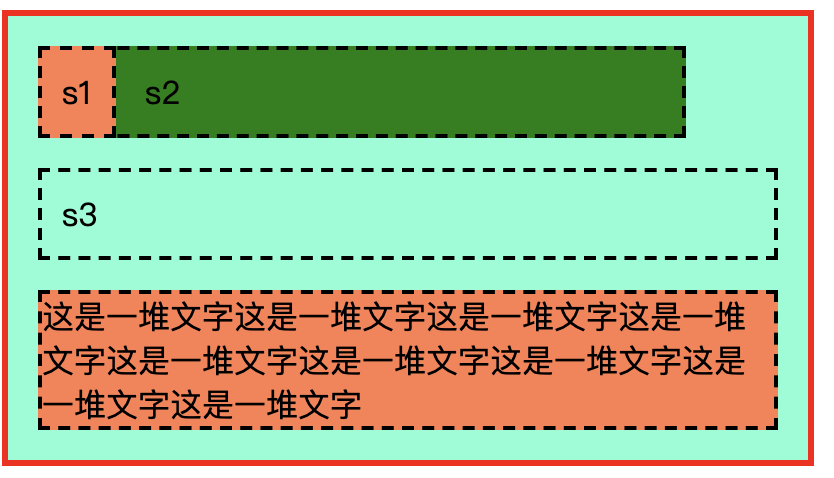

大致有以下效果：

- s1 定义为 float，所以 s1 从文档流里移除，float:left，于是 s1 被渲染到了左侧
- s1 因为是 float，所以 s2 直接就在 s1 本来应该占据的这一行进行渲染
- 可以这样理解：s2 的宽度无视了 s1，也就是这种布局下，不管 s1 是多宽，橙色的 s1 加上 绿色的 s2 都一直是 s2 定义的宽度：300px

### DIV 的特点

- 空的`div`是没有高度的。
- 有内容的`div`其高度取决于内容的高度。
- 如果没有指定`float`属性，`div`的宽度将和占满父元素的宽度（不管是不是空的）。
- 如果指定了`float`属性，`div`的宽度将取决于内部元素的宽度（所以，空的`div`指定了`float`属性后既没有高度也没有宽度）。

### 清除浮动 clear

语法：`clear:both`

清除两侧浮动，也就是说如果跟浮动的搅和在一起，就不要浮动的那一行了，元素另起一行进行布局


