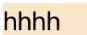
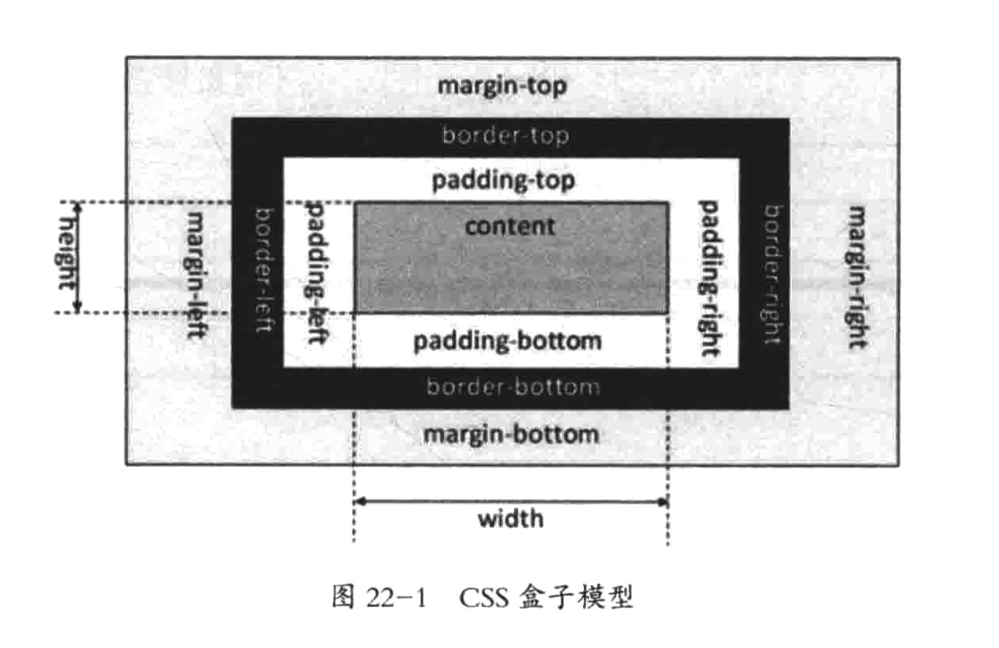

## 盒模型

每个元素就是这样一个盒子（想象2个装了照片的相框，每个相框就是一个盒子），有以下的属性：

- padding：内边距，内容与边框的距离，分成上下左右四个距离（相当于照片边缘和相框的距离）

- border：边框，边框有颜色、实线或者虚线、上下左右都可以有不同的样式（相当于相框有好多种材质和颜色）

- background-color：背景色，填充边框以内的空白，包括内边距。设置了颜色后是下面的效果，可以看到非文字的部分都被填满了（也就是说内容的部分也会被填充颜色）

  

- margin：外边距，两个元素的边框之间的距离（相当于我们摆放这两个相框的时候，两个相框之间的距离）

  两个元素都设置外边距时，他们的距离是外边距之和

  > 如果把外边距设置为负值，那么两个元素可以重叠在一起，这个是很重要的功能

- content：内容区，可以是文字或者图片

## 内容区

内容区就是 CSS 盒子模型的中心，呈现了盒子的主要内容。

内容区有三个属性：width、height、overflow。

width 和 height 是控制内容区的大小的，并不包含 padding，所以实际元素的大小是比 width 大的（如果有 padding 和 margin 的话）

当内容太过，超出内容区的范围时，可以使用 overflow 溢出属性来定义处理的方式

## 内边距

内边距指的是 内容区 和 边框 之间的空间。

## 边框

边框就可以理解成相框的边框部分

## 外边距

外边距主要是控制两个元素的边框的距离，主要是可以使得两个元素不必紧贴在一起。

当外边距为负值的时候，可以让元素重叠在一起，实现很多效果

## CSS3 盒子模型

`box-sizing: border-box`

这种盒子，我们定义 width 和 height 时，直接就定义的是盒子大小，通过从已设定的宽度和高度分别减去边框和内边距才能得到内容的宽度和高度。