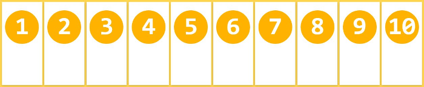

## 参考

[博客1](https://www.html.cn/archives/8629)

[博客2](http://www.ruanyifeng.com/blog/2018/10/flexbox-form.html)


## 基础知识

flex 布局是一套完整的属性集合，有的属性是在容器上（称为flex container）设置，有的属性是在容器的子元素（称为flex items）上设置。


在flex布局中，flex 项（就是子元素）要么按照 `main axis` (主轴)（从 `main-start` 到 `main-end` ）排布，要么按照 `cross axis` (交叉轴) (从 `cross-start` 到`cross-end`)排布

> 默认是横着排过去，就像是写字默认从左往右写一样。
>
> 可以设置成竖着排过去，也就是从上往下写
>
> 这两种排法都可以设置相反的顺序（从右往左排、从下往上排）

- **main axis**: flex 容器的主轴，flex 项沿着主轴排布，注意主轴不一定是水平的，主轴是水平还是垂直取决于 `flex-direction` 属性（见下文）。
- **main-start|main-end**: 分别表示主轴的开始位置和结束位置，flex 项在容器中会从 main-start 到 main-end 排布。
- **main size**: flex 项占据主轴的宽度或高度。flex 项的 main size 属性是要么是“宽度”，要么是“高度”，这取决于主轴方向。
- **cross axis**: 垂直于主轴的轴线称为交叉轴，其方向取决于主轴方向。
- **cross-start|cross-end**: 分别表示交叉轴的开始位置和结束位置。flex 项在交叉轴上的排布从 cross-start 开始位置到 cross-end 结束位置。
- **cross size**: flex 项占据交叉轴的宽度或高度。flex 项的 cross size 属性是要么是“宽度”，要么是“高度”，这取决于交叉轴方向。

> 我们以水平排列来举例，这时候所谓的主轴就是 X 轴，交叉轴就是 Y 轴
>
> main-start 就是 X = 0 的地方，main-end 就是 X = 最大宽度 的地方
>
> 同理 cross-start 和 cross-end 很好理解


## 父元素属性(flex container)

### display

我们使用 display 将一个元素设置为弹性布局的父容器，可以取值 flex 或者是 inline-flex：

- flex：容器本身呈现为块状元素
- inline-flex：容器本身呈现为行内元素

```css
.container {
  display: flex; /* or inline-flex */
}
```

### flex-direction

这个属性决定了子元素的排布方向，有：

- `row` (默认值) ：从左到右排列
- `row-reverse`: 反向行排布，即 `row` 的反方向，从右到左排列
- `column`: 列排布，与 `row` 相似，但是 flex 项从上到下排布。
- `column-reverse`: 反向列排布，即 `column` 反方向，与 `row-reverse` 相似，只是 flex 项从下到上排布。

> 说白了就是，从左往右、从右往左、从上往下、从下往上
>
> 这个属性确定了主轴的方向（上面四种之一，水平分成左右两个方向，竖直也类似）


```css
.container {
  flex-direction: row | row-reverse | column | column-reverse;
}
```

### flex-wrap

默认情况下，flex 项会尽可能地尝试排在同一行上（行或列），通过设置 `flex-wrap` 来决定 flex 项是否允需要换行。

> 默认情况下，不换行时，如果子元素的宽度超过了容器的宽度，子元素会自动进行压缩，强行挤在容器的宽度内不换行（想象一下被塞满了的一行书架，再塞一本书时，书会被强行塞进去同时被压薄了一点点）

```css
.container{
  flex-wrap: nowrap | wrap | wrap-reverse;
}
```

- `nowrap` (默认值) : 所有的 flex 项都会在同一行上排布，也就是我们常说的单行，或不换行。

  

- `wrap`: flex 项将从上到下根据实际情况排布再多行上，也就是我们常说的多行，或会换行。

  

- `wrap-reverse`: flex 项将 **从下到上** 根据实际情况排布再多行上折行。

  

### flex-flow

这是 `flex-direction` 和 `flex-wrap` 属性的缩写形式。同时定义 flex 容器的主轴和交叉轴。默认是 `row nowrap`。

```css
flex-flow: <‘flex-direction’>  <‘flex-wrap’>
```

### justify-content

当我们在主轴上没分完空间的时候，定义剩余空间的分配规则。

比如一个宽度是 500px 的 div，里面排列了 4 个 100px 的 div，这剩下的 100px 如何分配

```css
.container {
  justify-content: flex-start | flex-end | center | space-between | space-around | space-evenly;
}
```


- `flex-start` (默认值) : flex 项从主轴的开始位置（main-start）开始排布。
- `flex-end` : flex 项从主轴的结束位置（main-end）开始排布
- `center`: flex 项沿主轴居中排布。
- `space-between`: flex 项沿主轴均匀排布，即我们常说的沿主轴 **两端对齐** ，第一个flex 项在主轴开始位置，最后一个flex 项在主轴结束位置。
- `space-around`: flex 项沿主轴均匀排布。要注意的是 flex 项看起来间隙是不均匀的，因为所有 flex 项两边的空间是相等的。第一项在容器边缘有一个单位的空间，但是在两个 flex 项之间有两个单位的间隙，因为每个 flex 项的两侧都有一个单位的间隙。
- `space-evenly`: 任何两个 flex 项之间的间距（以及到 flex 容器边缘的空间）相等。（延伸一下，`align-content: space-evenly` 也是这个逻辑 ）

### align-items

对齐方式，举例来说，水平排布的时候，每个子元素的高度可能不一样，这个时候如何对齐他们的高度，就是一个问题。这个属性就是定义了几种对齐的方式

```css
.container {
  align-items: flex-start | flex-end | center | baseline | stretch;
}
```


- `flex-start`: flex 项按照交叉轴的开始位置（cross-start）对齐。
- `flex-end:` flex 项按照交叉轴的结束位置（cross-end）对齐。
- `center`: flex 项以交叉轴为中心，居中对齐。
- `baseline`: flex 项按照他们的文字基线对齐。
- `stretch` (默认值) : 拉伸 flex 项以填充整个容器（这里特别要注意：如果 flex 项有尺寸属性（min-width / max-width / width / min-height / max-height / height），那么首先应用这些尺寸属性）

> 对于默认的水平排布而言，这里所谓的交叉轴就是 y 轴

### align-content

当交叉轴上有剩余空间时，`align-content` 可以设置 flex 容器中的 **行** 在交叉轴上如何分配剩余空间，类似于 `justify-content` 在主轴上对齐单个 flex 项的方式。

> 水平排布时，比如我们布局容器有 300px 的高度，结果我们排布了 3 行之后，只占用了 200px 的高度，那么  align-content 就可以定义这 3 行 与剩下的 100px 的分配规则

```css
.container {
  align-content: flex-start | flex-end | center | space-between | space-around | stretch;
}
```


- `flex-start`：多行在容器的开始位置排布
- `flex-end`：多行在容器的结束位置排布
- `center`：多行在容器的中间位置排布
- `space-between`：多行均匀分布；第一行分布在容器的开始位置，最后一行分布在容器的结束位置
- `space-around`: 多行均匀分布，并且每行的间距（包括离容器边缘的间距）相同；
- `strech` (默认值)：多行拉伸以填充满整个剩余空间

> 这里的 ”行“ 的就是一行的中间线


## flex 项属性


### order

默认情况下，flex 项按源（HTML结构）顺序排布。但是，`order` 属性可以控制它们在 flex 容器中的显示顺序。

```css
.item {
  order: <integer>;  /* 默认值是 0 */
}
```


### flex-grow

`flex-grow` 定义了 flex 项在有可用剩余空间时拉伸比例。它接受的值作为比例，无单位。它规定了 flex 项应该占 flex 容器中可用空间的比例。

如果所有 flex 项的 `flex-grow` 都设置为 `1` ，则父容器中的剩余空间将平均分配给所有子项。 如果其中一个子项的值为 `2` ，则该子项占用的剩余空间是其他子项的两倍（或者至少会尽力获得）。

> 水平排布的时候，就是一个宽度比例

```css
.item {
  flex-grow: <number>; /* default 0 */
}
```


> 注，举个例子帮助理解：
>
> 比如我们得 flex 容器中有 6 个 flex 项，每个 flex 项的 `flex-grow` 初始值都是 1。如果我们将每个 flex 项的 `flex-grow` 相加起来，总和为 6。因此 flex 容器的总宽度被平均分成了 6 份。每个 flex 项增长到填充容器可用空间的1/6。
>
> 当我们将第 3 个 flex 项的 `flex-grow` 设置为 2 时，flex 容器现在被分成了 7 等份，因为所有 `flex-grow` 属性是：1 + 1 + 2 + 1 + 1 + 1。第 3 个 flex 项占了整个容器空间的 2/7，其他的占了 1/7。

### flex-shrink

这个参数定义的是收缩比例，默认是1

比如容器宽度是 300，里面放了 4 个宽度是 100 的 div，那么超出的部分就是 100 * 4 - 300 = 100。

于是，每个 div 都要收缩 1/(1+1+1+1) * 100 = 25 的大小

如果其中一个 div 的 flex-shrink 设置为 2，那么就要收缩 2/(2+1+1+1) * 100 = 40 的大小，最终是 60px 宽度

而其余 3 个 div 的 flex-shrink 是 1，只需要收缩 1/(2+1+1+1) * 100 = 20 的大小，最终是 80px 的宽度

> 也就是说，需要收缩的宽度才是成比例的，最终的宽度并不是成比例的

### flex-basis

`flex-basis` 定义了在分配剩余空间之前 flex 项默认的大小。可以设置为某个长度值（e.g. 20%, 5rem,等）或者关键字。关键字 `auto` 意味着 flex 项会按照其本来的大小显示（暂时由 `main-size` 关键字完成，直到弃用）。关键字 `content` 意味着根据内容来确定大小——这个关键字到目前没有被很好地支持，所以测试起来比较困难，与`content`的类似的关键字还有`max-content`, `min-content`, `fit-content`。

```css
.item {
  flex-basis: <length> | auto; /* default auto */
}
```

> 比如在水平排布的情况下，就类似于 width 了，其实表示的是占据的主轴的长度

如果设置为 `0` , 则 flex 项内容周围的空隙不会根据 `flex-grow` 按比例分配，如果设置为 `auto`，则 flex 项周围额外的空隙会根据 `flex-grow` 按照比例分配，如下图：


> 这里的意思就是说，绿色的部分在 flex-basis 为 0 的时候的特点

### flex

`flex` 是 `flex-grow`、`flex-shrink`、`flex-basis` 三个属性的缩写。其中第二个和第三个参数(`flex-shrink` 和 `flex-basis`)是可选的。默认值为`0 1 auto`。

```css
.item {
  flex: none | [ < 'flex-grow'> < 'flex-shrink'>? || < 'flex-basis'> ]
}
```

> 推荐使用缩写

### align-self

`align-self` 属性允许某个单独的 flex 项覆盖默认的对齐方式（或由 `align-items` 指定的对齐方式）。

具体的属性值得含义可以参考 `align-items`的解释。

```css
.item {
  align-self: auto | flex-start | flex-end | center | baseline | stretch;
}
```


### 水平垂直居中

```css
.parent {
  display: flex;
  height: 300px; /* 随意设定大小 */
}
 
.child {
  width: 100px;  /* 随意设定大小，比父元素要小 */
  height: 100px; /* 同上 */
  margin: auto;  /* 见证奇迹的时刻 */
}
```

