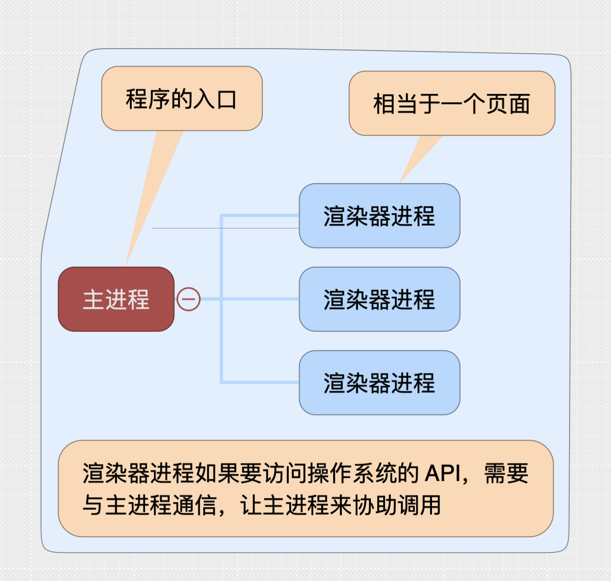

## 进程模型

Electron 应用由两种进程组成：一个 **主进程** 多个 **渲染器进程**。有的模块可以在两种进程中使用，有的模块只能在主进程中使用（主进程具有常规进程的权限，渲染器进程就相当于 chrome 的一个页面，所以只拥有部分权限）

> 主进程其实就是 node 进程入口

## 主进程

主进程包含这些职能：

- 响应应用的生命周期事件：启动、退出、准备退出、正在切换到后台、正在切换回前台等
- 调用原生操作系统 API

## 渲染器进程

主进程可以使用 Electron 的 BrowserWindow 模块来创建和销毁渲染器进程。渲染器进程可以加载 Web 页面，展示 GUI 界面（相当于打开一个网页）。这些页面可以加载其它 JS 文件进行执行，在自己的渲染器进程中执行 JS 代码。与普通网页的不同：**渲染器进程中执行的代码可以访问 node 的所有 API**。

> 注意这里的区别：渲染器进程中可以执行 node 代码，平时的普通网页是执行 node 编译后的前端 js 代码
>
> 但是：执行的 node 代码中不能使用一些包含操作系统 api 的代码（也就是说其实是执行部分 node 代码，有一些模块在渲染器进程中不存在）

