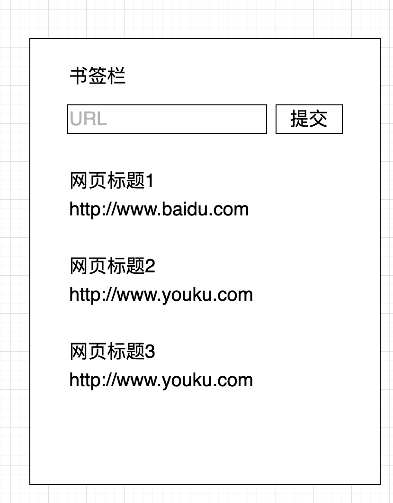
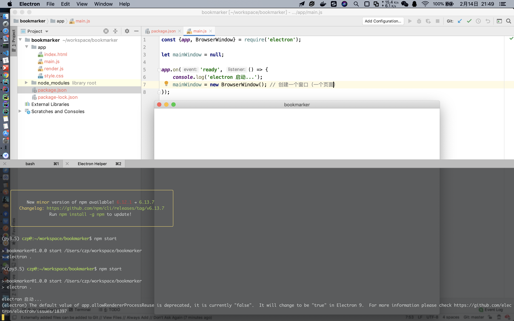
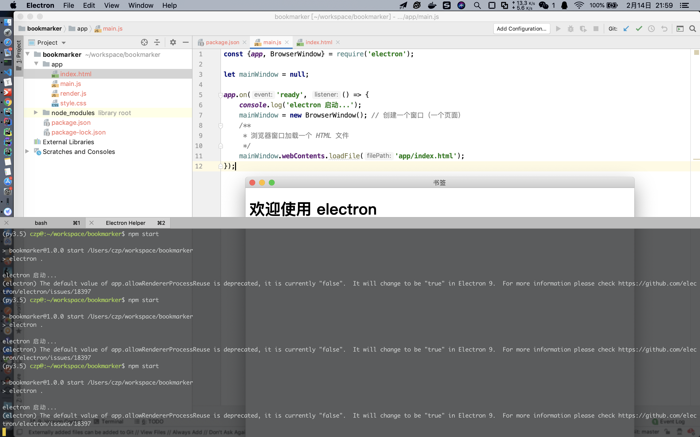
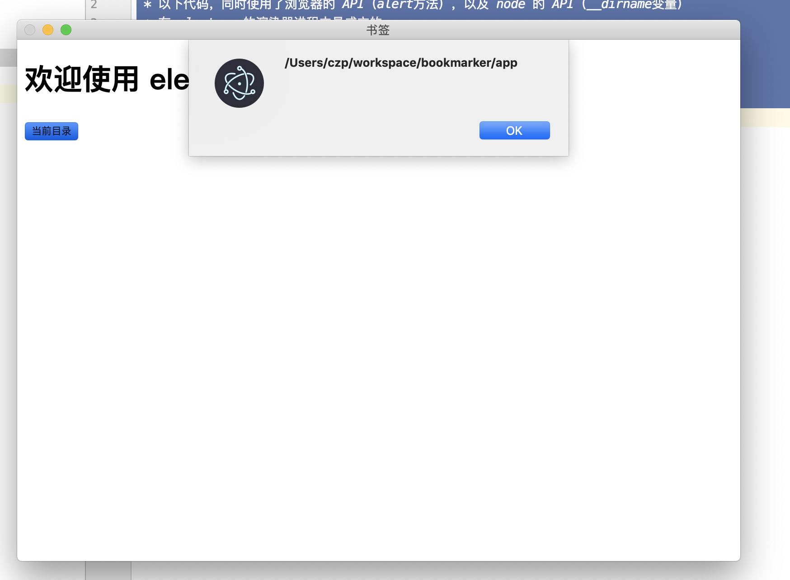
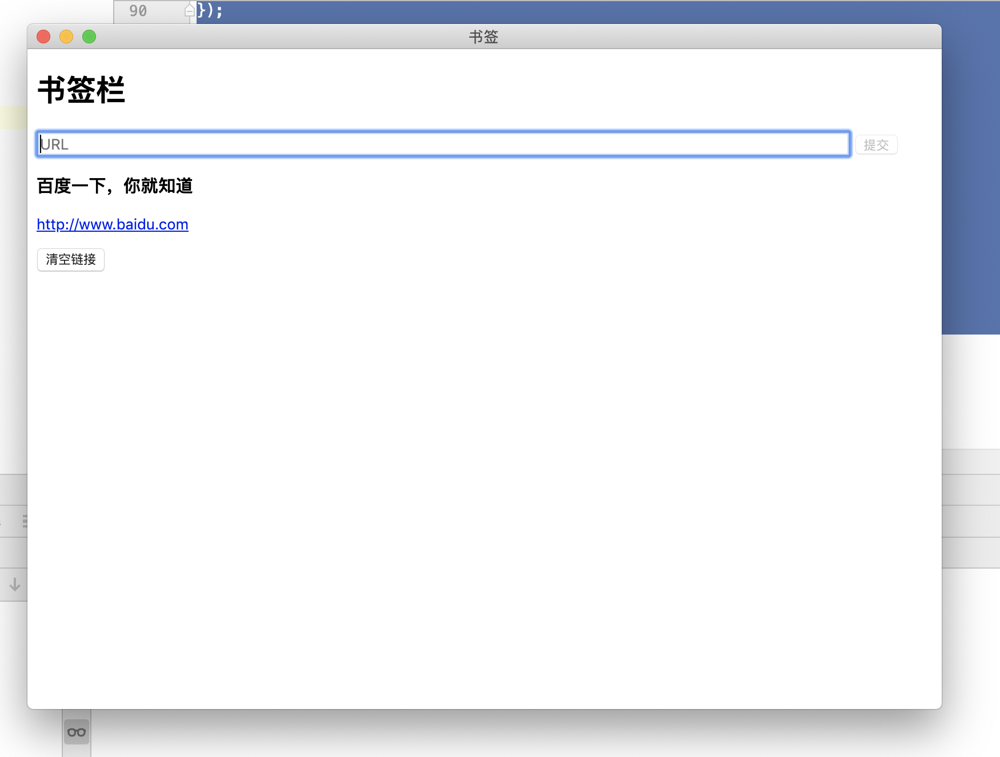

## 应用的内容

- 用户在应用中输入 URL
- 应用访问这个 URL，获取页面标题
- 将标题保存到应用的 localStorage 中
- 应用展示已经保存了的所有标题和链接

大致如图



## 工作步骤

### 创建项目

```bash
$ git clone git@github.com:cenzhipeng/bookmarker.git
$ cd bookmarker/
$ mkdir app
$ touch app/main.js app/render.js app/style.css app/index.html
$ npm init
$ tree
```


### 安装 electron

```bash
$ npm install electron
```


### package.json

```json
{
  "name": "bookmarker",
  "version": "1.0.0",
  "description": "electron 书签应用",
  "main": "app/main.js",
  "scripts": {
    "start": "electron .",
    "test": "echo \"Error: no test specified\" && exit 1"
  },
  "repository": {
    "type": "git",
    "url": "git+https://github.com/cenzhipeng/bookmarker.git"
  },
  "author": "cenzhipeng",
  "license": "ISC",
  "bugs": {
    "url": "https://github.com/cenzhipeng/bookmarker/issues"
  },
  "homepage": "https://github.com/cenzhipeng/bookmarker#readme",
  "dependencies": {
    "electron": "^8.0.0"
  }
}

```


### main.js

```javascript
const {app, BrowserWindow} = require('electron');

let mainWindow = null;

app.on('ready', () => {
    console.log('electron 启动...');
    mainWindow = new BrowserWindow(); // 创建一个窗口（一个页面）
});
```


执行命令：`npm start`，效果如下



> mainWindow 变量定义在外面是为了避免垃圾回收后，窗口直接消失


### 创建 app/index.html

```html
<!DOCTYPE html>
<html lang="zh-CN">
<head>
    <meta charset="UTF-8">
    <meta name="viewport" content="width=device-width,initial-scale=1">
    <title>书签</title>
</head>
<body>
<h1>欢迎使用 electron</h1>
</body>
</html>
```


### 更新 app/main.js 加载 HTML

```javascript
const {app, BrowserWindow} = require('electron');

let mainWindow = null;

app.on('ready', () => {
    console.log('electron 启动...');
    mainWindow = new BrowserWindow(); // 创建一个窗口（一个页面）
    /**
     * 浏览器窗口加载一个 HTML 文件
     */
    mainWindow.webContents.loadFile('app/index.html');
});
```


执行命令：`npm start`，效果如下




### 更新 app/index.html app/render.js 添加新按钮以及脚本

常规的页面上只能使用浏览器端的 JS，但是 electron 的页面脚本中，可以使用 node 的 API


app/index.html

```html
<!DOCTYPE html>
<html lang="zh-CN">
<head>
    <meta charset="UTF-8">
    <meta http-equiv="content-security-policy" content="
    default-src 'self';
    script-src 'self' 'unsafe-inline';
    connect-src *">
    <meta name="viewport" content="width=device-width,initial-scale=1">
    <title>书签</title>

</head>
<body>
<h1>欢迎使用 electron</h1>
<p>
    <button class="alert">当前目录</button>
</p>
<script>
    require('./render');
</script>
</body>
</html>
```


app/render.js

```javascript
/**
 * 以下代码，同时使用了浏览器的 API（alert方法），以及 node 的 API（__dirname变量）
 * 在 electron 的渲染器进程中是成立的
 */
const button = document.querySelector('.alert');
button.addEventListener('click', () => {
    alert(__dirname); // 注意，常规页面中，这个属于 node 的 API 是无法工作的
});
```




### 在渲染进程中添加样式

app/style.css

```css
html {
    box-sizing: border-box;
}

*, *:before, *:after {
    box-sizing: inherit;
}

body, input {
    font: menu; /* 使用运行页面的操作系统的默认系统字体 */
}
```

然后在 html 中像常规方式一样引入这个 css 即可（head 区域）


### 实现 UI 界面

app/index.html

```html
<!DOCTYPE html>
<html lang="zh-CN">
<head>
    <meta charset="UTF-8">
    <meta http-equiv="content-security-policy" content="
    default-src 'self';
    script-src 'self' 'unsafe-inline';
    connect-src *">
    <meta name="viewport" content="width=device-width,initial-scale=1">
    <title>书签</title>
    <link rel="stylesheet" href="style.css">
</head>
<body>
<h1>书签栏</h1>
<div class="error-message"></div>
<section class="add-new-link">
    <form class="new-link-form">
        <input type="url" class="new-link-url" placeholder="URL" size="100" required>
        <input type="submit" class="new-link-submit" value="提交" disabled>
    </form>
</section>

<section class="links"></section>
<section class="controls">
    <button class="clear-storage">清空链接</button>
</section>
<script>
    require('./render');
</script>
</body>

</html>
```


app/render.js

```javascript
const linkSection = document.querySelector('.links');
const errorMessage = document.querySelector('.error-message');
const newLinkForm = document.querySelector('.new-link-form');
const newLinkUrl = document.querySelector('.new-link-url');
const newLinkSubmit = document.querySelector('.new-link-submit');
const clearStorageButton = document.querySelector('.clear-storage');
const axios = require('axios').default;

newLinkUrl.addEventListener('keyup', () => {
    newLinkSubmit.disabled = !newLinkUrl.validity.valid; // 校验通过才可以提交
});

const clearForm = () => {
    newLinkUrl.value = null; // 提交后，清除输入框
};

/**
 * 从 localstorage 中，提取出 URL 和 title，挂载到 DOM 中进行渲染
 */
const renderUI = () => {
    const linkElements = Object.keys(localStorage).map(k => {
        return convert2LinkElement(k, localStorage.getItem(k))
    }).join('');
    linkSection.innerHTML = linkElements;
};

/**
 * 将 HTML 文本转化为 DOM 树，找到 title 标签
 * @param htmlText
 * @returns {string}
 */
const findTitle = htmlText => {
    const parser = new DOMParser();
    const dom = parser.parseFromString(htmlText, 'text/html');
    return dom.querySelector('title').innerText;
};

/**
 * 生成链接的 HTML 标签文本，后续挂载到 DOM 中
 * @param url
 * @param title
 * @returns {string}
 */
const convert2LinkElement = (url, title) => {
    return `
    <div class="link">
        <h3>${title}</h3>
        <p>
            <a href="${url}">${url}</a>
        </p>
    </div>
    
    `;
};

/**
 * 发送请求，去取出整个 HTML 文本
 * @param url
 * @returns {Promise<void>}
 */
async function getTitle(url) {
    const title = await axios.get(url)
        .then(response => findTitle(response.data))
        .catch(e => {
            console.log(e.errorMessage);
        });
    storeTitle(url, title);
    clearForm();
    renderUI();
}

/**
 * 将 url 和 title 存储到 localstorage
 * @param url
 * @param title
 */
function storeTitle(url, title) {
    localStorage.setItem(url, title);
}


/**
 * 提交时去获取 title 并展示
 */
newLinkForm.addEventListener('submit', e => {
    e.preventDefault(); // 阻止默认行为，防止页面刷新
    getTitle(newLinkUrl.value).catch(e => {
        console.log(e.errorMessage);
    });
});

/**
 * 点击时清空数据，并重新刷新UI
 */
clearStorageButton.addEventListener('click', e => {
    e.preventDefault();
    localStorage.clear();
    renderUI();
});

/**
 * 首次进入时展示数据
 */
renderUI();
```


### 点击链接时调用系统的默认浏览器

当我们直接点击链接时，页面会进入到这个链接里，但是我们没有后退按钮，界面就再也回不来了，所以我们要使用默认的浏览器来打开这个链接




app/render.js

```javascript
const linkSection = document.querySelector('.links');
const errorMessage = document.querySelector('.error-message');
const newLinkForm = document.querySelector('.new-link-form');
const newLinkUrl = document.querySelector('.new-link-url');
const newLinkSubmit = document.querySelector('.new-link-submit');
const clearStorageButton = document.querySelector('.clear-storage');
const axios = require('axios').default;

newLinkUrl.addEventListener('keyup', () => {
    newLinkSubmit.disabled = !newLinkUrl.validity.valid; // 校验通过才可以提交
});

const clearForm = () => {
    newLinkUrl.value = null; // 提交后，清除输入框
};

/**
 * 从 localstorage 中，提取出 URL 和 title，挂载到 DOM 中进行渲染
 */
const renderUI = () => {
    const linkElements = Object.keys(localStorage).map(k => {
        return convert2LinkElement(k, localStorage.getItem(k))
    }).join('');
    linkSection.innerHTML = linkElements;
};

/**
 * 将 HTML 文本转化为 DOM 树，找到 title 标签
 * @param htmlText
 * @returns {string}
 */
const findTitle = htmlText => {
    const parser = new DOMParser();
    const dom = parser.parseFromString(htmlText, 'text/html');
    return dom.querySelector('title').innerText;
};

/**
 * 生成链接的 HTML 标签文本，后续挂载到 DOM 中
 * @param url
 * @param title
 * @returns {string}
 */
const convert2LinkElement = (url, title) => {
    return `
    <div class="link">
        <h3>${title}</h3>
        <p>
            <a href="${url}">${url}</a>
        </p>
    </div>
    
    `;
};

/**
 * 发送请求，去取出整个 HTML 文本
 * @param url
 * @returns {Promise<void>}
 */
async function getTitle(url) {
    const title = await axios.get(url)
        .then(response => findTitle(response.data))
        .catch(e => {
            console.log(e.errorMessage);
        });
    storeTitle(url, title);
    clearForm();
    renderUI();
}

/**
 * 将 url 和 title 存储到 localstorage
 * @param url
 * @param title
 */
function storeTitle(url, title) {
    localStorage.setItem(url, title);
}


/**
 * 提交时去获取 title 并展示
 */
newLinkForm.addEventListener('submit', e => {
    e.preventDefault(); // 阻止默认行为，防止页面刷新
    getTitle(newLinkUrl.value).catch(e => {
        console.log(e.errorMessage);
    });
});

/**
 * 点击时清空数据，并重新刷新UI
 */
clearStorageButton.addEventListener('click', e => {
    e.preventDefault();
    localStorage.clear();
    renderUI();
});

/**
 * 首次进入时展示数据
 */
renderUI();

// 引入了这个 API，我们可以打开默认浏览器
const {shell} = require('electron');

/**
 * 当我们点击链接时打开浏览器，我们是在外层元素上监听的，chrome 支持事件的冒泡
 */
linkSection.addEventListener('click', e => {
    // 如果是一个链接，才处理这个事件
    if (e.target.href) {
        e.preventDefault();
        shell.openExternal(e.target.href); // 使用默认浏览器打开链接
    }
});
```

