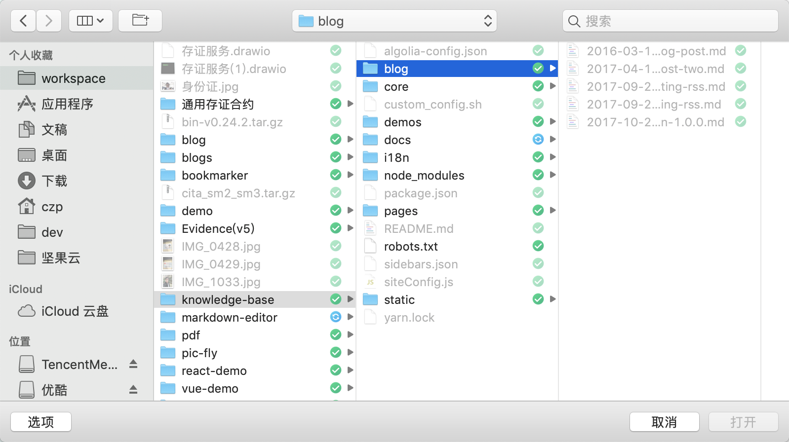
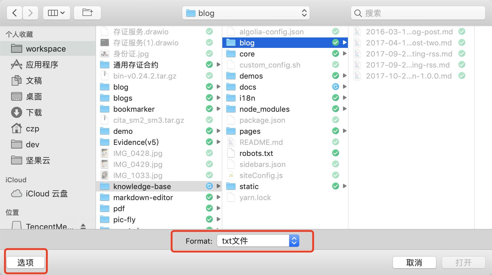
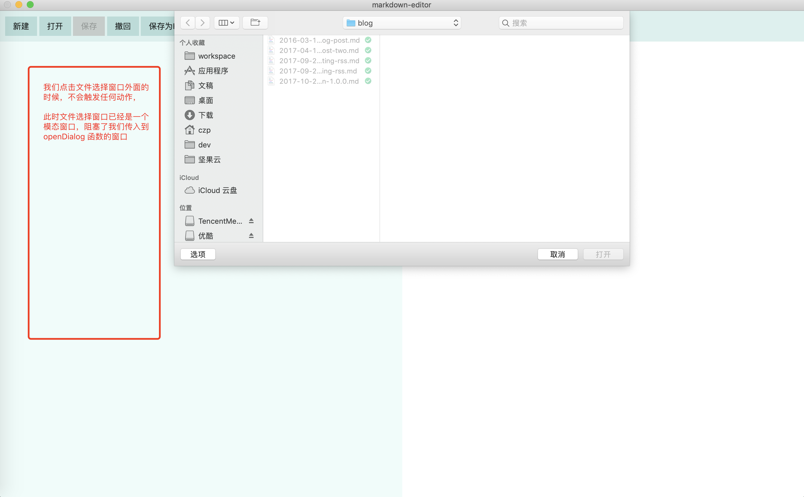

## 创建文件选择框

我们有时候需要让用户选择文件，可以使用 dialog

```javascript
const {app, BrowserWindow, dialog} = require('electron');
function getFileFromUser() {
    const files = dialog.showOpenDialog({ // 弹出文件打开对话框
        /**
         * 对话框可以设置有不同的属性 这里表示对话框只选择 一个 文件而不是目录或者多个文件
         * 其它可用的有：openDirectory multiselections
         */
        properties: ['openFile'],
        /**
         * 限定能够选择的文件的类型
         */
        filters:[
            {name: 'txt文件',extensions: ['txt']},
            {name: 'markdown文件',extensions: ['md','markdown']}
        ]
    });
    files.then(arr => {
        // arr.canceled 表示用户是否点了取消选择文件，如果是的话，那么 arr.filePaths 就是空数组
        // console.log(arr.filePaths); // 这个路径是选中文件的数组，我们选择单个文件数组就只会有一个值
        if(arr.canceled){
            return;
        }
        const filePath = arr.filePaths[0];
        const content = fs.readFileSync(filePath).toString();
        console.log(content);
    });
}
```

在 macos 显示如下




我们创建了 2 个文件的过滤选项，macos 要点击选项这里才能进行选择使用哪个选项，所以为了避免麻烦，可以只使用默认的一个




### 支持模态框

```javascript
function getFileFromUser(window) {
    const files = dialog.showOpenDialog(window,{ // 弹出文件打开对话框
        /**
         * 对话框可以设置有不同的属性 这里表示对话框只选择 一个 文件而不是目录或者多个文件
         * 其它可用的有：openDirectory multiselections
         */
        properties: ['openFile'],
        /**
         * 限定能够选择的文件的类型
         */
        filters:[
            {name: 'txt文件',extensions: ['txt']},
            {name: 'markdown文件',extensions: ['md','markdown']}
        ]
    });
    files.then(arr => {
        // arr.canceled 表示用户是否点了取消选择文件，如果是的话，那么 arr.filePaths 就是空数组
        // console.log(arr.filePaths); // 这个路径是选中文件的数组，我们选择单个文件数组就只会有一个值
        if(arr.canceled){
            return;
        }
        const filePath = arr.filePaths[0];
        const content = fs.readFileSync(filePath).toString();
        console.log(content);
    });
}

function appReady() {
    mainWindow = new BrowserWindow({
        // width: 100%,
        // height: 600,
        webPreferences: {
            nodeIntegration: true
        },
        show: false  // 刚创建出来时，不要显示，避免先显示短暂的白屏
    });
    mainWindow.maximize(); // 最大化 不等于全屏，最大化是保留系统任务栏等的
    mainWindow.loadFile('app/index.html');
    mainWindow.on('close', () => {
        mainWindow = null; // 关闭窗口后，将其设为 null
    });
    mainWindow.once('ready-to-show', () => {
        mainWindow.show(); // 主界面加载完成了才显示
        getFileFromUser(mainWindow);
    })
}
```

效果如图



当我们向 showOpenDialog 传入的第一个参数是 BrowserWindow 的时候，这个文件选择框将会变成这个 BrowserWindow 的模态窗口，阻塞 BrowserWindow 的运行

