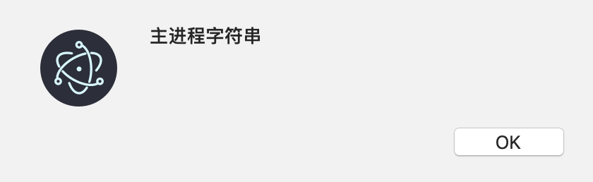

## 概述

首先我们知道：有些 **electron模块** 只能在主进程中使用、有些只能在渲染进程中使用，有些两种进程都能使用。而所有的 node 模块，在两种进程中都能使用（只要开启了渲染进程的 node 集成，electron 5.0 之后默认是关闭的）

因此，如果在渲染进程中想要使用一些主进程中才有的功能的话（比如GUI渲染），就需要渲染进程向主进程进行通信，告诉主进程：我想要使用 XXX 能力。所以 electron 在渲染进程中加入了 remote模块，来专门实现这个功能。

而 remote 模块只是渲染进程主动向主进程通信的方式，如果主进程想要主动向渲染进程通信，例如给渲染进程提供一些数据，那么就需要使用 webContents.send 方法，然后在渲染进程中使用 ipcRenderer 监听事件频道，获取到主进程发送来的数据。

### 渲染进程使用主进程对象

```javascript
// 渲染进程
const {remote} = require('electron');
setTimeout(() => remote.dialog.showOpenDialog(),5000);
```

> 渲染进程使用 remote，然后就可以使用主进程的对象，类似于 Java 的 RMI 机制

### 主进程通知渲染进程

```javascript
mainWindow.webContents.send('file-opened', filePath, content);
```

> 主进程使用渲染进程的窗口对象的 webContents，调用 send，发送消息。

### 渲染进程从主进程获取消息

```javascript
const {remote, ipcRenderer} = require('electron');
ipcRenderer.on('file-opened', (event, filePath, content) => {
    markdownView.value = content;
    renderMarkdown2Html(content);
    alert(filePath);
});
```

> 渲染进程使用 ipcRenderer，监听对应的消息，获取数据


## remote 的简单使用

```javascript
// 渲染进程
const {remote} = require('electron');
setTimeout(() => remote.dialog.showOpenDialog(),5000);
```

渲染进程中的 `remote.dialog` 就类似于主进程中的 `require('electron').dialog` 一样


## 基本原理

原理其实和 RMI 类似，渲染进程中访问 `remote.dialog` 的时候，就会向主进程发送一些信息，例如调用 `remote.dialog.showOpenDialog()` 时，就相当于告诉主进程：你需要调用 `electron.dialog.showOpenDialog()`，这个过程有点类似于 Java 的 RMI 机制：

- 在客户端（渲染进程）中创建了一个代理对象，代理了远程对象的一些接口
- 我们访问客户端对象的接口，RMI 底层就会将消息传递给远程对象，远程对象调用真正的实现方法
- 然后将结果再发送给客户端


## 访问 electron 内置模块

```javascript
// 渲染进程
const {remote} = require('electron');
setTimeout(() => remote.dialog.showOpenDialog(),5000);
```

渲染进程中的 `remote.dialog` 就类似于主进程中的 `require('electron').dialog` 一样

渲染进程中的 remote.app 就类似于主进程中的`require('electron').app` 一样

所以：访问 electron 内置模块使用 `remote.模块名` 即可

> 我们在主进程中也许没有引入这些模块，但是这些模块对象依然是存在于主进程中的，仅仅是主进程的 js 代码中没有获取到这些对象的引用而已，使用 remote 模块依然是能获取到这些对象的远程引用的


## 访问自定义的对象

```
// 主进程
app.sss = '主进程字符串';

// 渲染进程
const {remote} = require('electron');
alert(remote.app.sss);
```

结果：




> 建议将一些自定义对象挂载在主进程的 electron.app 对象上


## 访问模块 require

有时候有一些现成的模块，例如：

```
// foo.js
module.exports = 'bar'
```

我们可以使用

```javascript
// 渲染进程
const foo = require('electron').remote.require('./foo') // bar
```

来引入这个模块，这个相当于做了以下操作：

- 主进程执行了 `require('./foo')` 获取到了 mainFoo 对象
- 渲染进程产生了 mainFoo 对象的代理对象 foo
- 通过渲染进程的 foo 访问主进程的 mainFoo

> 从以上可以看出 `require('./foo')` 里的 `./foo` 这个相对路径必须是相对于主进程的主模块来说的


## remote 的回调坑

简单就是一句：尽量别把回调函数传递给主进程

实在不得不这么搞了，就自求多福多测试bug吧


## 主进程向渲染进程发送数据

前面的 remote 模块，发起通信的都是渲染进程，是一个单向的过程。如果主进程想要发起向渲染进程的通信，需要使用 webContents.send 方法

```javascript
mainWindow.webContents.send('file-opened', filePath, content);
```

> 第一个参数是消息通道，后面的参数都是具体的数据


## 渲染进程从主进程获取数据

主进程使用 webContents.send 像渲染进程发送数据后，渲染进程想要获取，需要使用如下的方式

```javascript
const {remote, ipcRenderer} = require('electron');
ipcRenderer.on('file-opened', (event, filePath, content) => {
    markdownView.value = content;
    renderMarkdown2Html(content);
    alert(filePath);
});
```

> 第一个参数是消息通道名称（实际就是类似于事件名称），第二个参数是回调。
>
> 回调的第一个参数 event 表示此次事件
>
> 回调的后面几个参数，就是主进程传递过来的几个参数数据

