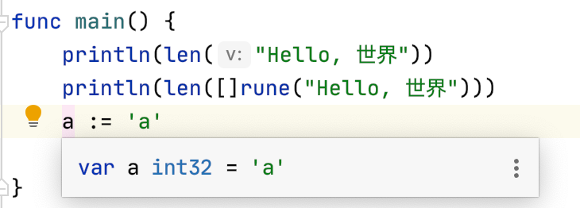

## unicode

unicode 实际上来说是定义了一个映射：某个数字  --> 某个字符

而 utf-8、utf-16、utf-32 等编码，则是定义了另一个映射：某种字节编码 --> 某个数字

对于 golang 来说，一个字符默认情况是采用 utf32 编码，也就是一个 int32


## 码点 rune

一个码点也就是一个字符在 unicode 中对应的那个数字（int32）

golang 中当我们单独写下一个字符的时候，实际就是一个码点的字面量，也就是 int32



rune 就是这个码点的类型，实际上就是 int32 的一个别名。

因此可以认为：golang 的单个字符采用 utf32 编码。每个字符就是一个 utf32、同时也是一个 rune、一个 int32

### 兼容 ascii

对于 ascii 字符，也可以用 byte 来承载（uint8的别名）

```
func main() {
	println(len("Hello, 世界"))
	println(len([]int32("Hello, 世界")))
	var a byte = 'a'
	println(a)
}
```


## 字符串长度 len

```
func main() {
	println(len("Hello, 世界"))
}
```

将会打印出 13。

golang 内置的 len 函数对 string 类型使用的时候，获得的是 string 的**字节长度**（整串字符实际是采用 UTF-8 编码的）


### 如何获取字符的数量（字符长度）

#### 转换成码点数组

```
func main() {
	println(len([]rune("Hello, 世界")))
}
```

- 首先将字符串转换成码点的数组
- 求这个码点数组的长度

#### 使用 utf8 的 api

```
func main() {
	println(len("Hello, 世界"))
	println(len([]rune("Hello, 世界")))
	println(utf8.RuneCountInString("Hello, 世界"))
}
```

`utf8.RuneCountInString("Hello, 世界")` 也可以计算字符串长度


### 如何遍历字符串的字符

```
func main() {
	for index, char := range "Hello, 世界" {
		fmt.Printf("第%v个字符是：%c\n", index, char)
	}
}
```

使用 range 来迭代字符

```
第0个字符是：H
第1个字符是：e
第2个字符是：l
第3个字符是：l
第4个字符是：o
第5个字符是：,
第6个字符是： 
第7个字符是：世
第10个字符是：界
```

可以看到 index 并不是字符的下标，而是 utf-8 编码里的字节下标


## 整数转字符串

### 使用 itoa

```
func main() {
	fmt.Println("aaa" + strconv.Itoa(10))
}
```

```
aaa10
```

这一点十分蛋疼，整数和字符串不能直接做加法。同时 string(int) 这种转换方式，是将 int 作为码点来转换为字符的，所以我们要将 10 转换成 "10" ，应该使用 `strconv.Itoa(10)`

> 反向转换就是 atoi，这就有可能会发生错误，需要注意判断 err == nil

### 使用 Sprintf

```
func main() {
	println("aaa" + fmt.Sprintf("%v", 10))
}
```

Sprintf 用法和 Printf 类似，但是它不是向屏幕打印字符串，而是将字符串结果进行返回

> 从转换的角度来看，Sprintf 更通用一点，它可以将各类的值转换成 string，比如数字、布尔值等


