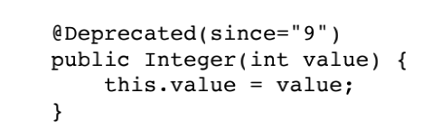
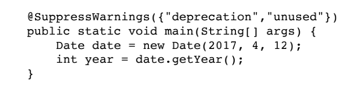
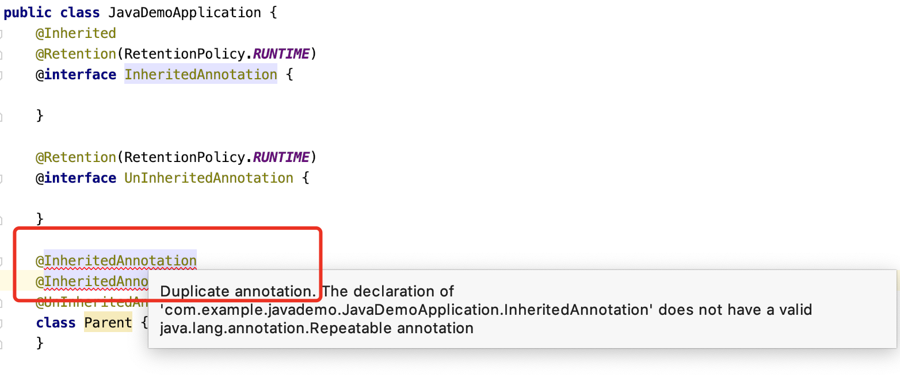

## 内置注解

java 本身有些内置注解，例如 Override、Deprecated、SuppressWarnings 等

### Override

用来修饰方法，表示该方法应该是父类或者实现的接口中声明的，当前类重写该方法，如果父类或者实现的接口中没有这个方法，就会报错。

> 这个注解加不加都不影响重写的结果，但是加了之后可以多一些编译时的检查，这样当我们写错方法名或者方法参数的时候可以被检查出来

### Deprecated

它可以修饰类、方法、字段、参数等，表示对应的内容已经过时了，建议不要使用。

从 Java 9 开始，有 2 个参数：since 和 forRemoval，表示过时的起始以及将来是否删除。



### SupressWarnings

表示压制编译器的警告，有一个必填参数，表示压制哪种类型的编译警告。




## 注解的基本格式

```java
@Target({TYPE, FIELD, METHOD, PARAMETER, CONSTRUCTOR, LOCAL_VARIABLE})
@Retention(RetentionPolicy.SOURCE)
public @interface SuppressWarnings {
    String[] value();
}
```

上面是 SuppressWarnings 的代码。

- 使用 `@interface`
- 使用 **元注解** Target 和 Retention
- 注解中可以有一些方法，表示参数

### Target 目标

表示注解的目标，也就是当前定义的这个注解（Override）要注解在什么元素上，元素 ElementType 主要的有：

- TYPE：类、接口（包括注解），枚举
- FIELD：字段，包括枚举常量
- METHOD：方法
- PARAMETER：方法中的参数
- CONSTRUCTOR：构造方法
- LOCAL_VARIABLE：本地变量
- MODULE：模块（Java 9 引入）

目标可以有多个，使用大括号 `{}` 来放置多个，表示当前定义的这个注解可以用在多个位置

> 如果没有这个元注解，那我们当前定义的这个注解就是适用于所有位置
>
> 还有其他一些没有列举出来，参见 ElementType 枚举去看吧

### Retention 保留时间

表示注解信息保留到什么时候，RetentionPolicy 可以取 3 种值：

- SOURCE：只在源代码种保留，编译成字节码之后就丢弃
- CLASS：保留到字节码文件，但是 JVM 加载了该类之后，不一定保留这个注解信息
- RUNTIME：一直保留到运行时，也就是说我们可以在运行的时候获取到注解的信息

> 如果没有声明 Retention，则表示是 CLASS 级别

### Documented 文档

功能：指明修饰的注解，可以被例如javadoc此类的工具文档化，只负责标记，没有成员取值。

### 注解参数

可以为注解定义一些参数，定义的方式是在注解内定义一些方法，比如 SuppressWarnings 中的 value() 方法，返回值表示参数的类型，也就是说这个注解可以接受一个字符串数组

```java
@Target({TYPE, FIELD, METHOD, PARAMETER, CONSTRUCTOR, LOCAL_VARIABLE})
@Retention(RetentionPolicy.SOURCE)
public @interface SuppressWarnings {
    String[] value();
}
```

> 当只有一个参数，且名称是 value，提供参数的时候可以省略 `value=`，直接写参数值
>
> 例如 @SuppressWarnings({"unused","deprecation"})

注解参数有限定的类型，只能是：基本类型、String、Class、枚举、注解，以及这些类型的数组

参数定义的时候可以有默认值，使用 default 来定义，例如

```java
@Target({TYPE, FIELD, METHOD, PARAMETER, CONSTRUCTOR, LOCAL_VARIABLE})
@Retention(RetentionPolicy.SOURCE)
public @interface MyAnnotation {
    Boolean value() default false;
}
```

> 参数值不能是 null


## 注解的继承

实际上，注解不能继承，注解的继承表示的是使用该注解的类可以被继承

```java
public class JavaDemoApplication {
    @Inherited
    @Retention(RetentionPolicy.RUNTIME)
    @interface InheritedAnnotation {

    }

    @Retention(RetentionPolicy.RUNTIME)
    @interface UnInheritedAnnotation {

    }

    @InheritedAnnotation
    @UnInheritedAnnotation
    class Parent {
    }


    class Child extends Parent {
    }

    public static void main(String[] args) {
        System.out.println(Child.class.isAnnotationPresent(InheritedAnnotation.class)); // true
        System.out.println(Child.class.isAnnotationPresent(UnInheritedAnnotation.class)); // false
    }
}
```

> 两个注解都在父类上添加了，都保留到运行时
>
> 子类继承父类后，只有添加了 Inherited 元注解的 InheritedAnnotation 在子类中还存在，而 UnInheritedAnnotation 不在子类中了


## 运行时获取注解信息

添加了注解之后，实际上不会不对程序产生其它任何影响，我们需要执行一些运行时获取到注解信息的代码，然后再根据注解信息执行相关的操作，一般模式就是：添加注解、读取注解、执行相关操作

### 反射获取注解信息

Class、Field、Method、Constructor 都有如下关于注解的方法

- `public Annotation[] getAnnotations()`：获取本元素的所有注解
- `public Annotation[] getDeclaredAnnotations()`：获取本元素的所有注解，不包括 `@Inherited` 继承来的
- `public <A extends Annotation> A getAnnotation(Class<A> annotationClass)`：获取指定类型的注解，没有的话返回 null
- `public boolean isAnnotationPresent(Class<? extends Annotation> annotationClass)`：判断是否具有指定类型的注解

> 这里都是 RUNTIME 类型的注解。有的 CLASS 或者 SOURCE 级别的，需要在外部进行处理，比如 Lombok 插件的注解就是 SOURCE 级别的，经过 Lombok 处理后，才能被 javac 编译器编译

对于 Method 和 Constructor，他们都有参数，具有下面的方法：

- `public Annotation[][] getParameterAnnotations()`：返回值是一个二维数组，每个参数对应一个一维数组，表示这个参数的所有注解

### Annotation 接口

```java
public interface Annotation {
    boolean equals(Object obj);

    int hashCode();

    String toString();

    Class<? extends Annotation> annotationType();
}
```

它表示注解，在内部实现时，所有的注解其实都实现了 Annotation 接口


## 自定义注解-自定义序列化

说一下大致的思路：

- 创建一些自定义注解，例如 SerializedFieldName 控制序列化的字段的名称
- 将自定义注解 SerializedFieldName 放到类的字段上，输入参数表示字段的序列化名称
- 创建一个序列化器
  - 序列化器接受一个对象
  - 扫描对象的所有字段
  - 扫描所有字段的注解
  - 如果没有 SerializedFieldName 注解，就使用字段的原始名称进行序列化
  - 如果有 SerializedFieldName 注解，就使用 SerializedFieldName 传入的名称进行序列化


## Repeatable 可重复注解

先看不能重复添加的普通注解：



可以看到，添加一样的注解后会报错，提示我们，这个注解需要添加 Repeatable 元注解

```java
@SpringBootApplication
public class JavaDemoApplication {
    public static void main(String[] args) {
        System.out.println(Repeat.class.isAnnotationPresent(RepeatableAnnotation.class)); // false
        System.out.println(Repeat.class.isAnnotationPresent(RepeatableAnnotationContainer.class)); // true
        RepeatableAnnotationContainer[] container =
                Repeat.class.getAnnotationsByType(RepeatableAnnotationContainer.class);
        RepeatableAnnotation[] repeats = container[0].value();
        System.out.println(repeats[0].value()); // 第一个注解
        System.out.println(repeats[1].value()); // 第二个注解
    }
}

@Retention(RetentionPolicy.RUNTIME)
@Repeatable(RepeatableAnnotationContainer.class)
@interface RepeatableAnnotation {
    String value();
}

@Retention(RetentionPolicy.RUNTIME)
@interface RepeatableAnnotationContainer {
    RepeatableAnnotation[] value();
}

@RepeatableAnnotation("第一个注解")
@RepeatableAnnotation("第二个注解")
class Repeat {
}
```

主要的用法：

- 将我们想要重复添加的注解 A 上添加上 Repeatable 元注解
- Repeatable 元注解的参数是一个容器类注解 B，这个容器类注解 B 的 value 返回 A 数组，用来装载重复的 A 注解
- 当我们获取重复注解的时候，被注解了的 Repeat 类只有容器类注解 B，没有原始的重复注解 A，这些重复的 A 注解需要从容器类注解 B 的 value 方法中获取
- 另外，如果只有一个重复注解的时候，被注解的并不是容器类注解 B，而是就是原始的重复注解 A，所以我们需要注意这种情况

> 本质上是一个语法糖，最后被注解上的其实是容器类注解
>
> 小技巧是将容器类注解作为外部重复注解的内部注解类，也就是说把容器类注解的定义，放在原始的重复注解内部

参考：[Repeatable](https://www.jianshu.com/p/4f65fae2510b)


## 总结

- 注解具有保留期：源码、字节码、运行时。大部分框架都是使用运行时 RUNTIME 的注解
- 注解具有参数：可以给注解传入一些参数
- 单单只是注解的话不会对程序产生任何影响
- 一般的模式是扫描出注解，然后对注解做相应的处理

