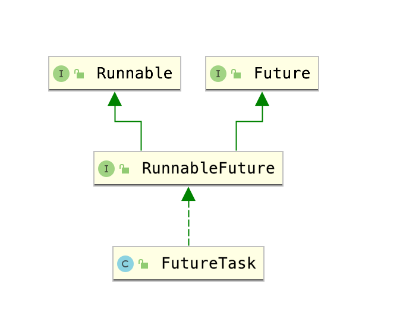

## Runnable 接口

```java
@FunctionalInterface
public interface Runnable {
    public abstract void run();
}
```

Runnable 用于**定义**一种没有返回值的**异步任务**，我们创建一个 Runnable 实例之后，相当于定义了一个异步任务的逻辑部分，但是并没有执行它。简单的使用就是将其使用另一个线程中执行，或者是放到线程池中执行。

### 使用 Thread 执行 Runnable 异步任务

```java
public static void main(String[] args) {
  Runnable runnable = () -> {
    System.out.println("异步线程："+ Thread.currentThread().getName());
  };
  System.out.println("主线程："+ Thread.currentThread().getName());
  new Thread(runnable).start();
}

输出：
主线程：main
异步线程：Thread-0
```

### 使用 ExecutorService 执行 Runnable 异步任务

```java
public static void main(String[] args) {
  Runnable runnable = () -> {
    System.out.println("异步线程："+ Thread.currentThread().getName());
    try {
      // 线程睡眠1s，模拟多个异步任务提交
      Thread.sleep(1000);
    } catch (InterruptedException e) {
      e.printStackTrace();
    }
  };
  ExecutorService executorService = Executors.newFixedThreadPool(2);
  // 提交 2 个异步任务
  executorService.execute(runnable);
  executorService.execute(runnable);
  System.out.println("主线程："+ Thread.currentThread().getName());
  new Thread(runnable).start();
}

输出：
主线程：main
异步线程：pool-1-thread-1
异步线程：pool-1-thread-2
异步线程：Thread-0
```

### Runnable 运行时异常的问题

```java
public static void main(String[] args) {
  Runnable runnable = () -> {
    System.out.println("异步线程："+ Thread.currentThread().getName());
    // 模拟一个运行时异常
    throw new RuntimeException("");
  };
  ExecutorService executorService = Executors.newFixedThreadPool(2);
  // 提交 3 个异步任务
  executorService.execute(runnable);
  executorService.execute(runnable);
  executorService.execute(runnable);
  System.out.println("主线程："+ Thread.currentThread().getName());
  new Thread(runnable).start();
}

输出：
主线程：main
异步线程：pool-1-thread-1
异步线程：pool-1-thread-2
异步线程：pool-1-thread-3
Exception in thread "pool-1-thread-1" Exception in thread "pool-1-thread-2" Exception in thread "pool-1-thread-3" java.lang.RuntimeException: 
	at com.example.javademo.JavaDemoApplication.lambda$main$0(JavaDemoApplication.java:40)
	at java.util.concurrent.ThreadPoolExecutor.runWorker(ThreadPoolExecutor.java:1149)
	at java.util.concurrent.ThreadPoolExecutor$Worker.run(ThreadPoolExecutor.java:624)
	at java.lang.Thread.run(Thread.java:748)
java.lang.RuntimeException: 
	at com.example.javademo.JavaDemoApplication.lambda$main$0(JavaDemoApplication.java:40)
	at java.util.concurrent.ThreadPoolExecutor.runWorker(ThreadPoolExecutor.java:1149)
	at java.util.concurrent.ThreadPoolExecutor$Worker.run(ThreadPoolExecutor.java:624)
	at java.lang.Thread.run(Thread.java:748)
java.lang.RuntimeException: 
	at com.example.javademo.JavaDemoApplication.lambda$main$0(JavaDemoApplication.java:40)
	at java.util.concurrent.ThreadPoolExecutor.runWorker(ThreadPoolExecutor.java:1149)
	at java.util.concurrent.ThreadPoolExecutor$Worker.run(ThreadPoolExecutor.java:624)
	at java.lang.Thread.run(Thread.java:748)
```

> 重点是：`异步线程：pool-1-thread-3` ，我们这个固定大小为 2 的线程池，创建了至少三个线程，因为前两个线程执行的时候都抛出了异常，线程直接挂了。所以只能创建新的线程去执行第三个任务

### 总结

- Runnable 只是异步任务的一种定义，我们只有使用别的线程将其执行才有意义。使用单独的线程执行它，或者使用 ExecutorService 执行它
- Runnable 接口的方法没有返回值，表示它是一种不期待结果的异步任务，我们一些后台操作就很适合用 Runnable 接口来定义，比如说定时更新缓存、定时记录一些日志等，这种任务不需要有明确的结果返回
- Runnable 需要自己处理所有的异常，抛出异常的话线程就直接挂了。


## Callable 和 Future 接口

```java
@FunctionalInterface
public interface Callable<V> {
    V call() throws Exception;
}

public interface Future<V> {
    boolean cancel(boolean mayInterruptIfRunning);
    boolean isCancelled();
    boolean isDone();
    V get() throws InterruptedException, ExecutionException;
    V get(long timeout, TimeUnit unit)
        throws InterruptedException, ExecutionException, TimeoutException;
}
```

Callable 接口也是定义一种异步任务，但是跟 Runnable 不同的是，Callable 定义的异步任务是有返回值的，比如我们在后台进行一定的计算，最终需要返回一个值给程序的其它线程使用。

这个返回值一般就是使用 Future 接口来表示。Future 接口定义的是一种异步任务的**执行结果**。它的泛型表示某个异步任务的返回结果，这个返回结果可以在将来的某个时间被获取到或者是抛出异常。

一般的模式就是，使用 Callable 定义异步任务的执行逻辑，将其提交到线程池中 submit，然后立刻得到一个 Future 表示这个异步任务的执行结果。

### 使用 ExecutorService 提交 Callable

```java
public static void main(String[] args) throws ExecutionException, InterruptedException {
  Callable<Integer> callable = () -> {
    // 模拟一个耗时操作
    Thread.sleep(2000);
    return 3;
  };
  ExecutorService executorService = Executors.newFixedThreadPool(2);
  // 提交这个 callable，将会得到一个 future，
  Future<Integer> result = executorService.submit(callable);
  long start = System.currentTimeMillis();
  // 想要获取异步任务结果的线程，这里也就是主线程，将会阻塞直到获取结果或者抛出异常
  Integer num = result.get();
  long end = System.currentTimeMillis();
  System.out.println("获取到结果：" + num);
  System.out.println("总耗时：" + (end - start) + " 毫秒");
}
输出：
获取到结果：3
总耗时：2003 毫秒
```

可以看到，我们的使用模式如下：

- 定义一个 callble 操作
- 将其提交到一个线程池，使用的是 submit 这个接口。这个接口将会执行异步任务，并且将异步任务的结果封装为一个 future，这一步是一个非阻塞的方法，仅仅是提交到线程池然后立刻得到 future，并不会阻塞到这个异步任务执行完毕。
- 我们通过 future 的 get 方法来获取异步任务的结果，很明显的道理就是，当我们调用 get 的时候，异步任务并不一定完成了，future 的策略就是：调用 get 方法的那个线程直接阻塞直到获取到异步任务的结果，或者是抛出异常。
- 因此我们的主线程中获取结果的总耗时也是差不多 2000 毫秒

### 总结

- Callable 也是一种异步任务的定义，它定义了异步任务的执行过程，以及最后应该返回的内容
- 我们一般通过 ExecutorService 线程池的 submit 接口，提交 callable 异步任务，然后立刻获取到 future 代表的异步任务的结果。
- 我们拿到 future 后，一般会在将来的某一个时刻调用它的 get 方法，阻塞当前的线程获取这个 future 的结果
- 也可以通过 future 的 isDone 接口来判断任务是否完成，任务没有完成的话，当前线程继续执行其他操作，任务完成了就调用 get，这样就提高了当前线程的效率


## Future 接口

```java
public interface Future<V> {
    boolean cancel(boolean mayInterruptIfRunning);
    boolean isCancelled();
    boolean isDone();
    V get() throws InterruptedException, ExecutionException;
    V get(long timeout, TimeUnit unit)
        throws InterruptedException, ExecutionException, TimeoutException;
}
```

- get
  - 􏰋􏰵􏲆􏰄􏱫􏳍􏲞􏱲􏰶􏲏􏰪􏰎􏱈􏲇􏰗􏱈􏲞􏱲􏰤􏲡􏲽􏰺􏰨􏱜􏲇􏱐􏳴􏲀􏰆􏴋􏰋􏰵􏲆􏰄􏱫􏳍􏲞􏱲􏰶􏲏􏰪􏰎􏱈􏲇􏰗􏱈􏲞􏱲􏰤􏲡􏲽􏰺􏰨􏱜􏲇􏱐􏳴􏲀􏰆􏴋􏰋􏰵􏲆􏰄􏱫􏳍􏲞􏱲􏰶􏲏􏰪􏰎􏱈􏲇􏰗􏱈􏲞􏱲􏰤􏲡􏲽􏰺􏰨􏱜􏲇􏱐􏳴􏲀􏰆􏴋返回异步任务最终的结果，如果异步任务还没有执行完毕，则当前调用 get 的这个线程阻塞，直到异步任务获取到了结果
  - 带参数的 get 方法定义了阻塞的最长时间
  - 当异步任务被取消的时候，抛出 CancellationException
  - 当异步任务本身抛出异常的时候，我们调用 get 的线程抛出异常 ExecutionException
  - 如果当前的线程被中断了，抛出异常 InterruptedException
  - 如果等待超时了，抛出异常 TimeoutException

- cancel
  - 用于取消任务，如果任务已完成、或者已经取消、或者由于某种原因不能被取消，返回 false，否则返回 true
  - 如果任务还没开始，则任务不再运行了，如果任务已经在运行，则不一定能取消
  - 参数 mayInterruptIfRunning 表示，如果任务正在执行，是否调用 interrupt 方法中断线程
- isCancelled
  - 查询任务是否被取消，只要 cancel 方法返回了 true，后续 isCancelled 方法都返回 true
- isDone
  - 查询任务是否已经结束，不管是什么原因都算，任务可能是正常结束了，也可能是抛出异常了，也可能是是被取消了

### 总结

Future 接口封装了一个异步的任务结果，但是不关注异步任务的具体执行，Future 仅仅关注异步任务是否完成了，以及获取它的结果，另外可以控制是否取消异步任务。


## RunnableFuture 接口

先看类图：



```java
public interface RunnableFuture<V> extends Runnable, Future<V> {
    /**
     * Sets this Future to the result of its computation
     * unless it has been cancelled.
     */
    void run();
}

public class FutureTask<V> implements RunnableFuture<V>
```

这个 RunnableFuture 接口的含义和名字一样，就是说它既是一个 Runnable 又是一个 Future。

前面说了，Runnable 是一个异步任务的执行过程的定义，而 Future 是一个异步任务执行结果的定义。

那么 RunnableFuture 接口，就是既定义了异步任务的执行过程，又定义了异步任务的执行结果。实际上来说，我们很少单独用到这个接口，这个接口在 ExecutorService 的 submit 接口中使用。

### submit 方法的逻辑

```java
public <T> Future<T> submit(Callable<T> task) {
  if (task == null) throw new NullPointerException();
  RunnableFuture<T> ftask = newTaskFor(task);
  execute(ftask);
  return ftask;
}

public <T> Future<T> submit(Runnable task, T result) {
  if (task == null) throw new NullPointerException();
  RunnableFuture<T> ftask = newTaskFor(task, result);
  execute(ftask);
  return ftask;
}
```

- 不论是 Callable 还是 Runnable，都被包装成了 RunnableFuture
  - Runnable 实际上可以看做是 `Callable<Void>`
- 将 RunnableFuture 视作一个 Runnable，提交到某处去执行（某个新的线程、或者当前线程、或者是某个已经存在的线程）
- 直接返回这个 RunnableFuture
- 这个 RunnableFuture 实际上就是 FutureTask 类来实现的

### 总结

- RunnableFuture 既是 Runnable 又是 Future
- 无论是 Runnable 还是 Callable 在 submit 的时候，都被 ExecutorService 包装成了 RunnableFuture，然后将其视为一个 Runnable 去 execute 执行了
- 我们接受到的 Future 就是 RunnableFuture 的实现类 FutureTask 的实例
- 很少单独直接使用这个接口


## FutureTask 类

这个类主要用来实现 Future 接口功能的，详细的源码分析留在以后有时间再写

简单说下实现的思路吧：

- 首先是接受一个 Callable 表示这个异步任务的具体逻辑。对于 Runnable 也可以包装成 `Callable<Void>` 类型，所以都看做是 Callable 即可
- 当我们调用 run 方法的时候，可以获取到当前正在执行 run 方法的进程，也就是 runner，然后我们执行内部的 callable 的 call 方法，执行完毕之后将结果设置到内部状态变量 result 里，并且将 runner 线程状态设置为 complete
- 上面的 run 方法是在某个线程中执行的
- 我们的主线程调用 get 的时候，就进入一个死循环，一直去看线程状态是否是 complete 或者是 cancel、exception 或者是超时了，最后再给出结果
- 我们的主线程调用 isDone 的时候就是简单的去看一下状态变量
- 内部的线程状态 state 是 volatile 修饰的，主要是解决多线程同时修改 future，比如同时去取消的时候，同时去设置的时候的可见性问题


## CompletableFuture

简单一句话概括：就是 Java 里的 Promise

参考：[https://colobu.com/2018/03/12/20-Examples-of-Using-Java%E2%80%99s-CompletableFuture/](https://colobu.com/2018/03/12/20-Examples-of-Using-Java%E2%80%99s-CompletableFuture/)

### 1.创建一个已完成的 CompletableFuture

```java
CompletableFuture<String> future = CompletableFuture.completedFuture("123");
```

### 2.创建一个异步 CompletableFuture

```java
CompletableFuture<String> future = CompletableFuture.supplyAsync(() -> {
  //做一些计算类的操作
  return "x";
});
```

### 3.直接运行一个没有返回值的异步任务

```java
CompletableFuture<Void> result = CompletableFuture.runAsync(() -> {
  // 做一些异步任务，不需要返回值
});
```

### 4.使用 thenApply 方法，进行 CompletableFuture 的连接

```java
CompletableFuture<String> future = CompletableFuture.supplyAsync(() -> {
  //做一些计算类的操作
  return "x";
});
future.thenApply(x -> {
  String name = Thread.currentThread().getName();
  System.out.println(name);
  return name;
}).thenApply(x -> {
  String name = Thread.currentThread().getName();
  System.out.println(name);
  return name;
});
输出；
main
main
```

> 跟 Promise 的 then 很像，接收上一步的结果，然后执行一个函数。
>
> 但是这里有个问题就是，执行这个函数的就是调用这个 thenApply 方法的进程，所以这里线程名称输出的都是 main
>
> 由于执行这个回调函数的线程就是当前调用 thenApply 的线程，所以实际上类似于 Future 的 get 调用了，当异步任务耗时较长时，当前调用 thenApply 的线程就会阻塞比较长，所以尽量不要用 thenApply 方法

### 5.使用 thenApplyAsync 方法，进行 CompletableFuture 的连接

```java
CompletableFuture<String> future = CompletableFuture.supplyAsync(() -> {
  //做一些计算类的操作
  return "x";
});
future.thenApplyAsync(x -> {
  String name = Thread.currentThread().getName();
  System.out.println(name);
  return name;
}).thenApplyAsync(x -> {
  String name = Thread.currentThread().getName();
  System.out.println(name);
  return name;
}, Executors.newSingleThreadExecutor());
System.out.println("结束");

输出：
ForkJoinPool.commonPool-worker-1
结束
pool-1-thread-1
```

> 这个 thenApplyAsync 才是我们真正应该推荐使用的方法，它有两个重载
>
> - 默认情况下，thenApplyAsync 使用 ForkJoinPool.commonPool 来运行回调
> - 我们可以提供第二个可选的参数 `Executor e` ，让这个执行器来执行回调，一般来说，我们可以自己创建一个线程池传入进去
> - ForkJoinPool.commonPool 的线程数量有限，与 CPU 核数一致，我们如果有很多 CompletableFuture 都进行了阻塞调用，这个默认的线程池很快就炸了
> - 因此在有阻塞代码的情况下，我们必须传入自己创建的线程池作为 thenApplyAsync 的第二个参数

### 6.使用 thenAccept/thenAcceptAsync 方法，消费前面的结果

```java
CompletableFuture<String> future = CompletableFuture.supplyAsync(() -> {
  //做一些计算类的操作
  return "x";
});
CompletableFuture<Void> result = future.thenAcceptAsync(x -> {
  String name = Thread.currentThread().getName();
  System.out.println(name);
  System.out.println(x);
});
System.out.println("结束");
Thread.sleep(1000);

输出：
结束
ForkJoinPool.commonPool-worker-1
x
```

> 这种情况其实跟 thenApply/thenApplyAsync 差不多，唯一的区别回调是不需要返回值，此时返回的 CompletableFuture 的泛型将会是 Void，依然可以在后面继续进行 thenApply 这种连接

### 7.使用 handle/handleAsync 方法，处理异常

```java
CompletableFuture<String> future = CompletableFuture.supplyAsync(() -> {
  if (System.nanoTime() % 2 == 0) {
    throw new RuntimeException("第一个异常");
  }
  //做一些计算类的操作
  return "x";
});
future.thenApplyAsync(x -> {
  if (System.nanoTime() % 2 == 0) {
    throw new RuntimeException("第二个异常");
  }
  return "xx";
}).thenApplyAsync(x -> {
  if (System.nanoTime() % 2 == 0) {
    throw new RuntimeException("第三个异常");
  }
  return "xxx";
}).thenApplyAsync(x -> {
  if (System.nanoTime() % 2 == 0) {
    throw new RuntimeException("第四个异常");
  }
  return 4;
}).handleAsync((num, e) -> {
  if (e != null) {
    System.out.println("发生了异常：" + e.getMessage());
  }
  return null;
});
System.out.println("结束");
Thread.sleep(1000);

输出：
结束
发生了异常：java.lang.RuntimeException: 第三个异常  (这里一二三四都有可能)
```

> 整个 CompletableFuture 链条，当发生异常时，就会停止，后面的 thenApplyAsync 方法不再执行
>
> 当我们调用 handleAsync 处理异常的时候，可以捕获到前面任何一个阶段抛出的异常，因为异常一旦发生整个链条就不执行了，所以说只可能会有一个异常被我们捕获到
>
> handle 方法可以看做是强化版本的 thenApply 方法，接收上一步骤的结果和之前可能发生了的异常，返回一个结果

### 8.使用 applyToEither/applyToEitherAsync 方法，表示任意一个完成

```java
public static void main(String[] args) throws InterruptedException {
  CompletableFuture<Integer> f1 = CompletableFuture.supplyAsync(() -> {
    try {
      Thread.sleep(Math.abs(new Random().nextInt()) % 1000);
    } catch (InterruptedException e) {
      e.printStackTrace();
    }
    return 5;
  });
  CompletableFuture<Integer> f2 = CompletableFuture.supplyAsync(() -> {
    try {
      Thread.sleep(Math.abs(new Random().nextInt()) % 1000);
    } catch (InterruptedException e) {
      e.printStackTrace();
    }
    return 8;
  });
  CompletableFuture<Integer> f3 = f1.applyToEitherAsync(f2, (num) -> {
    System.out.println(num);
    return 3;
  });
  Thread.sleep(2000);
  System.out.println(f3.isDone());
  System.out.println(f3.join());
}

输出：
5
true
3
  
或者输出：
8
true
3
```

> f1.applyToEitherAsync(f2, fn) 表示 f1 和 f2 任意一个完成的时候，将结果传递给 fn 作为参数来执行 fn。而执行 fn 得到的结果就是这个方法返回的 f3 的结果
>
> 注意：如果 f1 或者 f2 执行的时候抛出异常了，fn 将不会执行，f3 获取的结果也将会是抛出异常，这是要特别注意的一点

### 9.使用 acceptEither/acceptEitherAsync 方法，表示任意一个完成后消费

```java
public static void main(String[] args) throws InterruptedException {
  CompletableFuture<Integer> f1 = CompletableFuture.supplyAsync(() -> {
    try {
      Thread.sleep(Math.abs(new Random().nextInt()) % 1000);
    } catch (InterruptedException e) {
      e.printStackTrace();
    }
    return 5;
  });
  CompletableFuture<Integer> f2 = CompletableFuture.supplyAsync(() -> {
    try {
      Thread.sleep(Math.abs(new Random().nextInt()) % 1000);
    } catch (InterruptedException e) {
      e.printStackTrace();
    }
    return 8;
  });
  CompletableFuture<Void> f3 = f1.acceptEitherAsync(f2, (num) -> {
    System.out.println(num);
  });
  Thread.sleep(2000);
  System.out.println(f3.isDone());
  System.out.println(f3.join());
}
```

> 跟 applyToEitherAsync 是一个意思，唯一的区别是这里的 fn 是个消费者，不返回值

### 10.使用 runAfterBoth/runAfterBothAsync 方法，表示都完成后执行

```java
public static void main(String[] args) throws InterruptedException {
  CompletableFuture<Integer> f1 = CompletableFuture.supplyAsync(() -> {
    try {
      Thread.sleep(Math.abs(new Random().nextInt()) % 1000);
    } catch (InterruptedException e) {
      e.printStackTrace();
    }
    return 5;
  });
  CompletableFuture<Integer> f2 = CompletableFuture.supplyAsync(() -> {
    try {
      Thread.sleep(Math.abs(new Random().nextInt()) % 1000);
    } catch (InterruptedException e) {
      e.printStackTrace();
    }
    return 8;
  });
  CompletableFuture<Void> f3 = f1.runAfterBothAsync(f2, () -> {
    if(f1.isDone() && f2.isDone()){
      System.out.println("两个都完成了");
    }
  });
  Thread.sleep(2000);
}

输出是：
两个都完成了
```

> 注意：这里执行的是 Runnable，我们想要使用这两个已经完成了的 future 的结果的话，可以使用 f1.join() 和 f2.join()

### 11.使用 thenAcceptBoth/thenAcceptBothAsync，也表示都完成后执行

```java
public static void main(String[] args) throws InterruptedException {
  CompletableFuture<Integer> f1 = CompletableFuture.supplyAsync(() -> {
    try {
      Thread.sleep(Math.abs(new Random().nextInt()) % 1000);
    } catch (InterruptedException e) {
      e.printStackTrace();
    }
    return 5;
  });
  CompletableFuture<String> f2 = CompletableFuture.supplyAsync(() -> {
    try {
      Thread.sleep(Math.abs(new Random().nextInt()) % 1000);
    } catch (InterruptedException e) {
      e.printStackTrace();
    }
    return "8";
  });
  CompletableFuture<Void> f3 = f1.thenAcceptBothAsync(f2, (num,str) -> {
    if(f1.isDone() && f2.isDone()){
      System.out.println("两个都完成了");
      System.out.println(num);
      System.out.println(str);
    }
  });
  Thread.sleep(2000);
}
```

> 这个方法与 runAfterBothAsync 的行为几乎一致
>
> 唯一的区别是这里传入的是 BiConsumer，可以获取到两个 future 的结果

### 12.使用 thenCombine/thenCombineAsync，组合两个值返回新值

```java
public static void main(String[] args) throws InterruptedException {
  CompletableFuture<Integer> f1 = CompletableFuture.supplyAsync(() -> {
    try {
      Thread.sleep(Math.abs(new Random().nextInt()) % 1000);
    } catch (InterruptedException e) {
      e.printStackTrace();
    }
    return 5;
  });
  CompletableFuture<String> f2 = CompletableFuture.supplyAsync(() -> {
    try {
      Thread.sleep(Math.abs(new Random().nextInt()) % 1000);
    } catch (InterruptedException e) {
      e.printStackTrace();
    }
    return "8";
  });
  CompletableFuture<String> f3 = f1.thenCombineAsync(f2, (num, str) -> {
    System.out.println("两个都完成了");
    System.out.println(num);
    System.out.println(str);
    return num + str;
  });
  Thread.sleep(2000);
}
```

>这个方法就是说：等待 f1 和 f2 都完成，然后使用他们的结果执行一个函数获取新值，返回一个新的 future
>
>常用在这种场景：去 A 请求一个信息，去 B 请求一个信息，然后结合两个信息再做一些事情
>
>这样子就有了 future 的组合的能力

### 13.使用 thenCompose/thenComposeAsync，解耦 future

```java
public static void main(String[] args) throws InterruptedException {
  CompletableFuture<Integer> f1 = CompletableFuture.supplyAsync(() -> {
    try {
      Thread.sleep(Math.abs(new Random().nextInt()) % 1000);
    } catch (InterruptedException e) {
      e.printStackTrace();
    }
    return 5;
  });
  CompletableFuture<String> f2 = CompletableFuture.supplyAsync(() -> {
    try {
      Thread.sleep(Math.abs(new Random().nextInt()) % 1000);
    } catch (InterruptedException e) {
      e.printStackTrace();
    }
    return "8";
  });
  CompletableFuture<Integer> f3 = f1.thenComposeAsync(num -> CompletableFuture.completedFuture(num));
  Thread.sleep(2000);
}
```

> `f1.thenComposeAsync(num -> CompletableFuture.completedFuture(num))` 的返回结果是 `CompletableFuture<Integer>`
>
> 而 `f1.thenApplyAsync(num -> CompletableFuture.completedFuture(num))` 的返回结果是 `CompletableFuture<CompletableFuture<Integer>>`
>
> 这两个方法的关系就像是 map 和 flatMap，当我们封装了很多的异步方法时，例如 `(xxx) -> CompleteFuture<Result>` ，使用 thenComposeAsync 就会十分方便

### 14.使用 anyOf ，表示任意一个完成后的 future

```java
CompletableFuture.anyOf(f1, f2).whenCompleteAsync((num, e) -> {
  System.out.println(num);
});
```

> 这个语义表示：f1 和 f2 任意一个完成后，执行后面的函数
>
> 第一个参数表示：任意一个执行完成的结果
>
> 第二个参数表示：最先完成的那个 future 的异常
>
> 这两个参数必有一个是 null，异常是 null 表示正确完成。
>
> 这种检查方式跟 golang 差不多

### 15.使用 allOf，表示全部完成后的 future

```java
CompletableFuture.allOf(f1, f2).whenCompleteAsync((num, e) -> {
  // 分别处理 f1 和 f2，
});
```

> 这个语义表示：f1 和 f2 都完成
>
> 当这个组合的 future 完成后，我们就可以在内部的函数中分别处理 f1 和 f2，单独去看它们是否有异常

### 总结

- CompletableFuture 相当于 JS 里的 Promise
- xxx 和 xxxAsync 方法的区别是 xxxAsync 会在 ForkJoinPool.commonPool 中执行，xxx 大部分情况下会在调用 xxx 这个方法的线程中执行
- xxxAsync 方法最后一个参数都可以传入一个 Executor 表示它要执行的地点
- 建议全都使用 xxxAsync 方法


