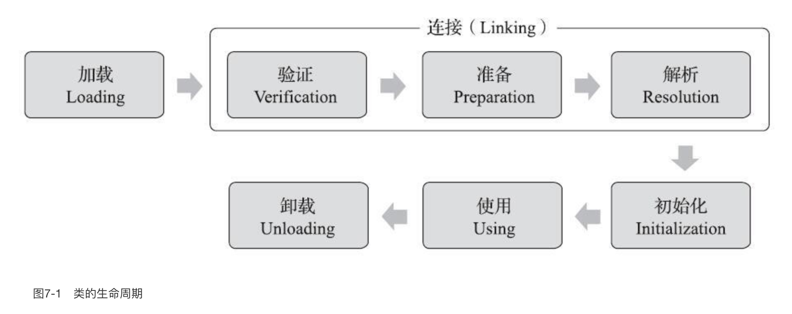
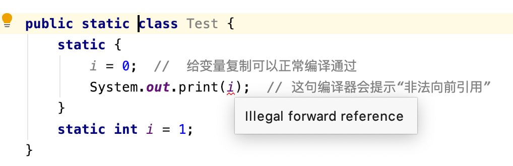

## ClassLoader 的作用

核心作用：负责将字节码文件加载到内存，创建 Class 对象。

> 例如我们传入一个字符串，表示类的地址，类加载器去某些系统路径下去找到这个类的字节码文件，然后将其加载到内存中，创建出一个 Class 类对象

通过 ClassLoader，我们可以实现一些强大灵活的功能：

- 热部署，在不重启 Java 程序的情况下，动态替换类的实现，jsp 就是使用这种方式的
- 应用的模块化和相互隔离，不同的 ClassLoader 可以加载相同的类但是相互隔离、互不影响。像是 tomcat 就是利用这一点，每个web程序使用不同的 ClassLoader，这些web应用互不干扰。OSGI 和 Java 9 利用这一点实现了一个动态模块化架构，每个模块有自己的 ClassLoader，不同模块互不干扰
- 从不同的地方灵活加载，例如从网络字节流加载字节码。最初类加载器的用途就是 applet，通过网络获取字节码动态加载


## 类加载器的基本机制和过程

类加载器的输入是 **完全限定类名**，输出是 Class 对象。一般程序运行时会有 3 个类加载器

### 启动类加载器 Bootstrap ClassLoader

这个类加载器是 JVM 实现的一部分，也就是说是 C++ 写的，它负责加载 java 的基础类，比如 String 类这种。这些类主要是处于 $JAVA_HOME/lib/rt.jar，完整的加载路径是 `System.getProperty("sun.boot.class.path")`，使用 -Xbootclasspath 可以修改这个路径

### 扩展类加载器 Extension ClassLoader

它的实现是 ExtClassLoader，它负责加载 java 的一些扩展类，说白了就是去加载 $JAVA_HOME/jre/lib/ext 目录里的 jar 包。可以使用 -Djava.ext.dirs 修改它的搜索路径

默认的路径在我的 mac 上是

```
/Users/czp/Library/Java/Extensions:/Library/Java/JavaVirtualMachines/adoptopenjdk-8.jdk/Contents/Home/jre/lib/ext:/Library/Java/Extensions:/Network/Library/Java/Extensions:/System/Library/Java/Extensions:/usr/lib/java
```

### 应用程序类加载器 Application ClassLoader

它的实现是 AppClassLoader，它负责加载应用程序的类，也就是上文说的 `java -cp <cp列表>` 命令里的 classpath 里的类

### 委托加载机制

上面 3 个类加载器有一个层次关系，AppClassLoader 内部持有一个 ExtClassLoader，ExtClassLoader 内部则是 持有BootstrapClassLoader(实际上是一个空指针)

在加载一个类的时候，基本过程是：

- 判断是否已经加载过了，加载过了就直接返回 Class 对象，因此一个类只会被加载一次
- 如果没有加载，先让它上层的类加载器去加载，也就是说 AppClassLoader 叫 ExtClassLoader 去加载，ExtClassLoader 也判断是否加载过了，没加载过就叫 BootstrapClassLoader 去加载
- 父类加载器没有加载成功，类加载器就尝试自己加载。

> 也就是说：任何类第一次加载的时候，首先都是 BootstrapClassLoader 去加载。BootstrapClassLoader 发现加载不了，就是 ExtClassLoader 去加载，然后接着才是 AppClassLoader 去加载
>
> 上述的说明仅限于这三种 JVM 和 JDK 自己实现的类加载器，实际上我们自己编写的类加载器完全可以打破这个所谓的双亲委托加载规则

这种委托机制主要是为了避免重复加载，说是避免覆盖核心类库，实际上仅仅有这个双亲委托的话是做不到的，主要靠的还是 JVM 自身的实现保证的

### 打破委托机制

双亲委托虽然是一般的机制，但是我们完全可以不理这个机制，例如

- 我们的类加载器可以使用自定义的加载顺序，从而打破双亲委托。但是有一个情况是，即使我们不遵守双亲委托，也无法加载以 java 开头的类，这是 java 的安全机制保证的
- 网状加载顺序：在 OSGI 框架和 java 9 模块化系统中，类加载器之间的关系是一个网，每个模块有一个类加载器，不同模块之间可能有依赖关系，在一个模块加载一个类时，可能是从自己模块加载，也可能是委托给其它模块的类加载器进行加载
- 父加载器委托给子加载器加载：典型的例子是 JNDI 服务。

> 一个程序运行的时候，会创建一个 AppClassLoader，在程序中用到 ClassLoader 的地方，如果没有指定，一般用到的都是这个 AppClassLoader，所以也经常被称作是系统类加载器。
>
> 在 springboot 中，打包成 fat jar 后的类加载器是 `org.springframework.boot.loader.LaunchedURLClassLoader`，它负责加载 jar 包里的 jar 包（springboot 把依赖的jar包嵌套地打在了jar包的里面）
>
> 如果我们使用 ide 去运行 springboot，使用的类加载器是 AppClassLoader，因为此时没有打包成 fat jar


## 类加载的时机

一个类型从被加载到虚拟机内存中开始，到卸载出内存为止，它的整个生命周期将会经历加载（Loading）、验证（Verification）、准备（Preparation）、解析（Resolution）、初始化（Initialization）、使用（Using）和卸载（Unloading）七个阶段，其中验证、准备、解析三个部分统称为连接（Linking）。




## 类加载的过程

### 加载

“加载”（Loading）阶段是整个“类加载”（Class Loading）过程中的一个阶段，希望读者没有混淆这两个看起来很相似的名词。（类加载包含了上述的：加载、验证、准备、解析、初始化 5 个阶段）

在加载阶段，Java虚拟机需要完成以下三件事情：

- 通过一个类的全限定名来获取定义此类的二进制字节流。（通过名称 --> 获取到类的二进制数据块 byte[]）
- 将这个字节流所代表的静态存储结构转化为方法区的运行时数据结构。
- 在内存中生成一个代表这个类的java.lang.Class对象，作为方法区这个类的各种数据的访问入口。

> JVM 规范仅仅规定了要通过名称获取到 class 的字节流，但是并没规定要存在文件系统上，因此很多自定义的类加载器就可以去加载zip包、网络中、运行时动态生成的类，玩出了很多花样。
>
> 例如 JDK 动态代理，就是通过动态生成类的二进制字节流来实现的，可以说这种模式是 Java 扩展性和灵活性的核心
>
> 总之就是：我们自定义的类加载器可以自由地决定如何从类名到 class 二进制字节流的映射，从而达到动态加载的目的

类型数据妥善安置在方法区之后，会在Java堆内存中实例化一个**java.lang.Class**类的对象，这个对象将作为程序访问方法区中的类型数据的外部接口。

> 加载时已经生成了 **java.lang.Class** 对象，但是此时被加载的类还并未初始化

### 验证

验证是连接阶段的第一步，这一阶段的目的是确保Class文件的字节流中包含的信息符合《Java虚拟机规范》的全部约束要求，保证这些信息被当作代码运行后不会危害虚拟机自身的安全。

Java虚拟机如果不检查输入的字节流，对其完全信任的话，很可能会因为载入了有错误或有恶意企图的字节码流而导致整个系统受攻击甚至崩溃，所以验证字节码是Java虚拟机保护自身的一项必要措施。

从整体上看，验证阶段大致上会完成下面四个阶段的检验动作：文件格式验证、元数据验证、字节码验证和符号引用验证。

- 文件格式验证，验证字节流是否符合Class文件格式的规范，并且能被当前版本的虚拟机处理。这一阶段可能包括下面这些验证点：

  - 是否以魔数0xCAFEBABE开头。
  - 主、次版本号是否在当前Java虚拟机接受范围之内。
  - 常量池的常量中是否有不被支持的常量类型（检查常量tag标志）。
  - 指向常量的各种索引值中是否有指向不存在的常量或不符合类型的常量。
  - ...

  > 这个阶段主要是验证一些文件格式、class 规范等

- 元数据验证

  - 这个类是否有父类（除了java.lang.Object之外，所有的类都应当有父类）。
  - 这个类的父类是否继承了不允许被继承的类（被final修饰的类）。
  - 如果这个类不是抽象类，是否实现了其父类或接口之中要求实现的所有方法。
  - 类中的字段、方法是否与父类产生矛盾（例如覆盖了父类的final字段，或者出现不符合规则的方法重载，例如方法参数都一致，但返回值类型却不同等）。

  > 这个阶段主要是语义上的验证，符合 java 的语法语义

- 字节码验证

  - 保证任意时刻操作数栈的数据类型与指令代码序列都能配合工作，例如不会出现类似于“在操作栈放置了一个int类型的数据，使用时却按long类型来加载入本地变量表中”这样的情况。
  - 保证任何跳转指令都不会跳转到方法体以外的字节码指令上。
  - 保证方法体中的类型转换总是有效的，例如可以把一个子类对象赋值给父类数据类型，这是安全的，但是把父类对象赋值给子类数据类型，甚至把对象赋值给与它毫无继承关系、完全不相干的一个数据类型，则是危险和不合法的。

- 符号引用验证

  - 符号引用中通过字符串描述的全限定名是否能找到对应的类。
  - 在指定类中是否存在符合方法的字段描述符及简单名称所描述的方法和字段。
  - 符号引用中的类、字段、方法的可访问性（private、protected、public、<package>）是否可被当前类访问。

  #### 总结

  验证阶段需要花费大量时间，目的主要在于保障安全性。如果我们对类的来源很有信心，可以在生产环境的实施阶段考虑使用 -Xverify：none 参数来关闭大部分的类验证措施，以缩短虚拟机类加载的时间。

### 准备

准备阶段是正式为类中定义的变量（即静态变量，被static修饰的变量）分配内存并设置类变量初始值的阶段（初始值也就是 0 值）如果是静态常量，那么就会被赋值为常量值

- `public static int value = 123;` 这种定义下，准备阶段时，value = 0
- `public static final int value = 123;` 这种顶一下，准备阶段时， value = 123

### 解析

解析阶段简单的来说就是虚拟机将常量池内的符号引用替换为直接引用的过程。具体的过程牵涉到Class文件格式中符号引用的规定，我还没怎么研究过，暂时先不管了。

### 初始化

类的初始化阶段是类加载过程的最后一个步骤，之前介绍的几个类加载的动作里，除了在加载阶段用户应用程序可以**通过自定义类加载器的方式局部参与**外，其余动作都完全由Java虚拟机来主导控制。直到初始化阶段，Java虚拟机才真正开始执行类中编写的Java程序代码，将主导权移交给应用程序。

初始化阶段就是执行类构造器 `<clinit>()` 方法的过程。`<clinit>()` 并不是程序员在Java代码中直接编写的方法，它是Javac编译器的自动生成物。

`<clinit>()` 方法是由编译器自动收集类中的所有类变量的赋值动作和静态语句块（static{}块）中的语句合并产生的，编译器收集的顺序是由语句在源文件中出现的顺序决定的，静态语句块中只能访问到定义在静态语句块之前的变量，定义在它之后的变量，在前面的静态语句块可以赋值，但是不能访问

```java
public class Test {
    static {
        i = 0;  //  给变量复制可以正常编译通过
        System.out.print(i);  // 这句编译器会提示“非法向前引用”
    }
    static int i = 1;
}
```



`<clinit>()` 方法与类的构造函数（即在虚拟机视角中的实例构造器 `<init>()` 方法）不同，它不需要显式地调用父类构造器，Java虚拟机会保证在子类的 `<clinit>()` 方法执行前，父类的 `<clinit>()` 方法已经执行完毕。因此在Java虚拟机中第一个被执行的 `<clinit>()` 方法的类型肯定是java.lang.Object

> clinit 是构造类变量的（把每个类看做一个对象实例，它也可以有字段，也就是类中定义的静态变量），init 是构造类的实例的，也就是我们写的构造函数

由于父类的 `<clinit>()` 方法先执行，也就意味着父类中定义的静态语句块要优先于子类的变量赋值操作，如下代码中，字段B的值将会是2而不是1。

```java
static class Parent {
    public static int A = 1;
    static {
        A = 2;
    }
}

static class Sub extends Parent {
    public static int B = A;
}

public static void main(String[] args) {
    System.out.println(Sub.B);
}
```

- `<clinit>()` 方法对于类或接口来说并不是必需的，如果一个类中没有静态语句块，也没有对变量的赋值操作，那么编译器可以不为这个类生成 `<clinit>()` 方法。

- Java虚拟机必须保证一个类的 `<clinit>()` 方法在多线程环境中被正确地加锁同步，如果多个线程同时去初始化一个类，那么只会有其中一个线程去执行这个类的 `<clinit>()` 方法，其他线程都需要阻塞等待，直到活动线程执行完毕 `<clinit>()` 方法。如果在一个类的 `<clinit>()` 方法中有耗时很长的操作，那就可能造成多个进程阻塞

  > 同一时间只能有一个线程去执行一个类的初始化方法。并且：一旦某个线程退出了这个初始化方法，其它线程不会再次进入这个方法，也就是初始化方法 `<clinit>()`  只会执行一次

  ```java
  static class DeadLoopClass {
      static {
          // 如果不加上这个if语句, 编译器将提示“Initializer does not complete normally”
             并拒绝编译
          if (true) {
              System.out.println(Thread.currentThread() + "init DeadLoopClass");
              while (true) {
              }
          }
      }
  }
  
  public static void main(String[] args) {
      Runnable script = new Runnable() {
          public void run() {
              System.out.println(Thread.currentThread() + "start");
              DeadLoopClass dlc = new DeadLoopClass();
              System.out.println(Thread.currentThread() + " run over");
          }
      };
  
      Thread thread1 = new Thread(script);
      Thread thread2 = new Thread(script);
      thread1.start();
      thread2.start();
  }
  ```

  运行结果如下，一条线程在死循环以模拟长时间操作，另外一条线程在阻塞等待

  ```java
  Thread[Thread-0,5,main]start
  Thread[Thread-1,5,main]start
  Thread[Thread-0,5,main]init DeadLoopClass
  ```

### 总结

- 类加载后的最终产物是：Class 对象
- Class 对象本身是处在堆中的，Class 并不完全是类的元数据，我们只是通过 Class 来访问类的元数据，类的元数据（方法代码，变量名，方法名，访问权限，返回值等等）都在方法区，在 JDK 8 中也就是在元空间中，元空间使用本地内存（Native Memory），使用 `-XX:MetaspaceSize` 定义
- 验证阶段主要是验证 class 的格式和安全性，如果确认不会有问题可以使用 ` -Xverify：none` 关闭大部分的类验证措施
- 准备阶段就是给类的静态变量分配内存，设置 0 值（此时静态变量的赋值语句并未被执行，先统一赋 0 值），如果是静态常量，那么赋值为常量的值
- 初始化就是执行类的静态代码，发生在一些特定的时期（参见下面章节）


## 初始化的时机

初始化阶段，会执行类的静态代码块，以下情况会发生初始化：

- 使用到类的时候
  - 使用 new 关键字实例化对象的时候
  - 读取或者设置一个类的静态字段的时候（被 final 修饰，已在编译器把结果放入常量池的除外）
  - 调用一个类的静态方法的时候
- 使用 java.lang.reflect 包的方法对类型进行反射调用的时候，如果类型还没有初始化，则需要先触发初始化
- 初始化某个类的时候，如果它的父类还没有初始化，那么需要先触发父类的初始化
- 虚拟机启动时，会首先初始化主类（main方法的那个类）
- 当使用JDK 7新加入的动态语言支持时，如果一个java.lang.invoke.MethodHandle实例最后的解析结果为REF_getStatic、REF_putStatic、REF_invokeStatic、REF_newInvokeSpecial四种类型的方法句柄，并且这个方法句柄对应的类没有进行过初始化，则需要先触发其初始化。（这块儿不清楚，先记下来）
- 当一个接口中定义了JDK 8新加入的默认方法（被default关键字修饰的接口方法）时，如果有这个接口的实现类发生了初始化，那该接口要在其之前被初始化。（跟子类初始化之前父类必须先初始化的道理差不多）

以上称作主动引用，一定会发生初始化，当发生被动引用时，不会初始化，例如

```java
public class JavaDemoApplication {
    public static void main(String[] args) {
        // 被动引用字段
        System.out.println(SubClass.value);

    }
  
    public static class Super {
        static {
            System.out.println("父类初始化了");
        }

        public static int value = 123;
    }

    public static class SubClass extends Super {
        static {
            System.out.println("子类初始化了");
        }
    }
}

输出是：
父类初始化了
123
```

> 可以看到，我们通过子类去引用父类的 value 字段，实际上被初始化的只有父类，这种就是被动引用之一

```java
public class JavaDemoApplication {
    public static void main(String[] args) {
        // 使用数组被动引用
        Super[] supers = new Super[10];

    }
  
    public static class Super {
        static {
            System.out.println("父类初始化了");
        }

        public static int value = 123;
    }

    public static class SubClass extends Super {
        static {
            System.out.println("子类初始化了");
        }
    }
}
```

> 这种使用数组的方式也是被动引用，会发现什么输出都没有，也就是 Super 并没有初始化，这种就是被动引用之二

```java
package org.fenixsoft.classloading;

/**
 * 被动使用类字段演示三：
 * 常量在编译阶段会存入调用类的常量池中, 本质上没有直接引用到定义常量的类, 因此不会触发定义常量的
   类的初始化
 **/
public class ConstClass {

    static {
        System.out.println("ConstClass init!");
    }

    public static final String HELLOWORLD = "hello world";
}

/**
 * 非主动使用类字段演示
 **/
public class NotInitialization {

    public static void main(String[] args) {
        System.out.println(ConstClass.HELLOWORLD);
    }
}
```

> 这种例子表示：我们引用这种字符串常量的时候，常量直接进入了**调用类**（也就是这个 NotInitialization 类）的常量池，这是编译期间的行为。在访问这个常量的时候，都转换成了对自己常量池的访问，因此没有触发 ConstClass 的初始化。这也是被动引用之三


## 总结

- BootstrapClassLoader 是属于 JVM 内部实现，用来加载 jdk 核心类库的，是 C++ 代码，在 java 中无法获取到这个加载器
- ExtClassLoader 负责加载 java.ext.dirs 定义的目录下的 jar 包。默认情况就是 $JAVA_HOME/jre/lib/ext 下的 jar 包
- AppClassLoader 负责加载我们传入的 classpath 的类
- AppClassLoader 和 ExtClassLoader 在加载类的时候，都会先让持有的 parent 的 ClassLoader 去加载，parent 加载不到才自己去加载，这样保证了类的版本一致
- 类被加载后不会立即初始化，会在一定的时机下触发初始化（一定是在被使用之前）
- 初始化只会执行一次