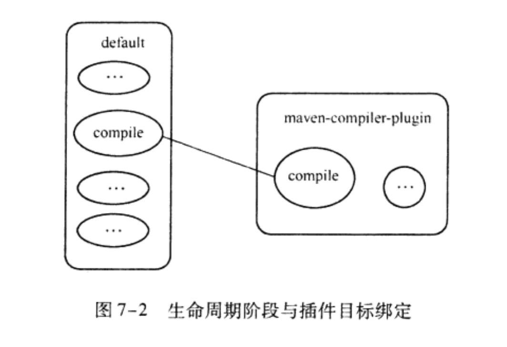

## 设置 MAVEN_OPTS 环境变量

例如设置为 -Xms128m -Xmx512m，就是为 maven 进程设置 JVM 参数


## 配置仓库镜像

```xml
<settings>
    <mirrors>
        <mirror>
            <id>aliyun</id>
            <name>aliyun</name>
            <mirrorOf>central</mirrorOf>
            <!-- 国内推荐阿里云的Maven镜像 -->
            <url>http://maven.aliyun.com/nexus/content/groups/public/</url>
        </mirror>
    </mirrors>
</settings>
```


## 搜索第三方组件

[https://search.maven.org/](https://search.maven.org/)


## 生命周期

maven 有 3 套**独立的**生命周期，他们分别是 clean、default、site。

site 主要是发布项目站点，用的不多，就不讲了

主要说下 clean 和 default

### clean

clean 生命周期的目的是清理项目，它包括 3 个**阶段**

- pre-clean：执行 clean 之前需要完成的工作
- clean：执行 clean 阶段
- post-clean：执行 clean 之后需要完成的工作

### default

default 生命周期定义了构建项目时所需要的执行步骤，它是生命周期中最核心的部分，包含的阶段如下

- validate：验证项目结构是否正常，必要的配置文件是否存在
- initialize：做构建前的初始化操作，比如初始化参数、创建必要的目录等
- generate-sources：产生在编译过程中需要的源代码
- process-sources：处理源代码，一般来说是对 src/main/resources 目录的内容进行变量替换等工作，复制输出到 classpath 目录里
- **generate-resources**：产生主代码中的资源在 classpath 里的包
- **process-resources**：将资源文件复制到 classpath 的对应包中
- **compile**：编译项目的主源码。一般是 src/main/java
- process-classes：产生编译过程中生成的文件
- generate-test-resources：产生编译过程中测试相关的代码
- process-test-resources：处理测试代码，一般来说是对 src/test/resources 目录的内容进行变量替换等工作，复制输出到 classpath 目录里
- **generate-test-resources**：产生测试资源在 classpath 里的包
- **process-test-resources**：将测试资源复制到 classpath 
- **test-compile**：编译测试代码
- process-test-compile：产生编译测试代码过程中的文件
- **test**：运行测试用例
- prepare-package：打包之前需要做的工作
- package：打包
- pre-integration-test：集成测试之前的工作
- integration-test：集成测试
- post-integration-test：集成测试之后的工作
- verify：检测测试后的包是否完好
- **install**：将打包的组件以构件的形式，安装到本地依赖库中
- **deploy**：将最终的包以构件的形式发布到远程仓库

### 生命周期与阶段

一共有 3 套生命周期，每个生命周期包含多个阶段，生命周期之间是独立的，可以自主的决定他们的顺序。但是一个生命周期的阶段之间是有依赖的，顺序是固定的

例如

```
mvn clean package
```

这个命令就执行了两个生命周期，先执行 clean 生命周期，再执行 default 生命周期，如果我们使用

```
mvn package clean
```

那么这个命令也执行两个生命周期，但是先执行 default 生命周期，再执行 clean 生命周期（当然一般不会这么写）

以上体现了生命周期的独立性，我们可以随意安排顺序（当然一般还是 clean default 的顺序）

而阶段的依赖性是指：阶段的顺序是固定的，例如

```
mvn clean package
```

第一个 clean 表示我们执行 clean 的生命周期，并且执行到了 clean 阶段，因此 pre-clean 阶段也已经执行了

第二个 package 表示执行 default 生命周期，并且执行到了 package 阶段，因此从 validate、initialize... 一直到

prepare-package 都已经执行过了


## 插件和目标

maven 只是定义了一套生命周期和阶段，但是自身其实是不做什么事情的，真正在这些生命周期和阶段中做事都是由插件来完成的。插件以独立的构建的形式存在，所以 maven 本身是很小的。

一个插件可能有很多个功能，比如 maven-dependency-plugin 它可以分析目标（analyze），它也可以列出依赖的目标（tree），这些一个一个的功能我们称作为目标（goal）。

现在 maven 已经定义了一套生命周期（default 生命周期）了，有20多个阶段，那么要将插件的功能集成到 maven 里，其实要做的也就是 goal 和 phase（阶段）的绑定了。

最终的效果就是：一个阶段可以绑定 A 插件的 a 目标，也可以继续绑定 B 插件的 b 目标，也就是说：

**一个阶段可以绑定多个目标（goal）**



如图，compile 阶段绑定了 maven-compiler-plugin 插件的 compile 目标

### 如何执行目标

使用 `mvn 插件前缀:目标名` 来执行目标，例如

```
mvn dependency:analyze
```

就执行了 maven-dependency-plugin 的 analyze 目标

### 内置绑定

显然如果所有的都要自己配的话，那 maven 就没什么卵用了，还不如用 gradle，因此 maven 提供了很多的内置阶段与插件目标的绑定，当我们在命令行里执行某个阶段的时候，就会自动执行这个阶段所绑定的插件的目标。

例如当我们执行 `mvn clean` 时，实际上内置绑定的是 maven-clean-plugin 的 clean 目标，相当于执行了 `mvn clean:clean`

内置的绑定有

|      生命周期阶段      |               插件目标               |           执行任务           |
| :--------------------: | :----------------------------------: | :--------------------------: |
|   process-resources    |   maven-resources-plugin:resources   |  复制主资源文件到主输出目录  |
|        compile         |    maven-compiler-plugin:compile     |    编译主代码到主输出目录    |
| process-test-resources | maven-resources-plugin:testResources |  复制测试资源到测试输出目录  |
|      test-compile      |  maven-compiler-plugin:testCompile   |  编译测试代码到测试输出目录  |
|          test          |      maven-surefile-plugin:test      |         执行测试用例         |
|        package         |         maven-jar-plugin:jar         |       创建项目 jar 包        |
|        install         |     maven-instsll-plugin:install     | 将项目输出构建安装到本地仓库 |
|         deploy         |      maven-deploy-plugin:deploy      | 将项目输出构建部署到远程仓库 |

> 其它阶段并没有绑定 goal 因此什么都不做

### 自定义绑定

例如这么个需求：把源代码也打包成一个 jar 包。默认的打包里，虽然是达成了 jar 包，但是里面都是编译后的 class 文件，并不包含源代码（java 文件），我们只能反编译去看源码。利用 maven-source-plugin 则可以将源代码单独打一个 jar 包

```xml
<build>
    <plugins>
        <plugin>
            <groupId>org.apache.maven.plugins</groupId>
            <artifactId>maven-source-plugin</artifactId>
            <version>3.2.1</version>
            <executions>
                <execution>
                    <id>attach-resources</id>
                    <phase>verify</phase>
                    <goals>
                        <goal>jar-no-fork</goal>
                    </goals>
                </execution>
            </executions>
        </plugin>
    </plugins>
</build>
```

- 定义一个插件，这里使用的是 maven-source-plugin
- 定义 executions
- executions 包含多个 execution
  - 每个 execution 绑定到某一个阶段 phase
  - 每个阶段可以绑定多个 goal

因此，我们执行 `mvn verify` 就约等于执行了 `mvn source:jar-no-fork`

> 实际上 `mvn verify` 还会执行前面的阶段，而 `mvn source:jar-no-fork` 仅仅执行这一个目标

**如果我们不定义 goal 与 phase 的绑定，也是可以直接单独执行插件的 goal 的**

> 我们不写 goal 与 phase 的绑定，运行 mvn verify 发现效果也是一样的，这是因为有的插件将编写时都绑定了默认的阶段，所以我们主要还是要熟悉插件。
>
> 例如 springboot 的打包插件，我们就不需要定义 goal，goal 默认就与 phase 绑定了。我们可以直接执行 mvn clean package

### 了解插件使用详情

如果我们想要知道插件的信息可以使用如下命令

```
mvn help:describe -Dplugin=org.apache.maven.plugins:maven-source-plugin:3.2.1 -Ddetail
```

截取一段输出

```bash
Name: Apache Maven Source Plugin
Description: The Maven Source Plugin creates a JAR archive of the source
  files of the current project.
Group Id: org.apache.maven.plugins
Artifact Id: maven-source-plugin
Version: 3.2.1
Goal Prefix: source

This plugin has 7 goals:

source:aggregate
  Description: Aggregate sources for all modules in an aggregator project.
  Implementation: org.apache.maven.plugins.source.AggregatorSourceJarMojo
  Language: java
  Bound to phase: package
  Before this goal executes, it will call:
    Phase: 'generate-sources'

  Available parameters:

    archive
      The archive configuration to use. See Maven Archiver Reference.
      Note: Since 3.0.0 the resulting archives contain a maven descriptor. If
      you need to suppress the generation of the maven descriptor you can
      simply achieve this by using the archiver configuration..

    attach (Default: true)
      User property: maven.source.attach
      Specifies whether or not to attach the artifact to the project

```

可以看到，这些信息说：

- 这个插件有 7 个 goal
- source:aggregate 是其中的一个 goal
  - 它有一些可选的参数，有的是默认的，我们可以通过传入 java系统属性来改变参数值
  - 例如 attach 参数，默认是 true，我们通过 `-Dmaven.source.attach=false` 可以将其设置为 false
  - 有的参数例如 archive，它没有表达式形式，只能在 pom 文件里配置（参考下面内容）

### 在 pom 中配置插件的参数

有很多插件的参数我们可能只需要配置一次，之后就几乎不会再修改了，这类参数其实不适合放在命令行里，更适合放在 pom 文件里定义。我们可以这样来定义插件的参数

```xml
<build>
    <plugins>
        <plugin>
            <groupId>org.apache.maven.plugins</groupId>
            <artifactId>maven-source-plugin</artifactId>
            <version>3.2.1</version>
            <configuration>
                <attach>false</attach>
            </configuration>
            <executions>
                <execution>
                    <id>attach-resources</id>
                    <phase>verify</phase>
                    <goals>
                        <goal>jar-no-fork</goal>
                    </goals>
                </execution>
            </executions>
        </plugin>
    </plugins>
</build>
```

只需要定义一个 configuration 即可，attach 元素即表示插件的 attach 参数，这样的配置效果等同于

`-Dmaven.source.attach=false`

并且 configuration 这里是作用于这个插件的，我们也可以将 configuration 配置在 execution 节点里面，这样就是作用于这个阶段的配置

### 插件仓库

有时候我们的插件不在中央仓库，可能需要单独配置插件仓库，使用

```xml
<pluginRepositories></pluginRepositories>
```

来配置

### 插件前缀

插件前缀也就是 help:describe 这种方式来调用插件的目标，实际上我们没有给出插件完整的 groupId 和 artifactId，但是 maven 还是解析到了相应的插件，这个功能就是插件前缀。

插件前缀是配置在maven元数据里的，所有如果我们自己的插件也想配置的话，需要修改maven元数据，反正暂时我没这个需求，就先不研究了


## 依赖管理

### scope 范围

| scope    | 说明                                          | 示例            |
| :------- | :-------------------------------------------- | :-------------- |
| compile  | 编译时需要用到该jar包（默认）                 | commons-logging |
| test     | 编译Test时需要用到该jar包                     | junit           |
| runtime  | 编译时不需要，但运行时需要用到                | mysql           |
| provided | 编译时需要用到，但运行时由JDK或某个服务器提供 | servlet-api     |

> 典型 test 就是 Junit，在编译 test 包的时候才需要，编译项目真正的代码时是不需要它的
>
> 典型 runtime 是 mysql 驱动，这种 spi 服务实际上编译时是没有被用到的，如果设置成 compile 类型的话，就不会被打进到 classpath 里，因此设置成 runtime，编译时虽然没用到，但是还是会被扔到 classpath 里
>
> 典型 provided 是 servlet API，编译的时候是需要的，但是运行的时候不需要，因为容器会提供

### 依赖传递

如果 A 对 B 是 compiled 的依赖，B 对 C 也是 compiled 依赖，那么 A 对 C 也是 compiled 依赖。也就是说依赖也是有传递性质的。下面表示依赖的传递范围，最左边的列表示 A 对 B 的依赖，最上面的行表示 B 对 C 的依赖，表中的值表示 A 对 C 的依赖。更多层级的依赖传递以此类推

|              | compile  | test | provided | runtime  |
| :----------: | :------: | :--: | :------: | :------: |
| **compile**  | compile  |  -   |    -     | runtime  |
|   **test**   |   test   |  -   |    -     |   test   |
| **provided** | provided |  -   | provided | provided |
| **runtime**  | runtime  |  -   |    -     | runtime  |

> - 当 B 对 C 的依赖是 complie 的时候，那么 A 对 B 的依赖是什么样的，A 就对 C 的依赖也是什么样的
> - 当 B 对 C 的依赖是 test 的时候，依赖不传递
> - 当 B 对 C 的依赖是 provided 的时候，A 对 B 也是 provided 依赖的时候才传递对 C 的 provided 依赖
> - 当 B 对 C 的依赖是 complie 的时候，那么 A 对 B 的依赖是什么样的，A 就对 C 的依赖也是什么样的（compile 除外）

### 依赖优先级

依赖的优先级分两种情况：

- 路径短的优先：A->B->C->X(2.0) 和 A->D->X(1.0) 这两种情况下，第一种的路径长度是 3，第二种的路径长度是 2，因此最终 X 的版本是 1.0，选择了路径长度最短的那个
- 先声明的优先：A->E->X(2.0) 和 A->D->X(1.0) 这两种情况下，两个路径长度都是 2，此时只靠第一条规则是无法确定谁优先的，因此引入了另一条规则，也就是先声明的优先。A 对 E 和 A 对 D 的依赖，谁在 pom 文件里声明在前面谁就优先采用

### 排除依赖

```xml
<dependency>
    <groupId></groupId>
    <artifactId></artifactId>
    <execlusions>
        <exclusion>
            <groupId></groupId>
            <artifactId></artifactId>
        </exclusion>
    </execlusions>
</dependency>
```

> 对某个想要排除的子依赖，添加 execlusions 节点

### 查看依赖

```
mvn dependency:tree
```

### 分析依赖

```
mvn dependency:analyze
```

输出

```
[WARNING] Used undeclared dependencies found:
[WARNING]    org.springframework:spring-webmvc:jar:5.2.4.RELEASE:compile
[WARNING]    org.aspectj:aspectjweaver:jar:1.9.5:compile
[WARNING]    org.springframework:spring-web:jar:5.2.4.RELEASE:compile
[WARNING]    org.springframework:spring-context:jar:5.2.4.RELEASE:compile
[WARNING]    org.springframework:spring-core:jar:5.2.4.RELEASE:compile
[WARNING]    org.junit.jupiter:junit-jupiter-api:jar:5.5.2:test
[WARNING]    com.google.zxing:core:jar:3.4.0:compile
[WARNING]    org.assertj:assertj-core:jar:3.13.2:test
[WARNING]    com.fasterxml.jackson.core:jackson-databind:jar:2.10.2:compile
[WARNING]    jakarta.validation:jakarta.validation-api:jar:2.0.2:compile
[WARNING]    org.apache.tomcat.embed:tomcat-embed-core:jar:9.0.31:compile
[WARNING]    org.springframework:spring-tx:jar:5.2.4.RELEASE:compile
[WARNING]    org.slf4j:slf4j-api:jar:1.7.30:compile
[WARNING]    org.mybatis:mybatis:jar:3.5.3:compile
[WARNING]    com.fasterxml.jackson.core:jackson-annotations:jar:2.10.2:compile
[WARNING] Unused declared dependencies found:
[WARNING]    org.springframework.boot:spring-boot-starter-web:jar:2.2.5.RELEASE:compile
[WARNING]    mysql:mysql-connector-java:jar:8.0.19:runtime
[WARNING]    org.springframework.boot:spring-boot-starter-jdbc:jar:2.2.5.RELEASE:compile
[WARNING]    org.springframework.boot:spring-boot-configuration-processor:jar:2.2.5.RELEASE:compile
[WARNING]    org.springframework.boot:spring-boot-starter-aop:jar:2.2.5.RELEASE:compile
[WARNING]    org.springframework.boot:spring-boot-starter-test:jar:2.2.5.RELEASE:test
[WARNING]    net.coobird:thumbnailator:jar:0.4.10:compile
[WARNING]    org.mybatis.spring.boot:mybatis-spring-boot-starter:jar:2.1.1:compile
```

主要是两个

- 一个是 Used undeclared dependencies found，表示没有声明但是使用了的依赖，这是传递性依赖带来的
- 一个是 Unused declared dependencies found，表示声明了但是没有使用。但是实际上这些很多都使用了，springboot 的 starter 包都是我们需要用到的，所以这些依赖分析看看就好。具体是否真的没使用到需要自己进行仔细的分析

### 管理依赖版本

```xml
<dependencyManagement>
    <dependencies>
        <dependency>
            <groupId>org.springframework.boot</groupId>
            <artifactId>spring-boot</artifactId>
            <version>2.2.0.RELEASE</version>
        </dependency>
        <dependency>
            <groupId>org.springframework.boot</groupId>
            <artifactId>spring-boot-test</artifactId>
            <version>2.2.0.RELEASE</version>
        </dependency>
    </dependencies>
</dependencyManagement>
```

- 使用 `<dependencyManagement>` 可以管理依赖版本
- 里面定义的依赖表示依赖的版本信息，并不会真的引入这些依赖
- 当我们使用普通的 `<dependency>` 引入依赖的时候，如果这些依赖在 `<dependencyManagement>` 里定义了，就不需要在写依赖的版本，版本默认使用 `<dependencyManagement>` 定义的版本
- 一般用在父 pom  中


## 聚合和继承

### 聚合

```xml
<project xmlns="http://maven.apache.org/POM/4.0.0" xmlns:xsi="http://www.w3.org/2001/XMLSchema-instance"
    xsi:schemaLocation="http://maven.apache.org/POM/4.0.0 https://maven.apache.org/xsd/maven-4.0.0.xsd">
    <modelVersion>4.0.0</modelVersion>

    <groupId>org.springframework</groupId>
    <artifactId>gs-multi-module</artifactId>
    <version>0.1.0</version>
    <packaging>pom</packaging>

    <modules>
        <module>library</module>
        <module>application</module>
    </modules>

</project>
```

- packaging 打包方式为 pom
- modules 中每个 module 都是一个相对路径（不一定代表模块自身 pom 中定义的名字）
- 这里 library 和 application 目录下其实都是一个完整的 springboot 应用

当我们执行 `mvn clean install` 的时候，实际上对所有包含的模块都执行了这两个生命周期，但是执行的顺序也是有规则的

```
[INFO] Reactor Build Order:
[INFO]
[INFO] multi-module-library                                               [jar]
[INFO] multi-module-application                                           [jar]
[INFO] gs-multi-module                                                    [pom]
```

这个顺序叫做反应堆构建顺序，后面再进行说明

### 继承

#### 创建 maven 项目

在顶层聚合模块下执行

```
mvn archetype:generate
```

随后根据提示选择骨架插件

```
7: internal -> org.apache.maven.archetypes:maven-archetype-quickstart (An archetype which contains a sample Maven project.)
```

然后根据提示输入 

- groupId：com.example
- artifactId：child
- version：0.0.1-SNAPSHOT
- package：com.example.child

```xml
<build>
    <pluginManagement>
        <plugins>
            <plugin>
                <groupId>org.apache.johnzon</groupId>
                <artifactId>johnzon-maven-plugin</artifactId>
                <version>${johnzon.version}</version>
            </plugin>
        </plugins>
    </pluginManagement>
</build>
```

- 这里定义插件的版本
- 这里也可以定义好插件的 goal 和 phase 的绑定

### 聚合和继承模块的关系

两者不是一个模块，但是也可以写在一个模块里，因此多半还是当做一个模块来写，父模块既是聚合又是被子模块继承的模块


## 测试

maven 的测试阶段是 maven-surefire-plugin 提供的功能

默认情况下它会执行测试路径下（src/test/java/）的测试类，测试类的命名符合以下规则：

- Test*.java
- *Test.java
- *TestCase.java

### 跳过测试

`mvn clean package -DskipTests`  或者 `mvn clean package -Dmaven.test.skip=true`

后者不仅跳过测试，测试代码的编译都直接跳过了

一般仅仅临时性的跳过，长期跳过测试是非常不推荐的

### 动态指定测试用例

有的时候我们专门针对某个测试用例，想要测试它是否通过（比如专门修一个bug），这个时候傻傻的执行全部的测试用例肯定是很浪费时间的，因此需要单独指定测试用例，可以使用

`mvn test -Dtest=SomeTest,AnotherTest`

这个时候就只执行这两个测试类里面的用例，高级点的还可以支持通配符

 `mvn test -Dtest=Some*Test`

### 包含和排除测试用例

```xml
<plugin>
    <groupId>org.apache.maven.plugins</groupId>
    <artifactId>maven-surefire-plugin</artifactId>
    <version>2.22.2</version>
    <configuration>
        <includes>
            <include>**/*Tests.java</include>
        </includes>
        <excludes>
            <exclude>**/SomeTest.java</exclude>
        </excludes>
    </configuration>
</plugin>
```

- 所有 Tests 也包含进来当做测试用例
- SomeTest 不要当做测试用例，进行排除

> 这种方式主要是为了兼容老系统

### 测试报告

默认情况下，maven-surefire-plugin 会在 target/surefire-reports 目录下生成两种风格的测试报告

- 简单文本
- 与 Junit 兼容的 XML

### 测试覆盖率报告

使用 jacoco

```xml
<plugin>
    <groupId>org.jacoco</groupId>
    <artifactId>jacoco-maven-plugin</artifactId>
    <version>0.8.5</version>
    <executions>
        <execution>
            <id>default-prepare-agent</id>
            <goals>
                <goal>prepare-agent</goal>
            </goals>
        </execution>
        <execution>
            <id>default-report</id>
            <phase>test</phase>
            <goals>
                <goal>report</goal>
            </goals>
        </execution>
    </executions>
</plugin>
```

- 最终报告在 target/site/jacoco/index.html 是总的报告


## 构建

### 内置属性

- ${basedir}：表示包含这个 pom 文件的目录，也就是项目根目录
- ${version}：表示项目版本

### pom 内置属性

- ${project.build.sourceDirectory}：项目的主源码目录，默认是 src/main/java
- ${project.build.testSourceDirectory}：项目的测试源码目录，默认是 src/test/java
- ${project.build.directory}：项目构建输出目录，默认是 target/
- ${project.outputDirectory}：项目的主代码编译输出目录，默认是 target/classes/
- ${project.testOutputDirectory}：项目的测试代码编译输出目录，默认是 target/test-classes/
- ${project.groupId}：项目的 groupId
- ${project.artifactId}：项目的 artifactId
- ${project.version}：项目的 version 与 ${version} 等价
- ${project.build.finalName}：项目打包输出文件的名称，默认是 `${project.artifactId}-${project.version}`，例如 myProject-0.0.1.jar，最后的后缀名取决于打包方式

### 自定义属性

在 `<properties>` 标签下面随意定义属性

### java 系统属性

所有的 java 系统属性都可以被 maven 访问，例如 ${user.home} 指向了用户目录

### 环境变量属性

所有环境变量都可以使用以 `env.` 开头的 maven 属性引用，例如 ${env.JAVA_HOME} 就表示引用了 $JAVA_HOME

### 配置属性替换

资源文件

```properties
aaa=${basedir}
```

pom 配置 resources 替换

```xml
<build>
    <resources>
        <resource>
            <directory>${basedir}/src/main/resources</directory>
            <filtering>true</filtering>
        </resource>
    </resources>
    <testResources>
        <testResource>
            <directory>${basedir}/src/test/resources</directory>
            <filtering>true</filtering>
        </testResource>
    </testResources>
</build>
```

### springboot 配置属性替换

在 springboot 中，我们都继承了 springboot 的 pom，它将属性的占位符替换了 `@`，具体的配置是

`<resource.delimiter>@</resource.delimiter>`

因此我们在 springboot 中，资源文件应该是：

```properties
aaa=@basedir@
```

这样才能进行配置属性的替换

### profile 配置

```xml
<profiles>
    <profile>
        <id>dev</id>
        <properties>
            <myProper>aaa</myProper>
        </properties>
    </profile>
    <profile>
        <id>test</id>
        <properties>
            <myProper>bbb</myProper>
        </properties>
    </profile>
</profiles>
```

### 激活 profile

#### 命令行激活

`mvn clean install -Pdev,test`

使用 -P 参数激活 profile，profile 可以激活多个，不局限于一定只能激活一个

#### 系统属性激活

我们可以配置当某个 java 系统属性存在时（-D 参数配置），自动激活 profile

```xml
<profiles>
    <profile>
        <id>dev</id>
        <properties>
            <myProper>aaa</myProper>
        </properties>
        <activation>
            <property>
                <name>dev</name>
            </property>
        </activation>
    </profile>
    <profile>
        <id>test</id>
        <properties>
            <myProper>bbb</myProper>
        </properties>
    </profile>
</profiles>
```

这里表示当存在 -Ddev 时，就激活 dev 这个 profile

可以进一步配置属性值时才激活，例如

```xml
<profiles>
    <profile>
        <id>dev</id>
        <properties>
            <myProper>aaa</myProper>
        </properties>
        <activation>
            <property>
                <name>dev</name>
                <value>x</value>
            </property>
        </activation>
    </profile>
    <profile>
        <id>test</id>
        <properties>
            <myProper>bbb</myProper>
        </properties>
    </profile>
</profiles>
```

这里表示当存在 -Ddev=x 时，就激活 dev 这个 profile，也就是既要存在 dev 系统属性，也要值等于 x

#### 操作系统环境激活

profile 还可以根据系统环境来激活，根据不同的操作系统激活不同的配置

```xml
<profiles>
    <profile>
        <id>dev</id>
        <properties>
            <myProper>aaa</myProper>
        </properties>
        <activation>
            <os>
                <name>Win10</name>
                <family>Windows</family>
                <arch>x86</arch>
                <!-- <version></version>-->
            </os>
        </activation>
    </profile>
    <profile>
        <id>test</id>
        <properties>
            <myProper>bbb</myProper>
        </properties>
    </profile>
</profiles>
```

- 这里 family 的值包括 Windows、UNIX、Mac 等
- 其它几项 name、arch、version 可以通过查看环境中的系统属性 os.name、os.arch、os.version 获得

#### 文件存在与否激活

还可以根据某个文件是否存在来决定激活的 profile

```xml
<profiles>
    <profile>
        <id>dev</id>
        <properties>
            <myProper>aaa</myProper>
        </properties>
        <activation>
            <file>
                <missing>x.properties</missing>
                <exists>y.properties</exists>
            </file>
        </activation>
    </profile>
    <profile>
        <id>test</id>
        <properties>
            <myProper>bbb</myProper>
        </properties>
    </profile>
</profiles>
```

#### 默认激活

我们可以定义某个 profile 在不做选择的时候默认激活

```xml
<profiles>
    <profile>
        <id>dev</id>
        <properties>
            <myProper>aaa</myProper>
        </properties>
        <activation>
            <activeByDefault>true</activeByDefault>
        </activation>
    </profile>
    <profile>
        <id>test</id>
        <properties>
            <myProper>bbb</myProper>
        </properties>
    </profile>
</profiles>
```

如果我们以上其它任何一种方式激活了某个 profile，那么我们默认激活的 profile 就会失效

### 查看 profile

- `mvn help:active-profiles` 列出激活的 profile
- `mvn help:all-profiles` 列出所有 profile

