## 基本概念

### 文件的三种状态

Git 有三种状态，你的文件可能处于其中之一：已提交(committed)、已修改(modified)和已暂存(staged)。

- 已提交表示数据已经安全的保存在本地数据库中
- 已修改表示修改了文件，但还没保存到数据库中（做了修改但是没有提交暂存区）
- 已暂存表示对一个已修改文件的当前版本做了标记，使之包含在下次提交的快照中

### 工作目录、暂存区域以及 Git 仓库

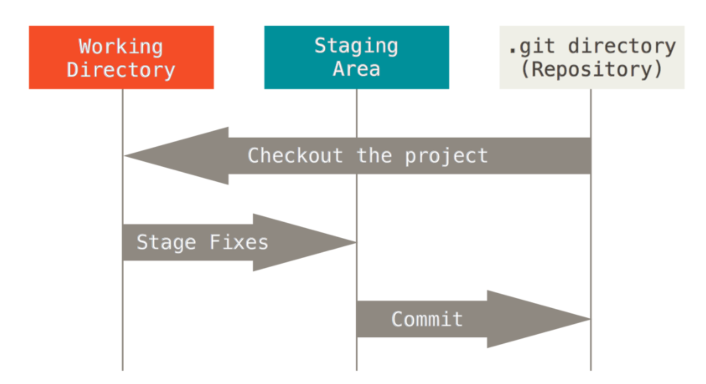

- Git 仓库目录是 Git 用来保存项目的元数据和对象数据库的地方。这是 Git 中最重要的部分，从其它计算机克隆仓库时，拷贝的就是这里的数据。
- 工作目录是对项目的某个版本独立提取出来的内容。这些从 Git 仓库的压缩数据库中提取出来的文件，放在磁盘上供你使用或修改。
- 暂存区域是一个文件，保存了下次将提交的文件列表信息，一般在 Git 仓库目录中。有时候也被称作 `索引`，不过一般说法还是叫暂存区域。

### 基本的工作流程

- 在工作目录中修改文件
- 暂存文件，将文件的快照放入暂存区域
- 提交更新，找到暂存区域的文件，将快照永久性存储到 Git 仓库目录

> 我的理解：
>
> - 版本库包含了所有的信息，包括当前版本
> - 暂存区就是当前版本的一个快照（初始状态等于当前版本）
> - 我们的工作就是在工作目录修改文件，然后 add 到暂存区
> - add 暂存区后，暂存区的状态马上就进行修改
> - 暂存区 commit 到版本库则是：将暂存区自己的快照添加到版本库的下一个版本
> - 也就是说，暂存区的初始状态都等于版本库的当前版本，版本库的下一个版本就是暂存区提交时的状态

## 配置

```bash
git config --global user.name "cenzhipeng"
git config --global user.email "cen-zhipeng@qq.com"
```

> 使用 git 之前必须配置好自己的信息，这个信息并不代表是真实的，但是一般也没人用这个搞事情

### 配置层级

- `/etc/gitconfig` 文件：包含系统上每一个用户及他们仓库的通用配置。 如果使用带有 --system 选项的 git config 时，它会从此文件读写配置变量
- `~/.gitconfig` 或 `~/.config/git/config` 文件：只针对当前用户， 可以传递 --global 选项让 Git 读写此文件
- 当前使用仓库的 Git 目录中的 config 文件，也就是 `.git/config`：针对该仓库

> 每一个级别覆盖上一个级别的配置，所以 `.git/config` 的优先级是最高的

### 文本编辑器

`git config --global core.editor vim`

当 Git 需要你输入信息时会调用它，如果未配置，Git 会使用操作系统默认的文本编辑器，通常是 Vim。

可以调用 vscode 之类的，但是要关闭自动保存，否则一打开就自动保存了，命令行就相当于得到了一个空的输入。

### 列出当前配置

`git config --list`

你可能会看到重复的变量名，因为 Git 会从不同的文件中读取同一个配置，这种情况下，Git 会使用它找到的每一个变量的最后一个配置。

### 获取帮助

`git help config`

> 使用 `git help subcommand` 获取帮助或者 `git subcommand --help`


## Git 基础

### 获取 git 仓库

#### 在现有目录中初始化仓库

```bash
$ git init
```

> 在这个时候，我们仅仅是做了一个初始化的操作，你的项目里的文件还没有被跟踪

如果你是在一个已经存在文件的文件夹（而不是空文件夹）中初始化 Git 仓库来进行版本控制的话，你应该开始 跟踪这些文件并提交。你可通过 git add 命令来实现对指定文件的跟踪，然后执行 git commit 提交

```bash
$ git add *.c
$ git add LICENSE
$ git commit -m 'initial project version'
```

#### 克隆现有的仓库

```bash
$ git clone https://github.com/libgit2/libgit2 mylibgit
```

> 这将会使用 mylibgit 作为仓库名字，不添加这个值的话，就使用默认的 libgit2 作为仓库名字

### 记录更新到仓库

#### git 文件的生命周期

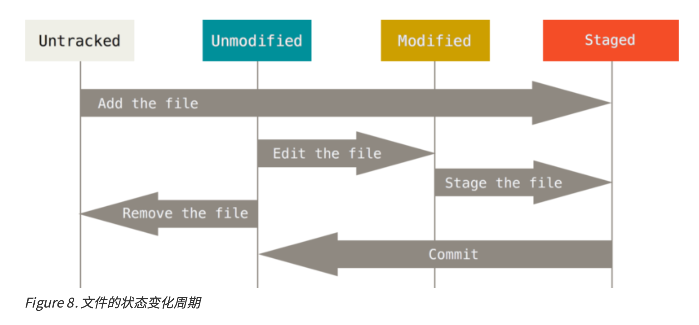

#### 检查当前文件状态

```bash
$ git status
On branch master
nothing to commit, working directory clean
```

#### 跟踪新文件

使用命令 git add 开始跟踪一个文件。所以，要跟踪 README 文件，运行

```bash
czp@:~/workspace/projects/git_demo$ echo 'My Project' > README
czp@:~/workspace/projects/git_demo$ git add README
czp@:~/workspace/projects/git_demo$ git status
On branch master

No commits yet

Changes to be committed:
  (use "git rm --cached <file>..." to unstage)
	new file:   README

```

可以看到，README 已被添加到暂存区被跟踪

> git add 命令使用文件或目录的路径作为参数，如果参数是目录的路径，该命令将递归地跟踪该目录下的所有文件。
>
> git add 是将运行这个命令时的文件状态提交到了暂存区，如果我们没有提交这个暂存，然后直接再次修改这个被 add 了的文件，那么修改的部分不会被包含在暂存区，这个文件在 git add 时的部分在暂存区，在 git add 之后的部分不在暂存区。
>
> 所以，运行了git add之后又作了修订的文件，需要重新运行git add把最新版本重新暂存起来

#### 查看简略的状态

```bash
$ git status -s 
 M README
MM Rakefile
A lib/git.rb
M lib/simplegit.rb
?? LICENSE.txt
```

> 使用 git status -s 查看简略的状态输出

- `??` 表示新添加的未跟踪文件
- `A` 表示新添加到暂存区中的文件
- `M` 表示修改过的文件，出现在右边的 M 表示该文件被修改了但是还没放入暂存区（第二行 ` M README` M前面有个空格），出现在靠左边的 M 表示该文件被修改了并放入了暂存区。
  - README 文件在工作区被修改了但是还没有将修改后的文件放入暂存区
  - lib/simplegit.rb 文件被修改了并将修改后的文件放入了暂存区
- `MM` 表示上面两种 M 状态的集合，也就是被修改后提交到了暂存区，然后又被修改了没有提交暂存区
  - Rakefile 在工作区被修改并提交到暂存区后又在工作区中被修改了，所以在暂存区和工作区都有该文件被修改了的记录

#### 忽略文件

有的文件不想纳入 git 管理（比如一些ide配置啥的、构建生成的文件之类的），可以创建一个名为 .gitignore 的文件，列出要忽略的文件模式

```
$ cat .gitignore 
*.[oa]
*~
```

- 第一行告诉 Git 忽略所有以 .o 或 .a 结尾的文件。一般这类对象文件和存档文件都是编译过程中出现的
- 第二行 告诉 Git 忽略所有以波浪符(~)结尾的文件，许多文本编辑软件(比如 Emacs)都用这样的文件名保存副本


文件 .gitignore 的格式规范如下:

- 所有空行或者以 # 开头的行都会被 Git 忽略。
- 可以使用标准的 glob 模式匹配。
- 匹配模式可以以(/)开头防止递归。
- 匹配模式可以以(/)结尾指定目录。
- 要忽略指定模式以外的文件或目录，可以在模式前加上惊叹号(!)取反。

> 所谓的 glob 模式是指 shell 所使用的简化了的正则表达式。
>
> - 星号 `*` 匹配零个或多个任意字符
> - `[abc]` 匹配任何一个列在方括号中的字符(这个例子要么匹配一个 a，要么匹配一个 b，要么匹配一个 c)
> - 问号 `?` 只匹配一个任意字符
> - 如果在方括号中使用短划线分隔两个字符，表示所有在这两个字符范围内的都可以匹配(比如 `[0-9]` 表示匹配所有 0 到 9 的数字)
> - 使用两个星号 `*` 表示匹配任意中间目录，比如 `a/**/z` 可以匹配 `a/z`, `a/b/z` 或 `a/b/c/z` 等
>
> 参考 [https://github.com/github/gitignore](https://github.com/github/gitignore)

#### 查看已暂存和未暂存的修改

想知道具体修改了什么地方，可以用 git diff 命令。

> 此命令比较的是**工作目录中当前文件和暂存区域**快照之间的差异，也就是修改之后还没有暂存起来的变化内容

使用 `git diff --staged` 查看的是：暂存区与上次提交之间的差别

> `git diff --staged` 和 `git diff --cached` 是完全一样的

> git diff 的输出解读 [https://blog.csdn.net/weixin_37909391/article/details/84641899](https://blog.csdn.net/weixin_37909391/article/details/84641899)

#### 跳过使用暂存区域

`git commit -a -m 'added new benchmarks'`

> git commit -a 将所有已经跟踪过的文件都添加到暂存区然后提交，就不用单独再执行 `git add .` 了

#### 移除文件

- 用 `git rm` 来删除文件，同时还会将这个删除操作记录下来
- 用 `rm` 来删除文件，仅仅是删除了物理文件，没有将其从 git 的记录中剔除
- 直观的来讲，`git rm` 删除过的文件，执行 `git commit -m "abc"` 提交时，
  会自动将删除该文件的操作提交上去
- 而对于用 `rm` 命令直接删除的文件，执行 `git commit -m "abc"` 提交时，
  则不会将删除该文件的操作提交上去
- 即使你已经通过 `rm` 将某个文件删除掉了，也可以再通过 `git rm` 命令重新将该文件从 git 的记录中删除掉，
  这样的话，在执行 `git commit -m "abc"` 以后，也能将这个删除操作提交上去
- 如果之前不小心用 `rm` 命令删除了一大批文件，此时用 `git rm` 逐个地再删除一次就显得相当蛋疼了。所幸还有更方便的处理方案，用如下的方式做提交就没有问题了： `git commit -am "abc"`

> 现在使用 rm 删除之后，再 git add 也可以了，就像是做了普通的修改一样


另外一种情况是，我们想把文件从 Git 仓库中删除(亦即从暂存区域移除)，但仍然希望保留在当前工作目录 中。换句话说，你想让文件保留在磁盘，但是并不想让 Git 继续跟踪。为达到这一目的，使用 --cached 选项

```bash
$ git rm --cached README
```

> 从暂存区删除了，不再追踪这些文件，但是在磁盘上还是有这些文件的

```bash
$ git rm log/\*.log
```

> 注意到星号 * 之前的反斜杠 \，因为 Git 有它自己的文件模式扩展匹配方式，所以我们不用 shell 来帮忙展开。 此命令删除 log/ 目录下扩展名为 .log 的所有文件

```bash
$ git rm \*~
```

> 该命令为删除以 ~ 结尾的所有文件。

### 查看提交历史

在提交了若干更新，又或者克隆了某个项目之后，你也许想回顾下提交历史.完成这个任务最简单而又有效的工具是 git log 命令。接下来的例子会用专门用于演示的 simplegit 项目，运行下面的命令获取该项目源代码

`git clone https://github.com/schacon/simplegit-progit`

然后在此项目中运行 git log，应该会看到下面的输出

```bash
czp@:~/workspace/projects/simplegit-progit$ git log
commit ca82a6dff817ec66f44342007202690a93763949 (HEAD -> master, origin/master, origin/HEAD)
Author: Scott Chacon <schacon@gmail.com>
Date:   Mon Mar 17 21:52:11 2008 -0700

    changed the verison number

commit 085bb3bcb608e1e8451d4b2432f8ecbe6306e7e7
Author: Scott Chacon <schacon@gmail.com>
Date:   Sat Mar 15 16:40:33 2008 -0700

    removed unnecessary test code

commit a11bef06a3f659402fe7563abf99ad00de2209e6
Author: Scott Chacon <schacon@gmail.com>
Date:   Sat Mar 15 10:31:28 2008 -0700

    first commit
```

默认不用任何参数的话，git log会按提交时间列出所有的更新，最近的更新排在最上面。正如你所看到的， 这个命令会列出每个提交的 SHA-1 校验和、作者的名字和电子邮件地址、提交时间以及提交说明

git log有许多选项可以帮助你搜寻你所要找的提交，接下来我们介绍些最常用的：

- `-p`，用来显示每次提交的内容差异
- `-2`，仅显示最近两次提交
- `--stat`，查看每次提交的简略的统计信息。`--stat` 选项在每次提交的下面列出所有被修改过的文件、有多少文件被修改了以及被修改过的文件的哪些行被移除或是添加了。在每次提交的最后还有一个总结。

#### 提交的父提交

每个提交都指向它的前一个提交，因此最终能找到一个共同的祖先（就像是分叉的区块链都从同一个链起始一样）

### 撤消操作

#### 修改上次的提交

有时候我们提交完了才发现漏掉了几个文件没有添加，或者提交信息写错了。此时，可以运行带有 --amend 选项的提交命令尝试重新提交：

```bash
$ git commit --amend
```

修改上次提交的信息：`git commit --amend -m "updated message"`

修改上次的提交：

```bash
czp@:~/workspace/projects/simplegit-progit$ echo sss > ant.txt
czp@:~/workspace/projects/simplegit-progit$ git add ant.txt
czp@:~/workspace/projects/simplegit-progit$ git commit --amend -m 'updated'
```

> 相当于我们在上一次提交的基础之上，添加了一个新的文件，最终看到的只有本次的提交
>
> 可以使用 `git commit --amend --no-edit` 不修改本次提交的文件

#### 取消暂存的文件

例如，你已经修改了两个文件并且想要将它们作为两次独立的修改提交，但是却意外地输入了 git add *暂存了它们两个。如何只取消暂存两个中的一个呢？git status命令提示了你：

```bash
$ git add *
$ git status
On branch master
Changes to be committed:
(use "git reset HEAD <file>..." to unstage)
renamed: README.md -> README 
modified: CONTRIBUTING.md
```

提示我们使用 `git reset HEAD <file>...` 来取消暂存，所以我们执行暂存 CONTRIBUTING.md 文件：

`git reset HEAD CONTRIBUTING.md`

#### 撤消对文件的修改

如果你并不想保留对 CONTRIBUTING.md 文件的修改怎么办？

`git checkout -- [file]`  例如 `git checkout -- CONTRIBUTING.md`

> 它从暂存区里把当前版本的该文件拷出来覆盖了这个文件，所以你做的修改就全都没有了
>
> 执行这个命令之前请想清楚你是不是真的全都不要你的修改了

也就是说：如果一个文件 A 经过了我们的修改变成 A1，然后我们将其 git add 到了暂存区，接着修改成了 A2，如果想将其还原，应该这么操作：

- 如果想还原成 A1，那么就执行： `git checkout -- A`
  - 因为此时暂存区的内容是 A1，所以直接拷出了 A1
- 如果想还原成 A，那么就执行：`git reset HEAD A; git checkout -- A`
  - 也就是，先把暂存区还原到 A
  - 再从暂存区拷出 A 去还原工作目录的 A2

### 远程仓库的使用

#### 查看远程仓库

如果想查看你已经配置的远程仓库服务器，可以运行 `git remote` 命令。它会列出你指定的每一个远程服务器的简写。如果你已经克隆了自己的仓库，那么至少应该能看到 origin - 这是 Git 给你克隆的仓库服务器的默认名字

```bash
czp@:~/workspace/projects$ git clone https://github.com/schacon/ticgit
Cloning into 'ticgit'...
remote: Enumerating objects: 1857, done.
remote: Total 1857 (delta 0), reused 0 (delta 0), pack-reused 1857
Receiving objects: 100% (1857/1857), 334.06 KiB | 278.00 KiB/s, done.
Resolving deltas: 100% (837/837), done.
czp@:~/workspace/projects$ cd ticgit/
czp@:~/workspace/projects/ticgit$ git remote
origin
```

查看仓库的 URL 可以使用

```bash
czp@:~/workspace/projects/ticgit$ git remote -v
origin	https://github.com/schacon/ticgit (fetch)
origin	https://github.com/schacon/ticgit (push)
```

如果想要查看某一个远程仓库的更多信息，可以使用 `git remote show [remote-name]` 命令

```bash
czp@:~/workspace/projects/ticgit$ git remote show origin
* remote origin
  Fetch URL: https://github.com/schacon/ticgit
  Push  URL: https://github.com/schacon/ticgit
  HEAD branch: master
  Remote branches:
    master tracked
    ticgit tracked
  Local branch configured for 'git pull':
    master merges with remote master
  Local ref configured for 'git push':
    master pushes to master (up to date)
```

#### 添加远程仓库

`git remote add <shortname> <url>`

以上命令添加一个新的远程 Git 仓库，同时指定一个名称，下面是例子

```bash
czp@:~/workspace/projects/ticgit$ git remote
origin
czp@:~/workspace/projects/ticgit$ git remote add pb https://github.com/paulboone/ticgit
czp@:~/workspace/projects/ticgit$ git remote -v
origin	https://github.com/schacon/ticgit (fetch)
origin	https://github.com/schacon/ticgit (push)
pb	https://github.com/paulboone/ticgit (fetch)
pb	https://github.com/paulboone/ticgit (push)
```

如果你想拉取 Paul 的仓库中有但你没有的信 息，可以运行 git fetch pb

```bash
czp@:~/workspace/projects/ticgit$ git fetch pb
remote: Enumerating objects: 22, done.
remote: Counting objects: 100% (22/22), done.
remote: Total 43 (delta 22), reused 22 (delta 22), pack-reused 21
Unpacking objects: 100% (43/43), done.
From https://github.com/paulboone/ticgit
 * [new branch]      master     -> pb/master
 * [new branch]      ticgit     -> pb/ticgit
```

现在 Paul 的 master 分支可以在本地通过 pb/master 访问到 - 你可以将它合并到自己的某个分支中，或者如果你想要查看它的话，可以检出一个指向该点的本地分支。

#### 从远程仓库中抓取与拉取

就如刚才所见，从远程仓库中获得数据，可以执行

```bash
$ git fetch [remote-name]
```

这个命令会访问远程仓库，从中拉取所有你还没有的数据。执行完成后，你将会拥有那个远程仓库中所有分支的
引用，可以随时合并或查看。

> 如果你使用 clone 命令克隆了一个仓库，命令会自动将其添加为远程仓库并默认以 “origin” 为简写。所以，git fetch origin 会抓取克隆(或上一次抓取)后新推送的所有工作。必须注意 git fetch 命令会将数据拉取到你的本地仓库，**但是它并不会自动合并或修改你当前的工作**。当准备好时你必须手动将其合并入你的工作

如果你有一个分支设置为跟踪一个远程分支，可以使用 git pull 命令来自动的抓取然后合并远程分支到当前分支。默认情况下，git clone 命令会自动设置本地 master 分支跟踪克隆的远程仓库的 master 分支。运行 git pull 通常会从最初克隆的服务器上抓取数据并自动尝试合并到当前所在的分支

#### 推送到远程仓库

当你想分享你的项目时，必须将其推送到上游。这个命令很简单 `git push [remote-name] [branch-name]`，例如将 master 分支推送到 origin 服务器

```bash
git push origin master
```

> 表示将你本地的当前分支，推送到 origin 仓库的 master 分支
>
> origin 也就是远程仓库，一般来说是我们 clone 的那个仓库

#### 远程仓库的移除与重命名

- 重命名：`git remote rename 原名 新名` 例如  `$ git remote rename pb paul`
- 移除：`git remote rm 远程仓库名称`

### 标签

#### 列出标签

```bash
$ git tag 
v0.1
v1.3
```

这个命令以字母顺序列出标签;但是它们出现的顺序并不重要。

你也可以使用特定的模式查找标签。例如，Git 自身的源代码仓库包含标签的数量超过 500 个。如果只对 1.8.5 系列感兴趣，可以运行：

```bash
$ git tag -l 'v1.8.5*' 
v1.8.5
v1.8.5-rc0
v1.8.5-rc1
v1.8.5-rc2 
v1.8.5-rc3 
v1.8.5.1 
v1.8.5.2 
v1.8.5.3 
v1.8.5.4 
v1.8.5.5
```

#### 创建标签

打标签的时候可以添加备注也可以不添加备注

不加备注：

```bash
git tag v1.4.1
```

添加备注

```bash
git tag -a v1.4 -m 'my version 1.4'
```

> 通过使用 git show 命令可以看到标签信息与对应的提交信息

#### 对某个提交打标签

你也可以对过去的提交打标签，比如我们提交了好几次，某个版本用来发布，此时可能会对过去的某个提交打标签用来发布。例如下面的提交记录

```bash
czp@:~/workspace/projects/ticgit$ git log --oneline
8472568 (HEAD -> master, tag: v1.4, origin/master, origin/HEAD) Added note to clarify which is the canonical TicGit-ng repo
cd95b7e Merge branch 'hotfix-1.0.2.2'
e493258 Bumped version to 1.0.2.2
470d7af Fixed bug where 'ti comment' was prepopulated with a ruby object
b201539 Merge branch 'hotfix-1.0.2.1'
871eb64 Bumped version to 1.0.2.1
37092ec Fixed bug where the comments (#s) appeared as first comment
27afa7c Merge branch 'release-1.0.2'
48f34b3 Bumped version to 1.0.2
```

我们对 `470d7af` 这个提交打标签

```bash
czp@:~/workspace/projects/ticgit$ git tag -a V1.0.0 470d7af -m "1.4版本"
czp@:~/workspace/projects/ticgit$ git tag
V1.0.0
v1.4
```

#### 将标签推送到远程仓库

默认情况下，我们打的标签并不会推到远程仓库，需要使用如下命令

```bash
git push origin v1.5
```

如果想要一次性推送很多标签，也可以使用带有 --tags 选项的 git push 命令。这将会把所有不在远程仓库服务器上的标签全部传送到那里

```bash
git push origin --tags
```

#### 检出标签

在 Git 中你并不能真的检出一个标签，因为它们并不能像分支一样来回移动。如果你想要工作目录与仓库中特定 的标签版本完全一样，可以使用 `git checkout -b [branchname] [tagname]` 在特定的标签上创建一个新分支

```bash
$ git checkout -b version2 v2.0.0 
Switched to a new branch 'version2'
```


## Git 分支

### 创建分支

```bash
$ git branch testing
```

这会在当前所在的提交对象上创建一个指针

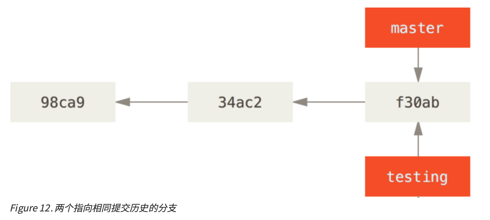

### HEAD 指针

Git 是怎么知道当前在哪一个分支上呢？也很简单，它有一个名为 HEAD 的特殊指针。在 Git 中，它是一个指针，指向当前所在的本地分支(译注:将 HEAD 想象为当前分支的别名)。在本例中，你仍然在 master 分支上。因为 git branch 命令仅仅创建 一个新分支，并不会自动切换到新分支中去。

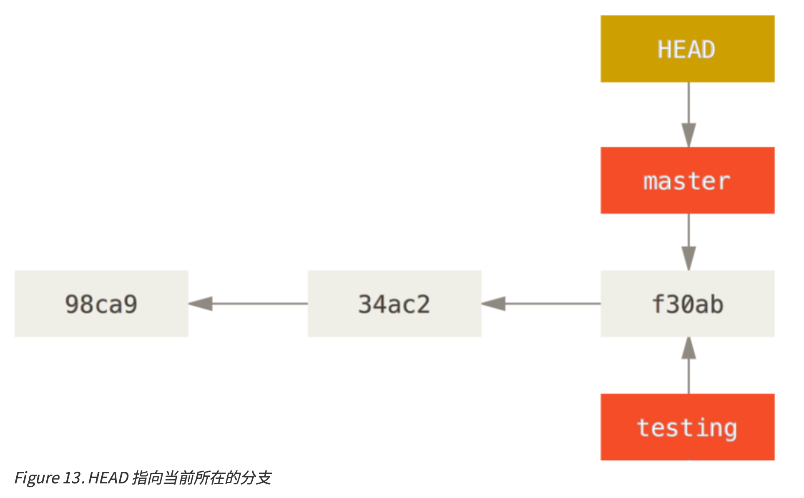

你可以简单地使用 git log 命令查看各个分支当前所指的对象。提供这一功能的参数是 --decorate

```bash
$ git log --oneline --decorate
f30ab (HEAD, master, testing) add feature #32 - ability to add new 
34ac2 fixed bug #1328 - stack overflow under certain conditions 
98ca9 initial commit of my project
```

> 当前 master 和 testing 分支均指向校验和以 f30ab 开头的提交对象

### 切换分支

要切换到一个**已存在**的分支，你需要使用 git checkout 命令。我们现在切换到新创建的 testing 分支去

```bash
$ git checkout testing
```

> 这样 HEAD 就指向 testing 分支了

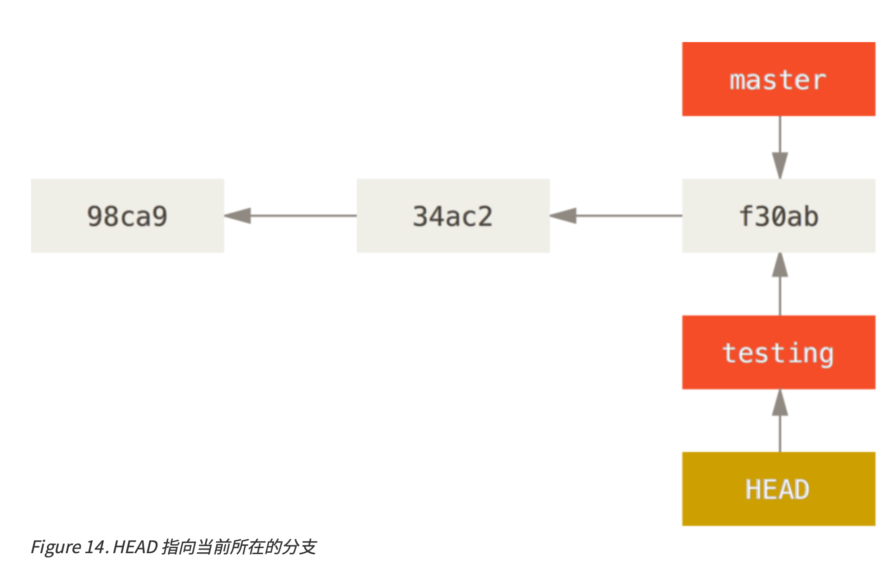

### 分支的新建与合并

#### 新建分支

首先，我们假设你正在你的项目上工作，并且已经有一些提交。

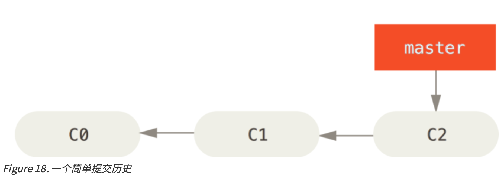

现在，你已经决定要解决你的公司使用的问题追踪系统中的 #53 问题。想要新建一个分支并同时切换到那个分

支上，你可以运行一个带有 -b 参数的 git checkout 命令

```bash
$ git checkout -b iss53
Switched to a new branch "iss53"
```

它等价于

```bash
$ git branch iss53
$ git checkout iss53
```

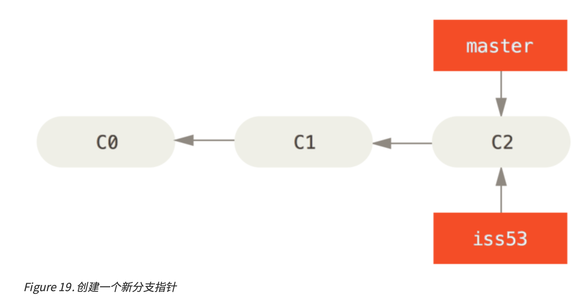

你继续在 #53 问题上工作，并且做了一些提交。在此过程中，iss53 分支在不断的向前推进，因为你已经检出

到该分支(也就是说，你的 HEAD 指针指向了 iss53 分支)

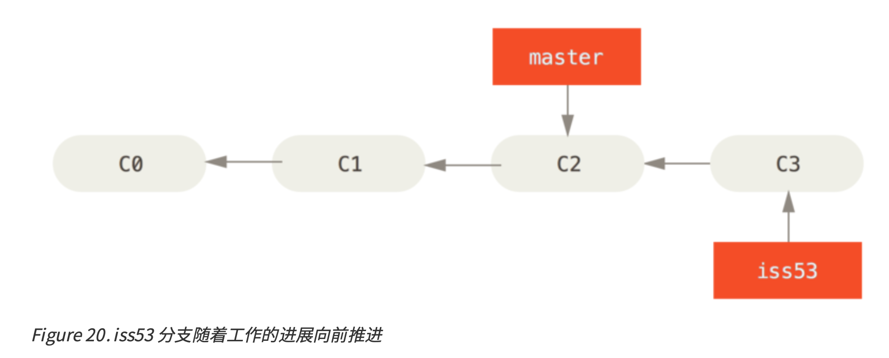

现在假设在 C2 处我们要修复一个恶性bug，我们需要切换回 master 分支，然后处理bug

```bash
$ git checkout master
$ git checkout -b hotfix
```

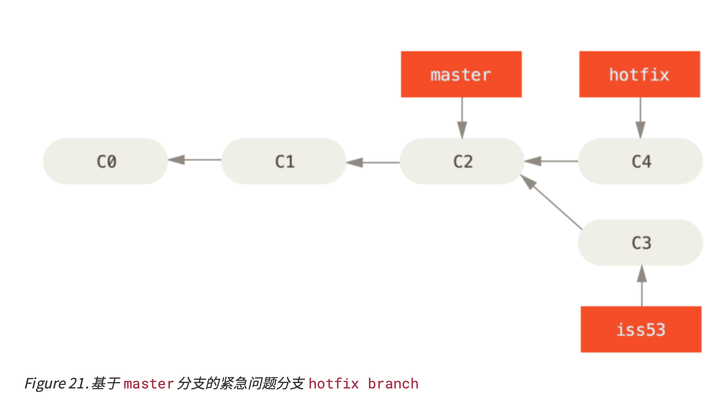

你可以运行你的测试，确保你的修改是正确的，然后将其合并回你的 master 分支来部署到线上。你可以使用

git merge命令来达到上述目的

```bash
$ git checkout master
$ git merge hotfix 
Updating f42c576..3a0874c 
Fast-forward
index.html | 2 ++
1 file changed, 2 insertions(+)
```

> 在 merge 之前，hostfix 是基于 maseter 的新分支，所以这里有个 Fast-forward，master 分支可以直接合并 hotfix 分支
>
> Git 只是简单的将指针向前移动。换句话说，当你试图合并两个分支时，如果顺着一个分支走下去能够到达另一个分支，那么 Git 在合并两者的时候，只会简单的将指针向前推进 (指针右移)，因为这种情况下的合并操作没有需要解决的分歧——这就叫做 “快进(fast-forward)”

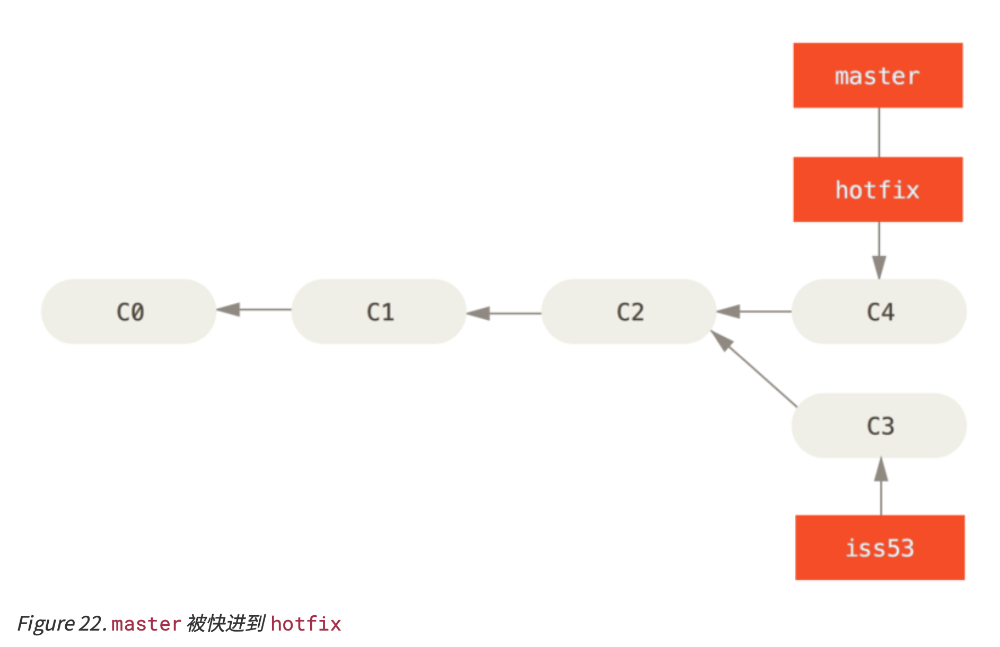

此时我们应该删除 hostfix 分支

```bash
$ git branch -d hotfix
```

现在你可以切换回你正在工作的分支继续你的工作，也就是针对 #53 问题的那个分支(iss53 分支)。

```bash
$ git checkout iss53
```

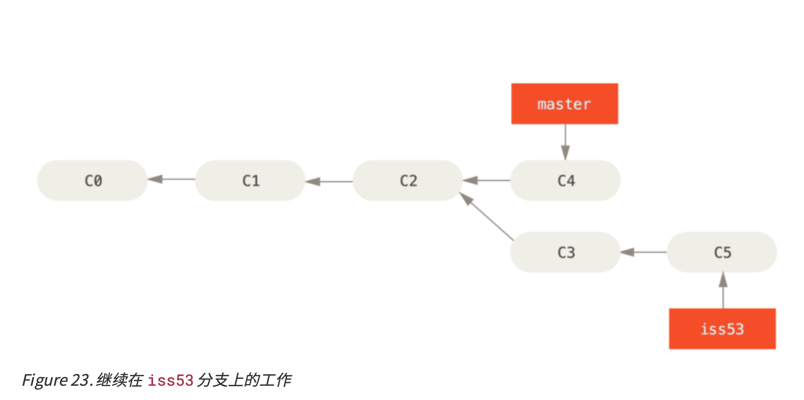

你在 hotfix 分支上所做的工作并没有包含到 iss53 分支中。如果你需要拉取 hotfix 所做的修改，你可以使用 git merge master 命令将 master 分支合并入 iss53 分支，或者你也可以等到 iss53 分支完成其使命， 再将其合并回 master 分支。

#### 分支的合并

假设你已经修正了 #53 问题，并且打算将你的工作合并入 master 分支。为此，你需要合并 iss53 分支到 master 分支，这和之前你合并 hotfix 分支所做的工作差不多。你只需要检出到你想合并入的分支，然后运行 git merge 命令

```bash
$ git checkout master
Switched to branch 'master'
$ git merge iss53
Merge made by the 'recursive' strategy. 
index.html | 1 +
1 file changed, 1 insertion(+)
```

因为 master 分支所在提交并不是 iss53 分支所在提交的直接祖先，Git 不得不做一 些额外的工作。出现这种情况的时候，Git 会使用两个分支的末端所指的快照(C4 和 C5)以及这两个分支的工 作祖先(C2)，做一个简单的三方合并。

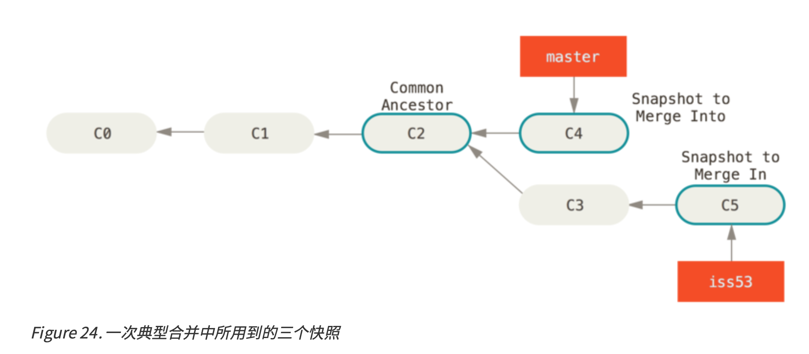

和直接将分支指针向前推进所不同的是，Git 将此次三方合并的结果做了一个新的快照并且自动创建一个新的提交指向它。这个被称作一次合并提交，它的特别之处在于他有不止一个父提交。

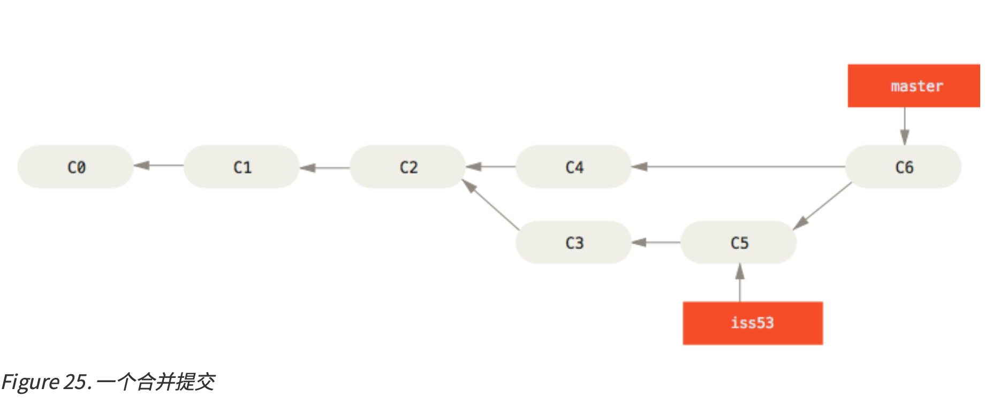

既然你的修改已经合并进来了，你已经不再需要 iss53 分支了。现在你可以在任务追踪系统中关闭此项任务， 并删除这个分支。

`$ git branch -d iss53`

#### 遇到冲突时的分支合并

有时候合并操作不会如此顺利。如果你在两个不同的分支中，对同一个文件的同一个部分进行了不同的修改，Git 就没法干净的合并它们。如果你对 #53 问题的修改和有关 hotfix 的修改都涉及到同一个文件的同一处，在合并它们的时候就会产生合并冲突

```bash
$ git merge iss53
Auto-merging index.html
CONFLICT (content): Merge conflict in index.html
Automatic merge failed; fix conflicts and then commit the result.
```

此时 Git 做了合并，但是没有自动地创建一个新的合并提交。Git 会暂停下来，等待你去解决合并产生的冲突。 你可以在合并冲突后的任意时刻使用git status命令来查看那些因包含合并冲突而处于未合并 (unmerged)状态的文件

```bash
$ git status
On branch master
You have unmerged paths.
(fix conflicts and run "git commit")
Unmerged paths:
(use "git add <file>..." to mark resolution)
both modified: index.html
no changes added to commit (use "git add" and/or "git commit -a")
```

任何因包含合并冲突而有待解决的文件，都会以未合并状态标识出来。Git 会在有冲突的文件中加入标准的冲突解决标记，这样你可以打开这些包含冲突的文件然后手动解决冲突。出现冲突的文件会包含一些特殊区段，看起来像下面这个样子

```bash
<<<<<<< HEAD:index.html
<div id="footer">contact : email.support@github.com</div> 
=======
<div id="footer">
please contact us at support@github.com 
</div>
>>>>>>> iss53:index.html
```

这表示 HEAD 所指示的版本，也就是你的 master 分支所在的位置，因为你在运行 merge 命令的时候已经检出到了这个分支，在这个区段的上半部分

```
<<<<<<< HEAD:index.html
<div id="footer">contact : email.support@github.com</div> 
=======
```

> `=======` 的上半部分

而 iss53 分支所指示的版本在 `=======` 的 下半部分

```
=======
<div id="footer">
please contact us at support@github.com 
</div>
>>>>>>> iss53:index.html
```

为了解决冲突，你必须选择使用由 `=======` 分割的两部分中的一个，或者你也可以自行合并这些内容。例如你可以通过把这段内容换成下面的样子来解决冲突

```bash
<div id="footer">
please contact us at email.support@github.com 
</div>
```

如果你对结果感到满意，并且确定之前有冲突的的文件都已经暂存了，这时你可以输入 git commit 来完成合并提交。默认情况下提交信息看起来像下面这个样子

```
Merge branch 'iss53'
Conflicts: index.html
#
# It looks like you may be committing a merge.
# If this is not correct, please remove the file #.git/MERGE_HEAD
# and try again.
# Please enter the commit message for your changes. Lines starting
# with '#' will be ignored, and an empty message aborts the commit. # On branch master
# All conflicts fixed but you are still merging.
#
# Changes to be committed: #modified: index.html
#
```

### 分支管理

现在已经创建、合并、删除了一些分支，让我们看看一些常用的分支管理工具。

#### 查看分支

```
$ git branch
	iss53
  * master
	testing
```

注意 master 分支前的 * 字符，它代表现在检出的那一个分支，也就是当前 HEAD 指针所指向的分支

如果需要查看每一个分支的最后一次提交，可以运行 git branch -v 命令

```
$ git branch -v
	iss53 93b412c fix javascript issue
  * master 7a98805 Merge branch 'iss53'
	testing 782fd34 add scott to the author list in the readmes
```

--merged 与 --no-merged 这两个有用的选项可以过滤这个列表中已经合并或尚未合并到当前分支的分支。如果要查看哪些分支已经合并到当前分支，可以运行 git branch --merged

```
$ git branch --merged 
	iss53
  * master
```

因为之前已经合并了 iss53 分支，所以现在看到它在列表中。在这个列表中分支名字前没有 * 号的分支通常可以使用 git branch -d 删除掉：你已经将它们的工作整合到了另一个分支，所以并不会失去任何东西。

查看所有包含未合并工作的分支，可以运行 git branch --no-merged

```
$ git branch --no-merged
	testing
```

这里显示了其他分支。因为它包含了还未合并的工作，尝试使用 git branch -d 命令删除它时会失败

```
$ git branch -d testing
error: The branch 'testing' is not fully merged.
If you are sure you want to delete it, run 'git branch -D testing'
```

如果真的想要删除分支并丢掉那些工作，如同帮助信息里所指出的，可以使用 -D 选项强制删除它。

### 远程分支

#### 拉取远程分支

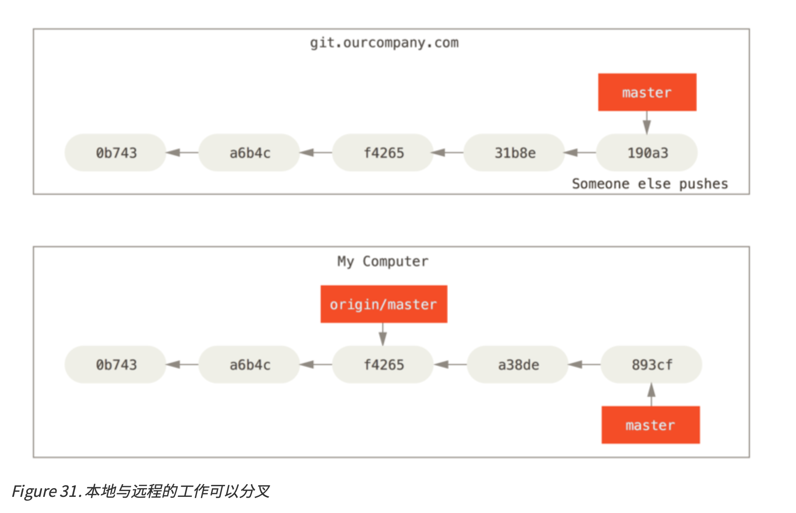

如图，我们 clone 之后，别人向原本的远程仓库推送导致 master 前进是非常正常的行为。此时我们本地的 origin/master 就会落后于真正的远程仓库的 master 分支

运行 git fetch origin 命令，就会将本地的 origin 仓库进行更新，拉取远程有而本地没有的数据，这样本地保存的 origin 远程仓库内容就与最新的内容一致了

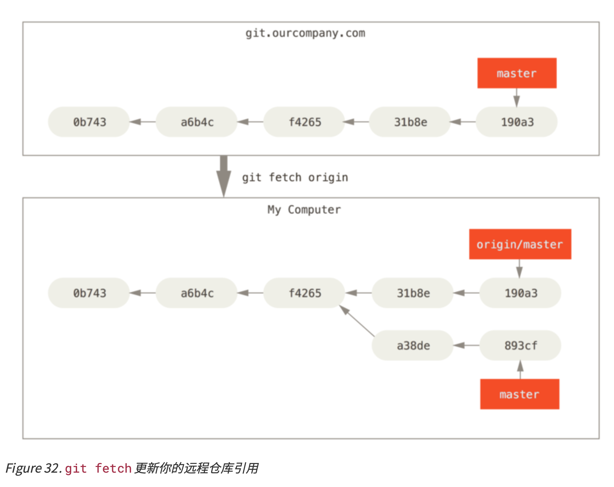

#### 推送远程分支

当你想要公开分享一个分支时，需要将其推送到有写入权限的远程仓库上。本地的分支并不会自动与远程仓库同 步，你必须显式地推送想要分享的分支。这样你就可以把不愿意分享的内容放到私人分支上，而将需要和别人协作的内容推送到公开分支

如果希望和别人一起在名为 serverfix 的分支上工作，执行如下命令

```bash
$ git push origin serverfix
```

> 这表示：推送本地的 serverfix 作为 origin 的 serverfix 分支

```bash
git push origin serverfix:awesomebranch
```

> 这表示：推送本地的 serverfix 作为 origin 的 awesomebranch 分支

#### 上游分支

从一个远程跟踪分支检出一个本地分支会自动创建一个跟踪分支，有时候也叫做上游分支

上游分支是与远程分支有直接关系的**本地分支**。如果在一个上游分支上输入 git pull，Git能自动地识别去哪个服务器上抓取、合并到哪个分支

当克隆一个仓库时，它通常会自动地创建一个跟踪 origin/master 的 master 分支

```bash
git checkout --track origin/serverfix
```

> 本地建立 serverfix 分支，跟踪远程的 origin/serverfix 分支

如果想要将本地分支与远程分支设置为不同名字，你可以轻松地增加一个不同名字的本地分支的上一个命令

```bash
git checkout -b sf origin/serverfix
```

> 现在，本地分支 sf 会自动从 origin/serverfix 拉取

如果已经有了一个本地分支，想要去跟踪某个远程分支（或者修改成跟踪其它的上游分支），执行

```bash
git branch -u origin/serverfix
```

> 执行命令的这个分支将会去追踪 origin/serverfix 分支
>
> 当设置好跟踪分支后，可以通过 @{upstream} 或 @{u} 快捷方式来引用它。所以在 master 分支并且它正在跟踪 origin/master 时，如果愿意的话可以使用 git merge @{u} 来取代 git merge origin/master

##### 查看上游分支

```bash
 $ git branch -vv
	iss53 7e424c3 [origin/iss53: ahead 2] forgot the brackets 
	master 1ae2a45 [origin/master] deploying index fix
  * serverfix f8674d9 [teamone/server-fix-good: ahead 3, behind 1] this should do it
    testing   5ea463a trying something new
```

> - iss53：本地有 2 个提交领先于 origin/iss53
> - master：与 origin/master 一致
> - serverfix
>   - teamone/server-fix-good(v1) 更新了一个版本到 teamone/server-fix-good(v2)，而 serverfix 只跟踪到了 teamone/server-fix-good(v1)
>   - 本地的 serverfix 有 3 个提交领先于 teamone/server-fix-good(v1)
> - testing：没有跟踪任何分支
>
> 这些数据来自于你从每个服务器上最后一次抓取的数据。这个命令并没有连接服务器，它只会告诉你关于本地缓存的服务器数据。如果想要统计最新的领先与落后数字，需要在运行此命令前抓取 所有的远程仓库。可以像这样做：`git fetch --all; git branch -vv`

### 拉取

当 git fetch 命令从服务器上抓取本地没有的数据时，它并不会修改工作目录中的内容。它只会获取数据然后让你自己合并。然而，有一个命令叫作 git pull 在大多数情况下它的含义是一个 git fetch 紧接着一个 git merge 命令。如果有一个像之前章节中演示的设置好的跟踪分支，不管它是显式地设置还是通过 clone 或 checkout 命令为你创建的，git pull 都会查找当前分支所跟踪的服务器与分支，从服务器上抓取数据然后尝试合并入那个远程分支。

由于 git pull 的魔法经常令人困惑所以通常单独显式地使用 fetch 与 merge 命令会更好一些

> git fetch 只是拉下来然后更新 origin/master 这样的远程分支，因为 origin/master 我们是不会修改的，所以这样不会有冲突
>
> git pull 在执行完了上面的操作之后，又执行了一个 `git merge origin/master`，这个操作是有可能有冲突的

### 删除远程分支

假设你已经通过远程分支做完所有的工作了，也就是说你和你的协作者已经完成了一个特性并且将其合并到了远 程仓库的 master 分支（或任何其他稳定代码分支），可以运行带有 --delete 选项的 git push 命令来删除一个远程分支

```bash
git push origin --delete serverfix
```

### 变基

当我们在 A 分支上执行 `git merge B` 的时候，表示将 A 分支的根基变成 B 分支

- 它首先找到 A 和 B 的共同祖先
- 然后将 A 分支相对于共同祖先的修改，作用在 B 分支的最新节点上

> 说白了就是：
>
> - 把 A 的祖先变成 B 分支
> - 此时大概率会有冲突，我们将其解决，完成 rebase
> - 最后看起来的效果就像是我们的操作就是在 B 分支上 checkout 出了 A 分支然后做的操作一样

```bash
czp@:~/workspace/projects/ticgit$ git branch
* master
czp@:~/workspace/projects/ticgit$ git status
On branch master
Your branch is ahead of 'origin/master' by 3 commits.
  (use "git push" to publish your local commits)

nothing to commit, working tree clean
czp@:~/workspace/projects/ticgit$ git checkout -b new
Switched to a new branch 'new'
czp@:~/workspace/projects/ticgit$ echo bbbbb > conflict.txt
czp@:~/workspace/projects/ticgit$ git add .
czp@:~/workspace/projects/ticgit$ git commit -m "new的提交"
[new 628c0f9] new的提交
 1 file changed, 1 insertion(+), 1 deletion(-)
czp@:~/workspace/projects/ticgit$ git checkout master
Switched to branch 'master'
Your branch is ahead of 'origin/master' by 3 commits.
  (use "git push" to publish your local commits)
czp@:~/workspace/projects/ticgit$ echo mmmmmm > conflict.txt
czp@:~/workspace/projects/ticgit$ git add .
czp@:~/workspace/projects/ticgit$ git commit -m "master的提交"
[master 7e055e9] master的提交
 1 file changed, 1 insertion(+), 1 deletion(-)
czp@:~/workspace/projects/ticgit$ git checkout new
Switched to branch 'new'
czp@:~/workspace/projects/ticgit$ git rebase master
First, rewinding head to replay your work on top of it...
Applying: new的提交
Using index info to reconstruct a base tree...
M	conflict.txt
Falling back to patching base and 3-way merge...
Auto-merging conflict.txt
CONFLICT (content): Merge conflict in conflict.txt
error: Failed to merge in the changes.
Patch failed at 0001 new的提交
hint: Use 'git am --show-current-patch' to see the failed patch
Resolve all conflicts manually, mark them as resolved with
"git add/rm <conflicted_files>", then run "git rebase --continue".
You can instead skip this commit: run "git rebase --skip".
To abort and get back to the state before "git rebase", run "git rebase --abort".
czp@:~/workspace/projects/ticgit$ git status
rebase in progress; onto 7e055e9
You are currently rebasing branch 'new' on '7e055e9'.
  (fix conflicts and then run "git rebase --continue")
  (use "git rebase --skip" to skip this patch)
  (use "git rebase --abort" to check out the original branch)

Unmerged paths:
  (use "git restore --staged <file>..." to unstage)
  (use "git add <file>..." to mark resolution)
	both modified:   conflict.txt

no changes added to commit (use "git add" and/or "git commit -a")
czp@:~/workspace/projects/ticgit$ git add conflict.txt
czp@:~/workspace/projects/ticgit$ git rebase --continue
Applying: new的提交
czp@:~/workspace/projects/ticgit$ git status
On branch new
nothing to commit, working tree clean
czp@:~/workspace/projects/ticgit$ git branch
  master
* new
czp@:~/workspace/projects/ticgit$ git checkout master
Switched to branch 'master'
Your branch is ahead of 'origin/master' by 4 commits.
  (use "git push" to publish your local commits)
czp@:~/workspace/projects/ticgit$ git merge new
Updating 7e055e9..1314f54
Fast-forward
 conflict.txt | 1 +
 1 file changed, 1 insertion(+)
```

- 当前处在 master 分支

- 检出一个新的分支 new 分支

- new 分支提交了一个文件 `conflict.txt` 内容是 `bbbbb`

- 回到 master 分支，也提交了一个文件 `conflict.txt` 内容是 `mmmmmm`

- 此时两个分支已经分叉了

- 回到 checkout 分支，执行 `git rebase master`

  - 表示：我要变成以 master 分支当前的位置为基底

- 此时，conflict.txt 文件冲突了（因为我们对 new 分支的提交，在 master 上重新做了一次）

- 我们将冲突解决（这一步在上面没有展示，是在编辑器中做的）

- `git add conflict.txt`，将冲突的文件添加，然后执行 `git rebase --continue`

- 此时 new 分支已经成功变基到了 master 分支，效果就像是这样：

  - 以 master 当前节点 checkout 出了 new
  - 在这个 new 上执行了 new提交
  - 此时 master 只是落后于 new，但是两者并未分叉，因此 master 可以 fast-forward 到 new 分支

- 切回到 master 分支，执行 `git merge new`

- 使用 `git log` 查看

  ```bash
  czp@:~/workspace/projects/ticgit$ git log
  commit 1314f540e0a7196cee3d65d3b85b781f2d7f2946 (HEAD -> master, new)
  Author: cenzhipeng <cen-zhipeng@qq.com>
  Date:   Fri Mar 27 10:30:35 2020 +0800
  
      new的提交
  
  commit 7e055e9a6f28aa03d175b6a21767a40421002d98
  Author: cenzhipeng <cen-zhipeng@qq.com>
  Date:   Fri Mar 27 10:30:55 2020 +0800
  ```

  可以看到两个分支现在在一个地方

### 一般模式和注意事项

> 注意事项：只对自己本地的分支进行 rebase，绝对不要对公共仓库上的分支进行 rebase。例如公共分支 master，我们只应该 checkout ，然后merge我们的分支，不应该对它进行 rebase

一般模式：

- 假设 A B 是两个分叉的分支，A 想要合并 B 的修改
- 在 B 分支执行 `git rebase A`
- 解决产生的冲突
- 执行 `git add xxx` 将冲突的文件标记为已经解决
- 执行 `git rebase --continue` 此时已经 rebase 成功
- 切换回 A 分支，执行 `git merge B` ，此时 A 分支可以 `fast-forward` 到 B 分支


