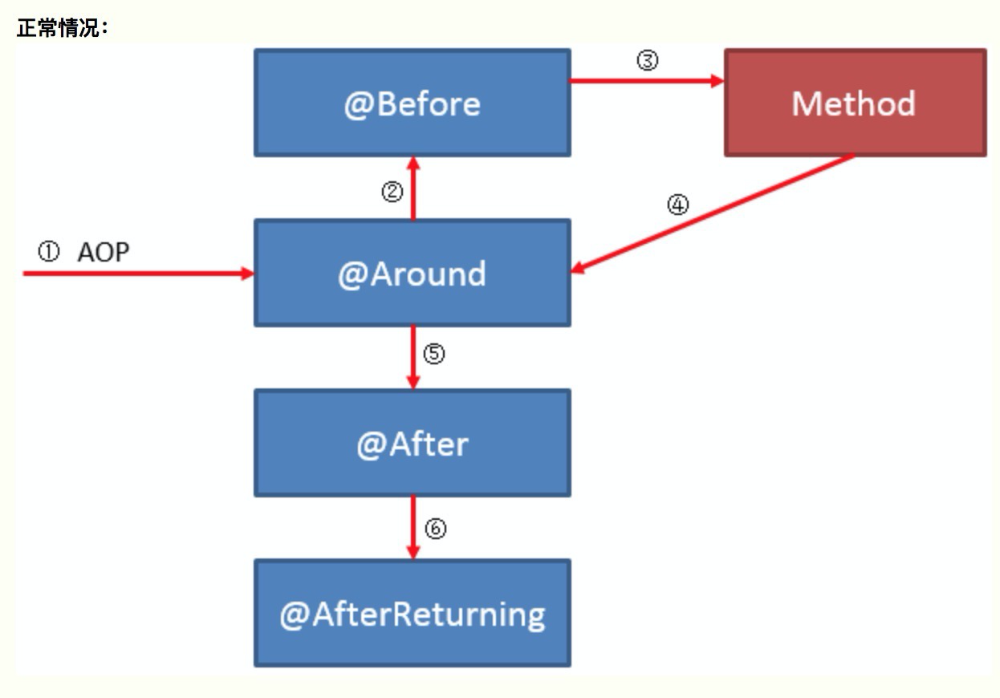

## AOP 概念

以下是 AOP 的核心概念：

- 连接点(joinpoint)：连接点是应用程序执行期间明确的一个点，比如方法调用、类初始化、对象实例化等。可以理解为一个时间点，我们的 AOP 就是定义在这个到了时间点上的时候想要做些什么（典型案例就是：方法调用的时候记录日志）。Spring只支持方法类型的连接点，所以在Spring中连接点指的就是被拦截到的方法，实际上连接点还可以是字段或者构造器
- 通知(advice)：所谓通知指的就是拦截到连接点之后要执行的代码，通知分为前置、后置、异常、后置返回、环绕、引入通知六类
- 切入点(pointcut)：**切入点是一个**用来选择什么时候执行通知的**定义**。我们创建一个切入点，其实就是从连接点中选择出一些符合我们的条件的连接点，我们的通知只在这些被选中的连接点上执行，而不是所有的连接点都执行
- 切面(aspect)：切面是封装在类中的通知和切入点的组合，这种组合定义了应该被执行的位置和执行的逻辑。简单说就是，切面包含两个方面：在哪里执行这些代码、以及这些代码具体的逻辑
- 织入(weaving)：将通知添加到目标类的具体连接点上的过程。这个过程不是我们处理的，而是 AOP 框架处理的。对于 AspectJ 来说，它有单独的编译器对 AOP 进行编译，实际上来说已经有点改变了 Java 语法，这是编译器织入的方式。对于 Spring AOP 来说，是通过动态代理来进行织入的，是一种运行时织入的方式，使用的是纯粹的 Java 方式，不需要单独编译
- 目标对象(target)：被 AOP 修改了的对象，也就是被通知(advised)的对象
- 引入(introduction)：这是通过引入其它方法或者字段，来修改类的结构的过程。通过引入的方式，我们可以在运行时让任何的类实现任何的接口，而不需要该类显示的实现该接口。简单来说，引入修改了类的结构，改变了字段或者方法。


> 连接点和切入点的区别：
>
> 我们去餐厅吃饭的时候，连接点就像是菜单上的菜名，而切入点则是我们想要选择的菜的想法。
>
> 例如：我想要所有的牛肉做成的菜，这句话就是一个切入点。这个切入点可能从菜单上（所有的连接点组成的集合）筛选出了某几个连接点（比如选出了：小炒黄牛肉、凉拌牛肉）
>
> 可以这样理解：
>
> - 在 spring AOP 中，连接点就是所有的方法调用的集合
> - 而切入点就是我们定义的表达式，这个表达式的作用是说明：我想要选择中哪些方法。最终这个切入点就定义了一些连接点的集合
> - 所以一般来说我们只需要定义切入点即可


## Spring 编码式 AOP

Spring 支持 aopaliance 这种通用 AOP 标准，因此我们可以先写一个这种编码式的 AOP 来体验一下 Spring 中的 AOP 使用过程

```java
public class JavaDemoApplication {
    static class RealServe {
        public String serve() {
            System.out.println("原始对象运行");
            return "原始对象";
        }
    }

    //import org.aopalliance.intercept.MethodInterceptor;
    // 这个是一个 AOP 标准，使用这个标准实现的 AOP 可以运行在别的 AOP 框架下
    static class RealServeDecorator implements MethodInterceptor {

        @Override
        public Object invoke(MethodInvocation invocation) throws Throwable {
            System.out.print("插入到前面的AOP，");
            Object result = invocation.proceed();
            System.out.println("返回值是：" + result);
            return result;
        }
    }

    public static void main(String[] args) {
        RealServe realServe = new RealServe();
        ProxyFactory pf = new ProxyFactory();
        pf.addAdvice(new RealServeDecorator());
        pf.setTarget(realServe);
        RealServe realServeProxy = (RealServe) pf.getProxy();
        realServeProxy.serve();
    }
}
```

- `import org.aopalliance.intercept.MethodInterceptor;`

  - 这是 AOP 的一种通用标准

- `ProxyFactory`

  ```java
  ProxyFactory pf = new ProxyFactory();
  pf.addAdvice(new RealServeDecorator());
  pf.setTarget(realServe);
  RealServe realServeProxy = (RealServe) pf.getProxy();
  ```

  - Spring 提供的代理工厂


## Spring AOP架构

Spring AOP 的实现方式是基于代理的，也就是生成原始对象的代理对象，AOP 的逻辑都封装在了代理对象里，我们在调用 bean 的逻辑的时候，实际上访问到的都是代理之后的 bean。


在运行时，Spring 会分析我们为 bean 定义的切入点，并且动态生成代理 bean，此时，不会直接调用目标 bean，而是将调用者注入代理 bean。

Spring AOP 的代理有两种实现方式：CGLIB 和 JDK 动态代理。默认情况下：

- 当被通知的目标对象实现一个接口时，使用 JDK 动态代理
- 当目标对象没有实现接口时，使用 CGLIB 代理

### Spring AOP 中的连接点

Spring AOP 中的连接点只支持方法调用，绝大部分情况下这种就够用了。如果想要更多的连接点，应该使用 AspectJ，AspectJ 和 Spring AOP 是可以一起用的

### Spring AOP 中的切面

在 Spring AOP 中，切面由实现了 Advisor 接口的类的实例表示。Spring 提供了一些可以复用的 Advisor 实现。Advisor 有两个子接口：PointcutAdvisor、IntroductionAdvisor

所有的 Advisor 实现都实现了 PointcutAdvisor 接口，这些实现使用切入点来控制要作用于哪些连接点。在 Spring 中，IntroductionAdvisor 被视为特殊类型的通知。

### 关于 ProxyFactory 类

ProxyFactory 类的作用：

- 控制织入和代理的创建的过程
- 使用 setTarget 表示被代理的是哪个对象
- 在内部将代理对象的创建过程交给了 cglib 或者 jdk 动态代理，具体是哪一个，取决于应用的配置
- 使用 addAdvice 将通知应用于这个对象的所有方法调用，而不是有选择的应用，在内部使用的是一个默认的切入点，这个切入点包含了所有的连接点（也就是所有的方法调用）
- 当想要更多的控制所创建的 advisor 或者想要向代理添加引入时，可以自己创建 Advisor 并且使用 ProxyFactory 的 addAdvisor 方法（其实就是添加切面啦，切面里包含有切入点和通知，所以可以控制向目标对象哪些方法进行通知）

### Spring AOP 的六种通知

- 前置通知
  - org.springframework.aop.MethodBeforeAdvice
  - 可以在连接点执行之前执行，也就是在被代理的方法执行之前进行执行。前置通知可以访问被代理的方法，但是无法控制方法本身的执行，如果前置通知抛出异常，那么拦截器链条的进一步执行会终止，并且将异常传回给拦截器链条。也就是说，可以通过抛出异常的方式来终止代理方法的执行
- 后置返回通知
  - org.springframework.aop.AfterReturningAdvice
  - 在连接点的方法调用完成并且返回之后执行，它可以访问被调用的方法、参数和它的返回值。此时方法已经调用完成，所以无法阻止方法的执行。如果目标方法抛出异常，则不会执行这个通知。并且异常将会照常传回调用堆栈
- 后置通知
  - org.springframework.aop.AfterAdvice
  - 仅当被通知方法正常完成时才执行后置通知，无论被通知方法的执行结果是什么，都会执行后置通知，即使抛出异常也会执行这个通知
- 环绕通知
  - org.aopalliance.intercept.MethodInterceptor
  - 在 Spring 中，环绕通知使用方法拦截器的 aopalliance 标准进行建模。环绕通知允许在方法调用之前和调用之后执行，并且可以控制方法的调用，控制返回值，如果需要的话可以完全绕过该方法，自己实现相应的逻辑
- 异常通知
  - org.springframework.aop.ThrowsAdvice
  - 异常通知在方法调用返回后执行，但是只有抛出异常的时候才执行。异常通知只能捕获特定的异常。使用异常通知可以访问抛出异常的方法、传递给调用的参数以及调用的目标
- 引入通知
  - org.springframework.aop.IntroductionInterceptor
  - Spring 将引入建模为特殊类型的拦截器。通过使用引入拦截器，可以指定由引入通知引入的方法的实现


## Spring boot AOP 的使用

- Maven 引入 spring-boot-starter-aop 依赖

  ```xml
  <dependency>
    <groupId>org.springframework.boot</groupId>
    <artifactId>spring-boot-starter-aop</artifactId>
  </dependency>
  ```

- 在 application.properties 中配置启用 AOP

  ```properties
  spring.aop.auto=true
  spring.aop.proxy-target-class=true
  ```

  - 第一个配置表示：启用 AOP 功能
  - 第二个配置表示：强制使用 CGLIB 来进行动态代理

- 使用 @Aspect 定义切面，切面里包含切入点和通知

前面两项就不多说了，直接从后面的 demo 示例开始写

### 定义一个即将被增强的bean

```java
// 我们的通知主要集中在这个接口的 sayHello 方法
public interface DemoService {
    String sayHello(String name);
}
// 这个接口用来介绍引入型通知的功能
public interface MoreService {
    String more();
}
// 引入型通知调用接口时的底层实现
public class MoreServiceImpl implements MoreService {
    @Override
    public String more() {
        System.out.println("增加的功能");
        return "增加功能";
    }
}


// 这个方法有一定的几率抛出异常
@Service
public class DemoServiceImpl implements DemoService {
    @Override
    public String sayHello(String name) {
        System.out.println("你好，" + name);
        if (System.nanoTime() % 2 == 0) {
            System.out.println("本次执行发生了异常");
            throw new RuntimeException("本次执行发生了异常");
        }
        return name;
    }
}
```

以上是一个简单的 service。

注意一个很重要的事情：Spring AOP 一定是对 bean 进行增强，我们所要代理的类，必须在容器中有实例

### 定义一个切面

```java
@Aspect
@Component
@Order(1)
public class DemoAspect {
    // 引入型通知
    @DeclareParents(
            value = "com.example.javademo.service.DemoServiceImpl", // 被增强的类
            defaultImpl = MoreServiceImpl.class // 使用什么实现来增强
    )
    private MoreService moreService; // 表示想要增加的接口

    @Pointcut("execution(* com.example.javademo.service.DemoServiceImpl.sayHello(..))")
    public void sayHelloPoint() {
    }

    @Before("sayHelloPoint() && args(name)") // args(name) 表示获取这个方法的第一个参数，参数名称并不一定要叫做 name
    public void cBefore(JoinPoint joinPoint, String name) {
        System.out.println("name参数是：" + name);
        System.out.println("sayHelloPoint 调用之前3");
        System.out.println("参数是：" + Arrays.stream(joinPoint.getArgs()) //获取方法参数
                .map(str -> (String) str)
                .collect(Collectors.joining()));
    }

    @Before("sayHelloPoint()")
    public void aBefore() {
        System.out.println("sayHelloPoint 调用之前1");
    }

    @Before("sayHelloPoint()")
    public void bBefore() {
        System.out.println("sayHelloPoint 调用之前2");
    }

    @Around("sayHelloPoint()")
    public Object around(ProceedingJoinPoint joinPoint) throws Throwable {
        System.out.println("sayHelloPoint 调用之前环绕");
        Object result = joinPoint.proceed();
        System.out.println("sayHelloPoint 调用之后环绕");
        return result; // 这里我们可以修改函数的返回值，如果返回其它的结果，函数返回值就被修改了
    }

    // 环绕类型传入的参数应该是 ProceedingJoinPoint
    @Around("sayHelloPoint()")
    public Object around2(ProceedingJoinPoint joinPoint) throws Throwable {
        System.out.println("sayHelloPoint 调用之前环绕2");
        Object result = joinPoint.proceed(); // 继续调用原始对象的方法，我们可以修改它的入参
        System.out.println("sayHelloPoint 调用之后环绕2");
        return result; // 这里我们可以修改函数的返回值，如果返回其它的结果，函数返回值就被修改了
    }

    @After("sayHelloPoint()")
    public void after() {
        System.out.println("sayHelloPoint 调用之后");
    }

    @AfterReturning("sayHelloPoint()")
    public void afterReturning() {
        System.out.println("sayHelloPoint 调用并且返回之后，抛出异常则不执行这里了");
    }

    @AfterThrowing("sayHelloPoint()")
    public void afterThrowing() {
        System.out.println("sayHelloPoint 调用抛出异常后执行这里");
    }
    
}
```

### main 方法和输出

```java
public static void main(String[] args) {
  ConfigurableApplicationContext context = SpringApplication.run(JavaDemoApplication.class, args);
  DemoService demoService = context.getBean(DemoService.class);
  MoreService moreService = (MoreService)demoService;
  demoService.sayHello("岑志鹏");
  moreService.more();
}
```

没有异常的时候的输出如下

```java
sayHelloPoint 调用之前环绕
sayHelloPoint 调用之前环绕2
sayHelloPoint 调用之前1
sayHelloPoint 调用之前2
name参数是：岑志鹏
sayHelloPoint 调用之前3
参数是：岑志鹏
你好，岑志鹏
sayHelloPoint 调用之后环绕2
sayHelloPoint 调用之后环绕
sayHelloPoint 调用之后
sayHelloPoint 调用并且返回之后，抛出异常则不执行这里了
增加的功能
```

抛出异常的时候的输出如下

```
sayHelloPoint 调用之前环绕
sayHelloPoint 调用之前环绕2
sayHelloPoint 调用之前1
sayHelloPoint 调用之前2
name参数是：岑志鹏
sayHelloPoint 调用之前3
参数是：岑志鹏
你好，岑志鹏
本次执行发生了异常
sayHelloPoint 调用之后
sayHelloPoint 调用抛出异常后执行这里
Exception in thread "main" java.lang.RuntimeException: 本次执行发生了异常
```

下面的内容进行详细分析这个切面的工作机制


## 切面用到的注解

- Component

  - 这个是 Spring 容器所需要的注解，如果不定义这个注解，Spring 容器不会将切面生效，因为容器里没扫描这个切面的 bean

- Aspect

  - 这个是真正定义切面的注解，用来提醒 Spring AOP，这个被注解的类是一个切面

- `@Order(1)`

  - 这个注解不是必须的
  - 这个注解用来定义切面的优先级，数字越小，优先级越高
  - 当有多个切面的时候，如果没有添加 Order 注解，不同的切面的优先级是未定义的

- `@Pointcut("execution(* com.example.javademo.service.DemoServiceImpl.sayHello(..))")`

  - 这个是定义切入点的注解，使用的是 execution 表达式
  - `execution(* com.example.javademo.service.DemoServiceImpl.sayHello(..))`
    - 这里开头的 * 号表示：任何任何类型的返回值，也就是任何方法都匹配，我们也可以匹配一个特别的类型比如说 String
    - `com.example.javademo.service.DemoServiceImpl.sayHello` 表示：匹配这个包名这个类的这个 sayHello 方法，对这个方法做增强
    - `sayHello(..)` 这里的两个点号表示匹配的方法可以具有任何参数，也就是所有重载的 sayHello 方法都匹配的上，我们也可以匹配某个特定签名的方法

- `@Around("sayHelloPoint()")`

  - 这个是定义环绕通知的注解，表示在方法执行过程中所要进行的操作
  - `sayHelloPoint()` 这个是之前的 @PointCut 注解修饰的方法，用来代指这个切入点，表示这个环绕通知要应用在这个切入点之上

- `@Before("sayHelloPoint()")` 

  - 这个是定义前置通知的注解，表示在方法执行之前所要进行的操作
  - `sayHelloPoint()` 含义如上

- `@After("sayHelloPoint()")`

  - 这个是定义后置通知的注解，表示在方法执行之后所要进行的操作

- `@AfterReturning("sayHelloPoint()")`

  - 这个是定义后置返回通知的注解，表示在方法执行并且返回之后所要进行的操作
  - 如果方法抛出了异常，那么这个通知就不会再执行了

- `@AfterThrowing("sayHelloPoint()")`

  - 这个是定义异常通知的注解，表示在方法抛出异常之后所要进行的操作
  - 如果方法没抛出异常，这个通知不会执行
  - 可以看出 `AfterThrowing` 和 `AfterReturning` 只会执行其中的一个

- 引入型通知

  ```java
  // 引入型通知
  @DeclareParents(
    value = "com.example.javademo.service.DemoServiceImpl", // 被增强的类
    defaultImpl = MoreServiceImpl.class // 使用什么实现来增强
  )
  private MoreService moreService; // 表示想要增加的接口
  ```

  - 使用 @DeclareParents 注解来定义引入型通知
  - value 参数表示：我们想要哪个类被增强。被增强的这个类将会增加新的接口实现。如果添加了 加号，例如 `DemoServiceImpl+`，在 springboot 2 之后，表示增加它的子类，但是不包含这个类自身
  - `private MoreService moreService;` 表示我们想要上面 value 这个被增强的类增加什么接口。这里表示说：我们想要让 DemoServiceImpl 多实现一个 MoreService 接口
  - defaultImpl 参数表示：DemoServiceImpl 多实现的这个 MoreService 接口，具体的方法是由谁来执行的。因为 DemoServiceImpl 本身是没有实现 MoreService 接口的，所以当我们调用 DemoServiceImpl 关于 MoreService 的接口方法时，需要一个底层的方法实现，这个实现就是 defaultImpl 定义的 MoreServiceImpl


## 切面的执行顺序

### 相同类型通知的执行顺序

参考：[https://segmentfault.com/a/1190000011283029](https://segmentfault.com/a/1190000011283029)

在我们上面的切面示例中，有 3 个前置通知，它们的顺序是有定义的，是按照通知的方法名字排序的，参考 `ReflectiveAspectJAdvisorFactory.getAdvisorMethods(..) `方法 ，里面有一行是 `methods.sort(METHOD_COMPARATOR);`，这里的比较器就是通过方法名进行排序的。

在我们的切面示例中，3 个前置通知的方法名分别是：aBefore、bBefore、cBefore

最后的执行顺序也是按照这个方法名的字符排序来的，小的在前面，所以 aBefore 是最先执行的

**因此，在同一个切面中，相同类型的通知（前置、后置等叫做类型），是按照方法名进行排序的**

### 单个切面不同类型通知的执行顺序



环绕通知分为三个部分：

- 调用 `proceedJoinPoint.proceed()` 之前的代码部分
- 调用 `proceedJoinPoint.proceed()` 的部分
- 调用 `proceedJoinPoint.proceed()` 之后的代码部分


在环绕通知确实调用了 `proceedJoinPoint.proceed()` 的情况下，顺序是这样的：

- 环绕通知中，调用 `proceedJoinPoint.proceed()` 之前的代码部分
- 所有的前置通知
- 环绕通知中，调用 `proceedJoinPoint.proceed()` 的部分
- 所有的后置通知
- 所有的后置返回通知/异常通知 （这两种通知是互斥的，只有一种执行）

> 在环绕通知没有调用 `proceedJoinPoint.proceed()` 的情况下，顺序与上面几乎一致，唯一的区别就是：所有的前置通知都取消了，也就是前置通知统统不生效了。但是后置的那些通知是还生效的

### 不同切面的顺序


不同切面的优先级是不确定的，但是我们可以给切面添加 Order 注解来定义切面的优先级，Order 数字越小，优先级越高

不同切面的通知执行顺序如下：

- 高优先级的切面的环绕通知调用 `proceedJoinPoint.proceed()` 之前的代码部分
- 高优先级的切面的前置通知
- 低优先级的切面的全部通知执行完成（按照上面单个切面不同类型通知的执行顺序进行执行）
- 高优先级的切面的环绕通知调用 `proceedJoinPoint.proceed()` 的部分
- 高优先级的切面的所有的后置通知
- 高优先级的切面的所有的后置返回通知/异常通知

> 一句话概括就是：高优先级的切面执行环绕的前半部分以及前置通知，然后把低一级的切面全部执行完。回过头来再继续执行高优先级的切面。
>
> 也就是说：
>
> - 高优先级的前半部分先执行，后半部分后执行
> - 低优先级切面（称作第二级）之后如果还有更低一级别的切面（称作第三级别），则是递归这个过程。
>   - 第二级切面执行环绕的前半部分以及前置通知
>   - 把第三级的切面全部执行完
>   - 回过头来再继续执行第二级的切面
> - 对于环绕通知，我们只需要在最低的那个级别的切面中调用 `proceedJoinPoint.proceed()` 
>
> 还有一种高优先级切面中环绕通知不执行 `proceedJoinPoint.proceed()` 的情况：
>
> - 这种情况下，由于 `proceedJoinPoint.proceed()` 没有执行
> - 所以高优先级切片的前置通知也不会生效了
> - 从而导致低优先级切面完全失效，任何通知都不起效（除了引入型通知）
> - 相当于直接屏蔽了低优先级切面
>
> 另外，在多个环绕通知中调用 `proceedJoinPoint.proceed()` 并不会导致被拦截的底层方法执行多次。底层方法只会执行一次，这里我们可以拿到返回值，然后将返回值不做修改返回出去，因此，每个环绕通知一般来说都要调用 `proceedJoinPoint.proceed()`

### 切点表达式

参考：

- [https://my.oschina.net/zhangxufeng/blog/1824275](https://my.oschina.net/zhangxufeng/blog/1824275)
- [https://www.cnblogs.com/myitnews/p/11553177.html](https://www.cnblogs.com/myitnews/p/11553177.html)

### 通知的参数

- 如果你不想要参数的话，这些通知方法都可以不加参数

- 非环绕型通知：第一个参数都可以是 JoinPoint，后面的参数通过下面的方式获取

  ```java
  @Before("sayHelloPoint() && args(name)") // args(name) 表示获取这个被拦截的方法的第一个参数，参数名称并不一定要叫做 name
  public void cBefore(JoinPoint joinPoint, String name) {
    System.out.println("name参数是：" + name);
    System.out.println("sayHelloPoint 调用之前3");
    System.out.println("参数是：" + Arrays.stream(joinPoint.getArgs()) //获取方法参数
                       .map(str -> (String) str)
                       .collect(Collectors.joining()));
  }
  ```

- 环绕型通知：第一个参数可以是 ProceedingJoinPoint，用来决定方法是否继续执行
- AfterReturning 中可以添加 return 的名称，然后绑定在方法的入参里
- AfterThrowing 中可以添加 throw 的名称，然后绑定在方法的入参里

### 最佳实践

- 尽量减少使用环绕通知
- 更多使用前置通知、后置通知等更加明确的通知范围