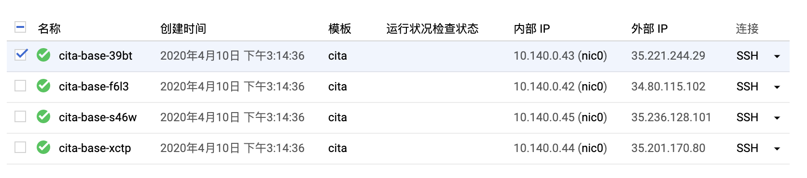
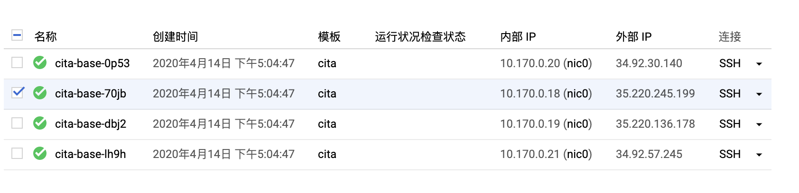
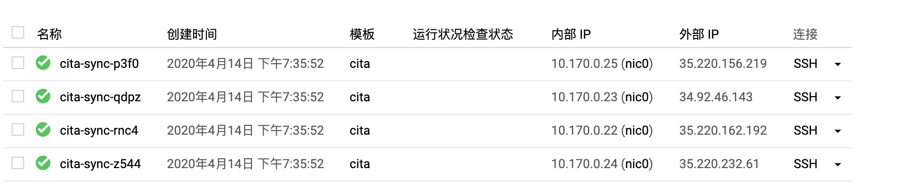

# 标准分链应用迁移 BaaS 方案调研

## 环境说明

本次实验均基于 google cloud platform 进行


## 节点数据打包迁移

### 准备 CITA 链实例组

#### 创建实例模板

首先创建一个实例模板，方便后续进行创建实例的操作，实例模板如下：

```
cita
机器类型
n1-standard-1（1 个 vCPU，3.75 GB 内存）
ubuntu-1804-bionic-v20200317	50GB
```

主要配置是：1 个 vCPU，3.75 GB 内存，50 GB 硬盘，操作系统 ubuntu-1804-bionic-v20200317

#### 创建实例组

然后是使用上面的模板创建一个实例组 cita-base，实例数量是 4 个



### 构建 CITA 链

使用 gcp 的 cloud shell 进入 4 台机器的 shell 环境，在每台机器上执行命令下载安装 cita 的软件包以及 docker

```
sudo su czp
cd ~
wget https://github.com/citahub/cita/releases/download/v0.24.2/cita_sm2_sm3.tar.gz
tar -zxvf cita_sm2_sm3.tar.gz
cd cita_sm2_sm3/
curl -fsSL https://get.docker.com -o get-docker.sh
sudo sh get-docker.sh
sudo usermod -aG docker czp
sudo su czp
```

> czp 是我机器的用户名，可修改为自己的用户名

在第一台机器上执行以下命令，构建链的节点

```
bin/cita create --super_admin "0x141d051b1b1922bf686f5df8aad45cefbcb0b696" --nodes "10.140.0.43:4000,10.140.0.42:4000,10.140.0.45:4000,10.140.0.44:4000"
```

将节点复制到其它3台机器（需要配置ssh秘钥，自行设置不再描述了）

```
scp -r test-chain/ czp@cita-base-f6l3:/home/czp/cita_sm2_sm3/
scp -r test-chain/ czp@cita-base-s46w:/home/czp/cita_sm2_sm3/
scp -r test-chain/ czp@cita-base-xctp:/home/czp/cita_sm2_sm3/
```

然后是，每台机器只保留一个节点，自行删除多余的重复节点即可（test-chain 目录下只保留一个数字开头的节点目录）

最后是在每个机器上依次启动节点

```
# 第1台
./bin/cita setup test-chain/0
./bin/cita start test-chain/0
# 第2台
./bin/cita setup test-chain/1
./bin/cita start test-chain/1
# 第3台
./bin/cita setup test-chain/2
./bin/cita start test-chain/2
# 第4台
./bin/cita setup test-chain/3
./bin/cita start test-chain/3
```

### 验证节点并且构造交易

查看块高，持续增长表示正常

```
curl -X POST --data '{"jsonrpc":"2.0","method":"blockNumber","params":[],"id":83}' 127.0.0.1:1337
```

安装 cita-cli

```
# 安装 cita-cli
wget https://github.com/citahub/cita-cli/releases/download/20.2.0/cita-cli-x86_64-musl-tls-20.2.0.tar.gz
tar -zxvf cita-cli-x86_64-musl-tls-20.2.0.tar.gz
sudo mv cita-cli /usr/local/bin/
```

测试合约

```
pragma solidity ^0.4.24;

contract SimpleStorage {
    uint storedData;
    event Init(address, uint);
    event Set(address, uint);
    event Stored(uint);

    constructor() public {
        storedData = 100;
        emit Init(msg.sender, 100);
    }

    function set(uint x) public {
        emit Stored(x);
        storedData = x;
        emit Set(msg.sender, x);
    }

    function get() public constant returns (uint) {
        return storedData;
    }
}
```

部署合约进行测试

```
# 部署合约
cita-cli rpc sendRawTransaction     --code 0x608060405234801561001057600080fd5b5060df8061001f6000396000f3006080604052600436106049576000357c010
0000000000000000000000000000000000000000000000000000000900463ffffffff16806360fe47b114604e5780636d4ce63c146078575b600080fd5b348015605957600080fd5b50607660048036038101908080359060
20019092919050505060a0565b005b348015608357600080fd5b50608a60aa565b6040518082815260200191505060405180910390f35b8060008190555050565b600080549050905600a165627a7a723058205aed214856a
5c433292a354261c9eb88eed1396c83dabbe105bde142e49838ac0029     --private-key 0x3ef2627393529fed043c7dbfd9358a4ae47a88a59949b07e7631722fd6959002     --algorithm sm2

# 获得合约地址是 0x9fd6e15f2df01991887b3b7b871d8944db9a8d86
# 测试合约 将 x 设置为 9
cita-cli rpc sendRawTransaction \
    --code 0x60fe47b10000000000000000000000000000000000000000000000000000000000000009 \
    --private-key 0x3ef2627393529fed043c7dbfd9358a4ae47a88a59949b07e7631722fd6959002 \
    --address 0x9fd6e15f2df01991887b3b7b871d8944db9a8d86 \
    --algorithm sm2
# 测试合约 获取 x 的值
czp@cita-base-39bt:~/cita_sm2_sm3$ cita-cli rpc call \
>     --to 0x9fd6e15f2df01991887b3b7b871d8944db9a8d86 \
>     --data 0x6d4ce63c \
>     --url http://127.0.0.1:1337
{
  "id": 1,
  "jsonrpc": "2.0",
  "result": "0x0000000000000000000000000000000000000000000000000000000000000009"
}
```

### 构建新的实例组（迁移组）

以上工作完成后，我们已经有一条正在执行的链了，并且其中已经部署了一条我们自己的合约，执行了一次交易。接下来我们需要创建一个迁移组来进行迁移操作

#### 创建实例组

依然使用 cita 模板，创建一个实例组 cita-new


然后每个节点安装 docker

```
sudo su czp
cd ~
curl -fsSL https://get.docker.com -o get-docker.sh
sudo sh get-docker.sh
sudo usermod -aG docker czp
sudo su czp
```


#### 打包 cita-base 的节点数据

以下说的节点，均是 cita-base 的节点

在第一个节点执行

```
bin/cita stop test-chain/0
cd ..
scp -r cita_sm2_sm3 czp@cita-new-bjk2:~/
cd cita_sm2_sm3
bin/cita start test-chain/0
```

在第二个节点执行

```
bin/cita stop test-chain/1
cd ..
scp -r cita_sm2_sm3 czp@cita-new-dd19:~/
cd cita_sm2_sm3
bin/cita start test-chain/1
```

在第三个节点执行

```
bin/cita stop test-chain/2
cd ..
scp -r cita_sm2_sm3 czp@cita-new-fhjs:~/
cd cita_sm2_sm3
bin/cita start test-chain/2
```

在第四个节点执行

```
bin/cita stop test-chain/3
cd ..
scp -r cita_sm2_sm3 czp@cita-new-lj10:~/
cd cita_sm2_sm3
bin/cita start test-chain/3
```

#### 修改 cita-new 的节点配置并启动链

以下说的节点均是 cita-new 的节点

在第一个节点执行

```
cd cita_sm2_sm3
sed -i "s/10.140.0.43/10.140.0.47/g"  test-chain/0/network.toml
sed -i "s/10.140.0.42/10.140.0.48/g"  test-chain/0/network.toml
sed -i "s/10.140.0.45/10.140.0.49/g"  test-chain/0/network.toml
sed -i "s/10.140.0.44/10.140.0.46/g"  test-chain/0/network.toml
bin/cita setup test-chain/0
bin/cita start test-chain/0
```

在第二个节点执行

```
cd cita_sm2_sm3
sed -i "s/10.140.0.43/10.140.0.47/g"  test-chain/1/network.toml
sed -i "s/10.140.0.42/10.140.0.48/g"  test-chain/1/network.toml
sed -i "s/10.140.0.45/10.140.0.49/g"  test-chain/1/network.toml
sed -i "s/10.140.0.44/10.140.0.46/g"  test-chain/1/network.toml
bin/cita setup test-chain/1
bin/cita start test-chain/1
```

在第三个节点执行

```
cd cita_sm2_sm3
sed -i "s/10.140.0.43/10.140.0.47/g"  test-chain/2/network.toml
sed -i "s/10.140.0.42/10.140.0.48/g"  test-chain/2/network.toml
sed -i "s/10.140.0.45/10.140.0.49/g"  test-chain/2/network.toml
sed -i "s/10.140.0.44/10.140.0.46/g"  test-chain/2/network.toml
bin/cita setup test-chain/2
bin/cita start test-chain/2
```

在第四个节点执行

```
cd cita_sm2_sm3
sed -i "s/10.140.0.43/10.140.0.47/g"  test-chain/3/network.toml
sed -i "s/10.140.0.42/10.140.0.48/g"  test-chain/3/network.toml
sed -i "s/10.140.0.45/10.140.0.49/g"  test-chain/3/network.toml
sed -i "s/10.140.0.44/10.140.0.46/g"  test-chain/3/network.toml
bin/cita setup test-chain/3
bin/cita start test-chain/3
```

#### 验证链的执行

在各个节点，使用下面命令查看块高，等待他们同步并且进行共识

```
curl -X POST --data '{"jsonrpc":"2.0","method":"blockNumber","params":[],"id":83}' 127.0.0.1:1337
```

等待同步完成后，验证我们之前部署的合约

```
czp@cita-new-bjk2:~/cita_sm2_sm3$ cita-cli rpc call \
>     --to 0x9fd6e15f2df01991887b3b7b871d8944db9a8d86 \
>     --data 0x6d4ce63c \
>     --url http://127.0.0.1:1337
{
  "id": 1,
  "jsonrpc": "2.0",
  "result": "0x0000000000000000000000000000000000000000000000000000000000000009"
}
```

可以看出，我们之前的合约数据是存在的，此时进行验证两条链是不同的链，分别在 cita-base 和 cita-new 执行一次合约调用。

在  cita-base 执行

```
cita-cli rpc sendRawTransaction \
    --code 0x60fe47b10000000000000000000000000000000000000000000000000000000000000339 \
    --private-key 0x3ef2627393529fed043c7dbfd9358a4ae47a88a59949b07e7631722fd6959002 \
    --address 0x9fd6e15f2df01991887b3b7b871d8944db9a8d86 \
    --algorithm sm2
```

> 将合约里的值设置为 339

等待几秒后执行下面命令查看，发现已经更新成 339 了

```
cita-cli rpc call \
    --to 0x9fd6e15f2df01991887b3b7b871d8944db9a8d86 \
    --data 0x6d4ce63c \
    --url http://127.0.0.1:1337
```


此时进入 cita-new 执行，发现依然是 9，证明该交易并未在 cita-new 执行

```
cita-cli rpc call \
    --to 0x9fd6e15f2df01991887b3b7b871d8944db9a8d86 \
    --data 0x6d4ce63c \
    --url http://127.0.0.1:1337
```

继续在 cita-new 执行，将合约的值设置为 100

```
cita-cli rpc sendRawTransaction \
    --code 0x60fe47b10000000000000000000000000000000000000000000000000000000000000100 \
    --private-key 0x3ef2627393529fed043c7dbfd9358a4ae47a88a59949b07e7631722fd6959002 \
    --address 0x9fd6e15f2df01991887b3b7b871d8944db9a8d86 \
    --algorithm sm2
```

等待几秒后，发现 cita-new 的值已经是 100，cita-base 的值不变

**此时已经证明：两条链已经不是同一条链了，已经成功的进行了链的迁移**

## 节点数据同步然后分叉

### 构建 CITA 链



在每个节点都执行以下命令：

```
sudo su czp
cd ~
wget https://github.com/citahub/cita/releases/download/v0.24.2/cita_sm2_sm3.tar.gz
tar -zxvf cita_sm2_sm3.tar.gz
cd cita_sm2_sm3/
curl -fsSL https://get.docker.com -o get-docker.sh
sudo sh get-docker.sh
sudo usermod -aG docker czp
sudo su czp
```

在第一台机器上执行以下命令，构建链的节点

```
bin/cita create --super_admin "0x141d051b1b1922bf686f5df8aad45cefbcb0b696" --nodes "10.170.0.20:4000,10.170.0.18:4000,10.170.0.19:4000,10.170.0.21:4000"
```

将节点复制到其它3台机器（需要配置ssh秘钥，自行设置不再描述了）

```
scp -r test-chain/ czp@cita-base-70jb:/home/czp/cita_sm2_sm3/
scp -r test-chain/ czp@cita-base-dbj2:/home/czp/cita_sm2_sm3/
scp -r test-chain/ czp@cita-base-lh9h:/home/czp/cita_sm2_sm3/
```

然后是，每台机器只保留一个节点，自行删除多余的重复节点即可（test-chain 目录下只保留一个数字开头的节点目录）

最后是在每个机器上依次启动节点

```
# 第1台
./bin/cita setup test-chain/0
./bin/cita start test-chain/0
# 第2台
./bin/cita setup test-chain/1
./bin/cita start test-chain/1
# 第3台
./bin/cita setup test-chain/2
./bin/cita start test-chain/2
# 第4台
./bin/cita setup test-chain/3
./bin/cita start test-chain/3
```

### 验证节点并且构造交易

查看块高，持续增长表示正常

```
curl -X POST --data '{"jsonrpc":"2.0","method":"blockNumber","params":[],"id":83}' 127.0.0.1:1337
```

安装 cita-cli

```
# 安装 cita-cli
wget https://github.com/citahub/cita-cli/releases/download/20.2.0/cita-cli-x86_64-musl-tls-20.2.0.tar.gz
tar -zxvf cita-cli-x86_64-musl-tls-20.2.0.tar.gz
sudo mv cita-cli /usr/local/bin/
```

测试合约

```
pragma solidity ^0.4.24;

contract SimpleStorage {
    uint storedData;
    event Init(address, uint);
    event Set(address, uint);
    event Stored(uint);

    constructor() public {
        storedData = 100;
        emit Init(msg.sender, 100);
    }

    function set(uint x) public {
        emit Stored(x);
        storedData = x;
        emit Set(msg.sender, x);
    }

    function get() public constant returns (uint) {
        return storedData;
    }
}
```

部署合约进行测试

```
# 部署合约
czp@cita-base-0p53:~/cita_sm2_sm3$ cita-cli rpc sendRawTransaction     --code 0x608060405234801561001057600080fd5b5060df8061001f6000396000f3006080604052600436106049576000357c0100000000000000000000000000000000000000000000000000000000900463ffffffff16806360fe47b114604e5780636d4ce63c146078575b600080fd5b348015605957600080fd5b5060766004803603810190808035906020019092919050505060a0565b005b348015608357600080fd5b50608a60aa565b6040518082815260200191505060405180910390f35b8060008190555050565b600080549050905600a165627a7a723058205aed214856a5c433292a354261c9eb88eed1396c83dabbe105bde142e49838ac0029     --private-key 0x3ef2627393529fed043c7dbfd9358a4ae47a88a59949b07e7631722fd6959002     --algorithm sm2
{
  "id": 4,
  "jsonrpc": "2.0",
  "result": {
    "hash": "0xb938c8676aa654aeec378678cb33bee02df87da0e131797d37467a8f4ceedd78",
    "status": "OK"
  }
}
czp@cita-base-0p53:~/cita_sm2_sm3$ cita-cli rpc getTransactionReceipt --hash 0xb938c8676aa654aeec378678cb33bee02df87da0e131797d37467a8f4ceedd78
{
  "id": 1,
  "jsonrpc": "2.0",
  "result": {
    "blockHash": "0x966380af8be0a28ea510b4573c0c2b3235e9f7dde70c3ae6854b1523f2af7a2b",
    "blockNumber": "0x8a",
    "contractAddress": "0x9fd6e15f2df01991887b3b7b871d8944db9a8d86",
    "cumulativeQuotaUsed": "0x17d9d",
    "errorMessage": null,
    "logs": [
    ],
    "logsBloom": "0x00000000000000000000000000000000000000000000000000000000000000000000000000000000000000000000000000000000000000000000000000000000000000000000000000000000000000000000000000000000000000000000000000000000000000000000000000000000000000000000000000000000000000000000000000000000000000000000000000000000000000000000000000000000000000000000000000000000000000000000000000000000000000000000000000000000000000000000000000000000000000000000000000000000000000000000000000000000000000000000000000000000000000000000000000000000",
    "quotaUsed": "0x17d9d",
    "root": null,
    "transactionHash": "0xb938c8676aa654aeec378678cb33bee02df87da0e131797d37467a8f4ceedd78",
    "transactionIndex": "0x0"
  }
}
# 获得合约地址是 0x9fd6e15f2df01991887b3b7b871d8944db9a8d86
# 测试合约 将 x 设置为 18
cita-cli rpc sendRawTransaction \
    --code 0x60fe47b10000000000000000000000000000000000000000000000000000000000000018 \
    --private-key 0x3ef2627393529fed043c7dbfd9358a4ae47a88a59949b07e7631722fd6959002 \
    --address 0x9fd6e15f2df01991887b3b7b871d8944db9a8d86 \
    --algorithm sm2
# 测试合约 获取 x 的值
czp@cita-base-0p53:~/cita_sm2_sm3$ cita-cli rpc call \
>      --to 0x9fd6e15f2df01991887b3b7b871d8944db9a8d86 \
>      --data 0x6d4ce63c \
>      --url http://127.0.0.1:1337
{
  "id": 1,
  "jsonrpc": "2.0",
  "result": "0x0000000000000000000000000000000000000000000000000000000000000018"
}
```

### 构建新的实例组（同步迁移组）



在源 cita 链上添加 4 个新节点作为同步节点

```
czp@cita-base-0p53:~/cita_sm2_sm3$ bin/cita append --chain_name test-chain --node "10.170.0.25:4000"
czp@cita-base-0p53:~/cita_sm2_sm3$ bin/cita append --chain_name test-chain --node "10.170.0.23:4000"
czp@cita-base-0p53:~/cita_sm2_sm3$ bin/cita append --chain_name test-chain --node "10.170.0.22:4000"
czp@cita-base-0p53:~/cita_sm2_sm3$ bin/cita append --chain_name test-chain --node "10.170.0.24:4000"
```

在 cita-sync 的 4 个节点中安装 docker 和 cita 软件包

```
sudo su czp
cd ~
wget https://github.com/citahub/cita/releases/download/v0.24.2/cita_sm2_sm3.tar.gz
tar -zxvf cita_sm2_sm3.tar.gz
cd cita_sm2_sm3/
curl -fsSL https://get.docker.com -o get-docker.sh
sudo sh get-docker.sh
sudo usermod -aG docker czp
sudo su czp
```

将源节点发送到目标节点

```
ssh 10.170.0.25 mkdir -p cita_sm2_sm3/test-chain && scp -r test-chain/4 czp@10.170.0.25:/home/czp/cita_sm2_sm3/test-chain/
ssh 10.170.0.23 mkdir -p cita_sm2_sm3/test-chain && scp -r test-chain/5 czp@10.170.0.23:/home/czp/cita_sm2_sm3/test-chain/
ssh 10.170.0.22 mkdir -p cita_sm2_sm3/test-chain && scp -r test-chain/6 czp@10.170.0.22:/home/czp/cita_sm2_sm3/test-chain/
ssh 10.170.0.24 mkdir -p cita_sm2_sm3/test-chain && scp -r test-chain/7 czp@10.170.0.24:/home/czp/cita_sm2_sm3/test-chain/
```

启动 4 个同步节点

```
czp@cita-sync-p3f0:~/cita_sm2_sm3$ bin/cita setup test-chain/4
czp@cita-sync-p3f0:~/cita_sm2_sm3$ bin/cita start test-chain/4
czp@cita-sync-qdpz:~/cita_sm2_sm3$ bin/cita setup test-chain/5
czp@cita-sync-qdpz:~/cita_sm2_sm3$ bin/cita start test-chain/5
czp@cita-sync-rnc4:~/cita_sm2_sm3$ bin/cita setup test-chain/6
czp@cita-sync-rnc4:~/cita_sm2_sm3$ bin/cita start test-chain/6
czp@cita-sync-z544:~/cita_sm2_sm3$ bin/cita setup test-chain/7
czp@cita-sync-z544:~/cita_sm2_sm3$ bin/cita start test-chain/7
```

同步节点上安装 cita-cli

```
# 安装 cita-cli
wget https://github.com/citahub/cita-cli/releases/download/20.2.0/cita-cli-x86_64-musl-tls-20.2.0.tar.gz
tar -zxvf cita-cli-x86_64-musl-tls-20.2.0.tar.gz
sudo mv cita-cli /usr/local/bin/
```

查看块高，发现在不断增长

```
czp@cita-sync-p3f0:~/cita_sm2_sm3$ cita-cli rpc blockNumber --url http://127.0.0.1:1341
{
  "id": 1,
  "jsonrpc": "2.0",
  "result": "0x1074"
}
```

查看之前部署的合约的值，发现是同一个值，可以证明已经是同一条链了

```
czp@cita-sync-p3f0:~/cita_sm2_sm3$ cita-cli rpc call \
>       --to 0x9fd6e15f2df01991887b3b7b871d8944db9a8d86 \
>       --data 0x6d4ce63c \
>       --url http://127.0.0.1:1341
{
  "id": 1,
  "jsonrpc": "2.0",
  "result": "0x0000000000000000000000000000000000000000000000000000000000000018"
}
```

### 同步后迁移

我们以 0x1000 这个高度为限，进行迁移，首先是等待 4 个同步节点达到该高度，这一块儿只要等待同步即可。在真实的生产环境中，这个过程可能会十分漫长（可能会花好几天）

等待 4 个节点都达到了 3000 这个高度后，将 4 个同步节点下线。

```
czp@cita-sync-p3f0:~/cita_sm2_sm3$ bin/cita stop test-chain/4
stop...ok
czp@cita-sync-qdpz:~/cita_sm2_sm3$ bin/cita stop test-chain/5
stop...ok
czp@cita-sync-rnc4:~/cita_sm2_sm3$ bin/cita stop test-chain/6
stop...ok
czp@cita-sync-z544:~/cita_sm2_sm3$ bin/cita stop test-chain/7
stop...ok
```

每个节点下载 cita_recover_sm2 

```
wget https://github.com/citahub/cita_recover/raw/master/bin/cita_recover_sm2
chmod a+x cita_recover_sm2
```

对节点数据进行裁剪（统一裁剪到某个高度例如这里的 3000）

```
czp@cita-sync-p3f0:~/cita_sm2_sm3$ ./cita_recover_sm2 -h 3000 -d test-chain/4/data/
czp@cita-sync-qdpz:~/cita_sm2_sm3$ ./cita_recover_sm2 -h 3000 -d test-chain/5/data/
czp@cita-sync-rnc4:~/cita_sm2_sm3$ ./cita_recover_sm2 -h 3000 -d test-chain/6/data/
czp@cita-sync-z544:~/cita_sm2_sm3$ ./cita_recover_sm2 -h 3000 -d test-chain/7/data/
```

修改节点的网络配置 network，断开 cita-sync 与 cita-base 的网络连接：

- cita-sync-p3f0 对应 cita-base-0p53
- cita-sync-qdpz 对应 cita-base-70jb
- cita-sync-rnc4 对应 cita-base-dbj2
- cita-sync-z544 对应 cita-base-lh9h

cita-sync-p3f0

```
# Current node ip is 10.170.0.25
port = 4000

[[peers]]
ip = "10.170.0.23"
port = 4000

[[peers]]
ip = "10.170.0.22"
port = 4000

[[peers]]
ip = "10.170.0.24"
port = 4000
```

cita-sync-qdpz

```
# Current node ip is 10.170.0.23
port = 4000

[[peers]]
ip = "10.170.0.25"
port = 4000

[[peers]]
ip = "10.170.0.22"
port = 4000

[[peers]]
ip = "10.170.0.24"
port = 4000
```

cita-sync-rnc4

```
# Current node ip is 10.170.0.22
port = 4000

[[peers]]
ip = "10.170.0.25"
port = 4000

[[peers]]
ip = "10.170.0.23"
port = 4000

[[peers]]
ip = "10.170.0.24"
port = 4000
```

cita-sync-z544

```
# Current node ip is 10.170.0.24
port = 4000

[[peers]]
ip = "10.170.0.25"
port = 4000

[[peers]]
ip = "10.170.0.23"
port = 4000

[[peers]]
ip = "10.170.0.22"
port = 4000
```

cita-base-0p53

```
# Current node ip is 10.170.0.20
port = 4000
[[peers]]
ip = "10.170.0.18"
port = 4000

[[peers]]
ip = "10.170.0.19"
port = 4000

[[peers]]
ip = "10.170.0.21"
port = 4000
```

cita-base-70jb

```
# Current node ip is 10.170.0.18
port = 4000
[[peers]]
ip = "10.170.0.20"
port = 4000

[[peers]]
ip = "10.170.0.19"
port = 4000

[[peers]]
ip = "10.170.0.21"
port = 4000
```

cita-base-dbj2

```
# Current node ip is 10.170.0.19
port = 4000
[[peers]]
ip = "10.170.0.20"
port = 4000

[[peers]]
ip = "10.170.0.18"
port = 4000

[[peers]]
ip = "10.170.0.21"
port = 4000
```

cita-base-lh9h

```
# Current node ip is 10.170.0.21
port = 4000
[[peers]]
ip = "10.170.0.20"
port = 4000

[[peers]]
ip = "10.170.0.18"
port = 4000

[[peers]]
ip = "10.170.0.19"
port = 4000
```

cita-base 4 个节点全部同时重启一遍（cita-sync 的四个节点下线了，但是 cita-base 的节点依然会尝试去连接它们，只有同时下线清除这块儿的缓存，这是个很大的隐患）

```
czp@cita-base-0p53:~/cita_sm2_sm3$ bin/cita restart test-chain/0
czp@cita-base-70jb:~/cita_sm2_sm3$ bin/cita restart test-chain/1
czp@cita-base-dbj2:~/cita_sm2_sm3$ bin/cita restart test-chain/2
czp@cita-base-lh9h:~/cita_sm2_sm3$ bin/cita restart test-chain/3
```

复制节点秘钥到 cita-sync

```
czp@cita-base-0p53:~/cita_sm2_sm3$ scp test-chain/0/address czp@10.170.0.25:/home/czp/cita_sm2_sm3/test-chain/4/
address                                                                                                                                                                   100%   43    87.3KB/s   00:00
czp@cita-base-0p53:~/cita_sm2_sm3$ scp test-chain/0/privkey  czp@10.170.0.25:/home/czp/cita_sm2_sm3/test-chain/4/
privkey                                                                                                                                                                   100%   67   112.6KB/s   00:00
czp@cita-base-0p53:~/cita_sm2_sm3$ scp test-chain/1/privkey  czp@10.170.0.23:/home/czp/cita_sm2_sm3/test-chain/5/
privkey                                                                                                                                                                   100%   67   142.6KB/s   00:00
czp@cita-base-0p53:~/cita_sm2_sm3$ scp test-chain/1/address  czp@10.170.0.23:/home/czp/cita_sm2_sm3/test-chain/5/
address                                                                                                                                                                   100%   43    78.5KB/s   00:00
czp@cita-base-0p53:~/cita_sm2_sm3$ scp test-chain/2/address  czp@10.170.0.22:/home/czp/cita_sm2_sm3/test-chain/6/
address                                                                                                                                                                   100%   43   117.7KB/s   00:00
czp@cita-base-0p53:~/cita_sm2_sm3$ scp test-chain/2/privkey  czp@10.170.0.22:/home/czp/cita_sm2_sm3/test-chain/6/
privkey                                                                                                                                                                   100%   67   186.8KB/s   00:00
czp@cita-base-0p53:~/cita_sm2_sm3$ scp test-chain/3/privkey  czp@10.170.0.24:/home/czp/cita_sm2_sm3/test-chain/7/
privkey                                                                                                                                                                   100%   67   141.0KB/s   00:00
czp@cita-base-0p53:~/cita_sm2_sm3$ scp test-chain/3/address   czp@10.170.0.24:/home/czp/cita_sm2_sm3/test-chain/7/
address                                                                                                                                                                   100%   43    80.0KB/s   00:00
```

启动 cita-sync

```
czp@cita-sync-p3f0:~/cita_sm2_sm3$ bin/cita start test-chain/4
czp@cita-sync-qdpz:~/cita_sm2_sm3$ bin/cita start test-chain/5
czp@cita-sync-rnc4:~/cita_sm2_sm3$ bin/cita start test-chain/6
czp@cita-sync-z544:~/cita_sm2_sm3$ bin/cita start test-chain/7
```

查看日志发现可以稳定出块，接下来进行验证合约，在几个 cita-sync 都执行下面的命令，发现都是 18 没有问题。

```
cita-cli rpc call \
      --to 0x9fd6e15f2df01991887b3b7b871d8944db9a8d86 \
      --data 0x6d4ce63c \
      --url http://127.0.0.1:1341
```

> url 看节点配置

接下来，在其中一个 cita-sync 节点执行合约的更改方法，将其设置为 99

```
cita-cli rpc sendRawTransaction \
    --code 0x60fe47b10000000000000000000000000000000000000000000000000000000000000099 \
    --private-key 0x3ef2627393529fed043c7dbfd9358a4ae47a88a59949b07e7631722fd6959002 \
    --address 0x9fd6e15f2df01991887b3b7b871d8944db9a8d86 \
    --algorithm sm2
```

再次执行上面查看数值的方法，发现四个 cita-sync 节点的值都是 99，证明这四个节点可以进行出块共识。

同时我们去 cita-base 执行上面查看数值的方法，发现数值依然是 18，证明两条链毫无关系，已经进行了分叉


## 总结

一共有两种方式的迁移：节点数据打包迁移、节点数据同步然后分叉迁移

### 节点数据打包迁移

- 源链的每个节点停机后打包所有数据
- 将打的包拷贝到对应的新节点
- 源链的节点重新启动
- 新链节点解压源链打的包
- 新链节点将 network 配置进行更改，更改为新链节点的 ip 和 端口

### 节点数据同步然后分叉迁移

- 源链添加同步节点作为新链节点（源链 4 个共识节点，那么同时也添加 4 个同步节点）
- 新链节点同步到某个位置后下线
- 新链每个节点下载 cita_recover_sm2 对区块和数据进行裁剪，例如统一裁剪到 1000（取决于我们想同步到哪个位置进行分叉）
- 更改源链和新链的 network 配置，在源链中删除所有新链节点的 ip 和端口
- 源链所有节点保证同时下线，或者不开启节点自动发现配置，然后源链节点再重新上线
- 上一步主要是为了保证源链不会再持有新链节点的信息将其视为同步节点
- 新链修改 network 配置组成一个独立的网络，删除源链的所有 ip 和端口
- 源链共识节点的 address 和 privkey 拷贝到对应的新链节点进行覆盖，这一步是为了保证新链完全替代源链共识节点
- 新链节点逐个启动，组成新链

### 优劣对比

- 速度：
  - 打包迁移更快
  - 节点数据同步然后分叉迁移需要首先进行区块同步，这一步需要同步区块，还需要执行区块，速度比打包迁移慢得多，同步区块可能要持续数天
- 操作复杂度：
  - 打包迁移更简单
  - 节点数据同步然后分叉迁移需要的操作步骤更多，包括添加同步节点、同步节点区块裁剪、节点网络配置修改、源链节点同时下线、拷贝源链 address 和 privkey 等一系列的操作，很容易出错
- 安全性：
  - 打包迁移更安全
  - 节点数据同步然后分叉迁移的操作多，而且中间有一步骤需要所有源链节点下线或者是所有节点关闭节点自动发现，这一步骤在实际的区块链环境中是很难保证能做到的
- 可行性
  - 打包迁移更具有可行性
  - 节点数据同步然后分叉迁移需要进行很多 hack 的操作，步骤多而且复杂，出错时可能导致很多意料之外的错误，只作为备选方案比较好