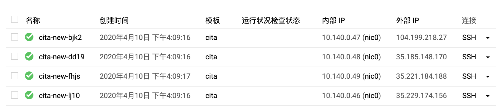

# 标准分链应用迁移 BaaS 方案调研

## 环境说明

本次实验均基于 google cloud platform 进行


## 节点数据打包迁移

### 准备 CITA 链实例组

#### 创建实例模板

首先创建一个实例模板，方便后续进行创建实例的操作，实例模板如下：

```
cita
机器类型
n1-standard-1（1 个 vCPU，3.75 GB 内存）
ubuntu-1804-bionic-v20200317	50GB
```

主要配置是：1 个 vCPU，3.75 GB 内存，50 GB 硬盘，操作系统 ubuntu-1804-bionic-v20200317

#### 创建实例组

然后是使用上面的模板创建一个实例组 cita-base，实例数量是 4 个


### 构建 CITA 链

使用 gcp 的 cloud shell 进入 4 台机器的 shell 环境，在每台机器上执行命令下载安装 cita 的软件包以及 docker

```
sudo su czp
cd ~
wget https://github.com/citahub/cita/releases/download/v0.24.2/cita_sm2_sm3.tar.gz
tar -zxvf cita_sm2_sm3.tar.gz
cd cita_sm2_sm3/
curl -fsSL https://get.docker.com -o get-docker.sh
sudo sh get-docker.sh
sudo usermod -aG docker czp
sudo su czp
```

> czp 是我机器的用户名，可修改为自己的用户名

在第一台机器上执行以下命令，构建链的节点

```
bin/cita create --super_admin "0x141d051b1b1922bf686f5df8aad45cefbcb0b696" --nodes "10.140.0.43:4000,10.140.0.42:4000,10.140.0.45:4000,10.140.0.44:4000"
```

将节点复制到其它3台机器（需要配置ssh秘钥，自行设置不再描述了）

```
scp -r test-chain/ czp@cita-base-f6l3:/home/czp/cita_sm2_sm3/
scp -r test-chain/ czp@cita-base-s46w:/home/czp/cita_sm2_sm3/
scp -r test-chain/ czp@cita-base-xctp:/home/czp/cita_sm2_sm3/
```

然后是，每台机器只保留一个节点，自行删除多余的重复节点即可（test-chain 目录下只保留一个数字开头的节点目录）

最后是在每个机器上依次启动节点

```
# 第1台
./bin/cita setup test-chain/0
./bin/cita start test-chain/0
# 第2台
./bin/cita setup test-chain/1
./bin/cita start test-chain/1
# 第3台
./bin/cita setup test-chain/2
./bin/cita start test-chain/2
# 第4台
./bin/cita setup test-chain/3
./bin/cita start test-chain/3
```

### 验证节点并且构造交易

查看块高，持续增长表示正常

```
curl -X POST --data '{"jsonrpc":"2.0","method":"blockNumber","params":[],"id":83}' 127.0.0.1:1337
```

安装 cita-cli

```
# 安装 cita-cli
wget https://github.com/citahub/cita-cli/releases/download/20.2.0/cita-cli-x86_64-musl-tls-20.2.0.tar.gz
tar -zxvf cita-cli-x86_64-musl-tls-20.2.0.tar.gz
sudo mv cita-cli /usr/local/bin/
```

测试合约

```
pragma solidity ^0.4.24;

contract SimpleStorage {
    uint storedData;
    event Init(address, uint);
    event Set(address, uint);
    event Stored(uint);

    constructor() public {
        storedData = 100;
        emit Init(msg.sender, 100);
    }

    function set(uint x) public {
        emit Stored(x);
        storedData = x;
        emit Set(msg.sender, x);
    }

    function get() public constant returns (uint) {
        return storedData;
    }
}
```

部署合约进行测试

```
# 部署合约
cita-cli rpc sendRawTransaction     --code 0x608060405234801561001057600080fd5b5060df8061001f6000396000f3006080604052600436106049576000357c010
0000000000000000000000000000000000000000000000000000000900463ffffffff16806360fe47b114604e5780636d4ce63c146078575b600080fd5b348015605957600080fd5b50607660048036038101908080359060
20019092919050505060a0565b005b348015608357600080fd5b50608a60aa565b6040518082815260200191505060405180910390f35b8060008190555050565b600080549050905600a165627a7a723058205aed214856a
5c433292a354261c9eb88eed1396c83dabbe105bde142e49838ac0029     --private-key 0x3ef2627393529fed043c7dbfd9358a4ae47a88a59949b07e7631722fd6959002     --algorithm sm2

# 获得合约地址是 0x9fd6e15f2df01991887b3b7b871d8944db9a8d86
# 测试合约 将 x 设置为 9
cita-cli rpc sendRawTransaction \
    --code 0x60fe47b10000000000000000000000000000000000000000000000000000000000000009 \
    --private-key 0x3ef2627393529fed043c7dbfd9358a4ae47a88a59949b07e7631722fd6959002 \
    --address 0x9fd6e15f2df01991887b3b7b871d8944db9a8d86 \
    --algorithm sm2
# 测试合约 获取 x 的值
czp@cita-base-39bt:~/cita_sm2_sm3$ cita-cli rpc call \
>     --to 0x9fd6e15f2df01991887b3b7b871d8944db9a8d86 \
>     --data 0x6d4ce63c \
>     --url http://127.0.0.1:1337
{
  "id": 1,
  "jsonrpc": "2.0",
  "result": "0x0000000000000000000000000000000000000000000000000000000000000009"
}
```

### 构建新的实例组（迁移组）

以上工作完成后，我们已经有一条正在执行的链了，并且其中已经部署了一条我们自己的合约，执行了一次交易。接下来我们需要创建一个迁移组来进行迁移操作

#### 创建实例组

依然使用 cita 模板，创建一个实例组 cita-new



然后每个节点安装 docker

```
sudo su czp
cd ~
curl -fsSL https://get.docker.com -o get-docker.sh
sudo sh get-docker.sh
sudo usermod -aG docker czp
sudo su czp
```


#### 打包 cita-base 的节点数据

以下说的节点，均是 cita-base 的节点

在第一个节点执行

```
bin/cita stop test-chain/0
cd ..
scp -r cita_sm2_sm3 czp@cita-new-bjk2:~/
cd cita_sm2_sm3
bin/cita start test-chain/0
```

在第二个节点执行

```
bin/cita stop test-chain/1
cd ..
scp -r cita_sm2_sm3 czp@cita-new-dd19:~/
cd cita_sm2_sm3
bin/cita start test-chain/1
```

在第三个节点执行

```
bin/cita stop test-chain/2
cd ..
scp -r cita_sm2_sm3 czp@cita-new-fhjs:~/
cd cita_sm2_sm3
bin/cita start test-chain/2
```

在第四个节点执行

```
bin/cita stop test-chain/3
cd ..
scp -r cita_sm2_sm3 czp@cita-new-lj10:~/
cd cita_sm2_sm3
bin/cita start test-chain/3
```

#### 修改 cita-new 的节点配置并启动链

以下说的节点均是 cita-new 的节点

在第一个节点执行

```
cd cita_sm2_sm3
sed -i "s/10.140.0.43/10.140.0.47/g"  test-chain/0/network.toml
sed -i "s/10.140.0.42/10.140.0.48/g"  test-chain/0/network.toml
sed -i "s/10.140.0.45/10.140.0.49/g"  test-chain/0/network.toml
sed -i "s/10.140.0.44/10.140.0.46/g"  test-chain/0/network.toml
bin/cita setup test-chain/0
bin/cita start test-chain/0
```

在第二个节点执行

```
cd cita_sm2_sm3
sed -i "s/10.140.0.43/10.140.0.47/g"  test-chain/1/network.toml
sed -i "s/10.140.0.42/10.140.0.48/g"  test-chain/1/network.toml
sed -i "s/10.140.0.45/10.140.0.49/g"  test-chain/1/network.toml
sed -i "s/10.140.0.44/10.140.0.46/g"  test-chain/1/network.toml
bin/cita setup test-chain/1
bin/cita start test-chain/1
```

在第三个节点执行

```
cd cita_sm2_sm3
sed -i "s/10.140.0.43/10.140.0.47/g"  test-chain/2/network.toml
sed -i "s/10.140.0.42/10.140.0.48/g"  test-chain/2/network.toml
sed -i "s/10.140.0.45/10.140.0.49/g"  test-chain/2/network.toml
sed -i "s/10.140.0.44/10.140.0.46/g"  test-chain/2/network.toml
bin/cita setup test-chain/2
bin/cita start test-chain/2
```

在第四个节点执行

```
cd cita_sm2_sm3
sed -i "s/10.140.0.43/10.140.0.47/g"  test-chain/3/network.toml
sed -i "s/10.140.0.42/10.140.0.48/g"  test-chain/3/network.toml
sed -i "s/10.140.0.45/10.140.0.49/g"  test-chain/3/network.toml
sed -i "s/10.140.0.44/10.140.0.46/g"  test-chain/3/network.toml
bin/cita setup test-chain/3
bin/cita start test-chain/3
```

#### 验证链的执行

在各个节点，使用下面命令查看块高，等待他们同步并且进行共识

```
curl -X POST --data '{"jsonrpc":"2.0","method":"blockNumber","params":[],"id":83}' 127.0.0.1:1337
```

等待同步完成后，验证我们之前部署的合约

```
czp@cita-new-bjk2:~/cita_sm2_sm3$ cita-cli rpc call \
>     --to 0x9fd6e15f2df01991887b3b7b871d8944db9a8d86 \
>     --data 0x6d4ce63c \
>     --url http://127.0.0.1:1337
{
  "id": 1,
  "jsonrpc": "2.0",
  "result": "0x0000000000000000000000000000000000000000000000000000000000000009"
}
```

可以看出，我们之前的合约数据是存在的，此时进行验证两条链是不同的链，分别在 cita-base 和 cita-new 执行一次合约调用。

在  cita-base 执行

```
cita-cli rpc sendRawTransaction \
    --code 0x60fe47b10000000000000000000000000000000000000000000000000000000000000339 \
    --private-key 0x3ef2627393529fed043c7dbfd9358a4ae47a88a59949b07e7631722fd6959002 \
    --address 0x9fd6e15f2df01991887b3b7b871d8944db9a8d86 \
    --algorithm sm2
```

> 将合约里的值设置为 339

等待几秒后执行下面命令查看，发现已经更新成 339 了

```
cita-cli rpc call \
    --to 0x9fd6e15f2df01991887b3b7b871d8944db9a8d86 \
    --data 0x6d4ce63c \
    --url http://127.0.0.1:1337
```


此时进入 cita-new 执行，发现依然是 9，证明该交易并未在 cita-new 执行

```
cita-cli rpc call \
    --to 0x9fd6e15f2df01991887b3b7b871d8944db9a8d86 \
    --data 0x6d4ce63c \
    --url http://127.0.0.1:1337
```

继续在 cita-new 执行，将合约的值设置为 100

```
cita-cli rpc sendRawTransaction \
    --code 0x60fe47b10000000000000000000000000000000000000000000000000000000000000100 \
    --private-key 0x3ef2627393529fed043c7dbfd9358a4ae47a88a59949b07e7631722fd6959002 \
    --address 0x9fd6e15f2df01991887b3b7b871d8944db9a8d86 \
    --algorithm sm2
```

等待几秒后，发现 cita-new 的值已经是 100，cita-base 的值不变

**此时已经证明：两条链已经不是同一条链了，已经成功的进行了链的迁移**

## 节点数据同步然后分叉

