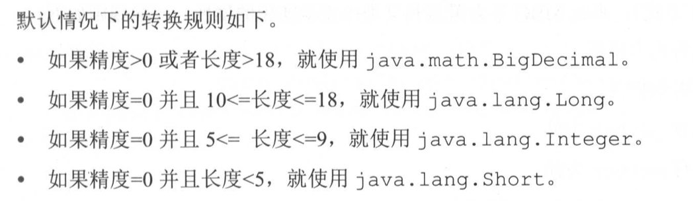

## 作用

MBG 的作用就是根据我们的表定义，帮助我们自动生成 Dao、Entity、Mapper 这些文件。简化开发


## 使用的一般步骤

1. 定义数据表
2. POM 引入 mybatis generator
3. 配置说要生成 Dao、Entity、Mapper 这些文件的表
4. 生成这些表的这些映射文件


## POM 引入

在 `plugins` 下面添加 `plugin` 节点

```xml
<plugin>
  <groupId>org.mybatis.generator</groupId>
  <artifactId>mybatis-generator-maven-plugin</artifactId>
  <version>1.3.2</version>
  <configuration>
    <configurationFile>${basedir}/src/main/resources/mybatis/generator.xml</configurationFile>
    <verbose>true</verbose>
    <overwrite>true</overwrite>
  </configuration>
</plugin>
```

> configurationFile 定义了配置文件的路径


## 配置 generator.xml

简单示例

```xml
<?xml version="1.0" encoding="UTF-8"?>
<!DOCTYPE generatorConfiguration
    PUBLIC "-//mybatis.org//DTD MyBatis Generator Configuration 1.0//EN" "http://mybatis.org/dtd/mybatis-generator-config_1_0.dtd">
<generatorConfiguration>
	<!--导入属性配置 这里的属性配置是相对于资源目录的-->
	<properties resource="datasource.properties"></properties>

	<!--指定特定数据库的jdbc驱动jar包的位置，这里的是本地的绝对路径，或者是相对于当前项目根目录的相对路径（执行的时候在根路径执行，所以是相对于工作目录也就是项目根路径而言的）-->
	<classPathEntry location="${db.driverLocation}"/>

	<context id="default" targetRuntime="MyBatis3">

    	<!-- optional，旨在创建class时，对注释进行控制 -->
    	<commentGenerator>
        	<property name="suppressDate" value="true"/>
        	<property name="suppressAllComments" value="true"/>
    	</commentGenerator>

    	<!--jdbc的数据库连接 -->
    	<jdbcConnection
            driverClass="${db.driverClassName}"
            connectionURL="${db.url}"
            userId="${db.username}"
            password="${db.password}">
    	</jdbcConnection>


    	<!-- 非必需，类型处理器，在数据库类型和java类型之间的转换控制-->
    	<javaTypeResolver>
        	<property name="forceBigDecimals" value="false"/>
    	</javaTypeResolver>


    	<!-- Model模型生成器,用来生成含有主键key的类，记录类 以及查询Example类
        	targetPackage     指定生成的model生成所在的包名
        	targetProject     指定在该项目下所在的路径
    	-->
    	<!--<javaModelGenerator targetPackage="com.mmall.pojo" targetProject=".\src\main\java">-->
    	<javaModelGenerator targetPackage="com.mmall.pojo" targetProject="./src/main/java">
        	<!-- 是否允许子包，即targetPackage.schemaName.tableName -->
        	<property name="enableSubPackages" value="false"/>
        	<!-- 是否对model添加 构造函数 -->
        	<property name="constructorBased" value="true"/>
        	<!-- 是否对类CHAR类型的列的数据进行trim操作 -->
        	<property name="trimStrings" value="true"/>
        	<!-- 建立的Model对象是否 不可改变  即生成的Model对象不会有 setter方法，只有构造方法 -->
        	<property name="immutable" value="false"/>
    	</javaModelGenerator>

    	<!--mapper映射文件生成所在的目录 为每一个数据库的表生成对应的SqlMap文件 -->
    	<!--<sqlMapGenerator targetPackage="mappers" targetProject=".\src\main\resources">-->
    	<sqlMapGenerator targetPackage="mappers" targetProject="./src/main/resources">
        	<property name="enableSubPackages" value="false"/>
    	</sqlMapGenerator>

    	<!-- 客户端代码，生成易于使用的针对Model对象和XML配置文件 的代码
            type="ANNOTATEDMAPPER",生成Java Model 和基于注解的Mapper对象
            type="MIXEDMAPPER",生成基于注解的Java Model 和相应的Mapper对象
            type="XMLMAPPER",生成SQLMap XML文件和独立的Mapper接口
    	-->

    	<!-- targetPackage：mapper接口dao生成的位置 -->
    	<!--<javaClientGenerator type="XMLMAPPER" targetPackage="com.mmall.dao" targetProject=".\src\main\java">-->
    	<javaClientGenerator type="XMLMAPPER" targetPackage="com.mmall.dao" targetProject="./src/main/java">
        	<!-- enableSubPackages:是否让schema作为包的后缀 -->
        	<property name="enableSubPackages" value="false" />
    	</javaClientGenerator>


    	<table tableName="mmall_shipping" domainObjectName="Shipping" enableCountByExample="false" enableUpdateByExample="false" enableDeleteByExample="false" enableSelectByExample="false" selectByExampleQueryId="false"></table>
    	<table tableName="mmall_cart" domainObjectName="Cart" enableCountByExample="false" enableUpdateByExample="false" enableDeleteByExample="false" enableSelectByExample="false" selectByExampleQueryId="false"></table>
    	<table tableName="mmall_cart_item" domainObjectName="CartItem" enableCountByExample="false" enableUpdateByExample="false" enableDeleteByExample="false" enableSelectByExample="false" selectByExampleQueryId="false"></table>
    	<table tableName="mmall_category" domainObjectName="Category" enableCountByExample="false" enableUpdateByExample="false" enableDeleteByExample="false" enableSelectByExample="false" selectByExampleQueryId="false"></table>
    	<table tableName="mmall_order" domainObjectName="Order" enableCountByExample="false" enableUpdateByExample="false" enableDeleteByExample="false" enableSelectByExample="false" selectByExampleQueryId="false"></table>
    	<table tableName="mmall_order_item" domainObjectName="OrderItem" enableCountByExample="false" enableUpdateByExample="false" enableDeleteByExample="false" enableSelectByExample="false" selectByExampleQueryId="false"></table>
        <table tableName="mmall_pay_info" domainObjectName="PayInfo" enableCountByExample="false" enableUpdateByExample="false" enableDeleteByExample="false" enableSelectByExample="false" selectByExampleQueryId="false"></table>
    	<table tableName="mmall_product" domainObjectName="Product" enableCountByExample="false" enableUpdateByExample="false" enableDeleteByExample="false" enableSelectByExample="false" selectByExampleQueryId="false">
        	<columnOverride column="detail" jdbcType="VARCHAR" />
        	<columnOverride column="sub_images" jdbcType="VARCHAR" />
    	</table>
    	<table tableName="mmall_user" domainObjectName="User" enableCountByExample="false" enableUpdateByExample="false" enableDeleteByExample="false" enableSelectByExample="false" selectByExampleQueryId="false"></table>


    	<!-- geelynote mybatis插件的搭建 -->
	</context>
</generatorConfiguration>
```

有 3 个必备元素，分别是 properties、classPathEntry、context

### properties

示例：`<properties resource="datasource.properties"></properties>`

- 用来配置外部的属性文件，最多可以配置一个，也可以不配置
- 引入属性文件后，可以在本 generator.xml 中，使用 `${name}` 的方式引用属性文件里的属性
- 这个标签包含有 resource 和 url 两个属性，只能使用其中的一个来指定属性文件，同时指定会报错
  - resource：指定 classpath 下的属性文件，例如我们在 spring boot 直接写 `datasource.properties` 表示引用的是，resources 下的这个文件
  - url：指定文件系统的绝对路径，用的少

### classPathEntry

示例：`<classPathEntry location="${db.driverLocation}"/>`

- 可以指定多个，也可以不指定
- 常规的用法是引入 JDBC 的驱动包
- location 如果是相对路径，是相对于项目根路径来说的（pom 文件所在的路径），其实就是工作目录

### context

- 用于指定生成一组对象的环境，例如要连接的数据库、要生产的对象的类型、要处理的数据库中的表。我们运行 MBG 的时候可以单独指定某些 context（只对某些表生成代码）
- 至少配置一个，可以配置多个

它包含有以下的属性

- id：必选，用来唯一确定该标签，于是我们运行 MBG 的时候可以根据 ID 单独指定某些 context
- defaultModelType：定义了 MBG 如何生成实体类。有以下可选值
  - conditional：**默认值**，如果一个表的主键只有一个字段，那么不会为这个字段生成单独实体类，会合并到基本实体类
  - flat：只为每张表生成一个实体类，包含所有字段，这个最推荐使用
  - hierarchical：如果表有主键，会为主键单独生成一个实体类，如果有 BLOB 字段，会将所有 BLOB 字段生成一个实体类，为其它字段生成另一个实体类，它会维护好这些关系（太复杂了，别用）
- targetRuntime：用于指定生成代码的运行时环境，支持以下值
  - MyBatis3：默认值
  - MyBatis3Simple：这种情况不会生成与 Example 相关的方法 
- introspectedColumnImpl：该参数可以指定扩展 org.mybatis.generator.api.IntrospectedColumn 类的实现类

一般情况使用如下配置即可

`<context id="mysql" defaultModelType="flat">`

如果不希望生成和 Example 查询有关的内容，使用如下配置

`<context id="mysql" targetRuntime="MyBatis3Simple" defaultModelType="flat">`

#### 子标签

context 有很多子标签，用来定义生成代码的具体行为。

- commentGenerator：用来配置如何生成注释，一般情况下，MBG 生成的注释没什么价值，所以就别要注释了

  ```xml
  <commentGenerator>
    <property name="suppressDate" value="true"></property>
    <property name="addRemarkComments" value="true"></property>
  </commentGenerator>
  ```
  - suppressDate：生成的注释不要时间戳（时间戳没卵用）
  - addRemarkComments：添加数据库表的注释信息（数据库表本身是有注释的）（大多数的 JDBC 驱动并不支持， 常用数据库中 MySQL 支持， SQLServer 不支持。Oracle 特殊配置后可以支持）
  - suppressAllComments：阻止所有注释（默认 false）

- jdbcConnection：用于指定要连接的数据库的信息，必填且只有一个。它有以下属性

  - driverClass：必填，访问数据库的 JDBC 的完全限定类名
  - connectionURL：必填，访问数据库的 URL 连接
  - userId：可选，数据库用户名
  - password：可选，数据库密码

  此外，它还可以添加很多 `property` 标签，这里的 property 会添加到 JDBC 驱动的属性中（JDBC 驱动的 connect 方法中，会传入很多的属性，我们配置在这里的 property 标签就会将属性传入到 connect 方法里去）。

  一般配置如下：

  ```xml
  <jdbcConnection driverClass="com.mysql.jdbc.driver"
                  connectionURL="jdbc:mysql://localhost:3306/orcl"
                  userId="czphg1"
                  password="123456">
  </jdbcConnection>
  ```

- javaTypeResolver：用来指定数据库类型和 JAVA 类型的对应关系，最多可以配置一个

  

  如果将 forceBigDecimals 设置为 true，则一定会使用 BigDecimal，默认是 false

  ```xml
  <javaTypeResolver>
    <property name="forceBigDecimals" value="false"></property>
  </javaTypeResolver>
  ```

- javaModelGenerator：控制生成的实体类，比如实体类的路径，有以下属性

  - targetPackage：必选，生成实体类的包名
  - targetProject：必选，生成实体类的起始路径

  还支持以下几个子 property 标签

  - constructorBased：只在 Mybatis3 生效。如果为 true，则实体类使用构造方法来构建，false 的话使用 setter 构建。默认是 false

  - enableSubPackages：如果为 true，则最终的包名是 catalog 和 schema 的组合，如果是 false 则直接使用 targetPackage，默认是 false

  - immutable：是否设置成不可变类，默认是 false

  - trimStrings：是否对数据库的查询结果进行 trim 处理，默认是 false（设置成 true 比较好），如果是 true 就会变成如下代码

    ```java
    public void setUserName(String userName){
      this.userName = userName == null ? null : userName.trim();
    }
    ```

  一般配置如下

  ```xml
  <javaModelGenerator targetPackage="test.model" targetProject="src/main/java">
    <property name="enableSubPackages" value="false" />
    <property name="trimStrings" value="true" />
  </javaModelGenerator>
  ```

- sqlMapGenerator：用来配置 mapper 文件的属性，可选，最多一个。