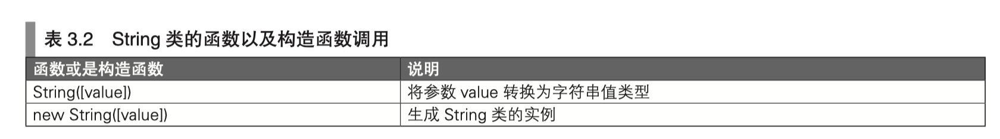
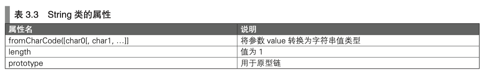
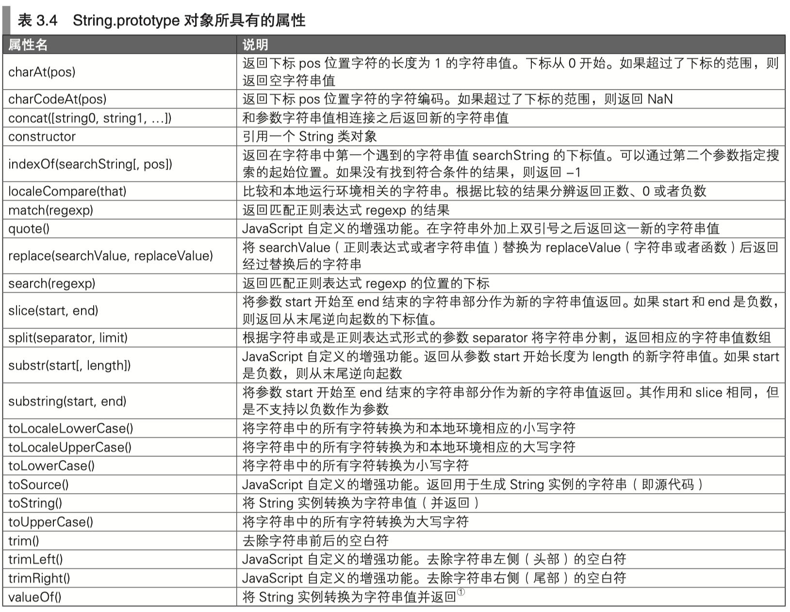
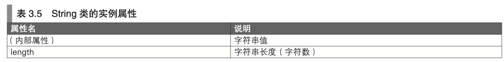
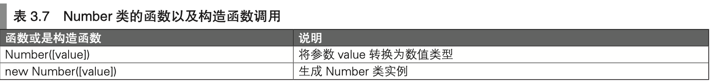
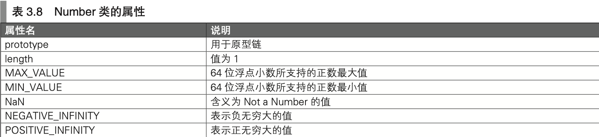
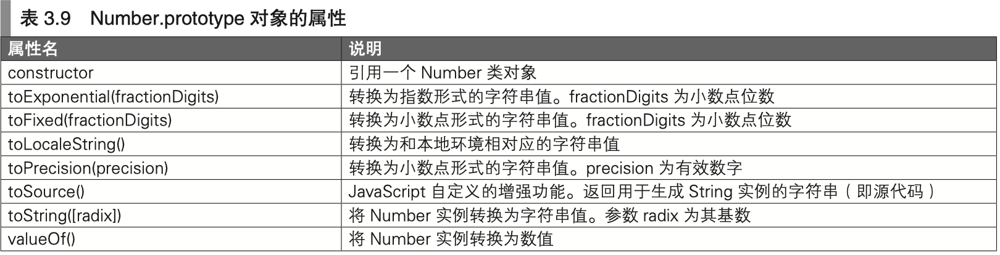

本文主要是 JS 的学习笔记，主要书籍是《JavaScript 编程全解》。内容主要是 ES 5 的标准，ES 6 的标准学习会在另外的文章中单独记录。


## 语法基础（ES 5）

- 变量没有类型（指的是 `var a = 123;` 中的 `a`，后续我们可以把任何内容再次赋值给它，比如 `a = "str123"`，一般也不建议这样做）

- 被声明但未进行赋值的变量，其值为 `undefined`，读取这种变量的时候不会引起运行时错误（实际上这种特性是错误之源），例如：

  ```javascript
  var foo;
  console.log(foo);
  // 将输出 underfined
  ```

  如果读取没有被声明的变量，就会引发 `ReferenceError` 异常，例如

  ```javascript
  console.log(fooo);
  // 将会输出 ReferenceError: fooo is not defined
  // 但是 typeof fooo 会返回 undefined，这是未声明变量唯一可以进行的操作
  ```

- 不通过 `var` 而直接使用变量名进行声明的变量，都是（隐式）全局变量（函数外部通过 `var` 声明的也是全局变量，需要尽量避免全局变量，特别是不通过 `var` 创建的隐式全局变量），例如：

  ```javascript
  foo = 3;
  console.log(foo);
  // foo 将是一个全局变量，在其他作用域也可以访问
  ```

- 匿名函数表达式返回的是一个 `Function` 对象的引用，我们可以用一个变量来接收这个引用，然后将这个变量名当做函数名来使用。例如：

  ```javascript
  var sum2 = function (a, b) {
      return Number(a) + Number(b)
  }
  var result = sum2(3,5);
  console.log(result);
  // 将会输出 8
  ```

- 函数就是一种对象，对象是没有名称的，所以上面我们将这个对象赋值给了变量，函数就具有了名称。如果是通过普通的函数声明，目前也可以当成这 2 个步骤：1.生成无名 `Function` 对象。2.赋值给`函数名称`这个变量

- JS 的对象可以当成属性的集合，类似于 Java 里的 Map 结构。但是具有 Map 所没有的性质：

  - JS 的属性值可以是函数
  - JS 具有原型链，可以实现类似于类的继承的能力

- 对象字面量中，属性名可以加引号也可以不加引号，如果不加引号的名称不是合法的标识符，那么就必须加引号，而且必须使用 `obj["属性名"]` 的方式进行访问，例如：

  ```js
  var obj = { "0a": 3 }
  console.log(obj["0a"]);
  // 不能使用 obj.0a 或者 obj."0a"
  ```

- ES 5 之后，对象字面量最后可以以逗号结尾。（也就是说除非为了兼容很老的版本了，否则这么做是完全没问题的，毕竟 ES 5 早都支持了）

- 对象字面量返回的是一个引用值，就像咱们 Java 里声明了一个字符串，这个字符串返回的是引用一样

- 属性访问分为 (.)点号，和方括号 [] 两种方式，前面已经说过。

- 如果给一个对象赋值了不存在的属性，那么就会新建该属性，例如：

  ```javascript
  var obj = { name: 'czp' };
  obj.age = 25; // 新建了属性 age = 25
  obj['0 weight'] = '60 kg'; // 新建了属性 '0 weight'，不是合法标识符，只能方括号访问
  console.log(obj.age);
  console.log(obj['0 weight']);
  // 将会输出 
  // 25
  // 60 kg
  ```

- `new` 关键字后面跟着的是函数名（不是类名），相当于把该函数当做构造函数调用了一遍。（这条是 ES 5 以及之前的特性，ES 6 开始就真的有了类的概念，另外的文章单独再提），例如：

  ```javascript
  function user(){
      this.a = 1;
      this.b = 2;
  }
  var c = new user(); // 调用了 user 方法，并且返回了对象引用
  console.log(c.a); // 将会输出 1
  ```


## 数据类型（ES 5）

5 种基本类型（实例称为“值”）：

- **字符串型**
- 数值型
- 布尔型
- null 型
- undefined 型

Object 类型（实例称为“对象”）：

- 除了上面 5 种之外的类型

> 重点关注：
>
> 字符串型（string）是基本类型，在使用时经常会被隐式转换成字符串对象类型（String），也就是说字符串型（string）返回的不是引用，不会存在浅拷贝的问题
>
> 
>
> 数值类型（number），是 JS 中 唯一的数据类型，就是一个 64 位的浮点数，也能够与其它类型进行转换，后续会说明
>
> 
>
> 布尔型（bool），取值空间只有 true 和 false
>
> 
>
> null 型，只有一个取值空间，就是 null。 但是 `typeof null` 会返回 `object`，这是 JS 第一个版本的解释器的一个 bug，而且无法修复，会影响后续实现，所以就一直是这样了
>
> 
>
> undefined 是指未初始化的值的类型，取值空间也只有一个，就是 undefined，当我们声明一个变量而不赋值的话，默认它的值就是 undefined，类型也就是 undefined。
>
> 注意如果我们直接使用一个未经声明的变量，会抛出`ReferenceError`，未经声明的变量只能执行 1 个操作，就是 `typeof xxx`，并且它会返回 `undefined`（记住这些结论就行）


## String 类型

JS 中存在 string 到 String 的隐式类型转换，例如：

```javascript
var s = "012";
console.log(s.length); // 这里的 length 属性就是转换到 String 后获取的，这种转换是语言内置的
// 将会输出 3
```

String 也可以反向转换成 string，例如：

```javascript
var sobj = new String('abc'); // 生成字符串对象
var s = sobj + 'def'; // 将字符串对象隐式转换为了字符串值
```

一般来说 2 者混用没有区别，但是在比较相等性上有一些细微的差别，例如：

```javascript
var sobj1 = new String('abc');
var sobj2 = new String('abc');
console.log(sobj1 == sobj2); // false 2者不是同一个 String 对象的引用
console.log(sobj1 === sobj2); // false 理由同上
console.log(sobj1 + '' == sobj2 + ''); // true 2者都是 string，且内容相同
console.log(sobj1 + '' === sobj2 + ''); // true 2者都是 string，且内容相同
var sobj = new String('abc'); 
var s = 'abc';
console.log(sobj == s); // true 2者转换后的值相等
console.log(sobj === s); // false 2者类型不等

var sobj = new String('abc');
console.log(typeof sobj); // object
console.log(typeof 'sobj') // string
```

一般，咱们就不要使用 `new String` 这种方式了，都用字符串的字面量就完事儿了。


### `String()` 和 `new String()` 的区别

- `String()` 实际上底层是调用了 `toString()`方法，是将一个变量转换成 string 值，也就是说 

  ```javascript
  var s = String('abc')
  var s2 = 'abc'
  ```

  s 和 s2 是一毛钱的区别都没有的，完全一样。

- `new String()` 是生成了一个 `String 对象`


### String 类的功能

String 类的对象也是不可变的，它具有以下功能。










## 数值类型（number）

`Javascript` 中的数值型（number），既可以表示整数，也可以表示小数，内部结构实质上是个64位的浮点数。从代码的角度看，只要是**写为整数就能够当整数使用**。


## 数值类（Number 类）

`Number 与 number` 的关系，和 `String 与 string` 的关系类似，也是有转换关系。参考上面 String 类型的相关内容就能分析出来 `Number` 的一些特性，例如：

```javascript
var a = Number(3); // 将 3 显式转换成 number，注意这里是转换成 number 而不是 Number
var b = new Number(3); // 生成一个 Number 对象
console.log(typeof a); // 将会输出 number
console.log(typeof b); // 将会输出 object
```


如果无法转换成数值类型，`Number` 函数将会返回 `NaN`，使用 `new` 运算符构造 `Number` 对象的时候也会如此，例如：

```javascript
var a = Number('x');
console.log(a); // NaN
console.log(typeof a); // number

var b = new Number('x');
console.log(b); // [Number: NaN]
console.log(typeof b); // object
```


### Number 类的功能







