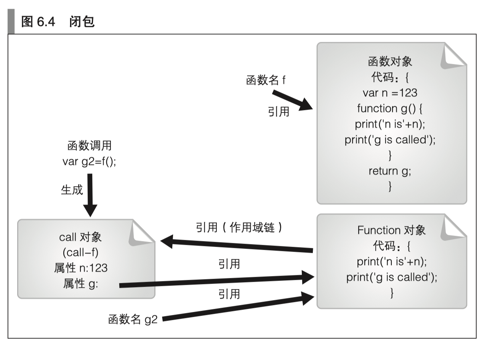

本文记录一些 JS 中关于函数的内容


## 声明语句与匿名表达式

函数可以通过声明语句和匿名函数表达式来进行声明，通过函数声明语句声明的函数在声明之前就可以调用。

声明语句：我们可以在函数具体的声明之前就调用该函数

```javascript
aa();
function aa(){
    console.log('aaa');
}
```

匿名表达式：我们使用匿名函数表达式，将无法提前调用该函数，下面的例子将会报错

```javascript
aa();
var aa = function () {
    console.log('aaa');
}
```


## arguments 对象

可以通过在函数内使用 arguments 对象来访问实参，例如：

```javascript
var aa = function (a, b, c) {
    console.log(arguments);
    console.log(a);
    console.log(b);
    console.log(c);
    arguments[2] = 8; // c 被重新赋值为 8 
    console.log(c);
}
aa(1, 2, 3, 4, 5);
```

输出如下：

```javascript
(py3.5) czp@:~/workspace/knowledge-base/demos/node_start$ node hello.js
[Arguments] { '0': 1, '1': 2, '2': 3, '3': 4, '4': 5 }
1
2
3
8
```

没有对应的形参的实参也可以通过 arguments 访问（上例中的 4 和 5），由于能够通过 arguments.length 获知实参的数量， 因此可以写出所谓的可变长参数函数。

而形参的数量可以通过 `fn.length` 获取，也就是上例中的 `aa.length`

> 注：虽然 arguments 可以使用数组的方式来进行赋值和访问，但是它实际不是数组对象，不具有数组对象的一些方法。


### arguments.length

函数的实际参数的数量，例如上例中的 `aa(1,2,3,4,5)` ，虽然函数定义只接受 3 个参数，但是实际上接受了 5 个参数，实际参数个数是 `arguments.length == 5`，且每个实际参数都可以通过 `arguments[i]` 来访问


### arguments.callee

该对象返回的是当前正在执行的函数对象的引用。这一引用可以在通过没有名字的函数（所谓的匿名函数）来实现递归函数时使用。这个属性不推荐使用，了解即可


## 作用域

JavaScript 中只有 2 种作用域（ES 6 之前）：

- 全局作用域
- 函数作用域

全局作用域是函数之外的作用域（也就是最外层的代码），在函数之外进行声明的名称属于全局作用域。这些名称就是所谓的全局变量以及全局函数。

在函数内进行声明的名称拥有的是函数作用域，它们仅在该函数内部才有效。作为函数形参的参数变量也属于函数作用域。


### 变量提升

在 JavaScript 中，我们使用 `var x = 3` 这种 `var` 声明的变量，具有变量提升的规则，将会导致一些比较不太容易察觉的问题：

```javascript
var x = 1;
function f(){
    console.log('x = ' + x);
    var x = 2;
    console.log('x = ' + x);
}
f();
```

表面上看，上面的例子将会打印 1 和 2。因为第一次打印时，访问的 x 是外部的 x，第二次打印时访问的 x 是内部的 x = 2。但实际上不是这样的：

```javascript
(py3.5) czp@:~/workspace/knowledge-base/demos/node_start$ node hello.js
x = undefined
x = 2
```

导致这种结果的原因是 JavaScript 的变量提升，我们上述例子的代码，实际等同于下面的代码：

```javascript
var x = 1;
function f(){
    var x; // 变量提升
    console.log('x = ' + x);
    var x = 2;
    console.log('x = ' + x);
}
f();
```

所以第一次打印的将会是 undefined 。

这种变量提升经常导致一些奇诡的问题，想要避免的话可以把变量声明放在函数最前面，或者使用 ES 6 的声明方式（后续 ES 6 系列会讲）

### 不存在块级作用域

```javascript
for (var i = 0; i < 10; i++) {
    ;
}
console.log(i);
```

上述例子，将会输出 i 在循环结束后的终值：10

这充分说明，JavaScript 中不存在块级别的作用域。（ES 6 中有）

### 嵌套函数与作用域

在 JavaScript 中我们可以对函数进行嵌套声明。也就是说，可以在一个函数中声明另一个函数。这 时，可以在内部的函数中访问其外部函数的作用域。从形式上来说，变量的查找是从内向外的，直到找到全局作用域：

```javascript
function f(){
    var s = 3;
    function x(){
        console.log(s);
    }
    x();
}
f();
```

将会输出：3

函数查找不到的变量，就在函数的外层函数去查找、再外层、更外层，直到全局作用域

### 变量遮蔽

我们可以使用作用域较小的变量，来遮蔽作用域较大的变量，实际上之前的变量提升的说明里，就出现了这种现象。

```javascript
function f(){
    var s = 3;
    function x(){
        var s = 5;
        console.log(s);
    }
    x();
    console.log(s);
}
f();
```

将会输出：5 和 3

在 x 函数内部，使用作用域较小的 s，遮蔽了外部 f 函数里的 s

当 x 函数结束后，再次访问 s 时，访问的是外部 f 函数里的 s


## Function 类

一个函数就是一个 Function 类的对象，也就是说函数对象的 `__proto__` 属性就是 `Function.prototype` 属性

### Function.length

值永远为1

### Function.prototype

| 属性名                          | 说明                                                         |
| ------------------------------- | ------------------------------------------------------------ |
| apply(thisArg, argArray)        | 将 argArray 的所有元素作为参数对函数调用。函数内的 this 引用引用的是 thisArg 对象 |
| bind(thisArg[,arg0,arg1,...])   | 返回一个新的 Function 对象。调用此函数时，arg0、arg1 等是实参，函数内的 this 引用引用 的是 thisArg 对象 |
| call(thisArg[, arg0, arg1,...]) | 将 arg0、arg1 等作为实参对函数调用。函数内的 this 引用引用的是 thisArg 对象 |
| caller                          | JavaScript 自带的增强功能。表示的是对当前函数调用的函数      |
| constructor                     | 对 Function 类对象的引用                                     |
| isGenerator()                   | JavaScript 自带的增强功能。当函数是 generator 时，返回 true  |
| length                          | 函数的形参的数量                                             |
| name                            | JavaScript 自带的增强功能。函数的表示名称                    |
| toSource()                      | JavaScript 自带的增强功能。求值结果将返回用于函数进行生成的字符串 |
| toString()                      | 将函数体转换为字符串形式并返回                               |


## 闭包

闭包是指有权访问另一个函数作用域中的变量的函数。创建闭包的常见方式，就是在一个函数内部创建另一个函数

```javascript
function f() {
    var count = 0
    return function () {
        console.log(count++);
    }
}
var fn = f();
fn();
fn();
fn();
```

以上示例中，f 函数内部的匿名函数就是一个闭包，这个匿名函数中的 count 就是 f 内部的 count 变量

以上示例将会输出：0 1 2

可以这样理解：闭包是一种有状态的函数，闭包的局部变量在函数调用结束后依然存在。


### 闭包的原理

首先明确以下几条：

- 函数在被调用时将会隐式地生成一个 Call 对象，函数内部定义的局部变量就是这个 Call 对象的属性。一般来说，当我们执行完一个函数后，这个 Call 对象就会被销毁。（可以将 Call 对象理解为一个栈帧）
- 当我们在函数中返回一个嵌套的内层函数，这个内层函数引用了外层函数的属性时，由于内层函数被返回后，被其它变量进行了引用，因此内层函数对象会常驻内层，并且这个内层函数引用了它的外层函数的属性，导致外层函数 Call 对象的属性不会被内存回收，于是出现了闭包的现象。



> 总而言之：内层函数引用了外层函数的属性，导致外层 Call 对象无法被内存回收

从描述的原理中还可以看出：由于每次函数调用生成的都是不同的 Call 对象，因此返回的闭包也是不同的，例如下面的例子：

```javascript
function f() {
    var count = 0
    return function () {
        console.log(count++);
    }
}
var f1 = f();
var f2 = f();
f1();
f1();
f1();
f2();
f2();
```

输出如下：

```javascript
(py3.5) czp@:~/workspace/knowledge-base/demos/node_start$ node hello.js
0
1
2
0
1
```

原因：

- f1 所引用的 Call 对象是在第一次调用时生成的
- f2 所引用的 Call 对象是在第二次调用时生成的
- 两个 Call 对象是独立的，因此里面的属性 count 也是独立的


### 闭包与执行环境

闭包指的是一 种特殊的函数，这种函数会在被调用时保持当时的变量名查找的执行环境。

从前面的示例中可以看出，闭包其实就是一个函数对象，这个函数对象引用的外部执行环境和它一起被保存了下来。

可以这样理解：

- 外部函数 f 调用时产生的 Call-f 对象有个属性 x
- 内层函数 g 引用了这个 x
- 当调用外部函数 f 返回了函数 g 并且被赋值为变量 g1 的时候，Call-f 对象的 x 属性没有被垃圾回收，假设 x 属性的内存地址是 Call-f-x ，那么其实此时 g1 函数内部引用的 x 就是 Call-f-x


### 一个函数返回两个闭包

```javascript
function f(arg) {
    function f1() {
        console.log(arg);
    }
    arg++;
    function f2() {
        console.log(arg);
    }
    return [f1, f2];
}
var funcs = f(3);
funcs[0]();
funcs[1]();
funcs[0]();
funcs[1]();
```

输出如下：

```javas
(py3.5) czp@:~/workspace/knowledge-base/demos/node_start$ node hello.js
4
4
4
4
```

可以这样理解：

- 外部函数 f 调用时产生的 Call-f 对象有个属性 arg
- 内层函数 f1 引用了这个 arg
- 内层函数 f2 引用了这个 arg
- 当调用外部函数 f 返回了函数数组 `[f1,f2]` 并且被赋值为变量 `funcs` 的时候，Call-f 对象的 arg 属性没有被垃圾回收，假设 arg 属性的内存地址是 Call-f-arg ，那么其实此时 `funcs[0]` 函数内部引用的 arg 就是 Call-f-arg，此时 `funcs[1]` 函数内部引用的 arg 也是 Call-f-arg
- 所以两个函数内部引用的都是同一个内存地址，并且这个内存地址的值在经过了 f 调用之后，已经是 4 了
- 所以会出现上面的结果，两个函数都输出 4，而不是直觉的 3 和 4

> 注：这里可以看出，我们把闭包内的引用当成内存地址是最合适的
>
> 如果我们调用两次 f，就会产生两个 Call-f 对象，返回两个闭包。那么这两个闭包内引用的就是两个不同的 Call-f-arg，就不会输出同一个值。
>
> 由此可以看出，闭包内就是 Call 对象的执行环境


