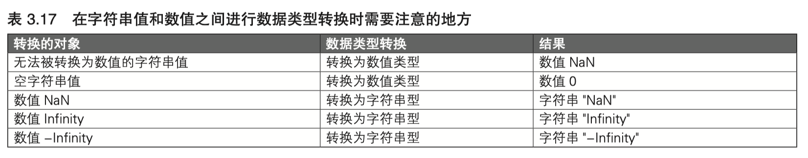

本文主要是记录 `Javascript` 中关于类型转换的一些内容。


## `string` 与 `number` 转换

- `Number` 将字符串转数字的时候，遇到非数字的情况，会返回 `NaN`，例如：

  ```javascript
  var a = Number('100x') -1;
  console.log(a); // NaN，100x 无法转换成数字
  ```

- `parseInt` 和 `parseFloat` 会忽略数字以外的字符，并且第二个参数视为基数，例如：

  ```javascript
  var a = parseInt('100x') -1;
  console.log(a); // 99, 这里忽略了 100x 后面的字母
  var b = parseInt('x100') -1;
  console.log(b); // NaN, 字母在前面的话也视为 NaN
  var c = parseInt('17',2);
  console.log(c); // 输出 1，因为 17 中的 7 在二进制中是不存在的，所以会被忽略掉，解析为 1
  var d = parseInt('17',16);
  console.log(d); // 输出 23，因为 17 按照16进制解析后是：16 * 1 + 7 = 23
  ```

### 隐式转换

只要在数值运算操作数的位置上书写字符串值，该值就将被隐式地转换为数值类型，例如：

```javascript
console.log('100'-1); // 99
console.log('100' - '1'); // 99
console.log('100' - ''); // 100
```

如果是加法运算，操作数上有字符串的话，那么就会转换成字符串之间的连接操作，例如：

```javascript
console.log('100' + 1); // 1001
console.log(1 + '100'); // 1100
console.log('100' - ''); // 100
```

`+` 作为单目运算符的时候，作为正号计算，将操作数转换成数值类型，例如：

```javascript
console.log(typeof +'100'); // number
console.log(+'100'); // 100
console.log(typeof +{}); // number
console.log(+{}); // NaN
```


## `string` 和 `number` 类型转换的常用方式

数值转字符串值：

```javascript
var n = 3;
console.log(typeof (n + '')); // string
```

字符串值转数值：

```javascript
var s = '3'
console.log(typeof +s); // number
```


## 特殊转换




## 布尔型转换

以下值会被转换成 `false`：

- 数值 `0`
- 数值 `NaN`
- `null` 值
- `undefined` 值
- 字符串值 `''`（空字符串值）


除了以上值外，都会被转换成布尔值 `true` （也就是说 `object` 类型的值，永远转换成 `true`）

 ### 常用转换方式

通常不会使用 `Number()` 函数将其它值转换成布尔值，而是下面这样：

```javascript
var s = 1;
console.log(!!s); // true
```


## 其它的转换


## `object` 和基本类型的转换

对 `object` 进行的转换：

| 转换后的类型 | 显式转换方法 | 说明                                                         |
| ------------ | ------------ | ------------------------------------------------------------ |
| 字符串型     | String(obj)  | 将 **toString()** 方法的结果转换成字符串型                   |
| 数值型       | Number(obj)  | 即 valueOf() 方法的结果，如果该结果不能转换成数值型，则改为 toString() 方法的结果转为数值型 |
| 布尔型       | Boolean(obj) | 总是 true                                                    |
| undefined 型 | NaN          | 'undefined'                                                  |


转换成 `object` 类型：

| 被转换值的类型 | 转换结果     |
| -------------- | ------------ |
| 字符串型       | String 对象  |
| 数值型         | Number 对象  |
| 布尔型         | Boolean 对象 |
| null 型        | Error 对象   |
| undefined 型   | Error 对象   |

