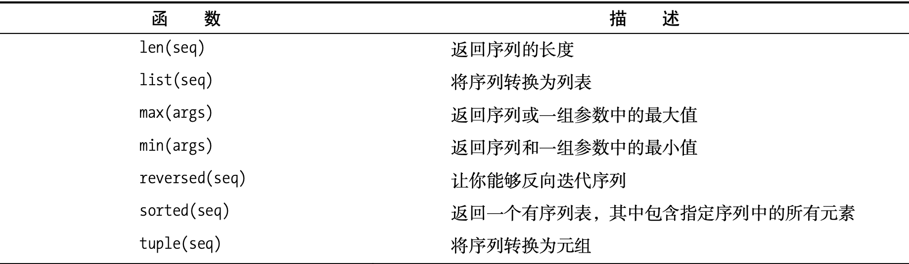

## 列表

形如 `a = [1,2,"3"]` 这种的就是列表，其实就是通常说的链表

列表的元素可以进行修改


## 元组

形如 `a = (1,2,"3",)` 这种的就是元组

元组的元素不可以修改

### 创建元组

只要将一些值用逗号分隔，就能自动创建一个元组。元组还可用圆括号括起，空元组用两个不包含任何内容的圆括号表示。只包含一个值的元组需要添加逗号

```
a = 1, 2, 3
b = (1, 2, 3)
c = ()
d = (2,) # 单个值的元组需要逗号，否则相当于是 2 这个整数值
```

### 函数 tuple

函数tuple的工作原理与list很像:它将一个序列作为参数，并将其转换为元组 。

```
tuple([1, 2, 3]) = (1, 2, 3)
```

> tuple 实际是类型不是函数


## 字符串

形如 `a = "1243"` 这种就是字符串

> python 没有单独的字符类型，字符就是只包含一个字符的字符串


## 序列

以上三种类型：列表、元组、字符串都是序列类型，因此都具有序列的通用操作

### 索引操作

```
greeting = 'Hello'
greeting[-1] # 代表 o
```

> - 字符串也是序列
> - -1 下标表示序列的最后一个元素

### 切片

```
tag = '<a href="http://www.python.org">Python web site</a>'
tag[9:30] # 代表 http://www.python.org
```

> - 左闭右开：tag[9:30] 最终包括下标 9-29 的元素
> - 开头3个元素：tag[:3] 省略第一个索引
> - 结尾3个元素：tag[-3:] 省略第二个索引，并且使用负数来表示结尾元素，-3 表示倒数第三个元素
> - 复制整个序列：tag[:] 省略两个索引，表示整个序列的切片，相当于一次浅拷贝
> - 复制1-10的奇数下标：tag[1:10:2] 第三个索引表示步长，每 2 个元素进行一次切片，因此最终只切片了奇数下标的元素
> - 从右向左取元素：tag[10:0:-1] 步长为 -1，表示从右向左，步长为 1 来取元素，这时候第二个索引必须大于第一个索引

### 序列相加

```
[1, 2, 3] + [4, 5, 6] = [1, 2, 3, 4, 5, 6]
'Hello,' + 'world!' = 'Hello, world!'
[1, 2, 3] + 'world!' # 发生异常
```

> 不能拼接列表和字符串，虽然它们都是序列。一般而言，不能拼接不同类型的序列

### 乘法

```
'python' * 5 = 'pythonpythonpythonpythonpython'
[42] * 10 = [42, 42, 42, 42, 42, 42, 42, 42, 42, 42]
```

> - 创建一个初始长度为10的列表：a = [None] * 10
> - 创建空列表：a = []

### 检测包含关系

```
permissions = 'rw'
'w' in permissions  # True
'x' in permissions  # False
users = ['mlh', 'foo', 'bar']
'mlh' in users  # True
```

> 这种包含关系检测，基本上等同于 contains 方法的含义

### 长度、最大值最小值

```
numbers = [100, 34, 678]
len(numbers) = 3
max(numbers) = 678
min(numbers) = 34
max(2, 3) = 3
min(9, 3, 2, 5) = 2
```

> - len、max、min 都是内置函数
> - max 和 min 除了接收序列之外，也可以接收多个参数返回最大最小值


## 列表操作

列表是 python 的主力，所以列表有很多的操作，需要掌握

### 函数list

它的作用是将其它序列转换成列表

```
list('Hello') = ['H', 'e', 'l', 'l', 'o']
```

### 删除元素

```
names = ['Alice', 'Beth', 'Cecil', 'Dee-Dee', 'Earl']
del names[2] # 剩下 ['Alice', 'Beth', 'Dee-Dee', 'Earl']
```

> 也可以 del names[2:] 删除一个切片

### 给切片赋值

```
name = list('Perl') # ['P', 'e', 'r', 'l']
name[2:] = list('ar') # ['P', 'e', 'a', 'r']
numbers = [1, 5]
numbers[1:1] = [2, 3, 4] # [1, 2, 3, 4, 5]  “替换”了一个空切片，相当于插入了一个序列
numbers = [1, 2, 3, 4, 5]
numbers[1:4] = [] # [1, 5] # 与del numbers[1:4] 等效
```

### 列表方法

#### append

添加元素到列表末尾

```
lst = [1, 2, 3]
lst.append(4)
lst = [1, 2, 3, 4]
```

> 就地修改，不返回新列表

#### clear

清空列表

```
lst = [1, 2, 3]
lst.clear()
lst = []
```

> 这类似于切片赋值语句 lst[:] = []

#### copy

```
a = [1, 2, 3]
b = a.copy()
```

> 这类似于使用 a[:] 或 list(a)，它们也都复制a，进行了一次浅拷贝

#### count

count计算指定的元素在列表中出现了多少次

```
['to', 'be', 'or', 'not', 'to', 'be'].count('to') # 2
```

#### extend

extend让你能够同时将多个值附加到列表末尾，为此可将这些值组成的序列作为参数提供给方法extend。换而言之，你可使用一个列表来扩展另一个列表

```
a = [1, 2, 3]
b = [4, 5, 6]
a.extend(b)
a = [1, 2, 3, 4, 5, 6]
```

> 看起来类似于拼接，但是 a + b 这种拼接不修改 a，返回的是新列表。而 extend 修改了 a

#### index

index 在列表中查找指定值第一次出现的索引

```
knights = ['We', 'are', 'the', 'knights', 'who', 'say', 'ni']
knights.index('who') # 4
```

> 如果找的值不存在会抛出异常 ValueError

#### insert

insert用于将一个对象插入列表。

```
numbers = [1, 2, 3, 5, 6, 7]
numbers.insert(3, 'four') = [1, 2, 3, 'four', 5, 6, 7]
```

#### pop

pop从列表中删除一个元素(末尾为最后一个元素)，并返回这一元素。

```
x = [1, 2, 3]
x.pop() # 3 此时 x = [1, 2]
x.pop(0) # 1 此时 x = [2]
```

> 默认是删除最后一个元素并返回，我们也可以提供一个索引，来表示要删除的元素下标，并将删除的元素返回

#### remove

remove用于删除第一个为指定值的元素

```
x = ['to', 'be', 'or', 'not', 'to', 'be']
x.remove('be') = ['to', 'or', 'not', 'to', 'be']
```

> 如果删除的不存在则抛出异常 ValueError

#### reverse

reverse按相反的顺序排列列表中的元素

```
x = [1, 2, 3]
x.reverse() = [3, 2, 1]
```

> 也是就地修改列表
>
> 如果要按相反的顺序迭代序列，可使用函数reversed。这个函数不返回列表，而是返回一个迭代器
>
> x = [1, 2, 3]
>
> list(reversed(x)) = [3, 2, 1]

#### sort

sort用于对列表就地排序

```
x = [4, 6, 2, 1, 7, 9]
x.sort() = [1, 2, 4, 6, 7, 9]
```

> 有时候我们不想修改原列表，可以使用 sorted 方法
>
> x = [4, 6, 2, 1, 7, 9]
>
> y = sorted(x)
>
> 这个函数可用于任何可迭代对象，但总是返回一个列表

#### 高级排序

sort 接受两个可选参数：key 和 reverse

```
x = ['aardvark', 'abalone', 'acme', 'add', 'aerate']
x.sort(key=len)
```

对于另一个关键字参数 reverse，只需将其指定为一个真值(True或False)，以指出是否要按相反的顺序对列表进行排序

```
x = [4, 6, 2, 1, 7, 9]
x.sort(reverse=True)
```

> 函数sorted也接受参数key和reverse


## 总结

- 列表、元组、字符串都是序列，具有序列的通用方法
- 检测包含关系需要使用 in 运算符



