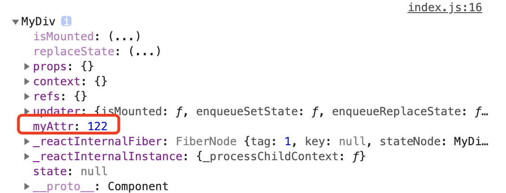

## react 元素的 ref 属性

react 元素中，ref 是一个特殊属性，利用它，我们可以得到元素本身或者是它挂载的DOM节点

```javascript
class MyComponent extends React.Component {
  constructor(props) {
    super(props);
    this.myRef = React.createRef();
  }
  render() {
    return <div ref={this.myRef} />;
  }
}
```

- 首先，`this.myRef = React.createRef();` 创建了一个 ref
- `<div ref={this.myRef} />` 将 div 这个 dom 节点的 ref 属性设置成了 `{this.myRef}`
- 这个设置属性的含义是：将 div 这个 dom 节点（一个 JS 对象），赋值给 `this.myRef.current`
- 也就是说，我们使用 `this.myRef.current` 可以操纵这个 dom，就像是使用 CSS 选择器选择到了节点一样

例如

```javascript
class MyComponent extends React.Component {
    constructor(props) {
        super(props);
        this.myRef = React.createRef();
    }

    componentDidMount() {
        this.myRef.current.innerHTML = '哈哈哈'
    }

    render() {
        return <div ref={this.myRef} />;
    }
}

ReactDOM.render(
    <MyComponent />,
    document.getElementById('root')
);
```

你将会看到元素的信息是

```javascript
<div>哈哈哈</div>
```

这证明我们引用到了这个 div 节点，并且设置了它的属性


## 访问 Refs

当 ref 被传递给 `render` 中的元素时，对该节点的引用可以在 ref 的 `current` 属性中被访问。

`const node = this.myRef.current;`

ref 的值根据节点的类型而有所不同：

- 当 `ref` 属性用于 HTML 元素时，构造函数中使用 `React.createRef()` 创建的 `ref` 接收底层 DOM 元素作为其 `current` 属性。

  ```javascript
  class MyComponent extends React.Component {
      constructor(props) {
          super(props);
          this.myRef = React.createRef();
      }
  
      componentDidMount() {
          this.myRef.current.innerHTML = '哈哈哈'
      }
  
      render() {
          return <div ref={this.myRef} />;
      }
  }
  ```

  这里就是接收了 div 元素作为 ref

- 当 `ref` 属性用于自定义 class 组件时，`ref` 对象接收组件的挂载实例作为其 `current` 属性。

  ```javascript
  class MyComponent extends React.Component {
      constructor(props) {
          super(props);
          this.myRef = React.createRef();
      }
  
      componentDidMount() {
          console.log(this.myRef.current);
      }
  
      render() {
          return <MyDiv ref={this.myRef}/>;
      }
  }
  
  class MyDiv extends React.Component {
      constructor(props) {
          super(props);
          this.myAttr = 122;
      }
  
      render() {
          return <div id={1}>sss</div>;
      }
  }
  
  ReactDOM.render(
      <MyComponent/>,
      document.getElementById('root')
  );
  ```

  

  可以看到，我们返回的是这个 React 组件的实例

- **你不能在函数组件上使用 `ref` 属性**，因为他们没有实例。


## 回调 Ref

```javascript
class AutoFocusInput extends Component {
  componentDidMount () {
    this.input.focus()
  }

  render () {
    return (
      <input ref={(input) => this.input = input} />
    )
  }
}

ReactDOM.render(
  <AutoFocusInput />,
  document.getElementById('root')
)
```

我们可以将一个回调函数传递给 ref，回调函数的第一个参数代表这个节点本身的引用。