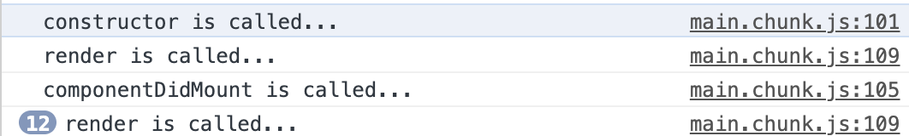

## 原始的更新渲染

前面我们写过一个时钟的例子，里面更新时钟时是新生成了 React 元素，然后重新调用 render 进行渲染

```javascript
function tick() {
  const element = (
    <div>
      <h1>Hello, world!</h1>
      <h2>It is {new Date().toLocaleTimeString()}.</h2>
    </div>
  );
  ReactDOM.render(
    element,
    document.getElementById('root')
  );
}

setInterval(tick, 1000);
```

这种是最原始的方式，有几个缺点：

- 我们使用这个组件时，要自己写代码控制更新频率
- 组件没有状态，无法自己更新，必须在外部进行重新渲染

实际上，组件有一些生命周期，其中一个就是当我们更新组件的状态时，会自动去更新组件的渲染，我们可以利用生命周期来更新渲染


## 组件的常用生命周期

要使用组件的生命周期，需要使用 class 类型的组件

```javascript
class Welcome extends React.Component {
  render() {
    return <h1>Hello, {this.props.name}</h1>;
  }
}
```

组件只有 render 方法是必须提供的，其它生命周期方法都是可选的


**挂载**

当组件实例被创建并插入 DOM 中时，其生命周期调用顺序如下：

- constructor()：组件的构造函数，含义很明确。构造函数内不要使用 setState()，而是直接使用 `this.state = xxx` 来添加私有状态，因为 setState() 是个生命周期方法，会触发渲染，此时组件还没有构造完成
- static getDerivedStateFromProps()  不常用
- render()：是 class 组件中唯一必须实现的方法。这个方法不应该修改 props
- componentDidMount()：会在组件挂载后（插入 DOM 树中）立即调用。依赖于 DOM 节点的初始化应该放在这里。如需通过网络请求获取数据，此处是实例化请求的好地方。可以在这里调用 setState() ，将会触发额外的渲染，但是渲染发生在刷新屏幕之前，所以这里不会感知到两次渲染的差异，屏幕实际只刷新了一次

```javascript
class Clock extends React.Component {
    // 组件创建时的逻辑，添加一个私有状态
    constructor(props) {
        super(props);
        // 定义一个私有状态，这个属性其实是一个特殊属性，React 对它有一个内置的生命周期
        this.state = {date: new Date()};
        console.log('constructor is called...');
    }

    componentDidMount() {
        console.log('componentDidMount is called...');
    }

    render() {
        console.log('render is called...');
        return (
            <div>
                <h1>Hello, world!</h1>
                <h2>It is {this.state.date.toLocaleTimeString()}.</h2>
            </div>
        );
    }
}

function tick() {
    ReactDOM.render(
        <Clock/>,
        document.getElementById('root')
    );
}

setInterval(tick, 1000);
```




**更新**

更新阶段说白了就是使用 setState() 后触发重新渲染的过程，生命周期如下

- static getDerivedStateFromProps()
- shouldComponentUpdate()
- **render()**
- getSnapshotBeforeUpdate()
- **componentDidUpdate()**


**卸载**

当组件从 DOM 中移除时会调用如下方法：

- componentWillUnmount()


## setState

`setState(updater[, callback])`

这个方法表示**要对组件进行状态的更新**，表明的是一个更新指令，并不会立刻去做这个更新。React 会将这个更新放入一个更新队列，然后在合适的时候去执行组件状态更新。也就是说更新并不会立即生效，如果我们想在更新后读取状态，应该使用这里的回调函数，或者是在 componentDidUpdate 中读取状态。

**调用这个方法将会触发组件的重新渲染**

我们不应该更改 state 对象本身的内容，而应该返回一个新的 state 对象，将新的 state 挂载到原来的 state 上

```javascript
this.setState((state, props) => {
  return {counter: state.counter + props.step};
});
```

上面我们就新建了一个 state 对象，执行了 setState 后，this.state 这个指针将会更改，而原先的 state 对象内容并没有发生更改

`setState(stateChange[, callback])`

这种类型是对象的混入，将会将传入的这个对象，混入到 state 上

例如 `this.setState({quantity: 2})`，最后就会导致 `this.state.quantity = 2`


## 使用 state 来更新渲染

有了上面的内容，我们就可以使用 state 来渲染

```javascript
lass Clock extends React.Component {
  constructor(props) {
    super(props);
    this.state = {date: new Date()};
  }

  componentDidMount() {
    this.timerID = setInterval(
      () => this.tick(),
      1000
    );
  }

  componentWillUnmount() {
    clearInterval(this.timerID);
  }

  tick() {
    this.setState({
      date: new Date()
    });
  }

  render() {
    return (
      <div>
        <h1>Hello, world!</h1>
        <h2>It is {this.state.date.toLocaleTimeString()}.</h2>
      </div>
    );
  }
}

ReactDOM.render(
  <Clock />,
  document.getElementById('root')
);
```

要点

1. 当 `<Clock />` 被传给 `ReactDOM.render()`的时候，React 会调用 `Clock` 组件的构造函数。因为 `Clock` 需要显示当前的时间，所以它会用一个包含当前时间的对象来初始化 `this.state`。我们会在之后更新 state。
2. 之后 React 会调用组件的 `render()` 方法。这就是 React 确定该在页面上展示什么的方式。然后 React 更新 DOM 来匹配 `Clock` 渲染的输出。
3. 当 `Clock` 的输出被插入到 DOM 中后，React 就会调用 `ComponentDidMount()` 生命周期方法。在这个方法中，`Clock` 组件向浏览器请求设置一个计时器来每秒调用一次组件的 `tick()` 方法。
4. 浏览器每秒都会调用一次 `tick()` 方法。 在这方法之中，`Clock` 组件会通过调用 `setState()` 来计划进行一次 UI 更新。得益于 `setState()` 的调用，React 能够知道 state 已经改变了，然后会重新调用 `render()` 方法来确定页面上该显示什么。这一次，`render()` 方法中的 `this.state.date` 就不一样了，如此以来就会渲染输出更新过的时间。React 也会相应的更新 DOM。
5. 一旦 `Clock` 组件从 DOM 中被移除，React 就会调用 `componentWillUnmount()` 生命周期方法，这样计时器就停止了。


## 正确地使用 State

- 不要直接修改 state，如 `this.state.comment = 'Hello';` 因为这样的话 React 感知不到你的修改

- State 可能是异步的

  ```javascript
  // Wrong
  this.setState({
    counter: this.state.counter + this.props.increment,
  });
  ```

  这种方式更新时依赖当前的值，这个值是不准确的

  要解决这个问题，可以让 `setState()` 接收一个函数

  ```javascript
  // Correct
  this.setState((state, props) => ({
    counter: state.counter + props.increment
  }));
  ```

  这会保证这里收到的 state 是上一个 state 值