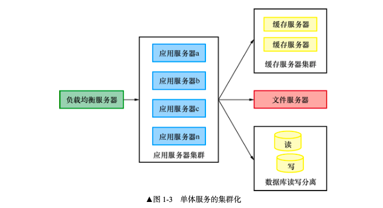
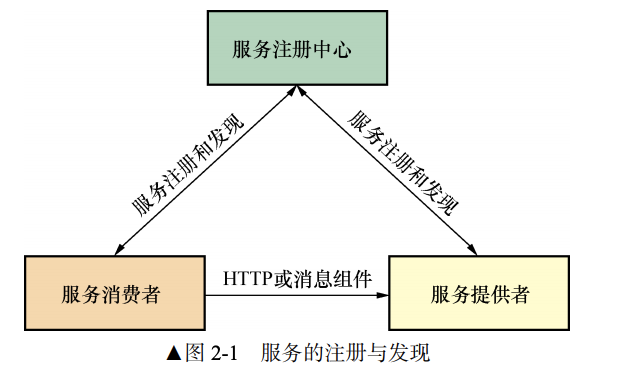

## spring boot 和 spring cloud 版本对应关系

| Release Train | Boot Version |
| :------------ | :----------- |
| Hoxton        | 2.2.x        |
| Greenwich     | 2.1.x        |
| Finchley      | 2.0.x        |
| Edgware       | 1.5.x        |
| Dalston       | 1.5.x        |

> spring cloud 项目官网有这个信息

## 单体架构的不足

- 业务复杂后，代码量越来越大，可读性、可维护性、可扩展性下降。新人接手需要的时间增多
- 随着用户的增加，程序承受的并发越来越高，并发能力有瓶颈
- 测试的难度越来越大，牵一发动全身

### 单体架构使用集群模式时候的不足

- 系统仍然是单体应用，依然还是可读性可维护性很差
- 数据库成为瓶颈，解决方案是使用分布式数据库，也就是将数据库进行分库分表
- 持续交付能力差，因为太复杂

## 微服务应该具有的特点

- 按照业务划分为一个个独立的程序，也就是服务单元
- 服务之间通过 RPC 通信（通常是 http）
- 自动化部署
- 可以用不同的编程语言
- 可以用不用的存储技术
- 服务集中化管理
- 微服务是一个分布式系统

## 微服务的优势

- 复杂业务拆分成多个小的业务，降低单个业务的复杂度，可读性和可维护性提高
- 服务具有很强的横向扩展能力
- 单个微服务内部高度耦合，服务与服务之间完全独立，无耦合。提高开发效率，降低开发成本
- 由于服务之间不会耦合，所以接手的时候比较简单
- 服务独立部署，单个服务的修改和部署对其它服务没有影响，测试简单
- 微服务在 CAP 理论中采用的是 AP 架构，具有高可用和分区容错的特点。

## 微服务的不足

- 微服务本身的复杂度就比较高，因为网络的通信就是比进程内通信更复杂
- 分布式事务。根据 CAP 理论，同时满足 一致性、可用性、分区容错 是不可能的。因此微服务系统的分布式事务十分困难和复杂
- 服务的划分很困难。
- 服务的部署更复杂，因为要部署的东西更多了，它们之间的调用网络也很复杂

## 微服务应该具备的功能

### 服务的注册与发现

服务注册中心保存所有微服务的地址以及它们的健康状态。

服务注册是指服务提供者将自己的信息（名称、ip等）告诉服务注册中心。

服务提供者会定期向注册中心发送心跳包，表示自己还活着。

### 服务的负载均衡

服务的负载均衡就是：服务的消费者如何找到某个服务实例

微服务中，一个服务提供者将会水平部署多个，我们一次实际上只需要消费其中一个实例，决定这一个具体的实例，就是服务的负载均衡所干的事情。

### 服务的容错

微服务系统中，服务的数量往往非常多，网络天生就是不可靠的，经常会面临某个组件忽然连接不到的情况（网络延迟或者是故障了），这时候就会影响到依赖这个服务的其它服务。

这个时候可能就**线程阻塞**了，然后在并发量高的情况下，一堆线程阻塞，直接完蛋了。

这个就导致了雪崩。

为了避免这种情况的发生，微服务使用一种熔断机制，当一个服务的失败次数或者是响应时间超过阈值的时候，熔断器就打开了，这个时候所有的请求就执行快速失败，也就是不再使用这个可能不可用的服务了，直接降级给出一些信息。

这种机制除了防止雪崩，还有以下作用：

- 将资源进行隔离：如果某个服务的某个 API 出了问题，只会隔离这个 API，不会影响到其它的 API
- 服务降级的功能：当服务处于正常的状态时，大量的请求短时间内同时涌入，超过了处理能力，这是熔断器就会打开将服务降级，一面服务器负载过高而故障
- 自我修复能力：当某个微小的故障，导致网络暂时不可用，熔断器被打开。网络恢复后，熔断器又自动关闭了，十分方便

### 服务网关

微服务系统中，API 接口资源通常由服务网关统一暴露（API 网关），内部服务不直接对外提供服务，这样做的好处是将内部的服务隐藏起来，在一定程度上可以对服务进行统一处理。

- 网关将所有服务统一聚合，对外统一暴露，外界不需要知道内部服务的复杂性。同时网关也保护了内部服务，防止被外部直接调用以及服务的敏感信息对外暴露
- 网关可以做一些身份认证、权限认证等功能
- 网关可以实现监控功能、实时日志输出，对请求进行记录
- 网关可以用来做流量监控，在高流量的情况下对服务降级
- API 接口从内部服务分离出来，方便做测试

### 服务配置的统一管理

在实际开发过程中，每个服务都有很多配置文件，随着服务数量的增加，管理这些配置文件也很麻烦和复杂。需要一个统一的配置管理组件，例如 spring cloud config，大致流程如下：

- 首先，config server 读取配置文件仓库的配置信息（可以是存放在配置服务的本地仓库，或者是远程的 git 仓库例如 github）
- config server 启动后，读取配置文件信息，存放在自己的内存中
- 当启动服务 A、B 时，由于服务 A、B 指定了向 config server 读取配置信息，服务 A、B 向 config server 读取配置信息
- 当服务的配置信息需要修改且修改完成后，向 config server 发送 post 请求进行刷新，这是服务 A、B 会向 config server 重新读取配置文件

### 服务链路追踪

微服务系统中，服务的调用链路可能十分复杂

一旦出了问题，想定位问题十分困难，所以要实现分布式链路追踪。