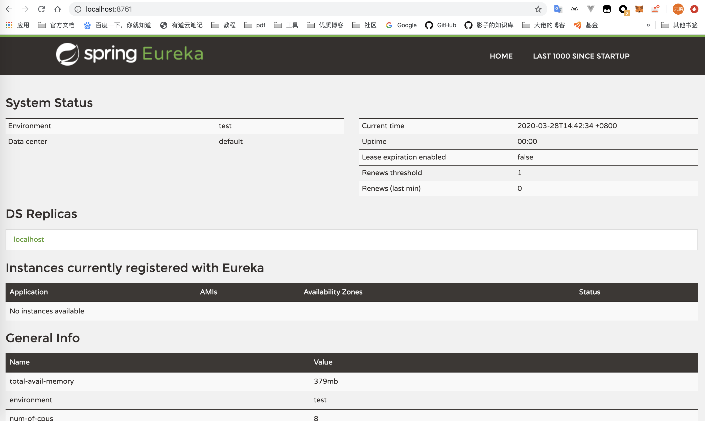

## 什么是 Eureka

Eureka 是一个用于服务注册和发现的组件，分为服务端和客户端。

服务端就是服务注册中心，用来注册服务。客户端用来向服务注册中心进行注册以及消费服务

### 基本架构

- Register Service
  - 服务注册中心，它是一个 Eureka Server，提供服务注册与发现的功能
- Provider Service
  - 服务提供者，它是一个 Eureka Client，提供服务
- Consumer Service
  - 服务消费者，它是一个 Eureka Client，消费服务

### 基本过程

- 首先需要一个服务注册中心 Eureka Server
- 服务提供者 Eureka Client 向服务注册中心 Eureka Server 注册，将自己的信息提供给服务注册中心
- 服务消费者 Eureka Client 也需要向服务注册中心 Eureka Server 注册，同时消费者获取服务注册列表信息，包含所有向服务注册中心注册了的组件的信息
- 获取了服务列表后，服务消费者就可以向服务发起调用请求（客户端负载均衡）


## 服务端使用方式

### pom 文件

只做了一些摘要，余下的一些 springboot 相关的需要补充才可运行

```xml
<parent>
    <groupId>org.springframework.boot</groupId>
    <artifactId>spring-boot-starter-parent</artifactId>
    <version>2.2.5.RELEASE</version>
    <relativePath/> <!-- lookup parent from repository -->
</parent>

<dependencies>
    <dependency>
        <groupId>org.springframework.cloud</groupId>
        <artifactId>spring-cloud-starter-netflix-eureka-server</artifactId>
    </dependency>
</dependencies>

<dependencyManagement>
    <dependencies>
        <dependency>
            <groupId>org.springframework.cloud</groupId>
            <artifactId>spring-cloud-dependencies</artifactId>
            <version>Hoxton.RELEASE</version>
            <type>pom</type>
            <scope>import</scope>
        </dependency>
    </dependencies>
</dependencyManagement>
```


### application.yml 文件

```yaml
spring:
  application:
    name: eureka-server

server:
  port: 8761

eureka:
  instance:
    prefer-ip-address: true
    status-page-url-path: /actuator/info #信息查询的url link
    health-check-url-path: /actuator/health #健康检查的url
    hostname: localhost
  # Eureka Server必须禁止向自己注册 必须将eureka.client.register-with-eureka和eureka.client.fetch-registry 设置为false
  client:
    register-with-eureka: false
    fetch-registry: false
    service-url:
      defaultZone: http://${eureka.instance.hostname}:${server.port}/eureka/
```

- 应用名称：eureka-server
- 服务器端口：8761
- prefer-ip-address：以 IP 地址来进行注册
- hostname: localhost，表示这个 Eureka Server 本身的主机名
- register-with-eureka: false，Eureka Server 本身也算是一个 Eureka Client，我们禁止向自己注册和拉取注册信息
- fetch-registry: false，禁止拉取注册信息
- defaultZone：表示向哪个注册中心去注册


### 启动类

```java
@EnableEurekaServer
@SpringBootApplication
public class EurekaServerApplication {

	public static void main(String[] args) {
		SpringApplication.run(EurekaServerApplication.class, args);
	}

}
```

启动类添加注解 `@EnableEurekaServer`


### 启动并访问




## 客户端使用方式

### pom 文件

只做了一些摘要，余下的一些 springboot 相关的需要补充才可运行

```xml
<parent>
    <groupId>org.springframework.boot</groupId>
    <artifactId>spring-boot-starter-parent</artifactId>
    <version>2.2.5.RELEASE</version>
    <relativePath/> <!-- lookup parent from repository -->
</parent>

<dependencies>
    <dependency>
        <groupId>org.springframework.cloud</groupId>
        <artifactId>spring-cloud-starter-netflix-eureka-client</artifactId>
    </dependency>
</dependencies>

<dependencyManagement>
    <dependencies>
        <dependency>
            <groupId>org.springframework.cloud</groupId>
            <artifactId>spring-cloud-dependencies</artifactId>
            <version>Hoxton.RELEASE</version>
            <type>pom</type>
            <scope>import</scope>
        </dependency>
    </dependencies>
</dependencyManagement>
```


### application.yml

```yaml
spring:
  application:
    name: eureka-client

server:
  port: 8762

eureka:
  client:
    service-url:
      defaultZone: http://localhost:8761/eureka/
```

- 应用名称：eureka-client
- 服务器端口：8762
- defaultZone：eureka server 的地址


### 启动类

```java
@EnableEurekaClient
@SpringBootApplication
public class EurekaClientApplication {

	public static void main(String[] args) {
		SpringApplication.run(EurekaClientApplication.class, args);
	}

}
```

启动类添加注解 `@EnableEurekaClient`


### 启动并访问


可以看到 

- Application 列表下面，EUREKA-CLIENT 已经显示出来了
- status 是 在线（up）
- 端口是 8762
- 192.168.0.105 是我本机的其中一个 ip 地址（可以通过 127.0.0.1、192.168.0.105 两种方式访问本机）


## Eureka 核心概念

### Register 服务注册

当 Eureka Client 向 Eureka Server 注册时，Eureka Client 提供自身的元数据，比如 IP 地址、端口、运行状况指标的 URL、主页地址等信息。

### Renew 服务续约

Eureka Client 默认情况下每隔 30 秒发送一次心跳来续约。通过续约来告知 Eureka Server：自己这个 Client 还处于可用状态。正常情况下，如果 Eureka Server 90 秒没有收到 Eureka Client 的心跳，就把它从注册列表里删除了。

> 官网建议不要修改这个间隔

### Fetch Registries 获取服务注册列表信息

Eureka Client 从 Eureka Server 获取服务注册表信息，并且将其**缓存在本地**。Eureka Client 使用这个注册表信息查找其它服务的地址从而进行 RPC 调用。

这个注册表信息 30 秒更新一次，每次返回的注册表信息可能与自己 Eureka Client 缓存的不一样（这期间服务可能上线或者下线了）。Eureka Client 第一次全量查找，后面则是增量查找。

### Cancel 服务下线

Eureka Client 在程序关闭的时候可以向 Eureka Server 发送下线请求。发送请求后，该 Eureka Client 的实例信息将从 Eureka Server 的服务注册列表里删除。

> 使用 `DiscoveryManager.getInstance().shutdownComponent()` 来发送下线请求

这种方式就是说：

- 服务主动说自己要下线了
- 如果不这样做，直接下线的话，需要 Server 等 90 秒发现没心跳，才会将服务踢出去

### Eviction 服务踢除

默认情况下，当 Eureka Client 连续 90 秒没有向 Eureka Server 发送服务续约（即心跳）时，Eureka Server 就将这个实例从服务注册列表里删除

### 为什么 Eureka Client 获取服务实例这么慢

- Eureka Client 的延迟注册
  - Eureka Client 启动后，不是马上向 Eureka Server 注册，而是有一个延迟向服务端注册的时间。默认是 40 秒后注册
- Eureka Server 的响应缓存
  - Eureka Server 30 秒更新一次响应缓存，可以通过修改 `eureka.server.responseCacheUpdateIntervalMs` 来调整这个时间。由于具有缓存，所以即使你注册了，Eureka Server 也不会马上更新
  - 为什么要有这种机制：个人认为是服务太多的情况下，实时更新消耗比较大，所以给一个缓存时间
- Eureka Client 的缓存
  - Eureka Client 本身也是每 30 秒才拉取一次服务注册表信息，所以如果 Eureka Server 更新了最新缓存后，Eureka Client 并不一定马上就拿到了最新的注册表数据
- LoadBalancer 的缓存
  - Ribbon 的负载均衡器从本地的 Eureka Client 获取注册表信息。Ribbon 本身又把这个信息缓存了一遍，以避免每个请求都去 Eureka Client 要服务注册列表信息（其实我觉得好像也没什么不可以的，本来就是同一个进程里面的）
  - 这个缓存又是 30 秒刷新一次。

综上所述就是：由于各个缓存的存在，以及 Eureka Client 的延迟注册，导致 Eureka Client 不能马上被 Eureka Server 发现，即使 Eureka Server 更新了服务注册列表。Eureka Client 也不能马上被其它服务调用，因为服务消费者本身也还有服务注册列表的缓存

### Eureka 的自我保护模式

默认情况下，如果超过 90 秒没收到服务的心跳，那么 Eureka Server 就将该服务实例下线。这种情况适用于 Eureka Server 本身网络良好，而 Eureka Client 实例故障的情况。

如果 Eureka Client 实例本身其实是正常的，Eureka Server 没收到心跳是因为 Eureka Server 自己网络故障的话，此时再使用这种踢出机制就会十分危险：显然它会慢慢的把所有服务都踢下线了，然而实际上是它自己网络有问题。

Eureka 为了防止这种情况出现，添加了一种自我保护模式：

- 如果 Eureka Server 接收到的服务续约次数，小于设置的阈值（正常情况下理应接收到的次数）的百分比（15分钟内低于 85%），Eureka Server 就开启了自我保护模式
- 在这种模式下，不再清理下线任何节点（因为它感觉可能是自己挂了，不敢随便乱下线了）

> 这样的好处就是不会因为自身的问题把服务全踢下去了
>
> 缺点就是一些真的挂了的服务还在服务注册列表里面

使用 `eureka.server.enable-self-preservation = false` 可以关闭自我保护模式（默认是开着的）


## 高可用服务注册中心

Eureka Server 自己就是一个单点，很容易自己就挂了，所以要把自己配置成高可用的情况

### Eureka Server application.yml

```yaml
spring:
  profiles: peer1
server:
  port: 8761
eureka:
  instance:
    hostname: peer1
  client:
    service-url:
      defaultZone: http://peer2:8762/eureka/

---
spring:
  profiles: peer2
server:
  port: 8762
eureka:
  instance:
    hostname: peer2
  client:
    service-url:
      defaultZone: http://peer1:8761/eureka/
```

> 这个是 yml 的多 profile 写法

### /etc/hosts 文件

```
127.0.0.1	peer1
127.0.0.1	peer2
```

### 启动两个 Eureka Server

分别使用两个 profile 启动 2 个 Eureka Server

### Eureka Client application.yml

```yaml
spring:
  application:
    name: eureka-client

server:
  port: 8763

eureka:
  client:
    service-url:
      defaultZone: http://localhost:8761/eureka/
```

### 启动 Eureka Client

启动 Eureka Client，然后访问 `peer1:8761`，发现 Eureka Client 已经向 peer1 注册了，并且在 DS Replicas 中显示了节点 peer2，我们访问 `peer2:8762`，发现 Eureka Client 也注册了，说明 peer1 的注册信息已经同步到了 peer2

### DS Replicas

表示 Eureka Server 的相邻节点

- peer1 的相邻节点就是 peer2
- peer2 的相邻节点就是 peer1

这两个就是一个 Eureka Server 集群

