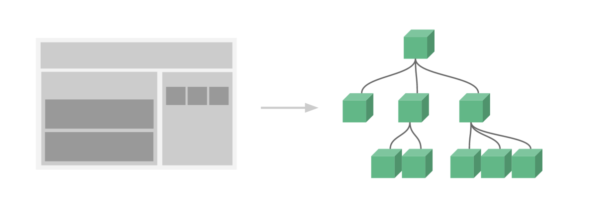

## 基本示例

```javascript
// 定义一个名为 button-counter 的新组件
Vue.component('button-counter', {
  data: function () {
    return {
      count: 0
    }
  },
  template: '<button v-on:click="count++">You clicked me {{ count }} times.</button>'
})
```

组件是可复用的 Vue 实例，且带有一个名字：在这个例子中是 `<button-counter>`。我们可以在一个通过 `new Vue` 创建的 Vue 根实例中，把这个组件作为自定义元素来使用：

```html
<div id="components-demo">
  <button-counter></button-counter>
</div>
```

```javascript
new Vue({ el: '#components-demo' })
```

因为组件是可复用的 Vue 实例，所以它们与 `new Vue` 接收相同的选项，例如 `data`、`computed`、`watch`、`methods` 以及生命周期钩子等。仅有的例外是像 `el` 这样根实例特有的选项。


## 组件的复用

你可以将组件进行任意次数的复用：

```html
<div id="components-demo">
  <button-counter></button-counter>
  <button-counter></button-counter>
  <button-counter></button-counter>
</div>
```

每个组件都会各自独立维护它的 `count`。因为你每用一次组件，就会有一个它的新**实例**被创建。

### data 必须是一个函数

**一个组件的 `data` 选项必须是一个函数**，因此每个实例可以维护一份被返回对象的独立的拷贝：

```javascript
data: function () {
  return {
    count: 0
  }
}
```

说白了，这个是函数式，无副作用的要求

如果 Vue 没有这条规则，点击一个按钮就可能影响到其它所有实例


## 组件的组织

通常一个应用会以一棵嵌套的组件树的形式来组织：



例如，你可能会有页头、侧边栏、内容区等组件，每个组件又包含了其它的像导航链接、博文之类的组件。

为了能在模板中使用，这些组件必须先注册以便 Vue 能够识别。这里有两种组件的注册类型：**全局注册**和**局部注册**。至此，我们的组件都只是通过 `Vue.component` 全局注册的：

```javascript
Vue.component('my-component-name', {
  // ... options ...
})
```

全局注册的组件可以用在其被注册之后的任何 (通过 `new Vue`) 新创建的 Vue 根实例，也包括其组件树中的所有子组件的模板中。


## 通过 Prop 向子组件传递数据

如果我们不能向组件传递数据，那么组件的行为就无法被我们控制，所以就有 props 机制向组件传递数据了

```javascript
Vue.component('blog-post', {
  props: ['title'],
  template: '<h3>{{ title }}</h3>'
})
```

一个组件默认可以拥有任意数量的 prop，任何值都可以传递给任何 prop。在上述模板中，你会发现我们能够在组件实例中访问这个值，就像访问 `data` 中的值一样。

一个 prop 被注册之后，你就可以像这样把数据作为一个自定义特性传递进来：

```html
<blog-post title="My journey with Vue"></blog-post>
<blog-post title="Blogging with Vue"></blog-post>
<blog-post title="Why Vue is so fun"></blog-post>
```

> props: ['title'] 表示我们的这个组件，接收一个参数，参数名称叫做 title，这个参数通过标签的属性的方式传递进来


## 单个根元素

组件不能像下面这样没有根元素

```html
<h3>{{ title }}</h3>
<div v-html="content"></div>
```

而应该使用一个根元素把其它元素包裹起来

```html
<div class="blog-post">
  <h3>{{ title }}</h3>
  <div v-html="content"></div>
</div>
```


## 监听子组件事件

有时候我们需要子组件告知父组件一些事件，例如父组件是一个跟组件，掌管了所有的data数据，我们点击子组件上的放大按钮，子组件要告知父组件去更新 data，将字体大小放大

这种模式就是：子组件 emit 某些事件，父组件监听子组件的事件，然后进行相应更改

```javascript
new Vue({
  el: '#blog-posts-events-demo',
  data: {
    posts: [/* ... */],
    postFontSize: 1
  }
})
```

```html
<div id="blog-posts-events-demo">
  <div :style="{ fontSize: postFontSize + 'em' }">
    <blog-post
      v-for="post in posts"
      v-bind:key="post.id"
      v-bind:post="post"
      v-on:enlarge-text="postFontSize += 0.1"
    ></blog-post>
  </div>
</div>
```

子组件

```javascript
Vue.component('blog-post', {
  props: ['post'],
  template: `
    <div class="blog-post">
      <h3>{{ post.title }}</h3>
      <button v-on:click="$emit('enlarge-text')">
        Enlarge text
      </button>
      <div v-html="post.content"></div>
    </div>
  `
})
```

子组件监听到 click 事件，马上通过 `$emit` 这个 API 发送一个自定义的事件，同时父组件也在子组件上监听这个事件，于是知道要去更改字体大小了。

### 使用事件抛出一个值

有时候，我们可能还要在事件里添加一些值，比如说我们点击放大时可能还有一个参数，通知放大多少倍

```html
<button v-on:click="$emit('enlarge-text', 0.1)">
  Enlarge text
</button>
```

```html
<blog-post
  ...
  v-on:enlarge-text="postFontSize += $event"
></blog-post>
```

我们通过 `$event` 可以访问这个参数

### 使用事件抛出多个值

```html
<button v-on:click="$emit('enlarge-text', 0.1, 0.2)">
  Enlarge text
</button>
```

```html
<blog-post
  ...
  v-on:enlarge-text="log"
></blog-post>
```

```javascript
methods: {
  log(arg1,arg2) {
    alert(arg1+arg2);
  }
}
```

抛出多个值时，我们可以通过在监听事件里，传入一个事件处理函数，将会将所有的值依次传入到这个函数里

### 在组件上使用 v-model

```html
<input v-model="searchText">
```

等价于

```html
<input
  v-bind:value="searchText"
  v-on:input="searchText = $event.target.value"
>
```

当用在组件上时，`v-model` 则会这样：

```html
<custom-input
  v-bind:value="searchText"
  v-on:input="searchText = $event"
></custom-input>
```

为了让它正常工作，这个组件内的 `<input>` 必须：

- 将其 `value` 特性绑定到一个名叫 `value` 的 prop 上
- 在其 `input` 事件被触发时，将新的值通过自定义的 `input` 事件抛出

写成代码之后是这样的：

```javascript
Vue.component('custom-input', {
  props: ['value'],
  template: `
    <input
      v-bind:value="value"
      v-on:input="$emit('input', $event.target.value)"
    >
  `
})
```

要点：

- 自定义组件里的input接收到input事件时，传递一个自定义的 input 事件出去，值就是输入的值
- 那么此时父组件就会接受到这个自定义的 input 事件，并且将我们绑定的值更新，更新的值传递给了子组件的 value 属性
- 所以子组件必须要将 props 设置为 value


## 通过插槽分发内容

和 HTML 元素一样，我们经常需要向一个组件传递内容，像这样：

```html
<alert-box>
  Something bad happened.
</alert-box>
```

Vue 的插槽

```javascript
Vue.component('alert-box', {
  template: `
    <div class="demo-alert-box">
      <strong>Error!</strong>
      <slot></slot>
    </div>
  `
})
```

这样，我们传递给 `<alert-box>` 的 innerHTML `Something bad happened.` 就取代了子组件里的 `<slot>`


## 动态组件

```html
<!-- 组件会在 `currentTabComponent` 改变时改变 -->
<component v-bind:is="currentTabComponent"></component>
```

在上述示例中，`currentTabComponent` 可以包括

- 已注册组件的名字，或
- 一个组件的选项对象

其实这里相当于是这个标签了，等于是一个动态的标签

```javascript
<currentTabComponent></currentTabComponent>
```

这种用法在 table 之类的对子标签有严格要求的地方很合适

```html
<table>
  <blog-post-row></blog-post-row>
</table>
这个将会导致错误，table 里不能有这种未知标签
```

```html
<table>
  <tr is="blog-post-row"></tr>
</table>
正确的做法
```

> 如果我们在单文件组件里使用的话，是没有这个限制的

