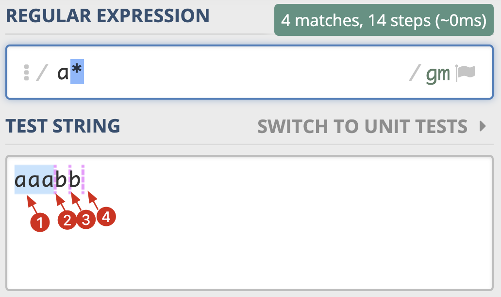
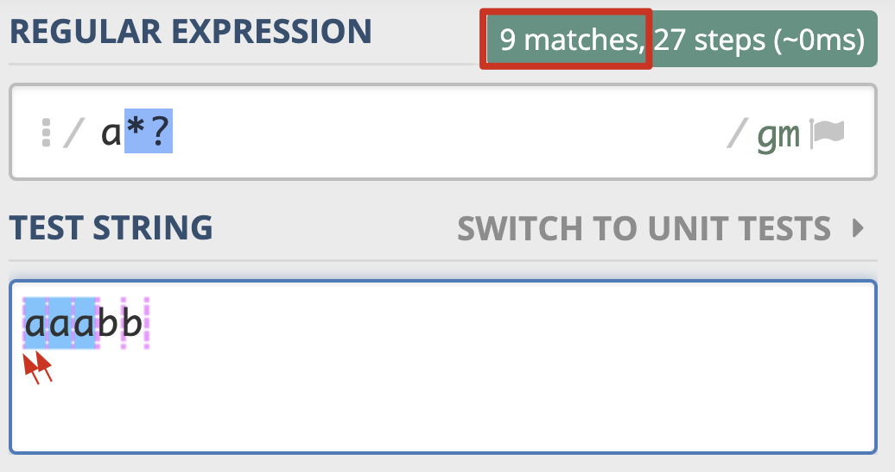
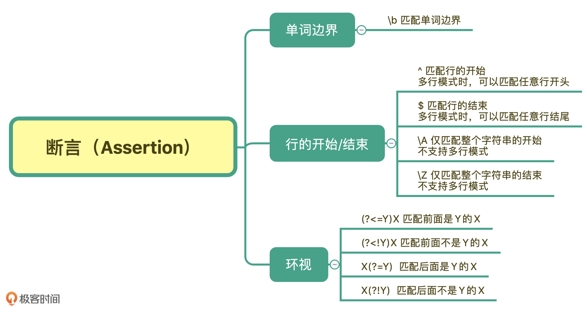

## 常用的正则表达式：

### 常用网址

```
1. https://regex101.com/
2. https://tool.oschina.net/regex/
3. http://tool.chinaz.com/regex/
4. https://www.w3cschool.cn/tools/index?name=re
5. https://c.runoob.com/front-end/854
6. http://tools.haokh.net/Regex
7. Windows 上推荐：RegexBuddy
8. Mac上推荐：Expressions

备注：1中支持账号功能，可以保存后进行分享。2~6都包含大量常用的正则示例。7&8 都需要付费。
```

### 手机号

第 1 位固定为数字 1；

第 2 位可能是 3，4，5，6，7，8，9；

第 3 位到第 11 位我们认为可能是 0-9 任意数字。

正则：

```
1[3-9]\d{9}
```


## 元字符

元字符就是指那些在正则表达式中具有特殊意义的专用字符。就像是普通字符里，一个反斜杠 `\` 就是一个元字符一样，它是专门用来转义的，正则表达式里有很多类似于这样的元字符。

### 分类

元字符按照它们的作用大致可以分成五类：特殊单字符、空白符、范围、量词、断言

### 特殊单字符

- .：
  - 描述：匹配任何一个字符(除了 \n 之外)
  - 正则示例：b.b
  - 说明：匹配包含 bnb bab bcb 之类的字符串
- \d：
  - 描述：匹配任何十进制数字，与[0-9]一致
  - 正则示例：data\d+.txt
  - 说明：表示匹配 data9.txt、data0.txt 等模式的字符串
- \D：
  - 描述：匹配非数字的内容，与 `[^0-9]` 一致
  - 正则示例：data\D.txt
  - 说明：表示匹配 dataa.txt、data我.txt 等模式的字符串
- \w：
  - 描述：匹配任何字母数字下划线字符，与[A-Za-z0-9_]相同（数字字母下划线），在 python3 的 re 模块中，默认启用的是 unicode 模式，所以它还要加上其他语言里的文字，例如中文字符也是可以被 \w 匹配的
  - 正则示例：[A-Za-z_]\w+
  - 说明：表示匹配 （字母或者下划线、字母下划线数字（中文韩文日文等字符）） 这种模式的字符串（标识符的匹配模式），在标准的正则规范里，它等价于 [A-Za-z0-9_]，但是在一些实现里，例如 python，它也可以匹配到其它语言的字符
- \W：
  - 描述：匹配数字字母下划线以外的字符，与 `[^A-Za-z0-9_]` 相同（以及排除中文韩文日文等字符），准确来说，它是 \w 的完全的反义词
- \s：
  - 描述：匹配任何空白字符，与 [\n\t\r\v\f ] 相同 (\S 与之相反)，注意，字符组里还有 **空格**，空格字符也是可以被 \s 匹配到的
- \S：
  - 描述：匹配任何空白之外的字符（能被肉眼看到的都能匹配上）

### 空白符

空白符就是无法被肉眼看到的符号，包括有：

- \r 回车符
- \n 换行符
- \f 换页符
- \t 制表符
- \v 垂直制表符

而使用 \s 可以匹配到以上的五种空白符，以及 **空格字符**，所以 `\s` 等价于 `[\n\t\r\v\f ]`（注意 \f 后面的空格）

**说白了：空白符也可以当成是特殊单字符**

### 量词

上面我们说到的元字符，它们虽然能匹配到不同的字符，但是统统都只能匹配到一个字符，有时候我们想匹配多个字符（例如 11 个数字组成的手机号码），这就需要用到表示量词的元字符了。

- *：
  - 描述：匹配 0 次或者多次前面出现的正则表达式，注意这里指代的是 1 个表达式，例如 `/bin/*sh$` 这里的 0 次或者多次仅仅代表前面的 `/` 出现 0 次或者多次
  - 正则示例：[A-Za-z0-9]*
  - 说明：匹配包含由（大写字母、小写字母、阿拉伯数字）组成的字符串。（实际上任何字符串都可以，因为可以理解成包含 0 次匹配也就是空字符串，任何字符串都可以认为包含空字符串）
- +：
  - 描述：匹配 1 次或者多次前面出现的正则表达式，注意这里指代的是 1 个表达式，例如 `/bin/+sh$` 这里的 1 次或者多次仅仅代表前面的 `/` 出现 1 次或者多次
  - 正则示例：[a-z]+\.com
  - 说明：匹配包含由小写字母与 `.com` 的组合，例如：aaa.com bbb.com ccc.com 等，这里 `.com` 前面至少有一个小写字母
- ?：
  - 描述：匹配 0 次或者 1 次前面出现的正则表达式
  - 正则示例：goo?
  - 说明：匹配包含 goo 和 gooo 的字符串，例如 `呵呵goo`
  - 用途：问号量词经常可以用来表示存在或者不存在两种含义，例如 `colou?r` 既可以匹配 `color` 又可以匹配 `colour` 两个表示颜色的单词的不同变体
- {M}：
  - 描述：匹配 M 次前面出现的正则表达式
  - 正则示例：[0-9]{3}
  - 说明：匹配包含有 3 个连续数字的字符串，例如 `n1233` `abc222ddd`
- {M,}：
  - 描述：匹配**至少** M 次前面出现的正则表达式
  - 正则示例：[0-9]{3,}
  - 说明：匹配包含有 3 个或者以上连续数字的字符串，例如 `n1233` `abc222ddd`
- {M,N}：
  - 描述：匹配 M 到 N 次前面出现的正则表达式
  - 正则示例：[0-9]{5,9}
  - 说明：匹配包含有 5-9 个连续数字的字符串，例如 `n12345` `n123456789`
  - 也可以使用 {5,} 表示至少匹配 5 次，但是不需要给出最大值，此时如果出现 100 次也是可以匹配的，等价的说法相当于是说重复 5 次及以上的次数

### 范围

我们当然可以用 \d{11} 来匹配上所有的手机号，但是很明显，这个正则除了手机号之外还可以匹配上别的号码序列（比如11个0），因为它表示的范围实际上比手机号表示的范围要大，我们就需要在一个特殊的范围里找符合要求的数字。

在正则表达式中，表示范围的符号以下类型

#### 逻辑或：|

- |：
  - 描述：用来分隔开多个正则表达式，表示一种**逻辑或**的情况
  - 正则示例：zhangsan|lisi
  - 说明：表示匹配 zhangsan 或者匹配 lisi
  - 这种方式用来组合多个正则表达式是很有用处的，例如说我们写了一个正则表达式 re1 用来匹配包含数字的字符串，re2 用来匹配包含英文字母的字符串，使用 re1|re2 就可以用来匹配：包含字母或者数字的字符串

#### 字符组 []

- [...]：
  - 描述：匹配来自字符组的任意单一字符
  - 正则示例：[aeiou]
  - 说明：匹配包含有上面 5 个字符里任意一个字符的字符串，例如 `a` `e` `i`
- [..x−y..]：
  - 描述：匹配 x~y 范围中的任意单一字符
  - 正则示例：[0-9],[A-Za-z]
  - 说明：匹配包含有（数字、逗号、字母）这种模式组成的字符串，例如 `1,a` `啊11,B`
- [^...]：
  - 描述：不匹配此字符组中出现的任何一个字符，包括某一范围的字符(如果在此字符组中出现)
  - 正则示例：`[^aeiou],[^A-Za-z0-9]`
  - 说明：匹配包含有（非 aeiou 、逗号、非字母数字）这种模式组成的字符串，例如 `,,,` `x,我`

示例：我们想匹配一个 URL，它的字符集可能是 http，也可能是 htpps 或者 ftp，可以使用以下正则：

```
(https?|ftp)://
```

### 断言

### 常用的元字符


## 量词和贪婪

贪婪模式和非贪婪模式都是针对量词的（*+?{} 这些量词），贪婪模式就是指量词会按照最长的序列去匹配，而非贪婪模式就是指量词会按照最短的序列去匹配。默认的模式都是贪婪模式，通过在量词后面添加一个问号，就可以将量词的匹配模式改变为非贪婪模式

### 示例

```
import re

print(re.findall(r'a*', 'aaabb'))
print(re.findall(r'a*?', 'aaabb'))

输出：
['aaa', '', '', '']
['', 'a', '', 'a', '', 'a', '', '', '']
```

字符串匹配的原理：

- 正则匹配的是字符串里的字符，对于 aaabb 这种字符串，它在每个字符之间的空隙都插入了空字符串 `''`
- 因此，对于 aaabb 我们应该理解成 `空a空a空a空b空b空`

对于贪婪匹配（第一行）：

- a* 匹配到 `空a空a空a`，最后一个 a 右边的 `空` 不进行匹配（也就是说：如果匹配到了真实的字符，就不像右边扩展 `空`）
- 剩下 `空b空b空`，匹配到第一个 `空`
- 剩下 `b空b空`，跳过第一个 b，匹配到 b 右边的 `空`
- 剩下 `b空`，跳过第一个 b，匹配到 b右边的 `空`
- 结束



对于非贪婪模式（第二行）：

- 对于 `空a空a空a空b空b空`，前 7 个字符都可以直接匹配一次
- 剩下 `b空b空`，后两次分别匹配到一个 `空`
- 结束




## 分组和引用

假如说我们有一个需求：我们想匹配 baidu.com 或者 www.baidu.com

当然我们可以这么写正则：`baidu\.com|www\.baidu\.com`

但是还有另一种方式：`(www\.)?baidu.com`

我们这里的量词：`?` 作用在前一个整体上 `(www\.)`，如果没有小括号的话，那么量词只能作用在前一个字符上。

这就是小括号的作用之一：将一个表达式作为一个整体。

同时，小括号的另一个作用就是将其作为一个分组，`(www\.)`，被当做一个分组，当我们执行查询后，这个分组捕获到的字符串，将可以被我们进行获取并且进行引用。

被括号括起来的部分  子表达式  会被保存成一个子组，每个分组都有一个编号，我们可以使用编号来引用这个分组。

如果涉及到多个分组，甚至嵌套的分组，有个最简单的办法就是数括号：第几个左括号就是第几个分组。

### 分组示例

```
match = re.match(r'((\d{4})-(\d{2})-(\d{2})) ((\d{2}):(\d{2}):(\d{2}))', '2020-08-01 21:00:03---2020-08-01 21:00:03')
print(match.group(1))  # 年-月-日
print(match.group(2))  # 年
print(match.group(3))  # 月
print(match.group(4))  # 日
print(match.groups())
```

输出：

```
2020-08-01
2020
08
01
('2020-08-01', '2020', '08', '01', '21:00:03', '21', '00', '03')
```

以上是对分组的简单使用，简单来说就是：分组编号从 1 开始，第几个括号就是第几个分组（数左括号）

### 正则中引用分组

分组除了在我们执行搜索之后再使用，还可以在正则里直接使用。

例如我们有一个需求，是匹配到一串字符里重复的单词，例如说：`this is is a sample string string aa`，那么就可以匹配到两个字符串：`is is ` 和 `string string `（注意这里面的空格）

要完成这个需求，可以这样写正则：`(\w+) \1`

```
match = re.findall(r'(\w+) \1', 'this is is a sample string string aa')
print(match)
```

输出：

```
['is', 'string']
```

我们可以看到，正则确实找到了这两个重复的单词，但是，结果并不是我们想要的，我们想要的是输出 `is is`，`string string` 这种匹配到的字符串。

这就是小括号分组的副作用了：

- 当我们使用小括号把一个子表达式括起来的时候，就创建了一个分组
- 而 findall 方法在表达式中定义了分组的时候，返回的将是分组组成的列表：[groups1, groups2, groups3] 这种
- 由于我们的分组只包含 `(\w+) \1` 左边的那一半，因此我们返回的分组列表也都是一半

如何解决这个问题呢？可以再加一个分组：

```
match = re.findall(r'((\w+) \2)', 'this is is a sample string string aa')
print(match)
```

输出：

```
[('is is', 'is'), ('string string', 'string')]
```

原理就是：我们把最外层当成了一整个大的分组，此时内层的 `(\w+)` 属于第二个分组，因此我们想引用它的话，需要改成 `\2`

### 去掉分组的副作用

很多时候，我们只想要小括号的包括为整体的作用，而不想让它被当做分组捕获，这个时候想要去除掉小括号的这个副作用，可以使用添加问号的方式。

例如我们匹配 15 位或者 18 位数字

```
print(re.findall(r'\d{15}(\d{3})?', '123456789012345678---123456789012345'))
```

输出：

```
['678', '']
```

我们可以看到，两个匹配里，前面的 15 位都不见了，这是因为它们不处于分组中，直接被 findall 方法给抛弃了。

有两种思路修改，第一种思路就是像上面一样，在最外层把整个正则表达式包起来：

```
print(re.findall(r'(\d{15}(\d{3})?)', '123456789012345678---123456789012345'))
```

其实这种方式不是很好，因为还是多出了一些我们不想要的分组，输出如下：

```
[('123456789012345678', '678'), ('123456789012345', '')]
```

而使用第二种方式，我们使用问号的方式将其取消分组的身份，更加合理：

```
print(re.findall(r'\d{15}(?:\d{3})?', '123456789012345678---123456789012345'))
```

输出：

```
['123456789012345678', '123456789012345']
```

这里的关键就是把 `(\d{3})` 改成了 `(?:\d{3})` ，这种表示说：不要将这个括号视为一个分组，括号里的内容从 `?:` 后面开始

### 命名分组

前面我们讲了分组编号，它们完全取决于括号的位置，而在正则表达式中，很有可能因为需求的编号，导致我们改动了括号的位置，所以很多语言都提供了命名分组的功能。

例如在 python 中，命名分组就是在分组的括号中开头处使用 P 参数：把  `(\d{3})` 分组添加一个名称就是 `(?P<group_name>\d{3})`

我们把上面的示例：匹配 15 或者 18 位数组添加命名分组就如下

```
all_match = re.finditer(r'(?P<complete>\d{15}(?P<last3_or_0>\d{3})?)', '123456789012345678---123456789012345')
for match in all_match:
    groups = match.groupdict()
    print('complete : %s' % groups['complete'])
    print('last3_or_0 : %s' % groups['last3_or_0'])
```

输出：

```
complete : 123456789012345678
last3_or_0 : 678
complete : 123456789012345
last3_or_0 : None
```

> 注意：第二个匹配中，last3_or_0 分组捕获到的是 None 而不是空字符串

如果我们要在正则表达式中就引用这个分组，可以使用 `(?P=group_name)` 的方式：

```
all_match = re.finditer(r'(?P<complete>\d{15}(?P<last3_or_0>\d{3})?(?P=last3_or_0))', '123456789012345678678')
for match in all_match:
    groups = match.groupdict()
    print(match.groups())
    print('complete : %s' % groups['complete'])
    print('last3_or_0 : %s' % groups['last3_or_0'])
```

输出：

```
('123456789012345678678', '678')
complete : 123456789012345678678
last3_or_0 : 678
```

> 关键点：使用 `(?P=last3_or_0)` 来引用 (?P<last3_or_0>\d{3}) 所捕获的内容


在 search 和 finditer 系列的 api 中，分组捕获到的是空字符串时，返回的是 None 而不是空字符串 `''`

而在 findall 的 api 中，会返回空字符串 `''`

例如：

```
print(re.findall(r'(?P<complete>\d{15}(?P<last3_or_0>\d{3})?)', '123456789012345'))

输出：[('123456789012345', '')]
```

```
print(re.search(r'(?P<complete>\d{15}(?P<last3_or_0>\d{3})?)', '123456789012345').groups())

输出：('123456789012345', None)
```

```
print(re.findall(r'(?P<complete>\d{15}(?P<last3_or_0>\d{3})?(?P=last3_or_0))', '123456789012345'))

输出：[]
```

这种行为还挺迷惑人的，只能说碰到这种引用分组的情况（而且分组捕获的还可能是空字符串），还是多注意下吧

### 小结


## 匹配模式

所谓匹配模式，指的是正则中一些改变元字符匹配行为的方式，比如匹配时不区分英文字母大小写。常见的匹配模式有 4 种，分别是不区分大小写模式、点号通配模式、多行模式和注释模式。

### 不区分大小写模式

例如我们想知道一串字符里有没有 cat 这个单词，不论是 Cat、CAT、cat 都是我们想要匹配的。这时候用不区分大小写模式就非常合适。

当我们把模式修饰符放在整个正则前面时，就表示整个正则表达式都是不区分大小写的。模式修饰符是通过 (? 模式标识) 的方式来表示的。 我们只需要把模式修饰符放在对应的正则前，就可以使用指定的模式了。在不区分大小写模式中，由于不分大小写的英文是 Case-Insensitive，那么对应的模式标识就是 I 的小写字母 i。

所以不区分大小写的 cat 就可以写成  `(?i)cat`

我们也可以用它来尝试匹配两个连续出现的 cat，你会发现，即便是第一个 cat 和第二个 cat 大小写不一致，也可以匹配上

```
print(re.findall(r'(?i)((cat) \2)', 'cat CaT'))
```

输出：

```
[('cat CaT', 'cat')]
```

也可以使用：

```
print(re.match(r'(cat) \1', 'cat CaT', re.IGNORECASE))
```

### 点号通配模式

点号 `.` 是可以匹配除了换行以外的任意字符的，有时候我们想要一种真正连换行也匹配上的行为，可以有几种方式。

一种就是使用 `[\s\S]`、`[\d\D]`、`[\w\W]` 等具有相反行为的元字符来表示匹配任意字符

另一种就是使用点号通配模式：`(?s).`，使用 `(?s)` 来开启这种模式，这是点号就可以匹配任意字符了

### 多行匹配模式

默认情况下，python 的 re 模块使用的都是单行匹配模式，它主要影响 `^$` 这两个元字符的定义

在单行匹配模式下，`^` 匹配整个字符串的开头，等同于 `\A` ，`$` 匹配整个字符串的结尾，等同于 `\z`（python 是 \Z）

但是在多行模式下，`^` 匹配每一行的开头，`$` 匹配每一行的结尾，而 `\A` 和 `\z`（python：\Z） 依然是匹配整个字符串的开头和结尾

例子：

```
print(re.findall(r'^aa.*', 'aaa\naaccc'))

输出：['aaa']
```

这种默认的单行模式下，正则将 `aaa\naaccc` 当成一整个字符串来匹配了

而开启多行模式：

```
print(re.findall(r'^aa.*', 'aaa\naaccc', re.MULTILINE))

输出：['aaa', 'aaccc']
```

在这种模式下，正则对每一行进行了一次匹配

### 注释模式

在实际工作中，正则可能会很复杂，我们可以在正则里面加上注释，这时就要开启注释模式。

正则中注释模式是使用 `(?#comment)` 来表示

例如：

```
(\w+)(?#word) \1(?#word repeat again)
```

> 说实话我觉得没什么卵用

### 小结


## 断言

简单来说，断言是指对匹配到的文本位置有要求，例如指定我们的字符串的开头、结尾等等。

在有些情况下，我们对要匹配的文本的位置也有一定的要求。为了解决这个问题，正则中提供了一些结构，只用于匹配位置，而不是文本内容本身，这种结构就是断言。

常见的断言有三种：单词边界、行的开始或结束以及环视。

### 单词边界

我们先来看一下例子。我们想要把下面文本中的 tom 替换成 jerry。注意一下，在文本中出现了 tomorrow 这个单词，tomorrow 也是以 tom 开头的。

```
tom asked me if I would go fishing with him tomorrow.
```

我们只希望替换 tom 而不希望替换其它包含了 tom 的单词，例如 tomorrow。

如果我们能找出单词的边界，也就是当出现了\w 表示的范围以外的字符，比如引号、空格、标点、换行等这些符号，我们就可以在正则中使用\b 来表示单词的边界。 \b 中的 b 可以理解为是边界（Boundary）这个单词的首字母


根据刚刚学到的内容，在准确匹配单词时，我们使用 \b\w+\b 就可以实现了。

```
import re

test_str = "tom asked me if I would go fishing with him tomorrow."
print(re.sub(r'\btom\b', 'jerry', test_str))
```

输出：

```
jerry asked me if I would go fishing with him tomorrow.
```

### 行的开始或结束

和单词的边界类似，在正则中还有文本每行的开始和结束，如果我们要求匹配的内容要出现在一行文本开头或结尾，就可以使用 ^ 和 $ 来进行位置界定。

\A 和 \z（python：\Z）则是匹配整个文本的开始和结束，当成一条单行数据来匹配

### 环视

环视就是要求匹配部分的前面或后面要满足（或不满足）某种规则，有些地方也称环视为零宽断言。

举个例子。邮政编码的规则是第一位是 1-9，一共有 6 位数字组成。现在要求你写出一个正则，提取文本中的邮政编码。根据规则，我们很容易就可以写出邮编的组成 [1-9]\d{5}。

我们发现，7 位数的前 6 位也能匹配上，12 位数匹配上了两次，这显然是不符合要求的。

也就是说，除了文本本身组成符合这 6 位数的规则外，这 6 位数左边或右边都不能是数字。

正则是通过环视来解决这个问题的。解决这个问题的正则有四种


因此，针对刚刚邮编的问题，就可以写成左边不是数字，右边也不是数字的 6 位数的正则

```
(?<!\d)[1-9]\d{5}(?!\d)
```

### 环视与子组

环视中虽然也有括号，但不会保存成子组。保存成子组的一般是匹配到的文本内容，后续用于替换等操作，而环视是表示对文本左右环境的要求，即环视只匹配位置，不匹配文本内容

### 小结




## 转义

### 字符组中需要转义的有三种情况

1.脱字符在中括号中，且在第一个位置需要转义

```

>>> import re
>>> re.findall(r'[^ab]', '^ab')  # 转义前代表"非"
['^']
>>> re.findall(r'[\^ab]', '^ab')  # 转义后代表普通字符
['^', 'a', 'b']
```

2.中划线在中括号中，且不在首尾位置

```

>>> import re
>>> re.findall(r'[a-c]', 'abc-')  # 中划线在中间，代表"范围"
['a', 'b', 'c']
>>> re.findall(r'[a\-c]', 'abc-')  # 中划线在中间，转义后的
['a', 'c', '-']
>>> re.findall(r'[-ac]', 'abc-')  # 在开头，不需要转义
['a', 'c', '-']
>>> re.findall(r'[ac-]', 'abc-')  # 在结尾，不需要转义
['a', 'c', '-']

```

3.右括号在中括号中，且不在首位

```

>>> import re
>>> re.findall(r'[]ab]', ']ab')  # 右括号不转义，在首位
[']', 'a', 'b']
>>> re.findall(r'[a]b]', ']ab')  # 右括号不转义，不在首位
[]  # 匹配不上，因为含义是 a后面跟上b]
>>> re.findall(r'[a\]b]', ']ab')  # 转义后代表普通字符
[']', 'a', 'b']
```

> 中括号的右括号 `]` 作为普通字符时不需要使用转义，但是左括号 `[` 作为普通字符时需要转义。
>
> 而小括号的左右括号都需要转义

### 字符组中其它的元字符

一般来说如果我们要想将元字符 （`.*+?()` 之类）表示成它字面上本来的意思，是需要对其进行转义的，但如果它们出现在字符组中括号里，可以不转义。这种情况，一般都是单个长度的元字符，比如点号（.）、星号（*）、加号（+）、问号（?）、左右圆括号等。它们都不再具有特殊含义，而是代表字符本身。但如果在中括号中出现 \d 或 \w 等符号时，他们还是元字符本身的含义。

```

>>> import re
>>> re.findall(r'[.*+?()]', '[.*+?()]')  # 单个长度的元字符 
['.', '*', '+', '?', '(', ')']
>>> re.findall(r'[\d]', 'd12\\')  # \w，\d等在中括号中还是元字符的功能
['1', '2']  # 匹配上了数字，而不是反斜杠\和字母d
```

### 小结


## 正则流派

目前主要有两大流派：POSIX 流派与 PCRE 流派（包含 BRE 和 ERE）

目前大部分常用编程语言都是源于 PCRE 标准，这个流派显著特征是有\d、\w、\s 这类字符组简记方式

### 在 Linux 中使用正则

其实有一些工具实现同时兼容多种正则标准，比如 grep 和 sed。如果在使用时加上 -E 选项，就是使用 ERE 标准；如果加上 -P 选项，就是使用 PCRE 标准。

在 grep 中使用 \d+ 查找不到结果，是因为 grep 属于 BRE 流派，不支持 \d 来表示数字，加号也要转义才能表示量词的一到多次，所以无法找出数字那一行

所以我们尽量使用 `grep -P` 这种就挺好的

### 小结


### 小技巧

Mac 中自带的 grep 不支持 -P 这个模式，需要 brew install grep，用这个版本覆盖系统的版本才能用 -P 这个参数


## python re 模块的使用

参考：[re 模块](https://wiki.jikexueyuan.com/project/explore-python/Regular-Expressions/re.html)

re 模块是 python 中关于正则表达式的模块，我们想要使用正则表达式，都可以使用 re 模块。

### 编译正则表达式 compile

函数：compile(pattern，flags = 0)

传入一个正则表达式，然后编译出一个正则表达式对象（Pattern 对象），后续可以使用这个对象进行正则表达式的搜索和替换等操作。简单来说，后面 re 具有的其它关于正则的命令，Pattern 对象都有，因为底层都是靠 Pattern 对象来完成这些操作的。

这个函数的作用是为了提高性能，减少重复编译 Pattern 对象的次数

flags 表示正则的模式：例如多行模式、忽略大小写模式等。

### 搜索和匹配（match、fullmatch、search、findall、finditer）

#### match(pattern，string，flags=0)

**返回 Match 对象**

从 string 的头部开始匹配正则表达式，如果匹配成功，就返回匹配对象（Match 对象），如果失败，就返回 None

注意这个方法是从字符串的头部开始匹配：

- 如果头部不符合模式，那么就会返回 None
- 如果尾部有多余的字符，那么依然可以匹配

示例如下：

```
import re

print(re.match(r'\d{3}', '333'))  # 成功
print(re.match(r'\d{3}', 'a333'))  # None 因为头部有多余的字符无法匹配
print(re.match(r'\d{3}', '333a'))  # 成功 尾部有多余的字符依然可以匹配成功
```

#### fullmatch(pattern，string，flags=0)

**返回 Match 对象**

从 string 的头部开始匹配正则表达式，如果匹配成功，就返回匹配对象（Match 对象），如果失败，就返回 None

注意这个方法是匹配整个字符串的：

- 如果头部不符合模式，那么就会返回 None
- 如果尾部有多余的字符，那么依然返回 None

示例如下：

```
import re

print(re.fullmatch(r'\d{3}', '333'))  # 成功
print(re.fullmatch(r'\d{3}', 'a333'))  # None 因为头部有多余的字符无法匹配
print(re.fullmatch(r'\d{3}', '333a'))  # None 尾部有多余的字符无法匹配
```

#### search(pattern，string，flags=0)

**返回 Match 对象**

在 string 中搜索能够匹配到正则表达式的子字符串，如果可以找到多个，那么就会返回第一个匹配（有点类似于 str 的 find 方法）。

注意点：

- 作用是在字符串里找到符合正则表达式的子字符串
- 找到第一个就立即返回（存在多个匹配也只找一个）
- 返回的对象是 Match 对象

示例如下：

```
import re

print(re.search(r'\d{3}', '333aa222'))  # 成功，找到的是 333
print(re.search(r'\d{3}', '222a333'))  # 成功 找到的是 222
print(re.search(r'\d{3}', '33a'))  # None 搜索失败
```

#### findall(pattern，string [, flags] )

返回一个列表，列表的每一项是：捕获组组成的元组，或者单个捕获组捕获的字符串。

列表有多少项，就代表匹配到了多少个子字符串

它的作用是在 string 中搜索能够匹配到正则表达式的子字符串，如果可以找到多个，那么就全部找到返回。

注意点：

- 如果正则表达式里没有分组或者只有一个分组：那么返回的是字符串组成的列表，每个字符串都代表这个分组捕获到的字符串
- 如果正则表达式有多个分组：那么返回的是多个分组组成的元组，然后再将这些元组组成列表
- 不重叠的匹配：例如匹配 3 个数字的正则，如果使用的 string 是 `123456`，那么返回的是 `123` 和 `456`，不会重叠使用这些字符

示例如下：

```
import re

print(re.findall(r'\d{3}', '333aa222'))  # 返回 ['333', '222']，因为没有设置分组
print(re.findall(r'\d{3}([a-z])+', '222a333bb'))  # ['a', 'b']，因为设置了分组，返回的是这个分组捕获的内容
print(re.findall(r'(\d{3}([a-z])+)', '222a333bb'))  # [('222a', 'a'), ('333bb', 'b')]，因为设置了两个分组
print(re.findall(r'\d{9}', '333aa222'))  # 返回 []，因为找不到匹配的内容
```

#### finditer(pattern，string [, flags] )

返回一个迭代器，迭代器的每一项都是一个 Match 对象，代表从 string 中找到能够匹配正则表达式的内容。

迭代器返回多少项，就代表匹配到了多少个子字符串

它的作用是在 string 中搜索能够匹配到正则表达式的子字符串，如果可以找到多个，那么就按照迭代的形式返回，返回的对象是 Match 对象。

注意点：

- 返回的是 Match 对象
- 不重叠的匹配：例如匹配 3 个数字的正则，如果使用的 string 是 `123456`，那么返回的是 `123` 和 `456`，不会重叠使用这些字符

示例如下：

```
import re

all_match = re.finditer(r'(\d{3}([a-z])+)', '222a333bb')  # [('222a', 'a'), ('333bb', 'b')]
for match in all_match:
    print(match.groups())

# ('222a', 'a')
# ('333bb', 'b')
```

### 正则分割字符串（split）

常规的字符串分割，只能传入固定的分隔符，而使用正则分割，可以传入正则模式的分隔符

#### split(pattern，string，max=0)

根据正则表达式的模式分隔符，split 函数将字符串分割为列表，然后返回成功匹配的 列表，分隔最多操作 max 次（默认分割所有匹配成功的位置）

示例：

```
import re

line = 'asdf fjdk; afed, fjek,asdf, foo'
words = re.split(r'[;,\s]\s*', line)
print(words)
```

> 这段正则的意思是：分隔符设置为 (分号/逗号/空格 + 0个或者多个空格)

如果我们想捕获到这些分隔符，可以使用捕获组

```
fields = re.split(r'(;|,|\s)\s*', line) # ['asdf', ' ', 'fjdk', ';', 'afed', ',', 'fjek', ',', 'asdf', ',', 'foo']
words = fields[::2]
delimiters = fields[1::2] + ['']
```

### 字符串替换（sub、subn）

正则的两大作用：一个是搜索，另一个就是替换。

re 模块中有两个函数用来对字符串进行正则替换：分别是 sub 和 subn

#### sub(pattern, repl, string, count=0, flags=0)

sub 函数用于对字符串中匹配到的内容进行替换，其中，repl 可以是字符串也可以是一个函数：

- 如果 repl 是字符串，则会使用 repl 去替换字符串每一个匹配的子串，并返回替换后的字符串，另外，repl 还可以使用 `\id` 的形式来引用分组，但不能使用编号 0
- 如果 repl 是函数，这个方法应当只接受一个参数（Match 对象），并返回一个字符串用于替换（返回的字符串中不能再引用分组）

count 用于指定最多替换次数，不指定时全部替换。

```
import re

p = re.compile(r'(\w+) (\w+)')
s = 'hello 123, hello 456'


def func(m):
    return 'hi' + ' ' + m.group(2)


print(p.sub(r'hello world', s))  # 使用 'hello world' 替换 'hello 123' 和 'hello 456'
print(p.sub(r'\2 \1', s))  # 引用分组
print(p.sub(func, s))
print(p.sub(func, s, 1))  # 最多替换一次
```

> 注意：这里使用的是 Pattern 对象的 sub 方法进行演示

#### subn(pattern, repl, string, count=0, flags=0)

subn 方法跟 sub 方法的行为类似，也用于替换。

它返回一个元组 `(sub(repl, string[, count]), 替换次数)` ：

- 元组有两个元素，第一个元素是使用 sub 方法的结果
- 第二个元素返回原字符串被替换的次数

```
import re

p = re.compile(r'(\w+) (\w+)')
s = 'hello 123, hello 456'


def func(m):
    return 'hi' + ' ' + m.group(2)


print(p.subn(r'hello world', s))
print(p.subn(r'\2 \1', s))
print(p.subn(func, s))
print(p.subn(func, s, 1))

```

结果：

```
('hello world, hello world', 2)
('123 hello, 456 hello', 2)
('hi 123, hi 456', 2)
('hi 123, hello 456', 1)
```

### Match 对象的方法

#### group(num=0)

返回整个匹配对象，或者编号为 num 的特定子组

```
import re

match = re.search(r'\d{3}([a-z])+', '222a333bb')
print(match.groups())  # ('a',)
print(match.group())  # 222a
print(match.group(1))  # a
```

> 所以，我们一般使用 match.group() 即可

#### groups(default=None)

返回一个包含所有匹配子组的元组，如果没有成功匹配，则返回一个空元组

#### groupdict(default=None)

返回一个包含所有匹配的命名子组的字典，所有的子组名称作为字典的键，如果没有成功匹配，则返回一个空字典

（这个方法用在我们使用了命名分组的情况下）

