## 报文首部


### 源端口、目标端口

表示这个包从哪个端口发过来，发给哪个端口。

从报文的结构可以看出，这两个都是 2 个字节的整数，所以最大都是 2^16 -1 = 65535

> 为什么没有IP：因为 IP 是 IP 协议去解析和包装的，不归 TCP 协议来管。TCP 报文是 IP 报文的其中一个部分，想象一下在上面的 TCP 报文外面再嵌套一层报文，里面定义了 IP 的相关信息

源 IP、源端口、目标 IP、目标端口构成了 TCP 连接的「四元组」。一个四元组可以唯一标识一个连接

### 序列号

TCP 是面向字节流的协议，通过 TCP 传输的字节流的每个字节都分配了序列号，序列号（Sequence number）指的是本报文段第一个字节的序列号。

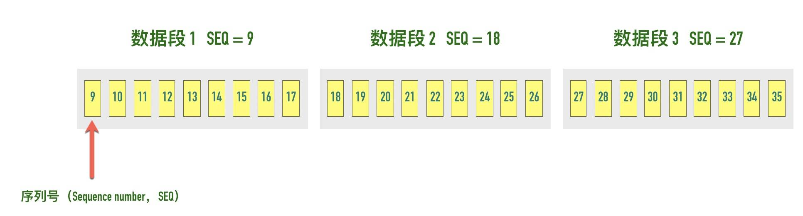

> 序列号是给字节编号，比如我们的报文的序列号是 9，发送了 9 个字节，那么下一个报文的序列号就是 18，中间的序列号就不用再次编号发送了（毕竟不可能所有 TCP 报文都只发送一个字节）

#### 初始序列号

在连接建立的时候，两边都要约定一个初始序列号，后续的 TCP 传输就是在这个初始序列号的基础之上不断进行。这种行为是通过主动建立连接的那一方发送 SYN 报文来实现的

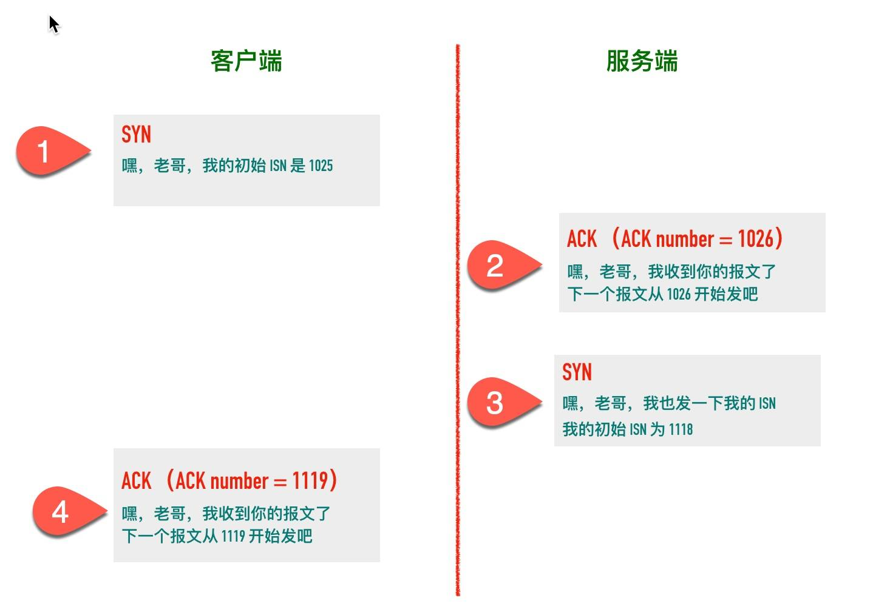

> 这里面 2 和 3 通常是合并发送的：ACK 和 SYN 都只是标志位，只占用同一个字节里的某一个比特，所以一个 TCP 报文**既可以是 ACK 也可以是 SYN 报文**

这个过程其实就是三次握手的过程：

- 主动连接方发送 SYN 报文，给出自己的起始序列号 ISN
- 服务端接收了 SYN 之后 ，发送 SYN + ACK 报文（一个报文的两个标志位）
  - ACK 表示 ACK 的是主动连接方发过来的 SYN，表示这个 SYN 包我收到了。这个是 TCP 协议的一个必须的过程：**每个字节都要被 ACK**
  - SYN 表示：我也把我的初始序列号 ISN 告诉你
- 主动连接方接收到 SYN + ACK 报文，知道两条信息：
  - 我的 SYN 包被对面接收到了确认了
  - 对面把它的 ISN 号码也告诉我了，我后面可以跟他通信了

可以把 SYN 报文看成占用一个字节的报文，所以我们需要 ACK，ACK 的值是 SYN 传输的 ISN + 1

### 确认号

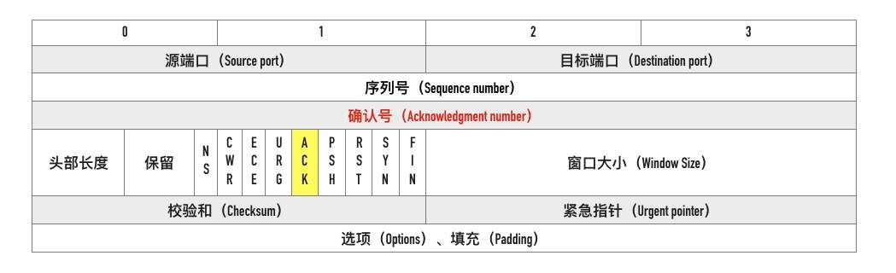

TCP 使用确认号（Acknowledgment number, ACK）来告知对方下一个期望接收的序列号，小于此确认号的所有字节都已经收到。

关于确认号有几个注意点：

- 不是所有的包都需要确认的
- 不是收到了数据包就立马需要确认的，可以延迟一会再确认
- ACK 包本身不需要被确认，否则就会无穷无尽死循环了
- 确认号永远是表示小于此确认号的字节都已经收到

> - 单纯的 ACK 包不需要被再次 ACK，因为纯 ACK 包并不携带字节（如果 ACK 的同时还携带了字节，那么是需要被 ACK 的）
> - 我们收到多个 TCP 包之后，分别是 3、5、7 个字节，可以一次性确认 15 个字节，也就是说：收到了多个 TCP 包，只回发一个 ACK 包来确认说自己全部收到了
> - 确认号 15 表示：15 之前的我都收到了，下一个你要从 15 开始发给我

### TCP 标志位

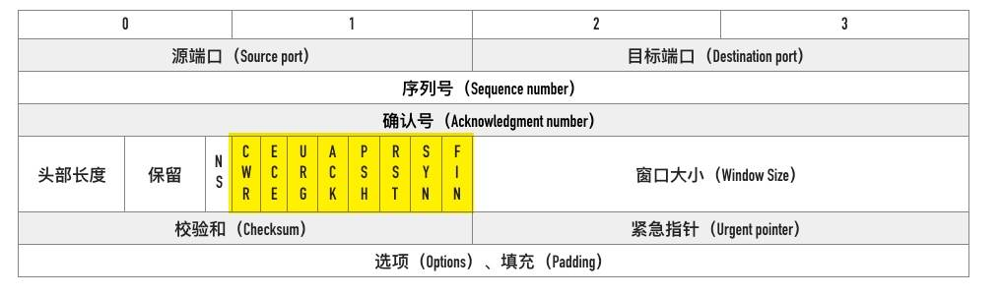

TCP 有很多种标记，有些用来发起连接同步初始序列号，有些用来确认数据包，还有些用来结束连接。

> 同一个包可以同时有多种标志，比如 SYN + ACK 标志、FIN + ACK 标志等

最常见的有下面这几个：

- SYN（Synchronize）：用于发起连接数据包同步双方的初始序列号（将自己的起始序列号告知对方）
- ACK（Acknowledge）：确认数据包（表示确认号之前的字节已经接收到了）
- RST（Reset）：这个标记用来强制断开连接，通常是之前建立的连接已经不在了、包不合法、或者实在无能为力处理
- FIN（Finish）：通知对方我发完了所有数据，准备断开连接，后面我不会再发数据包给你了。
- PSH（Push）：告知对方这些数据包收到以后应该马上交给上层应用，不能缓存起来

### 窗口大小

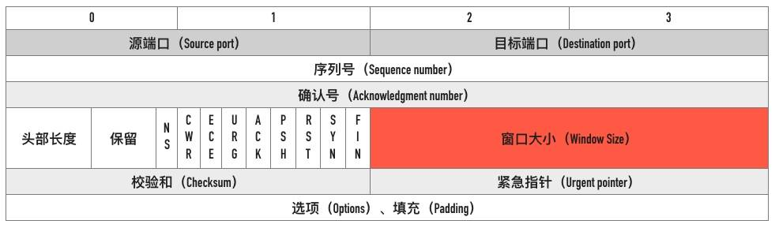

这个窗口大小表示告诉接收了报文的对方：我还能接收多少个字节的数据

之所以要有这个字段是为了控制对方传输的速度（当然对方也可以根本不管你继续发就完事儿了）。

当我们接收 TCP 流量的时候，有时候处理速度比较慢（比如逻辑很复杂），那么可能对方发送的速度超过我们处理的速度，缓冲区可能被撑爆了（接收了数据之后存放数据的地方），我们就需要对对方的发送速度进行控制。于是就有了这个字段：告诉对方说自己还能接收多少个字节的数据，不要超过了这么多

> 实际来说窗口大小字段有个缩放比例，主要还是为了填坑，窗口大小只有 16 个 bit，最多表示 64k 的大小，在今天的网络速度面前显然是不够的，于是在 SYN 建立连接的时候，会在 TCP 选项里填入窗口缩放比例，值是 0 到 14，表示将窗口扩大 2^0 ~ 2^14 倍
>
> 如果抓包的时候没有抓到 SYN 包，我们是不知道真正的窗口缩放值是多少的

### TCP 选项

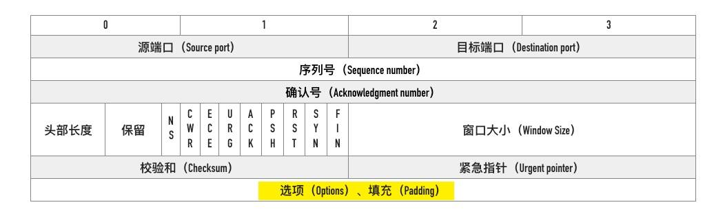

可选性的格式

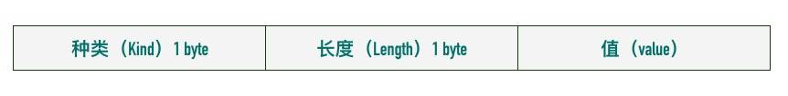

以 MSS 为例，kind=2，length=4，value=1460

常用的选项有以下几个：

- MSS：最大段大小选项，是 TCP 允许的从对方接收的最大报文段
- SACK：选择确认选项
- Window Scale：窗口缩放选项


## 三次握手

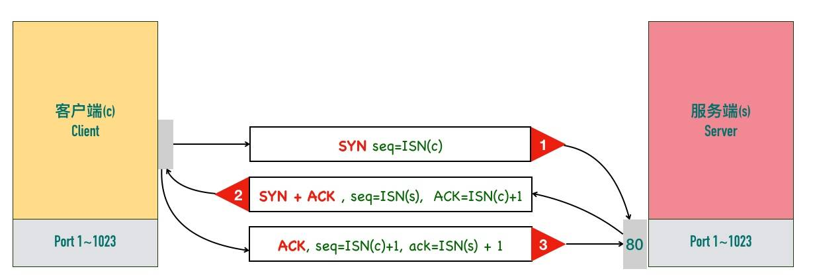

1、客户端发送的一个段是 SYN 报文，这个报文只有 SYN 标记被置位。

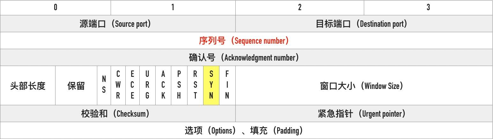

> SYN 报文不携带字节数据，但是它占用一个序列号，我们可以认为它携带了一个空字节
>
> 凡是消耗序列号的 TCP 报文段，一定需要对端确认。如果这个段没有收到确认，会**一直重传**直到达到指定的次数为止。

2、服务端收到客户端的 SYN 段以后，将 SYN 和 ACK 标记都置位

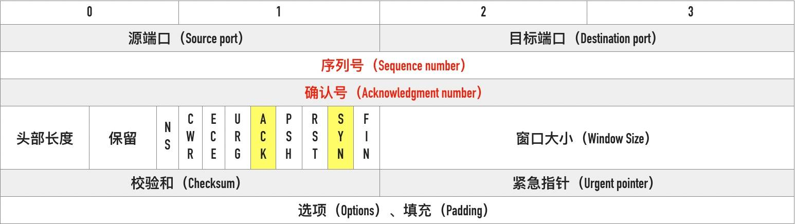

SYN 标记的作用与步骤 1 中的一样，也是同步服务端生成的初始序列号。ACK 用来告知发送端之前发送的 SYN 段已经收到了，「确认号」字段指定了发送端下次发送段的序号，这里等于客户端 ISN 加一。

> 确认号表示：确认号之前的报文我收到了，你下次发的报文要从确认号这个序列号开始

3、客户端发送三次握手最后一个 ACK 段，这个 ACK 段用来确认收到了服务端发送的 SYN 段。因为这个 ACK 段不携带任何数据，且不需要再被确认，这个 ACK 段不消耗任何序列号。

### 初始序列号

握手的目的就是交换初始序列号

初始的序列号并非从 0 开始，通信双方各自生成，一般情况下两端生成的序列号不会相同。生成的算法是 ISN 随时间而变化，会递增的分配给后续的 TCP 连接的 ISN。

一个建议的算法是设计一个假的时钟，每 4 微妙对 ISN 加一，溢出 2^32 以后回到 0，这个算法使得猜测 ISN 变得非常困难。

1、出于安全性考虑。如果被知道了连接的ISN，很容易构造一个在对方窗口内的序列号，源 IP 和源端口号都很容易伪造，这样一来就可以伪造 RST 包，将连接强制关闭掉了。如果采用动态增长的 ISN，要想构造一个在对方窗口内的序列号难度就大很多了。

2、因为开启 SO_REUSEADDR 以后端口允许重用，收到一个包以后不知道新连接的还是旧连接的包因为网络的原因姗姗来迟，造成数据的混淆。如果采用动态增长的 ISN，那么可以保证两个连接的 ISN 不会相同，不会串包。

> 出于安全的考虑   ISN 不应该固定。否则有被伪造的风险

### 三次握手的状态变化

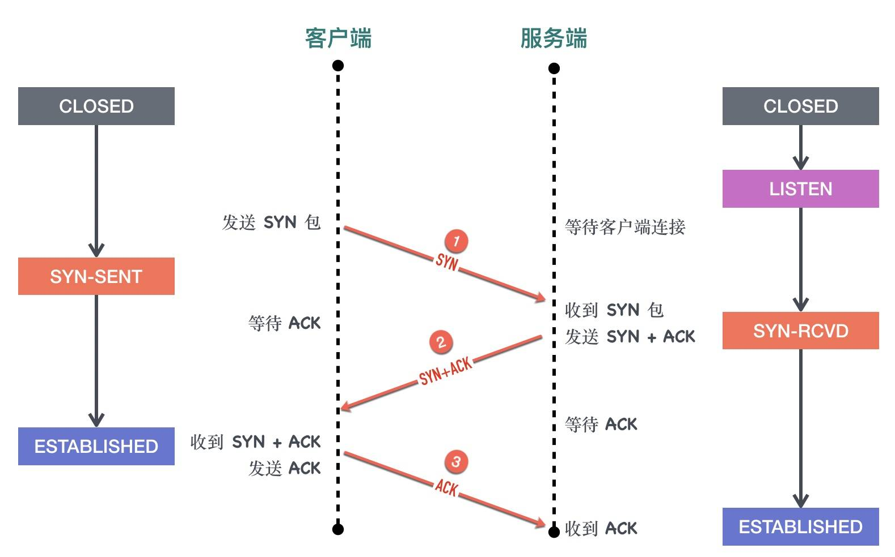

### 同时打开

过程是：

- 两端同时发生 SYN 报文
- 两端在 SYN-SENT 状态同时接受了对面的 SYN 报文，都进入 SYN-RCVD 状态
- 此时两端都会直接发送 SYN + ACK 报文，进入 ESTABLISHED 状态

> 主要的核心是：SYN-SENT 状态接受到了 SYN 报文的话，就进入 SYN-RCVD 状态，这时两边都像是一个服务端


## TCP 自连接

客户端在连接服务端时，如果没有指定端口号，系统会随机分配一个。随机就意味着可能分配一个和目的端口一样的数字，此时就会出现自连接情况了。因为对于tcp协议来讲，连接的流程是走的通，三次握手整个阶段都合法，连接自然可以建立。

> 危害就是可能把我们本来应该用来做监听用的端口给占用了，比如说进程 A 不断连接 50000，结果正好分配到了 50000 端口，自己连自己，这时候本来应该监听 50000 端口的进程起来发现端口没了

客户端随机分配的范围由 `/proc/sys/net/ipv4/ip_local_port_range` 文件决定，在我的 Centos 8 上，这个值的范围是 32768~60999，只要服务监听的端口小于 32768 就不会出现客户端与服务端口相同的情况。这种方式比较推荐。


## 四次挥手

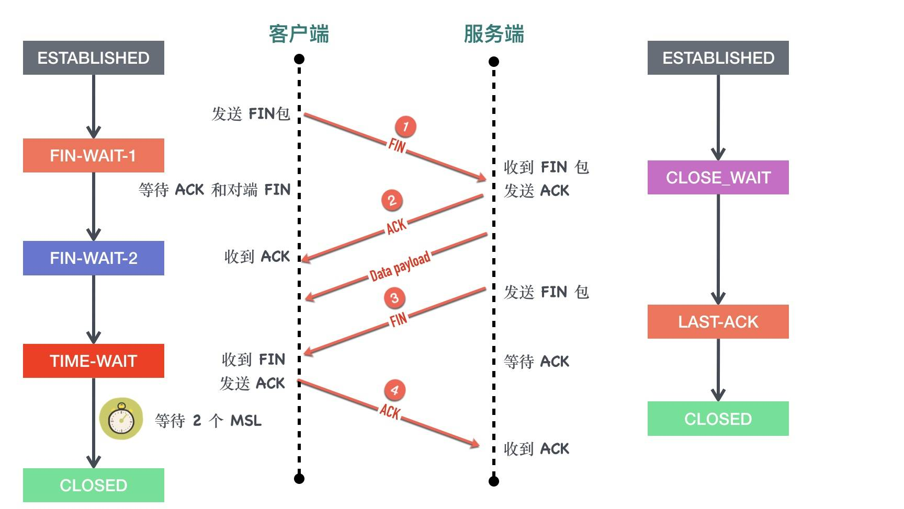

- 主动关闭方发送 FIN 包，进入 FIN-WAIT-1 状态
- 被动关闭方接收 FIN 包后，发送 ACK 确认，进入 CLOSE-WAIT 状态
- 主动关闭方接收到 ACK 之后，进入 FIN-WAIT-2 状态
- 被动关闭方继续发送其它数据
- 被动关闭方没有数据要发送了，发送 FIN 报文给主动关闭方，然后进入 LAST-ACK 状态，等待客户端的 ACK。同前面一样如果 FIN 段没有携带数据，也需要消耗一个序列号。
- 主动关闭方接收到 FIN 之后，发送 ACK 包给被动关闭方，自身进入 TIME_WAIT 状态，等待 2 个 MSL 进入 CLOSED 状态
- 被动关闭方接收到 ACK，进入 CLOSED 状态

### 为什么是四次

主要原因是：发送 FIN 包之后，就无法再发送其它数据了。被动关闭方在收到主动关闭方的 FIN 包的时候，经常是无法将 ACK + FIN 包一起发送的，因为这个时候被动关闭方可能还有很多数据需要发送给主动关闭方。

所以大多数时候是四次。如果被动关闭方其实也没什么数据要发了，那么可以稍微延迟一下发送，ACK + FIN 包一起发送，这就少了一次。

如果被动关闭方有很多数据要发送，死等这些数据准备好，然后 ACK + FIN 包一起发送，主动关闭方可能需要等待很久，会重发很多次 FIN 包，造成浪费网络带宽

### 同时关闭


也是一样的套路：

- 发送 FIN 后直接收到了对面的 FIN，FIN-WAIT-1 直接进入 CLOSING 状态
- 两边都直接再发个 ACK 即可
- 两边都认为自己是主动关闭方，都进入 TIME_WAIT 状态
- 等待 2 个 MSL 进入 CLOSED 状态


## TIME_WAIT

主动关闭方会进入 time_wait 状态，经过 2 个 MSL 彻底关闭连接。

### MSL

MSL（Max Segment Lifetime）报文最大生存时间，是 TCP 报文在网络中的最大生存时间。这个值与 IP 报文头的 TTL 字段有密切的关系。

IP 报文头中有一个 8 位的存活时间字段（Time to live, TTL）如下图。 这个存活时间存储的不是具体的时间，而是一个 IP 报文最大可经过的路由数，每经过一个路由器，TTL 减 1，当 TTL 减到 0 时这个 IP 报文会被丢弃。

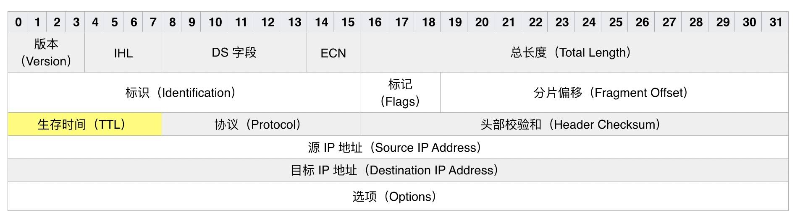

从上面可以看到 TTL 说的是「跳数」限制而不是「时间」限制，尽管如此我们依然假设**最大跳数的报文在网络中存活的时间不可能超过 MSL 秒**。Linux 的套接字实现假设 MSL 为 30 秒，因此在 Linux 机器上 TIME_WAIT 状态将持续 60秒。

> 也就是说，实际上报文只是有最大的转发次数，实际上没有生存时间的限制，这个值是估算出来的

### TIME_WAIT 存在的原因是什么

第一个原因：数据报文可能在发送途中延迟但最终会到达，因此要等老的“迷路”的重复报文段在网络中过期失效，这样可以避免用**相同**源端口和目标端口创建新连接时收到旧连接姗姗来迟的数据包，造成数据错乱。

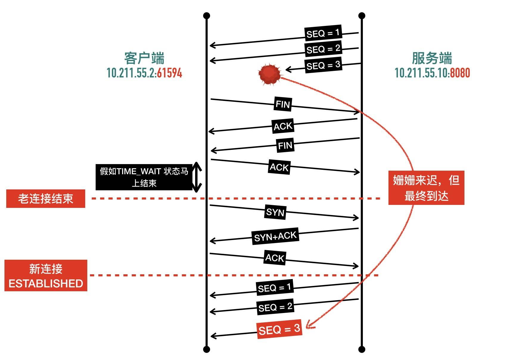

> 如果没有 time_wait，当我们关闭连接后，短时间内在同样的端口建立新的连接后，旧连接中迟到的报文可能会被新连接接收到，如果序列号正好回绕了，有可能旧连接到报文替代了新连接的报文，造成连接混乱。
>
> 有了 time_wait 后，由于经过了 2 MSL，可以确保旧连接的报文都失效了

第二个原因：主动关闭方最后发送 ACK 后，被动关闭方可能没有收到，那么被动关闭方就会重发 FIN 报文，如果此时主动关闭方已经关闭了，那么就无法重发 ACK 了，所以需要等待。一来一回就是 2 MSL（自己发过去是 MSL，对面重发 FIN 过来又是 MSL）

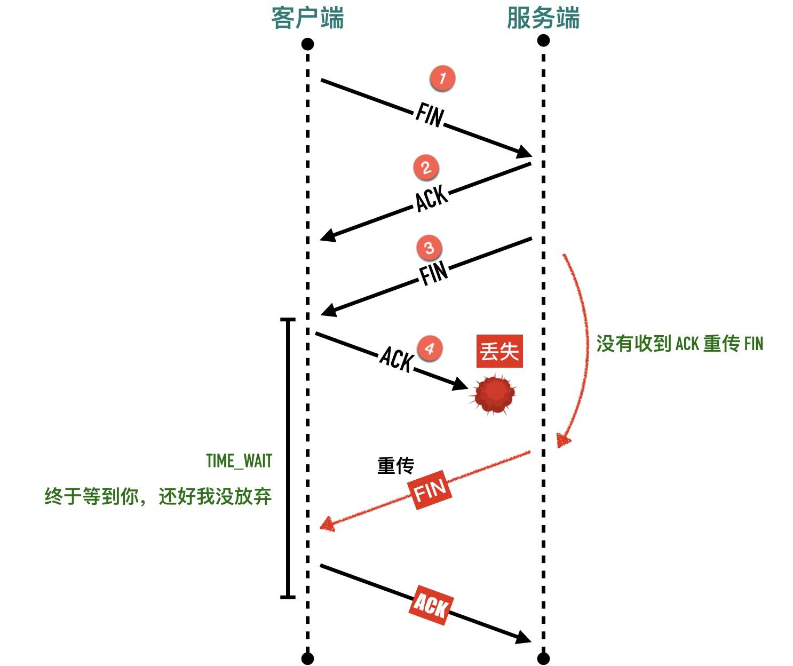

### 为什么是两个 MSL

- 1 个 MSL 确保四次挥手中主动关闭方最后的 ACK 报文最终能达到对端
- 1 个 MSL 确保对端没有收到 ACK 重传的 FIN 报文可以到达

2MS = 去向 ACK 消息最大存活时间（MSL) + 来向 FIN 消息的最大存活时间（MSL）

### TIME_WAIT 的问题

在一个非常繁忙的服务器上，如果有大量 TIME_WAIT 状态的连接会怎么样呢？

- 连接表无法复用
- socket 结构体内存占用

如果客户端与服务器通信全部使用短连接，不停的创建连接，接着关闭连接，客户端机器会造成大量的 TCP 连接进入 TIME_WAIT 状态。

### 应对 TIME_WAIT 的各种操作

重要的原理：SYN 建立连接的时候，可以开启时间戳选项，包的首部选项中都会带上时间戳，时间戳递增

#### tcp_tw_reuse 选项

缓解紧张的端口资源，一个可行的方法是重用“浪费”的处于 TIME_WAIT 状态的连接，当开启 net.ipv4.tcp_tw_reuse 选项时，处于 TIME_WAIT 状态的连接可以被重用。下面把主动关闭方记为 A， 被动关闭方记为 B，它的原理是：

- 如果主动关闭方 A **收到的包时间戳比当前存储的时间戳小**，说明是一个迷路的旧连接的包，直接丢弃掉
- 如果因为 ACK 包丢失导致被动关闭方还处于 `LAST-ACK` 状态，并且会持续重传 FIN+ACK。这时 A 发送SYN 包想三次握手建立连接，此时 A 处于`SYN-SENT`阶段。当收到 B 的 FIN 包时会回以一个 RST 包给 B，B 这端的连接会进入 CLOSED 状态，A 因为没有收到 SYN 包的 ACK，会重传 SYN，后面就一切顺利了。

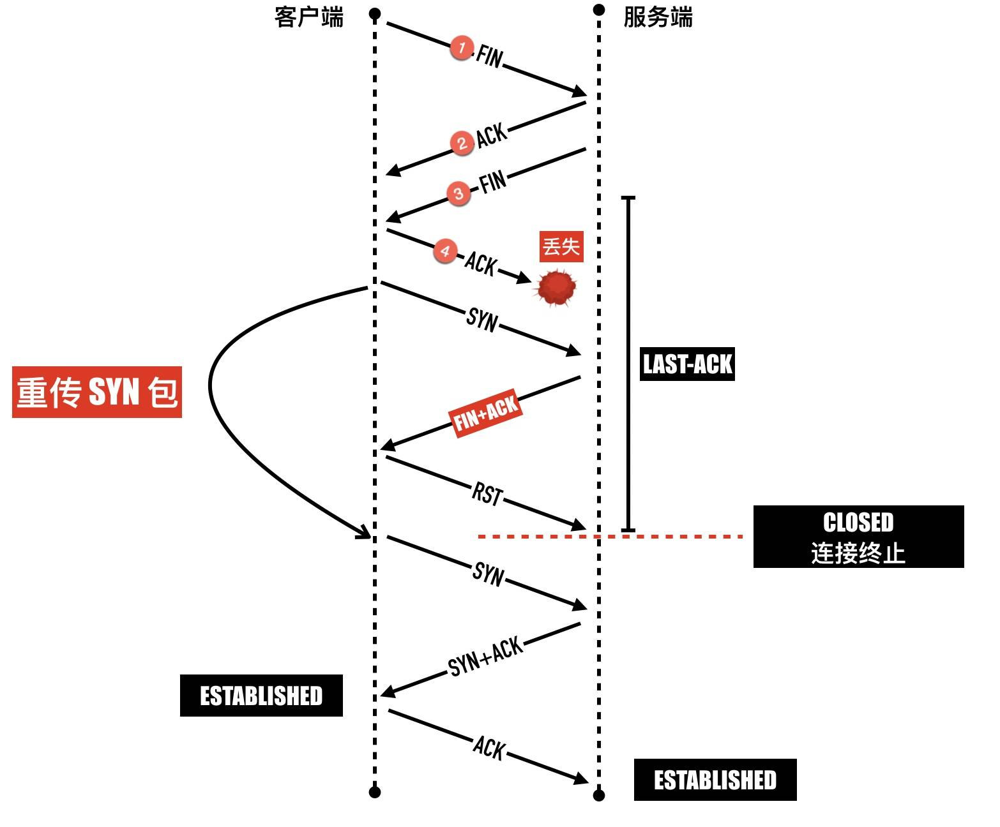

> - 时间戳开启后，可以分辨旧数据包
> - 接收到 FIN 包后直接 RST 让对面关闭（time_wait 下就是重传 ACK）

#### tcp_tw_recyle 选项

tcp_tw_recyle 是一个比 tcp_tw_reuse 更激进的方案， 系统会缓存每台主机（即 IP）连接过来的最新的时间戳。对于新来的连接，如果发现 SYN 包中带的时间戳与之前记录的来自同一主机的同一连接的分组所携带的时间戳相比更旧，则直接丢弃。如果更新则接受复用 TIME-WAIT 连接。

这种机制在客户端与服务端一对一的情况下没有问题，如果经过了 NAT 或者负载均衡，问题就很严重了。

因为每个 NAT 后面的客户端的机器时间可能是不一致的，有可能虽然是新连接，但是时间戳偏旧的情况，这个时候会被 TCP 丢弃，所以一般别使用这个选项

### 小结

TIME_WAIT 状态是最容易造成混淆的一个概念，这个状态存在的意义是

- 可靠的实现 TCP 全双工的连接终止（处理最后 ACK 丢失的情况）
- 避免当前关闭连接与后续连接混淆（让旧连接的包在网络中消逝）


## TCP 快速打开（TFO）

TFO 是在原来 TCP 协议上的扩展协议，它的主要原理是在**发送第一个 SYN 包的时候就开始传数据**了，不过它要求当前客户端之前已经完成过「正常」的三次握手。快速打开分两个阶段：请求 Fast Open Cookie 和 真正开始 TCP Fast Open

请求 Fast Open Cookie 的过程如下：

- 客户端发送一个 SYN 包，头部包含 Fast Open 选项，且该选项的Cookie 为空，这表明客户端请求 Fast Open Cookie
- 服务端收取 SYN 包以后，生成一个 cookie 值（一串字符串）
- 服务端发送 SYN + ACK 包，在 Options 的 Fast Open 选项中设置 cookie 的值
- 客户端缓存服务端的 IP 和收到的 cookie 值

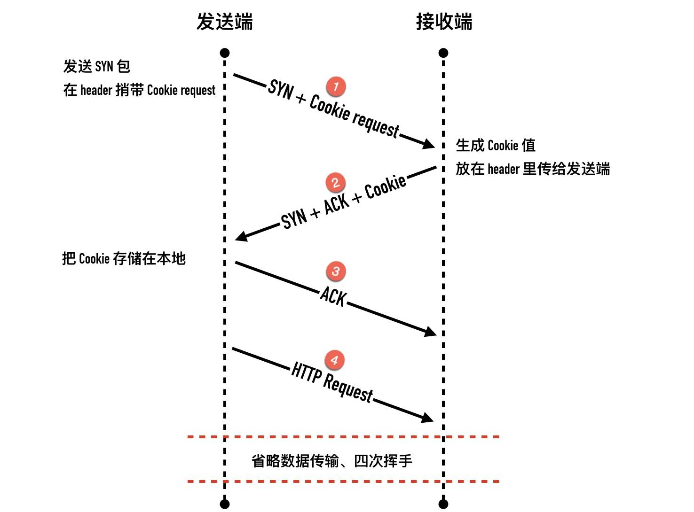

第一次过后，客户端就有了缓存在本地的 cookie 值，后面的握手和数据传输过程如下：

- 客户端发送 SYN 数据包，里面包含数据和之前缓存在本地的 Fast Open Cookie。（注意我们此前介绍的所有 SYN 包都不能包含数据）
- 服务端检验收到的 TFO Cookie 和传输的数据是否合法。如果合法就会返回 SYN + ACK 包进行确认并将数据包传递给应用层，如果不合法就会丢弃数据包，走正常三次握手流程（只会确认 SYN）
- 服务端程序收到数据以后可以握手完成之前发送响应数据给客户端了
- 客户端发送 ACK 包，确认第二步的 SYN 包和数据（如果有的话）
- 后面的过程就跟非 TFO 连接过程一样了

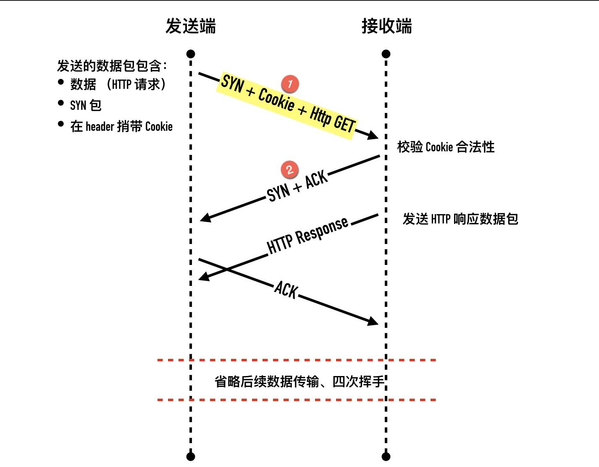

### 小结

1. 客户端发送一个 SYN 包，头部包含 Fast Open 选项，且该选项的 Cookie 长度为 0
2. 服务端根据客户端 IP 生成 cookie，放在 SYN+ACK 包中一同发回客户端
3. 客户端收到 Cookie 以后缓存在自己的本地内存
4. 客户端再次访问服务端时，在 SYN 包携带数据，并在头部包含上次缓存在本地的 TCP cookie
5. 如果服务端校验 Cookie 合法，则在客户端回复 ACK 前就可以直接发送数据。如果 Cookie 不合法则按照正常三次握手进行。

> 第一次连接，主要是设置 fast open 选项，然后连接建立后获取到 cookie 进行缓存
>
> 后续连接，发送 SYN 报文同时发生数据和 cookie，对端验证 cookie 通过的话，也发送 ACK + SYN + 数据。
>
> 这样就减少了一次握手
>
> 如果对端验证 cookie 不正确的话，就按照正常的 SYN 验证即可


## DDOS 攻击

listen 函数

```
int listen(int sockfd, int backlog);
```

### 半连接队列和全连接队列

当服务端调用 listen 函数时，TCP 的状态被从 CLOSE 状态变为 LISTEN，于此同时内核创建了两个队列：

- 半连接队列（Incomplete connection queue），又称 SYN 队列
- 全连接队列（Completed connection queue），又称 Accept 队列

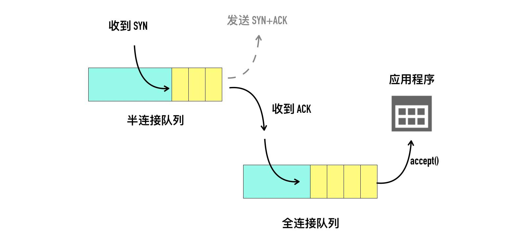

服务端收到 SYN ，将客户端连接放入半连接队列。自身发送 ACK+ SYN 后收到客户端的 ACK，就将其放入全连接队列。这时连接已经建立完成了。

#### 半连接队列

服务端回复 SYN+ACK 包以后等待客户端回复 ACK，同时开启一个定时器，如果超时还未收到 ACK 会进行 SYN+ACK 的重传，重传的次数由 tcp_synack_retries 值确定。在 CentOS 上这个值等于 5。

一旦收到客户端的 ACK，服务端就开始**尝试**把它加入另外一个全连接队列（Accept Queue）。

半连接队列的大小与三个值有关：

- 用户层 listen 传入的backlog
- 系统变量 `net.ipv4.tcp_max_syn_backlog`，默认值为 128
- 系统变量 `net.core.somaxconn`，默认值为 128

#### 全连接队列

「全连接队列」包含了服务端所有完成了三次握手，但是还未被应用调用 accept 取走的连接队列。此时的 socket 处于 ESTABLISHED 状态。每次应用调用 accept() 函数会移除队列头的连接。如果队列为空，accept() 通常会阻塞。全连接队列也被称为 Accept 队列。

你可以把这个过程想象生产者、消费者模型。内核是一个负责三次握手的生产者，握手完的连接会放入一个队列。我们的应用程序是一个消费者，取走队列中的连接进行下一步的处理。这种生产者消费者的模式，在生产过快、消费过慢的情况下就会出现队列积压。

listen 函数的第二个参数 backlog 用来设置全连接队列大小，但不一定就会选用这一个 backlog 值，还受限于 somaxconn。

如果全连接队列满，内核会舍弃掉 client 发过来的 ack（应用层会认为此时连接还未完全建立）

我们来模拟一下全连接队列满的情况。因为只有 accept 才会移除全连接的队列，所以如果我们只 listen，不调用 accept，那么很快全连接就可以被占满。

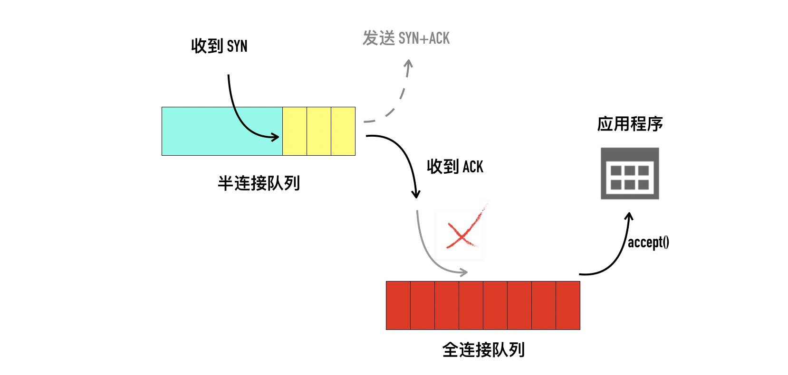

#### 小结

- 半连接队列：服务端收到客户端的 SYN 包，回复 SYN+ACK 但是还没有收到客户端 ACK 情况下，会将连接信息放入半连接队列。半连接队列又被称为 SYN 队列。
- 全连接队列：服务端完成了三次握手，但是**还未被 accept 取走**的连接队列。全连接队列又被称为 Accept 队列。
- 半连接队列的大小与用户 listen 传入的 backlog、net.core.somaxconn、net.core.somaxconn 都有关系。
- 全连接队列的大小是用户 listen 传入的 backlog 与 net.core.somaxconn 的较小值

### SYN flood 攻击

SYN Flood 是一种广为人知的 DoS（拒绝服务攻击） 想象一个场景：客户端大量伪造 IP 发送 SYN 包，服务端回复的 ACK+SYN 去到了一个「未知」的 IP 地址，势必会造成服务端大量的连接处于 SYN_RCVD 状态，而服务器的半连接队列大小也是有限的，如果半连接队列满，也会出现无法处理正常请求的情况。

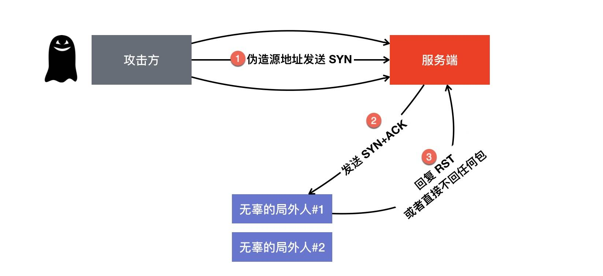

服务端因为没有收到 ACK，就会进行重传，centos 上是 5 次。重传的时间依然是指数级退避（1s、2s、4s、8s、16s），发送完最后一次 SYN+ACK 包以后，等待 32s，服务端才会丢弃掉这个连接，把处于SYN_RECV 状态的 socket 关闭。

在这种情况下，一次恶意的 SYN 包，会占用一个服务端连接 63s（1+2+4+8+16+32），如果这个时候有大量的恶意 SYN 包过来连接服务器，很快半连接队列就被占满，不能接收正常的用户请求。

#### 如何应对 SYN Flood 攻击

增加 SYN 连接数：tcp_max_syn_backlog。这个其实只是心理安慰，发生了攻击后，其实调大了也没卵用

减少重试次数：重试次数由 `/proc/sys/net/ipv4/tcp_synack_retries`控制，默认情况下是 5 次，当收到`SYN+ACK`故意不回 ACK 或者回复的很慢的时候，调小这个值很有必要。

#### SYN Cookie 机制

SYN Cookie 技术最早是在 1996 年提出的，最早就是用来解决 SYN Flood 攻击的，现在服务器上的 tcp_syncookies 都是默认等于 1，表示连接队列满时启用，等于 0 表示禁用，等于 2 表示始终启用。由`/proc/sys/net/ipv4/tcp_syncookies`控制。

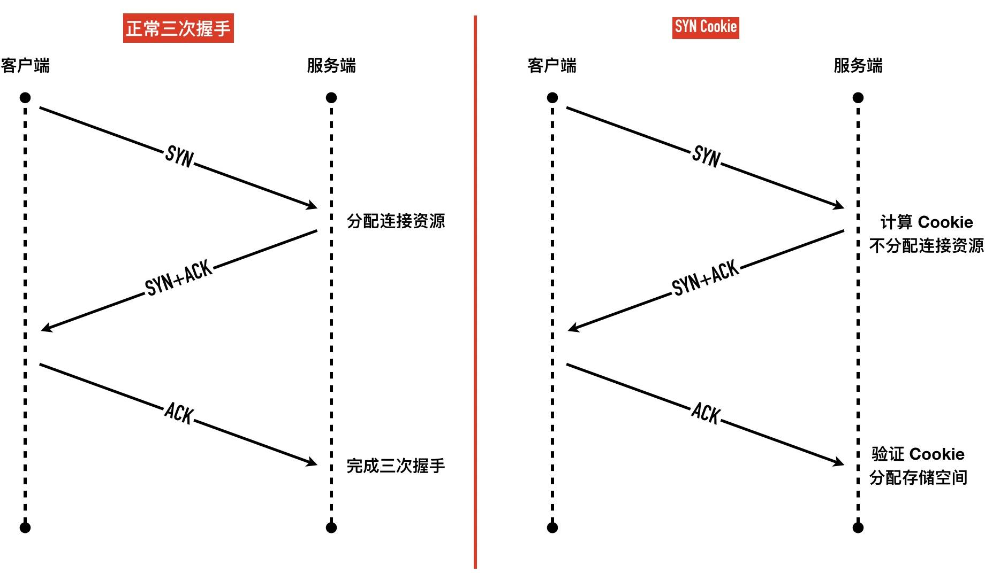

SYN Cookie 的原理是基于「无状态」的机制，服务端收到 SYN 包以后不马上分配为 `Inbound SYN`分配内存资源，而是根据这个 SYN 包计算出一个 Cookie 值，作为握手第二步的序列号回复 SYN+ACK，等对方回应 ACK 包时校验回复的 ACK 值是否合法，如果合法才三次握手成功，分配连接资源。

因为 syn-cookie 是一个无状态的机制，服务端不保存状态，不能使用其它所有 TCP 选项，比如 WScale，SACK 这些。因此要想变相支持这些选项就得想想其它的偏门，如果启用了 Timestamp 选项，可以把这些值放在 Timestamp 选项值里面。不在上面这个四个字段中的扩展选项将无法支持了，如果没有启用 Timestamp 选项，那就彻底凉凉了。

### 小结

DDOS 攻击其实主要的原理就是耗尽服务器的资源，资源分很多种。

例如：

- 通过伪造请求耗尽半连接队列
- 通过大量请求耗尽连接队列
- 通过大量请求耗尽带宽等等

它难以防御主要是因为它的确就是普通的请求。

防御措施主要还是聚焦于流量识别、请求特征识别等等。例如请求的频率、流量类型、数据包特征、正常业务的间隔等等。主要是基于这些用户特征的识别。

另一种就是死扛，即通过大量服务器和带宽资源的堆砌达到从容应对DDoS流量的效果。


## 端口复用 SO_REUSEPORT

常规情况下，端口是不能复用的：一个进程监听了 8080 端口，另一个进程就无法监听该端口。

有两种方式进行端口复用，一种就是监听端口，然后  fork 子进程，一种就是多个进程使用 SO_REUSEPORT

### fork 子进程

大致的步骤是：主进程调用 listen，然后 fork 子进程，那么子进程也 listen 了这个端口，从而实现了多个进程对于同一个端口的复用。

这种方式的问题在于惊群效应：多进程/多线程同时监听同一个套接字，当有网络事件发生时，所有等待的进程/线程同时被唤醒，但是只有其中一个进程/线程可以处理该网络事件，其它的进程/线程获取失败重新进入休眠。这样会带来 CPU 资源的浪费和锁竞争的开销。

### SO_REUSEPORT

这种方式就是多个进程在 listen 的时候加入端口复用的选项。当有请求进来的时候，操作系统随机选择一个进程去连接。

#### 安全性

试想下面的场景，你的进程进程监听了某个端口，不怀好意的其他人也可以监听相同的端口来“窃取”流量信息，这种方式被称为端口劫持（port hijacking）。SO_REUSEPORT 在安全性方面的考虑主要是下面这两点。

1、只有第一个启动的进程启用了 SO_REUSEPORT 选项，后面启动的进程才可以绑定同一个端口。 

2、后启动的进程必须与第一个进程的有效用户ID（effective user ID）匹配才可以绑定成功。

#### 好处

- 实现了内核级的负载均衡
- 支持滚动升级（Rolling updates）

滚动升级步骤如下所示。

1. 新启动一个新版本 v2 ，监听同一个端口，与 v1 旧版本一起处理请求。
2. 发送信号给 v1 版本的进程，让它不再接受新的请求
3. 等待一段时间，等 v1 版本的用户请求都已经处理完毕时，v1 版本的进程退出，留下 v2 版本继续服务


## 重传机制

超时重传，重传一定次数后关闭

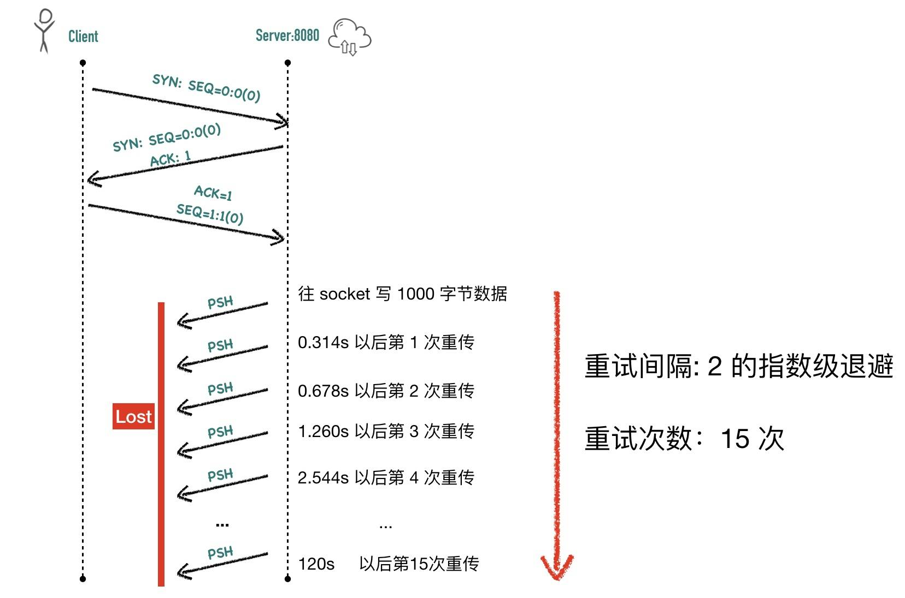

可以看到重传时间间隔是指数级退避，直到达到 120s 为止，总时间将近 15 分钟，重传次数是 15次 ，重传次数默认值由 /proc/sys/net/ipv4/tcp_retries2 决定（等于 15），会根据 RTO 的不同来动态变化。

### 快速重传与 SACK

快速重传的含义是：当发送端收到 3 个或以上重复 ACK，就意识到之前发的包可能丢了，于是马上进行重传，不用傻傻的等到超时再重传。

#### SACK

SACK（Selective Acknowledgment），选择确认。主要用于下面的情况：

A 端发送了 5 个包，B 端接收了 1、3、4、5，只有 2 没有收到，那么 B 端会不断发送 ACK = 2。

A 端接收到 ACK = 2，只能知道：除了 2 号包，3、4、5 包也有可能丢失，那到底是只重传数据包 2 还是重传 2、3、4、5 所有包呢？

聪明的网络协议设计者，想到了一个好办法

- 收到 3 号包的时候在 ACK 包中告诉发送端：喂，小老弟，我目前收到的最大连续的包序号是 **1000**（ACK=1001），[1:1001]、[2001:3001] 区间的包我也收到了
- 收到 4 号包的时候在 ACK 包中告诉发送端：喂，小老弟，我目前收到的最大连续的包序号是 **1000**（ACK=1001），[1:1001]、[2001:4001] 区间的包我也收到了
- 收到 5 号包的时候在 ACK 包中告诉发送端：喂，小老弟，我目前收到的最大连续的包序号是 **1000**（ACK=1001），[1:1001]、[2001:5001] 区间的包我也收到了

也就是说：SACK 机制除了发送 ACK 之外，还把自己收到的其它后续不连续的数据包编号也发给对端了，这样对端就知道需要重发哪些包了

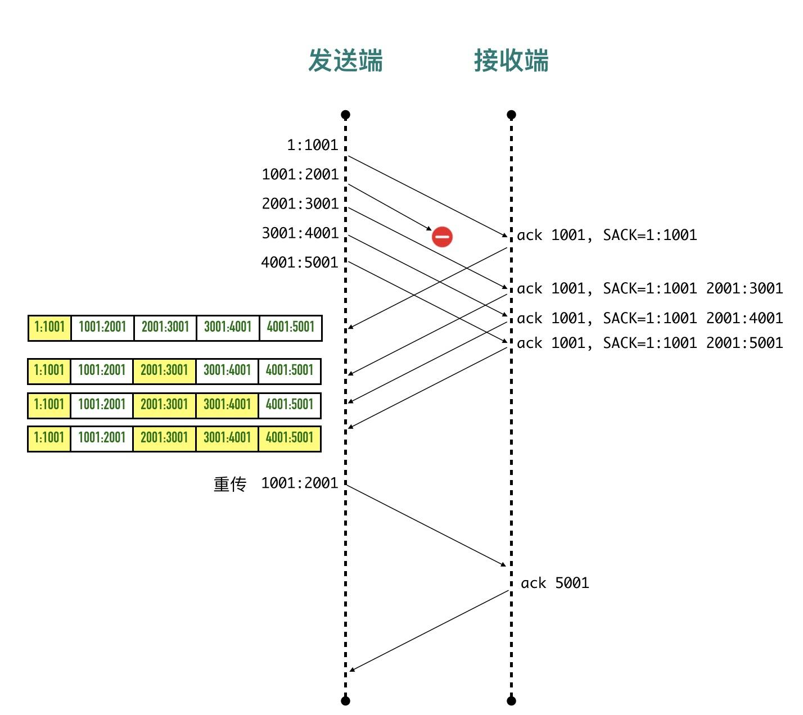

这些信息是附赠在报文首部的选项里的，选项长度可变，但由于整个TCP选项长度不超过40字节，实际最多不超过4组边界值，该选项参数告诉对方已经接收到并缓存的不连续的数据块，注意都是已经接收的，发送方可
根据此信息检查究竟是哪个块丢失，从而发送相应的数据块。


## 流量控制 滑动窗口

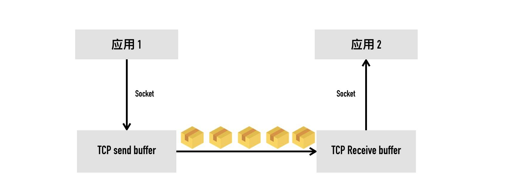

应用 2 的接收缓冲区可能会爆满：

- 应用 1 发的太快了
- 应用 2 消费的太慢了

为了防止接收缓冲区爆满，那么就需要有流量控制，通知应用 1 发慢一点，或者暂时别发了。

（想象一下双 11 发货的时候，货物都堆在小区的快递站点了，这时候就会告诉物流公司发货慢一点）

那发送端怎么知道接收端缓冲区是否已满呢？

为了控制发送端的速率，接收端会告知发送端自己的接收窗口（rwnd），也就是接收缓冲区中空闲的部分。

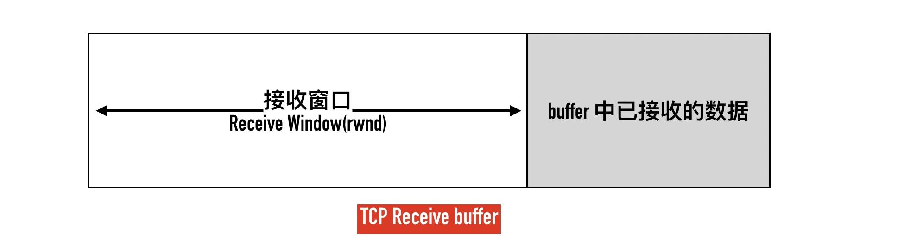

TCP 在收到对端回复的 ACK 包里会带上对端的接收窗口的大小，发送端需要根据这个值调整自己的发送策略。

### 发送窗口和接收窗口

总结如下：

- 自己的发送窗口，取决于对端的接收窗口
- 对端的发送窗口，取决于自己的接收窗口

### 发送窗口的内容

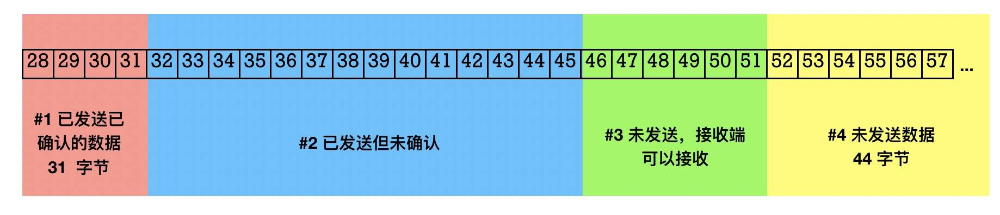

对于 TCP 的发送端来说，一个包可以分为以下四种状态：

- 已发送已确认
- 已发送未被确认
- 未发送，但是在对端的接收窗口内
- 未发送，但是不在对端的接收窗口内（即使数据在自己这里准备就绪了也不应该发送这些包）

发送窗口则是包含上面蓝色和绿色的部分


#### 零窗口探测

接收端缓冲区不足，最后可能为 0 ，那么发送端的发送窗口最后就是 0 了。

此时接收端如果恢复了处理能力，但是发送端并不会感知到。（接收端发送给发送端的 ACK 丢失的情况下）

发送端会主动进行零窗口探测，也是指数退避时间的重试。它会发送 ACK 报文，携带的一个字节序列号是接收端最后一次 ACK 的 SEQ - 1，也就是接收端已经确认过的包。

如果接收端的缓冲区恢复了处理能力，那么接收端会重新 ACK 这个字节，并且调整自己的接收 window 的大小，这时候发送端就知道接收端的接收窗口已经发生改变了。

### 小结

- 流量控制实际上就是接收端使用 window 告诉发送端：我还剩这么多字节的缓冲区，你别发多了
- 接收端的接收窗口就是这个 window 的大小（乘以缩放比例）
- 发送端的发送窗口就是取决于收到的 ACK包里的 ACK 号码和 window
- 流量控制控制的是两个节点间的流量传输，防止发送端发送过快过多。但是没有考虑整个网络的拥堵


## 拥塞控制

TCP 利用滑动窗口来做流量控制，流量控制这种机制确实可以**防止发送端向接收端过多的发送数据**，但是它只关注了发送端和接收端自身的状况，而**没有考虑整个网络的通信状况**。于是出现了要讲的拥塞处理。

拥塞处理主要涉及到下面这几个算法

- 慢启动（Slow Start）
- 拥塞避免（Congestion Avoidance）
- 快速重传（Fast Retransmit）和快速恢复（Fast Recovery）

为了实现上面的算法，TCP 的每条连接都有两个核心状态值：

- 拥塞窗口（Congestion Window，cwnd）
- 慢启动阈值（Slow Start Threshold，ssthresh）

### MSS

MSS 就是 TCP 数据包每次能够传输的最大数据分段，虽然 TCP 的报文可以很大，但是底层实际上是要分解成一个一个的包来发送的。一个 TCP 包可能由多个底层的数据包组成。

MSS 就是底层数据包能够承载的最大值，1460 个字节。

### 慢启动

你不知道对端有多快，如果有足够的带宽，你可以选择用最快的速度传输数据，但是如果是一个缓慢的移动网络呢？如果发送的数据过多，只是造成更大的网络延迟。这是基于整个考虑，每个 TCP 连接都有一个拥塞窗口的限制，最初这个值很小，随着时间的推移，每次发送的数据量如果在不丢包的情况下，“慢慢”的递增，这种机制被称为「慢启动」

> 主要原因是如果网络本身就很慢，我们传输的数据过多，那么会导致延迟更高

这个算法的过程如下：

- 第一步，三次握手以后，双方通过 ACK 告诉了对方自己的接收窗口（rwnd）的大小，之后就可以互相发数据了
- 第二步，通信双方各自初始化自己的「拥塞窗口」（Congestion Window，cwnd）大小。
- 第三步，cwnd 初始值较小时，每收到一个 ACK，cwnd + 1，每经过一个 RTT，cwnd 变为之前的两倍。 过程如下图

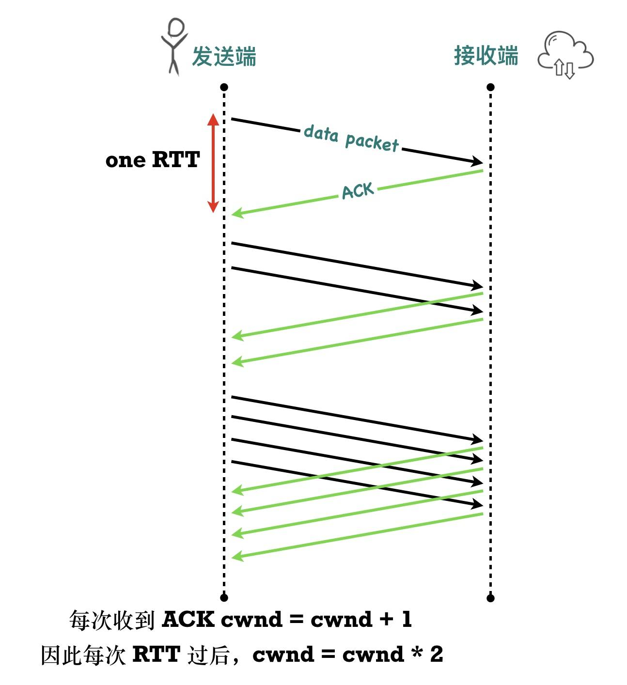

### 拥塞窗口

拥塞窗口指的是在收到对端 ACK 之前自己还能传输的最大 MSS 段数。初始值是 10 ，表示 TCP 发送方一开始能发送 10 个 MSS 段。

每次经过一个 RTT 这个拥塞窗口就翻倍。

主要是不对网络造成更大的影响，导致延迟更高。

### 慢启动阈值

慢启动拥塞窗口（cwnd）肯定不能无止境的指数级增长下去，否则拥塞控制就变成了「拥塞失控」了，它的阈值称为「慢启动阈值」（Slow Start Threshold，ssthresh），这是文章开头介绍的拥塞控制的第二个核心状态值。ssthresh 就是一道刹车，让拥塞窗口别涨那么快。

- 当 cwnd < ssthresh 时，拥塞窗口按指数级增长（慢启动）
- 当 cwnd > ssthresh 时，拥塞窗口按线性增长（拥塞避免）

### 拥塞避免

当 cwnd > ssthresh 时，拥塞窗口进入「拥塞避免」阶段，在这个阶段，每一个往返 RTT，拥塞窗口大约增加 1 个 MSS 大小，直到检测到拥塞为止。

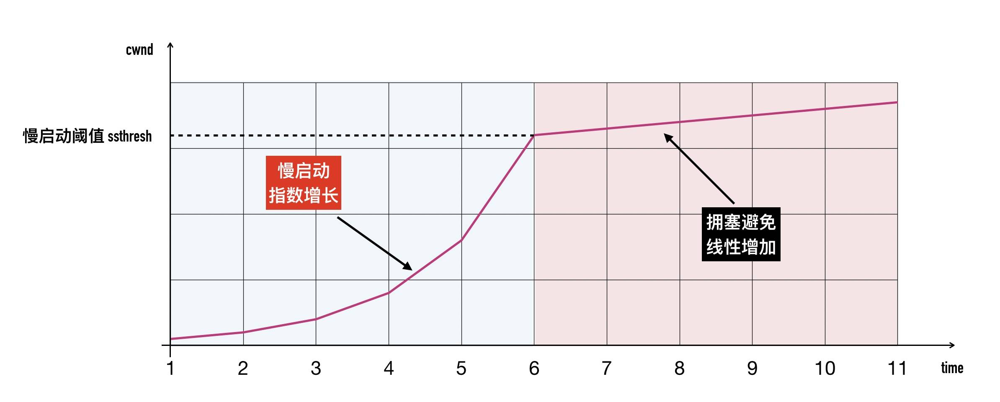

### 快速恢复

当收到三次重复 ACK 时，进入快速恢复阶段。解释为网络轻度拥塞。

- 拥塞阈值 ssthresh 降低为 cwnd 的一半：ssthresh = cwnd / 2
- 拥塞窗口 cwnd 设置为 ssthresh
- 拥塞窗口线性增加

### 为什么初始的拥塞窗口是 10

根据 Google 的研究，90% 的 HTTP 请求数据都在 16KB 以内，约为 10 个 TCP 段。再大比如 16，在某些地区会出现明显的丢包，因此 10 是一个比较合理的值。

### 小结

拥塞控制的几种算法：

- 慢启动：拥塞窗口一开始是一个很小的值，然后每 RTT 时间翻倍
- 拥塞避免：当拥塞窗口达到拥塞阈值（ssthresh）时，拥塞窗口从指数增长变为线性增长
- 快速重传：发送端接收到 3 个重复 ACK 时立即进行重传
- 快速恢复：当收到三次重复 ACK 时，进入快速恢复阶段，此时拥塞阈值降为之前的一半，然后进入线性增长阶段

> 这里讲的都是避免网络拥塞的一些行为，与流量控制是有区别的


## Nagle 算法

简单来讲 nagle 算法讲的是减少发送端频繁的发送小包给对方。例如我们代码里写的是往一个 socket 连接里不断的发送少量字节。TCP 不会那么蠢一次一次的发，而是会根据一定的规则进行合并和拆分发送。

Nagle 算法要求，当一个 TCP 连接中**有在传数据**（已经发出但还未确认的数据）时，**小于 MSS 的报文段就不能被发送，直到所有的在传数据都收到了 ACK**。同时收到 ACK 后，TCP 还不会马上就发送数据，会收集小包合并一起发送。网上有人想象的把 Nagle 算法说成是「hold 住哥」，我觉得特别形象。

默认情况下 Nagle 算法都是启用的，Java 可以通过 `setTcpNoDelay(true);`来禁用 Nagle 算法。

### 典型的小包场景 SSH

一个典型的大量小包传输的场景是用 ssh 登录另外一台服务器，每输入一个字符，服务端也随即进行回应，客户端收到了以后才会把输入的字符和响应的内容显示在自己这边。比如登录服务器后输入`ls`然后换行，中间包交互的过程如下图

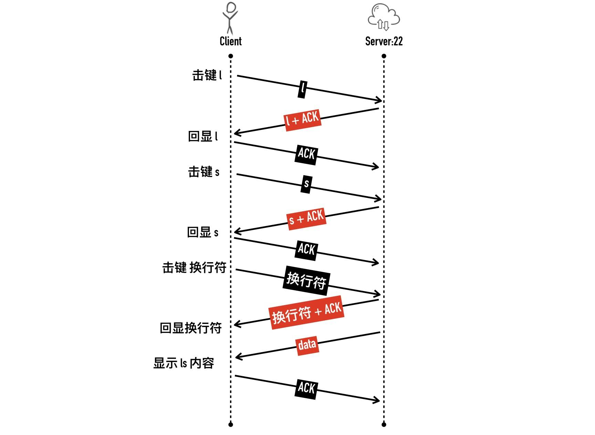

### Nagle 算法的意义

Nagle 算法的作用是减少小包在客户端和服务端直接传输，一个包的 TCP 头和 IP 头加起来至少都有 40 个字节，如果携带的数据比较小的话，那就非常浪费了。就好比开着一辆大货车运一箱苹果一样。

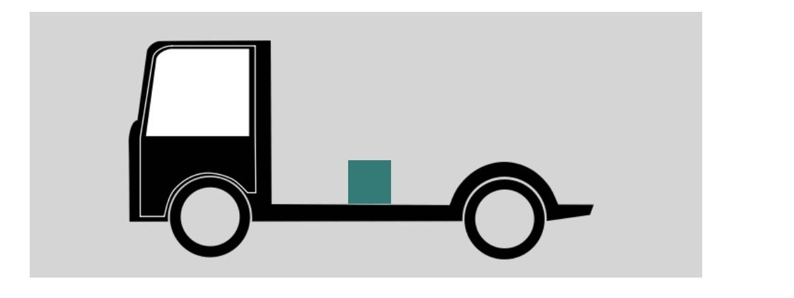

> 说白了减少 TCP 和 IP 头部的消耗，避免发送很多个这种无用的信息

在低延迟的场景下是没多大意义的，因为 ACK 很快，可能你刚要发下一段的时候，前面的消息就都已经被 ACK 了，基本不怎么触发 Nagle 的条件

### 小结

Nagle 算法可以有效的减少网络上小包的数量。Nagle 算法是应用在发送端的，简而言之就是，对发送端而言：

- 当**第一次发送数据时不用等待**，就算是 1byte 的小包也立即发送

- 后面发送数据时需要累积数据包直到满足下面的条件之一才会继续发送数据：

  - 数据包达到最大段大小 MSS
  - 之前发送的数据包的 ACK 全部被接收到了

  


## 延迟确认

首先必须明确两个观点：

- 不是每个数据包都对应一个 ACK 包，因为可以合并确认。
- 也不是接收端收到数据以后必须立刻马上回复确认包。

如果收到一个数据包以后暂时没有数据要分给对端，它可以等一段时间（Linux 上是 40ms）再确认。如果这段时间刚好有数据要传给对端，ACK 就可以随着数据一起发出去了。如果超过时间还没有数据要发送，也发送 ACK，以免对端以为丢包了。这种方式称为「延迟确认」。

需要立马回复 ACK 的场景有：

- 如果接收到了大于一个帧的报文，且需要调整窗口大小
- 处于 quickack 模式（tcp_in_quickack_mode）
- 收到乱序包（We have out of order data.）

### Nagle + 延迟确认

两种组合在一起很可能有性能问题，特别是在包小，而延迟确认时间长的情况下：

- Nagle 等发送端接收了对端对之前报文的 ACK 后才接着发
- 接收端等到延迟确认的时间后才发送确认

那么可以预见的就是发送端一直不发要等到接收端确认，接收端的确认则是故意很慢。从而导致了性能下降。

### 延迟确认无法关闭

大部分 Linux 实现上并没有开关可以关闭延迟确认


## keep alive 原理

一个 TCP 连接上，如果通信双方都不向对方发送数据，那么 TCP 连接就不会有任何数据交换。这就是我们今天要讲的 TCP keepalive 机制的由来。

### 原理

当一个 TCP 连接建立之后，启用 TCP Keepalive 的一端便会启动一个计时器，当这个计时器数值到达 0 之后（也就是经过tcp_keep-alive_time时间后，这个参数之后会讲到），一个 TCP 探测包便会被发出。这个 TCP 探测包是一个纯 ACK 包（规范建议，不应该包含任何数据，但也可以包含1个无意义的字节，比如0x0。），其 Seq号 与上一个包是重复的，所以其实探测保活报文不在窗口控制范围内。
