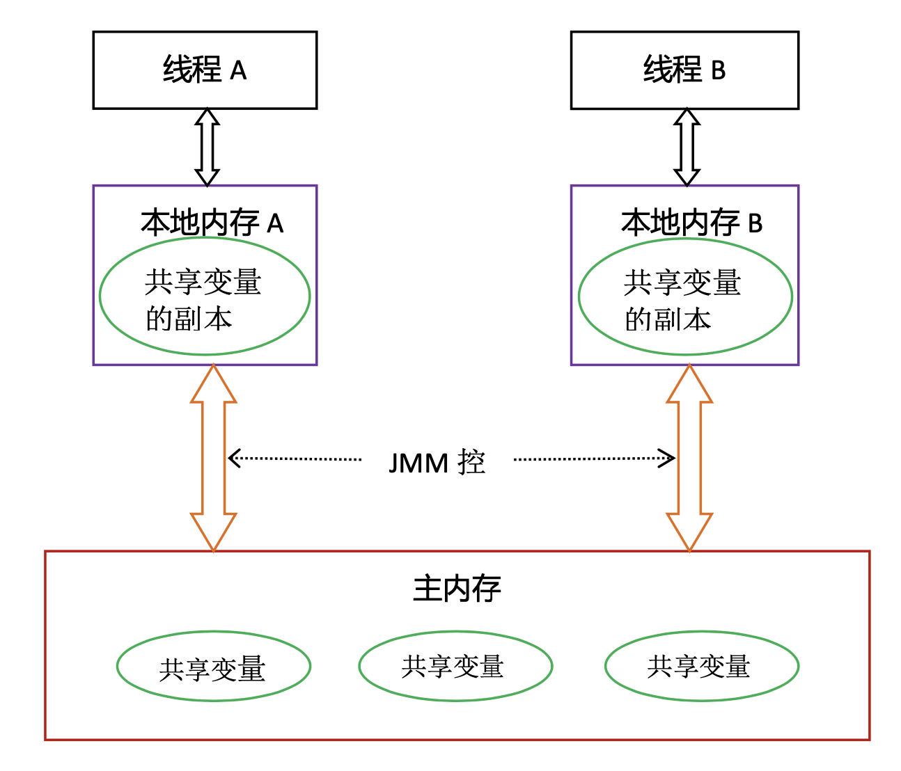
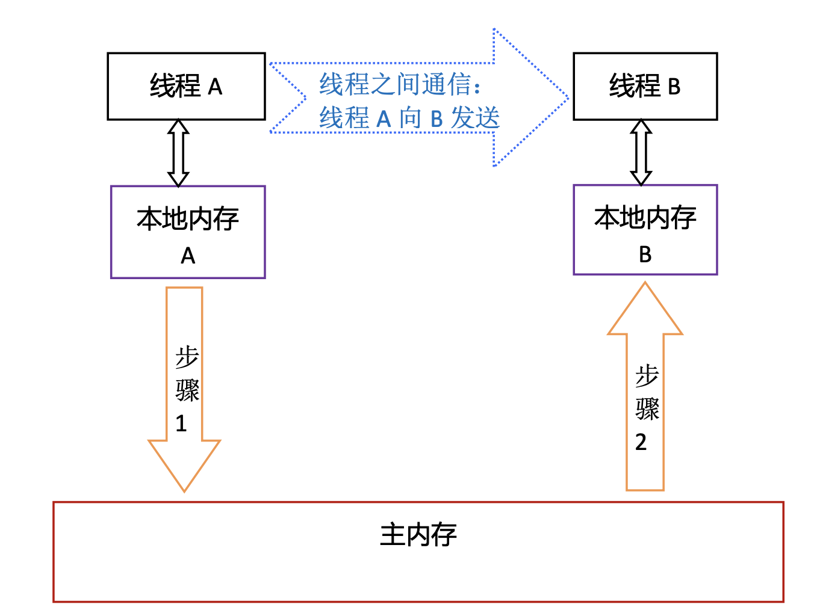
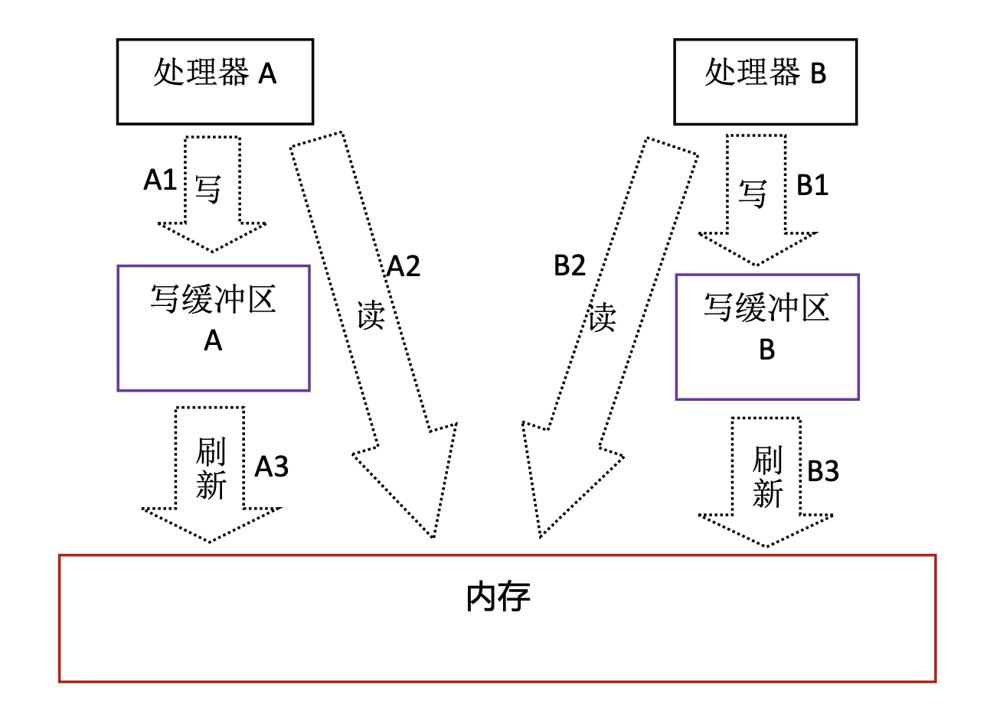
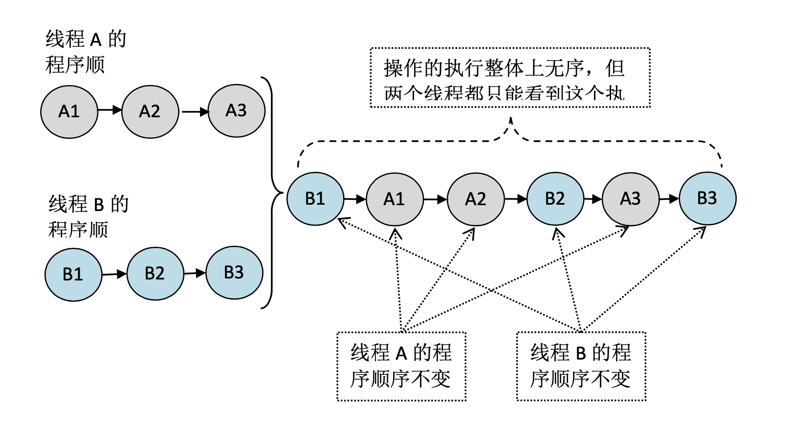
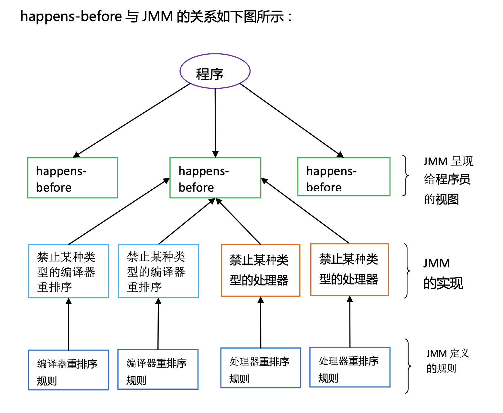

## 共享内存和消息传递

### 通信

- 共享内存使用隐式方式通信：读写公共状态
- 消息传递使用显式方式通信：发送消息

### 同步

- 共享内存：显式指定某个方法或者某段代码需要在线程之间互斥执行
- 消息传递：隐式指定，因为消息的发生必须发生在消息接收之前


## java 内存模型

JMM 决定了一个线程对共享变量的写入何时对另一个线程可见。



主内存基本可以理解成 JVM 的堆内存的对象实例数据部分，因为这部分的内存是线程共享的，肯定是会有读写顺序的问题的。

> 这里一个在堆中 10M 的对象会在本地内存中有 10M 的副本吗？
>
> 不会的，因为堆中一个对象都是：引用 ---> 字段对象引用 ---> 字段对象引用 ---> 基本数据类型
>
> 程序最终操作的都是引用或者基本数据类型，本地内存中保存的也是这些定长类型，实际上副本的大小很小

从上图看，线程 A 与线程 B 通信需要经过 2 个步骤：

- A 线程把本地内存 A 中更新过的的共享变量副本刷写到主内存中去
- B 线程从主内存中读取 A 更新过的共享变量



这种共享内存的方式可以理解成：**主内存被当成了消息传递的缓冲区**，但是并不保证消息发送一定在消息接收之前。（B 线程可能先读取完了之后，A 线程才将更新刷写到主内存，这也就导致了不可见的问题）

### 总结

JMM 出现的原因是：

- CPU 本身就是具有多级高速缓存的，JMM 的本地内存基本对应于栈内存的部分区域和 CPU 的**高速缓存**。CPU 高速缓存就是具有这种读取和写入不一致的情况，因此有 CPU 的缓存一致性协议，而 JMM 封装了底层高速缓存的细节，将其相关的行为包装成 JMM 

  > 高速缓存导致写主内存是一个异步操作，写入返回之后，写入工作并不一定完成了，其它线程并不能马上看见这次的写入

JMM 解决的问题是：

- 高速缓存机制导致的读写顺序问题
- 一个线程进行写入操作后，何时可以被其它线程观测到

JMM 内存的对应关系：

- 主内存对应于堆内存里的对象实例数据
- 工作内存对应于 CPU 高速缓存


## 重排序

重排序的目的：

- 提高运行的性能

重排序的类型：

- 编译器重排序：编译的时候就可以分析出一些重排序的规则来，然后将一些代码重排序
- 处理器重排序：运行的时候，CPU 对指令进行重排序（CPU 的并行流水线）

重排序的行为：

- 单线程的执行结果不会发现变化：看起来就跟没有重排序是一样的
- **A 线程的执行过程对于 B 线程来说看起来是乱序的**：我们不能假设在 B 线程中可以看到 A 线程的 A1 操作发生在 A2 操作之前
- 由于单线程的执行结果不能发现变化，所以对于一些有依赖性的操作，不会进行重排序：例如单线程对同一个变量写入两次，这两个写入操作的相对顺序不会发现变化（不能改变执行结果）


## 写缓冲和重排序导致的不可见问题

| 线程 A              | 线程 B              |
| ------------------- | ------------------- |
| a = 1; // A1        | b = 2; // B1        |
| x = b; // A2        | y = a; // B2        |
| 初始状态：a = b = 0 | 初始状态：a = b = 0 |
| 可能的结果：x = 0   | 可能的结果：y = 0   |

很明显，如果没有重排序和写缓冲，写入操作立即可见的情况下，不可能会出现 x = y = 0 的情况：

- 如果 x = 0，说明 A 线程运行完 A2 的时候，B1 尚未运行，也就是说运行顺序是 A1-A2-B1-B2
- 此时 y 必然等于 1
- 如果 y = 0，说明 B 线程运行完 B2 的时候，A1 尚未运行，也就是说运行顺序是 B1-B2-A1-A2
- 此时 x 必然等于 2

而实际上，由于有写缓冲的存在，导致了重排序的现象：

- 虽然 A1 操作发生在 A2 之前，但是 A1 返回的时候，仅仅将工作内存里的 a 进行了修改为 1，并未刷写到主内存(A3)
- A2 操作读取到了主内存的 b = 0，于是 x = 0（此时 B3 未完成）
- 虽然 B1 操作发生在 B2 之前，但是 B1 返回的时候，仅仅将工作内存里的 b 进行了修改为 2，并未刷写到主内存(B3)
- B2 操作读取到了主内存的 a = 0，于是 y = 0（此时 A3 未完成）



也就是说执行顺序可能是：A1-A2-B1-B2-A3-B3

A3 和 B3 这两个真正写主内存的操作都发生在读取操作 A2、B2 之后，所以他们读到的都是初始值 0

> 这种就是读写的重排序，我们发现读操作最后都被排到了写操作的前面
>
> 而 JMM 就是用来控制并且描述这种重排序行为的，让我们有办法屏蔽或者控制这种行为


## 执行顺序模型

理想的执行顺序模型：



理想的顺序模型下，A 和 B 整体是有序的，虽然它们不一定是连续执行的，但是每个线程的顺序是与线程定义的一样的，这种执行顺序模型也是我们脑海里经常会默认的模型。

但是很可惜，**这种执行模型在 JAVA 中是不存在的**。

在 JAVA 中：

- 单个线程是有序的：A 观察 A 自己觉得自己就是按照 A1、A2、A3 执行的

- 多个线程是乱序的：B 观察 A 觉得线程 A 完全是打乱了顺序执行的，可能是 A3、A1、A2 的顺序。因此完全无法保证可见性。

  > 即使 B 读取到了 A3 写入的值，也不一定保证能读取到 A1 写入的值

- 锁的顺序是有序的，例如 A 线程执行了 A1、(A2、A3、A4)、A5，其中 A2、A3、A4 是在一个同步锁中执行的，此时 B 线程执行 B1、B2、B3，B2 是获取锁的操作，那么 B2 操作时可以观察到正常顺序的 A2、A3、A4（这三个操作可能在内部有重排序，但是在外部的观察还是顺序执行的）


## happens-before

由于上面的不可见的问题，以及多线程的乱序问题，于是 JMM 提出了 happens-before 的规则，这些规则定义了可见性的规则：也就是定义了**什么样的操作对什么样的操作是可见的**。

比如说操作A先行发生于操作B，其实就是说在发生操作B之前，操作A产生的影响能被操作B观察到。

如果两个操作没有 happens-before 关系，那么操作的可见性就无法保证。

- 程序次序规则（Program Order Rule）：**在一个线程内**，按照控制流顺序，书写在前面的操作先行发生于书写在后面的操作。注意，这里说的是控制流顺序而不是程序代码顺序，因为要考虑分支、循环等结构。

  > 单个线程内，后面的操作总能观察到前面操作的结果

- 管程锁定规则（Monitor Lock Rule）：一个 unlock 操作先行发生于后面对同一个锁的 lock 操作。这里必须强调的是同一个锁，而 "后面" 是指时间上的先后。

  > A 线程解锁，B 线程可以观测到这个解锁操作，于是 B 线程可以立刻进行加锁。不会出现这种情况：A 解锁了，B 却以为 A 还未解锁

- volatile变量规则（Volatile Variable Rule）：对一个volatile变量的写操作先行发生于后面对这个变量的读操作，这里的后面同样是指时间上的先后。

  > 对于一个 volatile 的写入操作，能立刻被其它线程观察到结果，也就是说其它线程在这个写入操作发生后进行读取的话，一定能读到最新的值。底层是通过内存屏障实现的

- 线程启动规则（Thread Start Rule）：Thread对象的 start() 方法先行发生于此线程的每一个动作。

- 线程终止规则（Thread Termination Rule）：线程中的所有操作都先行发生于对此线程的终止检测，我们可以通过Thread::join()方法是否结束、Thread::isAlive()的返回值等手段检测线程是否已经终止执行。

  > 我们可以通过这些 API 立刻知道线程是否结束

- 线程中断规则（Thread Interruption Rule）：对线程interrupt()方法的调用先行发生于被中断线程的代码检测到中断事件的发生，可以通过Thread::interrupted()方法检测到是否有中断发生。

  > `Thread::interrupted()` 方法可以立刻观察到别的线程对自己这个线程是否调用了 interrupt() 方法

- 对象终结规则（Finalizer Rule）：一个对象的初始化完成（构造函数执行结束）先行发生于它的 finalize() 方法的开始。

- 传递性（Transitivity）：如果操作A先行发生于操作B，操作B先行发生于操作C，那就可以得出操作A先行发生于操作C的结论。

最重要的规则：

- 程序次序规则：单线程前面的操作影响都对后面的操作可见
- 管程锁定规则：同一个锁的解锁操作可以立刻被它的加锁操作观察到（立刻就知道是否已经被加锁了）
- volatile变量规则：volatile 的写入操作立刻被它的读取操作可见（总能读取到最新的值）
- 传递性规则：A 对 B 可见，B 对 C 可见，那么 A 对 C 可见

如果两个操作之间不存在 happens-before 规则，那么它们的可见性是不确定的。

例如两个线程同时对一个未使用 volatile 修饰的变量进行读写，假设从时间顺序上来说，A 线程先写入了该变量，B 线程后读取该变量，依然无法保证 B 线程能读取到 A 写入了的值，因为它们没有 happens-before 规则。

### 总结

一个操作的影响要保证可以被另一个操作观察到，它们一定要有 happens-before 的关系。

- A happens-before B 不是说 A 一定要发生在 B 的前面
- 而是说：A 操作如果发生在 B 的前面，A 操作的影响可以被 B 操作观察到

例如：

```java
// 以下操作在同一个线程中执行
int i = 1; // A1
int j = 2; // A2
```

这里 A1 happens-before 于 A2（程序次序规则），即使 A2 并不需要读取 A1 的值，但是 happens-before 规则是存在的。

但是 A1 不一定比 A2 先执行，因为它们没有依赖关系，运行的时候依然可能进行重排序。

> happens-before 只是 JVM 确保可见，但是你如果压根儿就不去观察，那么 JVM 也就知道可以重排序




## volatile

### 特性

可以把 volatile 变量的读写看成：使用同一个锁，来对这个 volatile 变量进行读写。举例如下：

```java
public class Test {
    volatile long vl = 0L;

    public void set(long l) {
        vl = l;
    }

    public void increment() {
        vl++;
    }

    public long get() {
        return vl;
    }
}
```

上面的代码从语义上可以看做等价于

```java
public class Test {
    long vl = 0L;

    public synchronized void set(long l) { // 使用锁来同步写入
        vl = l;
    }

    public void increment() {
        long temp = get(); // 调用同步的获取
        temp += 1;
        set(temp);  // 调用同步的写入
    }

    public synchronized long get() {  // 使用锁来同步获取
        return vl;
    }
}
```

总之，volatile 具有以下特性：

- 可见性：对于一个 volatile 变量的读取，总是读取到任意线程对这个变量最后的写入（总是读到最新值）
- 原子性：读或者写具有原子性（非 volatile 变量的 long 和 double 类型，写入不具有原子性）

### happens-before 关系

```java
public class Test {
    int a = 0;
    volatile boolean flag = false;

    public void writer() {
        a = 1; // 1
        flag = true; //2
    }

    public void reader() {
        if (flag) { // 3
            int i = a; //4
        }
    }
}
```

这种情况下：

- 1 happens before 2
- 3 happens before 4
- 2 happens before 3 （volatile 规则）
- 因此 1 happens before 4（传递性）

因此，当一个线程执行 writer，一个线程执行 reader，如果 reader 线程执行到了 if 里面，看到了 flag 为 ture 的话，一定能看到 a = 1。（如果 flag 不是 validate，则没有这个保证）

> 底层原理是：volatile 写入导致所有工作内存刷新到主内存，volatile 读取导致所有工作内存失效，从主内存去读取，于是读取到了已经写入到了主内存的最新的 a 值

### 内存语义

- 写入一个 volatile 变量时，JMM 会将该线程对应的本地内存中的共享变量刷新到主内存（于是在它之前的操作更新的共享变量也得以刷写到主内存）
- 读取一个 volatile 变量时，JMM 会将该线程对应的本地内存中的共享变量置为无效，从主内存中读取共享变量（于是同时也可以读取到其它共享变量在主内存的值）

