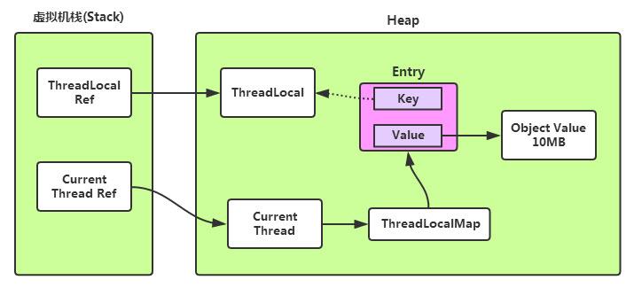

## 1.java是解释执行吗

并不完全是解释执行，对于运行时的热点代码会被 JIT 编译成机器码，这部分就是编译执行的了

- Server 模式的 JVM 统计的数据更多，需要上万次的调用才会进行 JIT 编译
- Client 模式的 JVM 统计的数据较少，门限是 1500 次就进行 JIT 编译

JVM 参数：

- `-Xint` 只解释执行，不进行 JIT 编译
- `-Xcomp` 只编译执行，并不一定比普通 JIT 快
  - 首先是启动会慢
  - 其次是一些分支预测不进行 profiling 的话，不能有效优化


## 2.为什么 JVM 不全程 JIT

- 首先，编译有时间开销，对于一些只执行少数次数的代码，JIT 没啥卵用可能更慢
- 第二是编译也有空间开销，编译后的大小扩增了 10 倍以上
- 对于一些代码只有运行的时候才知道怎么更好的优化，所以只能先解释执行看看效果，收集一下 profile


## 3.Exception 和 Error 的区别


- 首先，Error 和 Exception 都继承自 Throwable，只有 Throwable 类型的实例才可以被抛出或者捕获
- Exception 是程序正常运行中，可以预料的意外情况，可能并且应该被捕获，进行相应处理。
- Error 是指在正常情况下，不大可能出现的情况，绝大部分的 Error 都会导致程序（比如 JVM 自身）处于非正常的、不可恢复状态。既然是非正常情况，所以不便于也不需要捕获，常见的比如 OutOfMemoryError 之类，都是 Error 的子类。


## 4.运行时异常与一般异常有什么区别？

- Exception 分为可检查异常和非检查异常，可检查异常必须显示的捕获，非检查异常不是必须要显示捕获的
- 运行时异常一般是编码的时候可以避免的异常，根据具体的需要来自行决定是否捕获

常见的检查异常：

- IOException
- FileNotFoundException
- ClassNotFoundException
- InterruptedException
- NoSuchMethodException
- SQLException
- ConnectException

常见的运行时异常：

- NullPointerException
- ArrayIndexOutOfBoundsException
- ClassCastException
- IllegalArgumentException
- UnsupportedOperationException
- NumberFormatException


## 5.NoClassDefFoundError 和 ClassNotFoundException 的区别

ClassNotFoundException 产生的原因：

- 使用 Class.forName 方法来动态地加载类，类加载器没找到这个类的字节码，抛出 ClassNotFoundException，这是一个普通的检查异常

NoClassDefFoundError 产生的原因：

- 编译的时候有这个类，例如使用 `A a = new A()` 这种语句引用的类，类信息是编译的时候获取到的，在编译的时候找到了这个类
- 而在运行的时候没有这个 class 文件。造成该问题的原因可能是打包过程漏掉了部分类，或者jar包出现损坏或者篡改。解决这个问题的办法是查找那些在开发期间存在于类路径下但在运行期间却不在类路径下的类。

> Class.forName 传入的只是类名字符串，所以编译时其实是不知道类信息的


## 6.强引用、软引用、弱引用、幻象引用有什么区别？具体使用场景是什么？

- 强引用，就是普通写代码的时候指向对象的引用。这种引用只要存在，被引用的对象就不会被回收

- 软引用，就是只有当 JVM 认为内存不足时，才会去试图回收软引用指向的对象。JVM 会确保在抛出 OOM 之前，清理软引用指向的对象。软引用通常用来实现内存敏感的缓存，如果还有空闲内存，就可以暂时保留缓存，当内存不足时清理掉，这样就保证了使用缓存的同时，不会耗尽内存。

  > 即将 OOM 时回收，如果不发生 OOM，也会在一段时间后被回收，通过
  >
  > `-XX:SoftRefLRUPolicyMSPerMB=3000` 设置 3000 毫秒后回收
  >
  > 但是这种设置取决于 JVM 实现，不能过度依赖

- 弱引用（WeakReference）并不能使对象豁免垃圾收集，仅仅是提供一种访问在弱引用状态下对象的途径。这就可以用来构建一种没有特定约束的关系，比如，维护一种非强制性的映射关系，如果试图获取时对象还在，就使用它，否则重现实例化。它同样是很多缓存实现的选择。

  > 被垃圾收集器发现了的时候回收

- 对于幻象引用，有时候也翻译成虚引用，你不能通过它访问对象。幻象引用仅仅是提供了一种确保对象被 finalize 以后，做某些事情的机制，比如，通常用来做所谓的 Post-Mortem 清理机制，我在专栏上一讲中介绍的 Java 平台自身 Cleaner 机制等，也有人利用幻象引用监控对象的创建和销毁。

  > 我们只是在它被回收的时候收到一个通知


## 7.String、StringBuffer、StringBuilder有什么区别？

- String 是不可变的字符串，同时也是一个 final 的类。由于是不可变的，所以它的操作都会产生新的 String 对象，对于性能来说会弱一点（但是 immutable 对于编程的语义来说是很提倡的）

- StringBuilder 是为了解决 String 的不可变特性导致的太多中间小对象而出现的，它的 append 和 add 方法等不会产生中间对象。

  > 不保证拼接操作的线程安全

- StringBuffer 则是线程安全的 StringBuilder 实现，它的操作保证了线程安全性。但是开销较大

  > 各种修改方法都是 synchronize 方法

总结就是：

- 常规使用 String
- 大量拼接操作使用 StringBuilder
- 多个线程进行同一个字符串的大量拼接操作的话用 StringBuffer

实际上来说我们直接拼接字符串也未必就一定真的是用 String，javac 编译时可能优化成了 StringBuilder。

### 字符串常量池

我们可以使用 `"abc".intern()` 把这个字符串加入到字符串常量池中，这个常量池就是存储在堆区中的一个 hashTable（JDK 7 以及之后的版本），这个方法返回的就是常量池中的这个字符串对象的引用。

这样就避免了创建重复的字符串之后被强引用，导致堆中有很多重复字符串无法释放。

这个常量池的大小现在是 60013，也就是说这个 HashTable 有 60013 个槽位，显然如果我们缓存的数量越多，发生 hash 碰撞的概率越大，通过调整 `-XX:StringTableSize=N` 参数来修改这个常量池的槽位的数量

### G1 自动排重

上面的 intern 常量池方法需要自己显式调用，在 Oracle JDK 8u20 之后，推出了一个新的特性，也就是 G1 GC 下的字符串排重（JVM 自动排重）

个功能目前是默认关闭的，你需要使用下面参数开启，并且记得指定使用 G1 GC：

`-XX:+UseStringDeduplication`


## 8.动态代理是基于什么原理？

动态代理是一种方便运行时动态构建代理、动态处理代理方法调用的机制，很多场景都是利用类似机制做到的，比如用来包装 RPC 调用、面向切面的编程（AOP）。

用的较多的有 JDK 动态代理、CGLib 动态代理，其它的方式还有 javaassist、asm 等直接生成字节码的方式

- JDK 动态代理，只能对接口进行代理，也就是代理对象实现了这些接口
- CGLib 动态代理，可以对接口和类进行代理，代理对象实际上是继承的子类，它只能代理父类所有的非 final 的 public 方法


## 9.HashMap相关的问题

- 为什么容量是 2 的幂

  - 因为计算下标值的时候，不是使用的 mod 算法，而是使用了位运算

  - ```java
        static final int hash(Object key) {
            int h;
            return (key == null) ? 0 : (h = key.hashCode()) ^ (h >>> 16);
        }
    ```

  - 这里计算出的新的 hash 主要是为了让高位的数据也参与到低位来

  - 因为 length 一般较小，起作用的主要还是低位的数据，所以需要把高位的影响也添加进来

  - `p = tab[i = (n - 1) & hash]`，这里 n 表示容量，如果 n 是 2 的幂的话，`n -1` 的二进制就是一串连续的 1，这样 hash 就能保证每个桶都有可能。如果 n 不是 2 的幂，此时 `n -1` 的二进制就包含了 0 ，那么按位与的时候这个值对应的桶肯定不会被分到

  

## 10.ThreadLocal 内存泄漏



- 每个线程持有一个 ThreadLocalMap
- 这个 Map 是一个 Entry 数组，也就是说 ThreadLocalMap 是基于开放寻址的方式来实现的（线性探测）
- 当我们使用 `someThreadLocal.set(obj)` 的时候，将会构造一个 Entry，key 就是 `someThreadLocal` 这个 ThreadLocal 对象引用，value 是 obj
- 这个 Entry 同时继承了 WeakReference，构造函数使用的是 super(k)，也就是说，key 是一个弱引用
- 当我们使用 `someThreadLocal.get()` 的时候，它将自身作为 key，然后计算 hash，找到对应的 Entry，然后比对这个 entry 的 key
- 如果不对，就继续探测下一个 Entry 进行比对（线性探测）


内存泄漏的原因：

- ThreadLocal 对象的强引用一旦被置为 null，Entry 里的弱引用 key 就会在下次 GC 被回收
- 于是就出现了很多 key 取出来是 null 的 Entry，我们无法使用这些 entry 里的 value


最佳实践：

- 使用完了 ThreadLocal 对象就调用它的 remove 方法，将其从线程的 ThreadLocalMap 中删除


## 11.并发容器

