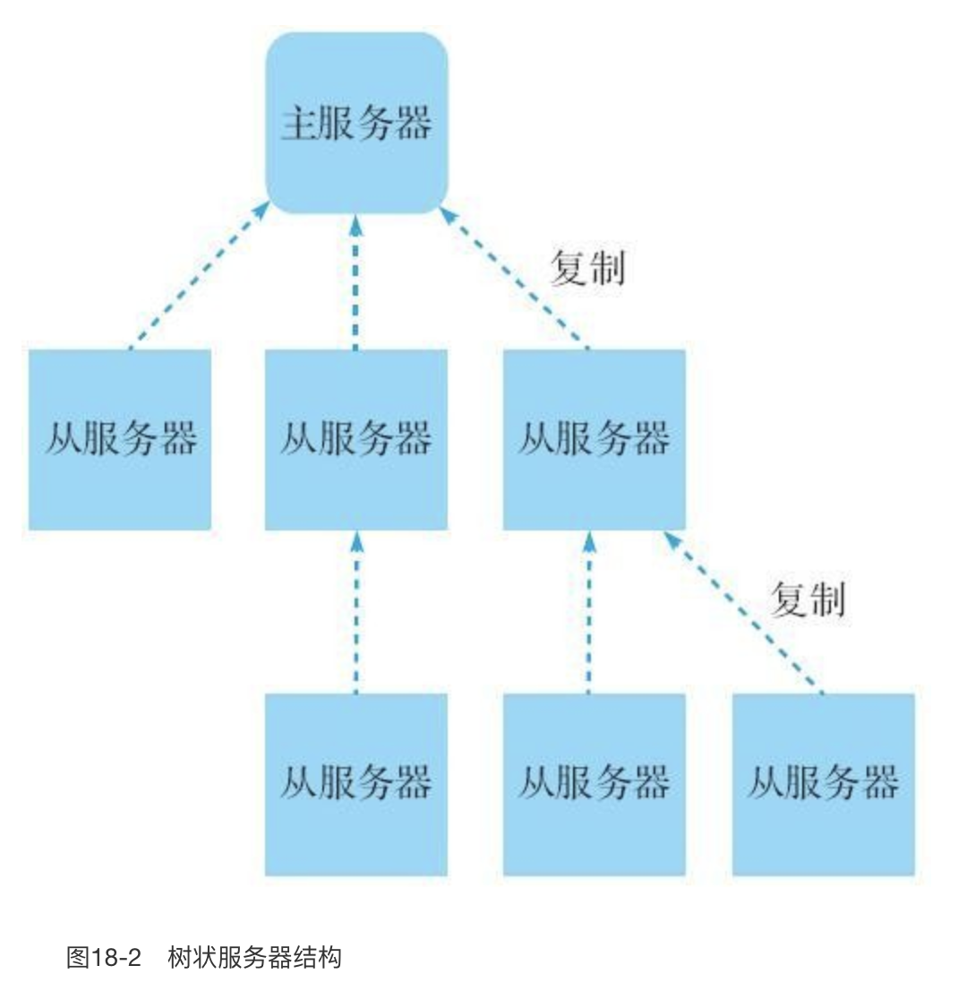
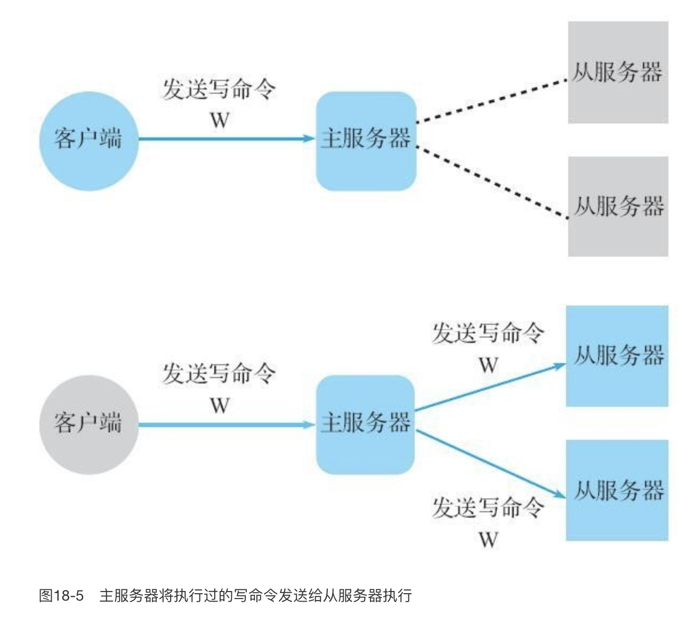

## 复制功能

- 树状的复制
- 一个从服务器只能从一个主服务器复制，但是一个主服务器的数据可以被多个从服务器复制
- 开启了复制功能的从服务器不能进行写操作，只能进行读操作

主服务器每次进行了写操作之后，就将写操作发给从服务器去同步

## 哨兵模式

首先，哨兵模式顾名思义就是：一个或者多个节点（哨兵）去定时探测主节点是否挂了，如果有哨兵发现主节点挂了（不一定真的挂了，可能是这个哨兵自己网络不行），它就去跟其它哨兵交换意见：你们觉得主节点是不是挂了？其它哨兵肯定有人认为主节点挂了，有人认为没有挂。最后收集完了意见之后统计数量，比如我们配置 quorum 等于 2 则表示只要有 2 个哨兵觉得主节点挂了，就认为它真的挂了，就要开始选举出一个哨兵的代表，让它去进行故障转移。一般 quorum 配置是哨兵数量的一半加1，也就是说 3 个哨兵就配置为 2，5 个哨兵配置为 3（哨兵数量一般是奇数，这是为了选举算法的考虑）

哨兵的工作过程：

- 每隔10秒，每个 Sentinel 节点会向主节点和从节点发送 info  命令获取最新的拓扑结构，有以下作用
  - 获取从节点信息
  - 新的从节点加入后，可以被 Sentinel 感知
  - 节点不可达后，也可以被感知
- 每隔  2 秒，每个 Sentinel 节点会向 Redis 数据节点的 `__sentinel__:hello` 频道上发送该 Sentinel 节点对于主节点的判断以及当前 Sentinel 节点的信息，同时每个 Sentinel 节点也会订阅该频道，来了解其他 Sentinel 节点以及它们对主节点的判断，所以这个频道主要有两个功能
  - 发现新的Sentinel节点
  - Sentinel节点之间交换主节点的状态
- 每隔1秒，每个Sentinel节点会向主节点、从节点、其余Sentinel节点发送一条ping命令做一次心跳检测，来确认这些节点当前是否可达。

哨兵的选举思路：

- 每个在线的Sentinel节点都有资格成为领导者，当它确认主节点主观下线 时候，会向其他Sentinel节点发送sentinel is-master-down-by-addr命令，要求将自己设置为领导者。
- 收到命令的Sentinel节点，如果没有同意过其他 Sentinel 节点的 sentinel is-master-down-by-addr 命令，将同意该请求，否则拒绝。
- 如果该Sentinel节点发现自己的票数已经大于等于max(quorum， num(sentinels)/2+1)，那么它将成为领导者。
- 如果此过程没有选举出领导者，将进入下一次选举。

## 缓存

缓存的好处：

- 加速读写
- 降低数据库的负载

缓存的坏处：

- 数据不一致
- 代码维护成本
- redis 运维的成本

使用场景：

- 开销大的计算，比如很复杂的 SQL 语句，重复计算显然是不合理的，能缓存的话还是应该缓存下来
- 加速读取。不管怎么说，读数据库还是要慢很多，所以使用 redis 的话读取快很多

### 缓存使用策略

- LRU/LFU/FIFO算法剔除
  - 这些算法是为了在**达到最大内存的时候，选择删掉哪些 key**，当然你乱删一直删除到小于最大内存限制也是可以的，但是肯定是不够聪明的
  - LRU：最近最少使用，表示删除最长时间没使用过的 key
  - LFU：最不经常使用，表示删除最近一段时间访问次数最少的 key
    - 上面两者的区别可以这样来理解：比如考虑（右边的访问时间最晚，也就是最新的访问） AAAAABAAAAAAB，这个访问顺序的话，A 显然是最长时间没被用过的（B才是最新被访问的），那么 LRU 要删除一个键就会选 A
    - 而如果使用 LFU 的话，上面的序列中，最近最不经常使用的是 B，因为我们其实只访问了它两次，只不过在我们统计的时候它走狗屎运是最新的一次访问。但是按照频率来计算，我们就应该删除掉 B
  - FIFO 先入先出就没什么好说的了
  - 这些算法的一致性是很差的，因为开发人员无法控制哪些 key 会被删除
  - 维护成本不高，只需要选择一个策略就行了
- 超时删除
  - 超时删除就是给键设置过期时间，时间到了就被删了（实际上不是，可能到了我们再次访问的时候才被删除，redis 平时可能懒得耗费CPU去删除）
  - 一段的时间窗口内存在数据不一致
  - 维护成本不高，设置过期时间即可
- 主动更新
  - 真实数据更新后，立即主动更新缓存
  - 一致性高，但是如果负责更新的那个线程突然挂了，可能这个过期数据还会接着存在很久，所以还需要结合超时删除一起使用
  - 维护成本比较高，要自己更新还要保证正确性
- 最佳实践
  - 低一致性业务建议配置最大内存和淘汰策略的方式使用。
  - 高一致性业务可以结合使用超时剔除和主动更新，这样即使主动更新出了问题，也能保证数据过期时间后删除脏数据。

### 防止缓存穿透

缓存穿透：查询的数据在 redis 里不存在，然后我们理所当然就要去查数据库，结果数据库里其实也没有。如果我们就构造一大堆你缓存里没有的数据呢？那我就得不停的去查数据库，这样就跟没缓存是一样的了，数据库可能炸了。

优化方案：

- 当查询到数据库，数据库也没有的时候，就把空对象（某个代表这个值是空的值）缓存到 redis 里。那么下次查询的时候就会在 redis 命中一个空对象，业务层处理知道是个空的就返回了
- 这种情况避免了数据库的爆炸，但是我们可以把redis撑爆，因为你缓存了一堆你本来没有的数据
- 解决方案是把这种空值的缓存设置一个较短的过期时间
- 这种时候就是 redis 帮 mysql 顶住了一部分压力，但是又不会把自己累死
- 上面是一个层面的优化，第二个优化是用布隆过滤器，把存在的数据用布隆过滤器包起来，每个查询过来了先布隆过滤器过滤一下。这样可以过滤掉大部分不应该存在的请求。
- 剩下的一部分其实也有部分是不存在的（布隆过滤器过滤了的肯定是真的应该被过滤的，但是没被过滤的也有可能是应该被过滤的，也就是说布隆过滤器有漏网之鱼），但是并不多，这个时候已经足够顶住压力了
- 两种方案可以结合使用

### 缓存和数据库的一致性

[https://www.jianshu.com/p/dd8d3c4b8282](https://www.jianshu.com/p/dd8d3c4b8282)

[https://www.cnblogs.com/liuqingzheng/p/11080680.html](https://www.cnblogs.com/liuqingzheng/p/11080680.html)

总结：

- 查询命中就返回
- 查询未命中去数据库查，查到就更新缓存，设置过期时间
- 更新时，更新数据库，然后让缓存失效

