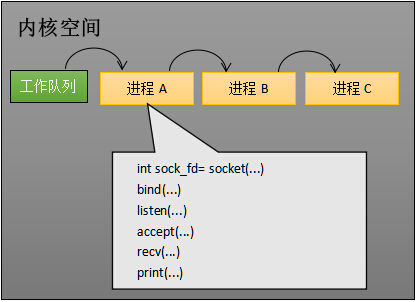
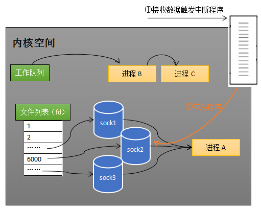

## 参考

- [https://zhuanlan.zhihu.com/p/63179839](https://zhuanlan.zhihu.com/p/63179839)
- [https://zhuanlan.zhihu.com/p/64138532](https://zhuanlan.zhihu.com/p/64138532)
- [https://zhuanlan.zhihu.com/p/64746509](https://zhuanlan.zhihu.com/p/64746509)

## 阻塞的原理

### 工作队列

所有正在运行的进程，处于内核的工作队列中，然后按照一定的调度算法进行调度

### 等待队列

当进程A执行到创建socket的语句时，操作系统会创建一个由文件系统管理的socket对象（如下图）。这个socket对象包含了发送缓冲区、接收缓冲区、等待队列等成员。等待队列是个非常重要的结构，它指向所有需要等待该socket事件的进程。

> 说白了就是，某个 socket 的等待队列，存储的都是进程，表示这个队列里的进程都阻塞在这个 socket 上，当 socket 出现某些事件的时候（比如来数据了），操作系统是通过中断知道的，知道了之后就会去唤醒等待队列上的进程。
>
> 所以我们在进程阻塞在某个 socket 的时候，是**需要将进程添加到 socket 的等待队列上**的，这也就是 select 的效率较低的根本原因了

当程序执行到 socket 的一些阻塞操作时，操作系统会将进程A从工作队列移动到该 socket 的等待队列中（如下图）。由于工作队列只剩下了进程 B 和 C，依据进程调度，cpu 会轮流执行这两个进程的程序，不会执行进程 A 的程序。**所以进程A被阻塞，不会往下执行代码，也不会占用cpu资源**。

### 唤醒进程

当 socket 接收到数据后，操作系统将该 socket 等待队列上的进程重新放回到工作队列，该进程变成运行状态，继续执行代码。也由于 socket 的接收缓冲区已经有了数据，recv 可以返回接收到的数据。

### 总结

- CPU 只调度工作队列里的进程

- 进程执行一些阻塞在 socket 的操作时，执行以下步骤：

  - 进程从工作队列中移除
  - 进程加入到 socket 的等待队列中

- socket 接收到数据的时候，执行以下步骤

  - 数据存入到接收缓冲区
  - 唤醒 socket 的等待队列里的所有进程：实质就是将进程从 socket 的等待列表中移除，添加到内核的工作队列中

  

## select

### 基本使用

- select 调用传入一组文件描述符，表示需要监听这一组 socket 集合
- 阻塞直到这组 socket 有新数据接收
- 返回接收到了数据的 socket 的数量
- 遍历这组 socket，使用非阻塞的读取来一个一个遍历读取

> 最后一步是因为 select 返回我们并不知道到底是哪些 socket 有接收到数据，所以只能遍历

### 基本原理

- select 调用传入一组文件描述符，当前进程阻塞
  - 操作系统接收一组文件描述符，将当前调用这个 select 的进程，从工作队列移除
  - 遍历这一组文件描述符，对于每一个文件描述符，都将当前进程添加到该文件描述符的等待队列中
  - 因此这是一个 O(n) 的重操作，因为每个文件描述符的的等待队列，一个 n 个等待队列都要添加这个进程
- 当某个或者某些 socket 接收到数据时，当前进程被唤醒
  - 将当前进程从这组 socket 的所有等待队列里移除，然后添加到内核的工作队列中
  - 这一步也是个 O(n) 的重操作，需要遍历 n 个等待队列，然后执行删除操作
- 自行遍历这组 socket，以确定哪些 socket 有新数据
  - 这又是一个 O(n) 的遍历操作

### 总结

select 最根本的性能低的原因是：

- 每次要传入一组文件描述符，操作系统需要遍历去修改它里面每个文件描述符的等待队列，这种每次都是 O(n) 的操作。
- 另外我们不知道哪些 socket 接收了数据，所以最后我们在进程里还需要遍历 socket 集合，这又是个 O(n) 的操作
- 正是因为遍历操作开销大，出于效率的考量，才会规定 select 的最大监视数量，默认只能监视 1024 个 socket

## epoll

### 设计思路

select 低效的一个原因就是：维护一组需要监视的 socket、进程阻塞在这些 socket 上，这两个步骤是耦合的一起进行的，操作系统每次都需要去遍历这组 socket，然后更新它们的等待队列。

epoll 的思路就是：

- 先聚合这组 socket，创建一个 epoll fd（只被创建一次），添加我们要监视的 socket 到这个 epoll fd
- 我们只监视 epoll fd，进程被阻塞在 epoll fd 的等待队列上
- 当某个 socket 接收到数据时：
  - 通知这个 epoll fd（socket 映射到 epoll fd，O(1) 的操作，使用类似 hashMap 的结构）
  - 将 socket 添加到 epoll fd 的就绪列表中
- 将进程从 epoll fd 的等待队列中移除，添加到内核的工作队列中
- 进程读取  epoll fd 的就绪列表

### 原理图

