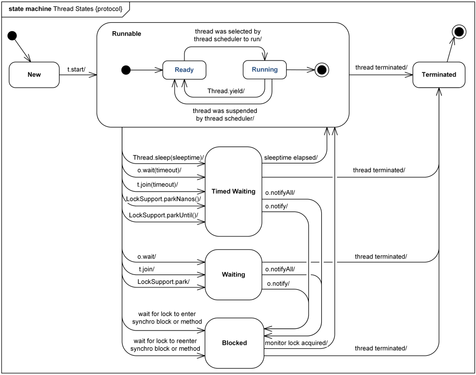
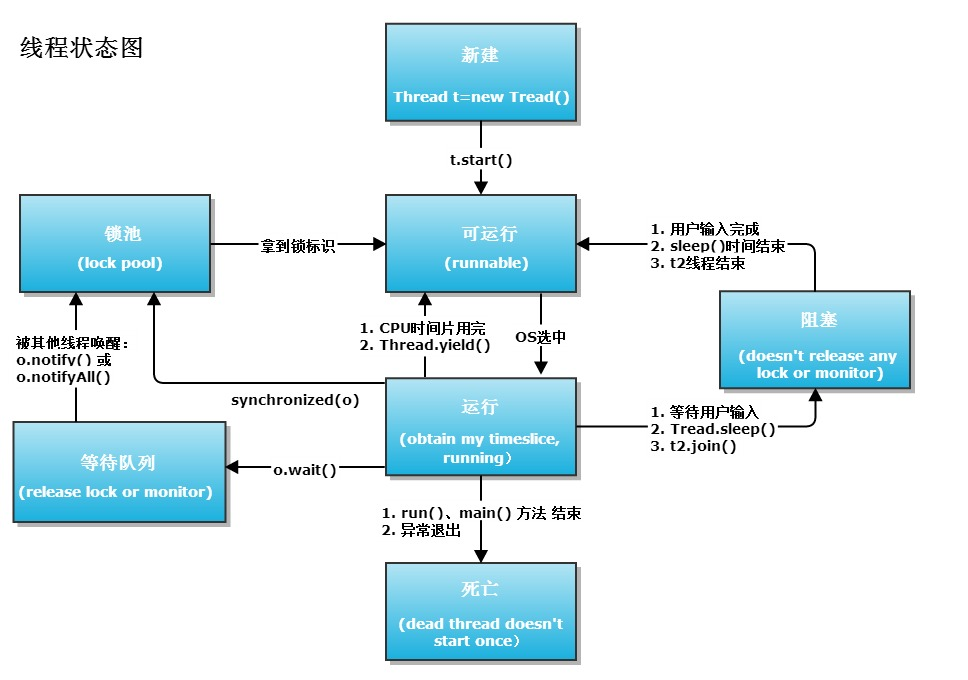

## 线程状态

参考：[https://my.oschina.net/goldenshaw?tab=newest&catalogId=3277710](https://my.oschina.net/goldenshaw?tab=newest&catalogId=3277710)

```java
    public enum State {
        /**
         * Thread state for a thread which has not yet started.
         */
        NEW,

        /**
         * Thread state for a runnable thread.  A thread in the runnable
         * state is executing in the Java virtual machine but it may
         * be waiting for other resources from the operating system
         * such as processor.
         */
        RUNNABLE,

        /**
         * Thread state for a thread blocked waiting for a monitor lock.
         * A thread in the blocked state is waiting for a monitor lock
         * to enter a synchronized block/method or
         * reenter a synchronized block/method after calling
         * {@link Object#wait() Object.wait}.
         */
        BLOCKED,

        /**
         * Thread state for a waiting thread.
         * A thread is in the waiting state due to calling one of the
         * following methods:
         * <ul>
         *   <li>{@link Object#wait() Object.wait} with no timeout</li>
         *   <li>{@link #join() Thread.join} with no timeout</li>
         *   <li>{@link LockSupport#park() LockSupport.park}</li>
         * </ul>
         *
         * <p>A thread in the waiting state is waiting for another thread to
         * perform a particular action.
         *
         * For example, a thread that has called <tt>Object.wait()</tt>
         * on an object is waiting for another thread to call
         * <tt>Object.notify()</tt> or <tt>Object.notifyAll()</tt> on
         * that object. A thread that has called <tt>Thread.join()</tt>
         * is waiting for a specified thread to terminate.
         */
        WAITING,

        /**
         * Thread state for a waiting thread with a specified waiting time.
         * A thread is in the timed waiting state due to calling one of
         * the following methods with a specified positive waiting time:
         * <ul>
         *   <li>{@link #sleep Thread.sleep}</li>
         *   <li>{@link Object#wait(long) Object.wait} with timeout</li>
         *   <li>{@link #join(long) Thread.join} with timeout</li>
         *   <li>{@link LockSupport#parkNanos LockSupport.parkNanos}</li>
         *   <li>{@link LockSupport#parkUntil LockSupport.parkUntil}</li>
         * </ul>
         */
        TIMED_WAITING,

        /**
         * Thread state for a terminated thread.
         * The thread has completed execution.
         */
        TERMINATED;
    }
```

- new
  - 还没有调用 start 的线程，也就是我们刚创建的时候
- runnable
  - 处于 runnable 状态下的线程正在 Java 虚拟机中执行，但它**可能正在等待**来自于操作系统的其它资源，比如处理器。
- blocked
  - 正在等待监视器锁的状态
  - 进入 synchronized 块的时候首先处于这一状态，等着获取锁
  - 调用 `Object.wait()` 之后，被唤醒（notify）了之后重新进入同步块，那么就又进入了 blocked 状态
- waiting
  - 不带参数的 `Object.wait()` 方法
  - 不带参数的 `Thread.join()` 方法
  - `LockSupport.park()` 方法
  - 以上方法导致进入 waiting 状态
- timed_waiting
  - `Thread.sleep()`
  - 带参数的 `Object.wait(time)` 方法
  - 带参数的 `Thread.join(time)` 方法
  - `LockSupport.parkNanos()` `LockSupport.parkUntil()` 这类带时间的方法
- terminated
  - 结束状态






### 总结

等待锁的状态就是 blocked，例如第一次进入 synchronized 块竞争的时候，或者 wait 了之后又被 notify 叫醒了再次进入 synchronized 块的时候。

当我们 IO 阻塞的时候是什么状态呢？其实是 Runnable 状态，这个是 JVM 层面的线程状态，实际上反映到底层操作系统线程的状态其实是 waiting 状态。

因此，JVM 和 操作系统的线程状态对应如下


所以为什么说锁的消耗大：因为锁导致 JVM 线程进入了 blocked 状态，而反映到底层就是 waiting 状态，这个是需要进行系统调用的。

一旦进行系统调用就必须进入内核态，操作系统就要保存一堆上下文，导致效率低下。

因此：我们在进入 synchronized 块这种锁的时候，并不会立刻就进入 blocked 状态，而是先多试着去获取几次，实在是获取不到，我才使用系统调用对操作系统说：让我睡一会儿，有人释放锁了再叫我

（如果不主动调用系统调用将自己阻塞的话，就只能用循环的方式让自己进行忙等待了，那 CPU 就被白白浪费了，自旋锁也算是一种忙等，但是它只自旋少数次，用少量CPU损耗来避免线程切换的系统调用损耗）


## JVM 对锁的优化

### 不优化的时候是什么样子

很多资料都是在说 JVM 对锁的优化的具体措施，但是都不怎么谈不优化的时候是什么样子，我觉得我可以梳理一下自己的理解

根据线程状态里的描述，多个线程进入同步块的时候，会去争抢这个锁，那么：

- 抢到锁的线程只有一个
- 抢不到锁的线程应该怎么办？

不优化的时候，抢不到锁的线程直接进入 blocked 状态（JVM 线程状态）。

也就是说调用系统调用，将自己进入到 waiting 状态（操作系统线程状态），由于这里要进行系统调用，因此就导致了性能低下，因为操作系统要进行上下文切换，保存上下文一大堆的工作。

### 自旋锁

由于上面不优化的时候性能很低，那么怎么办呢？其中自旋锁的思路就是：

- 一个线程拿到锁执行的可能很短
- 因此我可以等它运行完了这很短的持有锁的时间，自己再去拿锁
- 所以我就跑一段循环，让自己进行一段时间的 忙等待，拖过这一阵子

可以看到，自旋锁的主要思想就是，不直接进入 blocked 状态，而是进行一段时间的循环，实在是取不到锁了再进入到 blocked 状态

> 这里可以考虑调整 JVM 自旋锁的次数来验证一下线程状态（-XX：PreBlockSpin），比如设置自旋 1 亿次，那么应该可以看到一个线程没拿到 synchronized 锁，但是是 Runnable 而不是 blocked 状态
>
> 注：上面的参数已经删除了，1.6 开始只提供自适应自旋锁

JVM 现在有**自适应自旋锁**，就是：

- 如果一个线程在某个锁上自旋获取过锁，那么 JVM 倾向于后续获取锁的时候继续自旋，自旋次数会增加
- 如果在某个锁上自旋很少能获取到锁，JVM 就觉得自旋的作用可能不大，后续可能直接跳过去不自旋了

说白了就是会自行调整自旋的次数

### 锁消除

JIT 编译的时候发现某段代码其实没有锁的竞争，就会把锁给消掉

说白了就是运行时的一些逃逸分析来做的。如果判断到一段代码中，在堆上的所有数据都不会逃逸出去被其他线程访问到，那就可以把它们当作栈上数据对待，认为它们是线程私有的，同步加锁自然就无须再进行。

### 锁粗化

如果一系列的连续操作都对同一个对象反复加锁和解锁，甚至加锁操作是出现在循环体之中的，那即使没有线程竞争，频繁地进行互斥同步操作也会导致不必要的性能损耗。
如果虚拟机探测到有这样一串零碎的操作都对同一个对象加锁，将会把加锁同步的范围扩展（粗化）到整个操作序列的外部。

> 我理解是说：对于同一个锁零碎的频繁加锁，不如直接加一个大锁效率高。因为加锁的次数多，可能导致线程调度的次数多

### 轻量级锁

轻量级锁是相对于重量级锁而言的：

- 重量级锁就是说我们一开始 synchronized 的实现，底层是通过操作系统的互斥量这个 API 来实现的，一个线程拿到这个互斥量之后，其它线程当然就拿不到了，这个就是 synchronized 判断谁拿到锁的实现方式
- 轻量级锁则是 JDK 1.6 之后的一种实现 synchronized 的方式，先使用 CAS 把锁对象的 mark world 指向自己，如果失败了说明有人跟自己竞争，直接升级到重量级锁（把自己挂机起来）
- 这里升级重量级锁我理解就是让自己这个线程挂机（进入 blocked 状态），否则就只能空转了

> 轻量级锁适用于竞争很少的场景，实际上没多少竞争，所以靠一手 CAS 即可

### 偏向锁

- 当锁第一次被线程获取的时候，线程使用 CAS 把锁的拥有者改成自己的线程ID，同时设置它的标志位，表示这个锁处于偏向模式
- 以上表示：锁第一次被获取之前，从标志位可以看出不是偏向锁，所以线程会执行上面的操作
- 等到后面这个线程再获取这个对象的锁的时候，看到线程 ID 是自己，并且是偏向锁，那就直接拿走锁了
- 这个就消除了后续的线程的 CAS 操作
- 如果有其它线程在竞争，那么它看到这个锁是偏向锁了，并且不是指向自己的，就变成了一个轻量级锁，使用 CAS 将锁撤销偏向锁，此时就变成了一个轻量级锁

> 偏向锁主要也是适用于竞争少的场景


