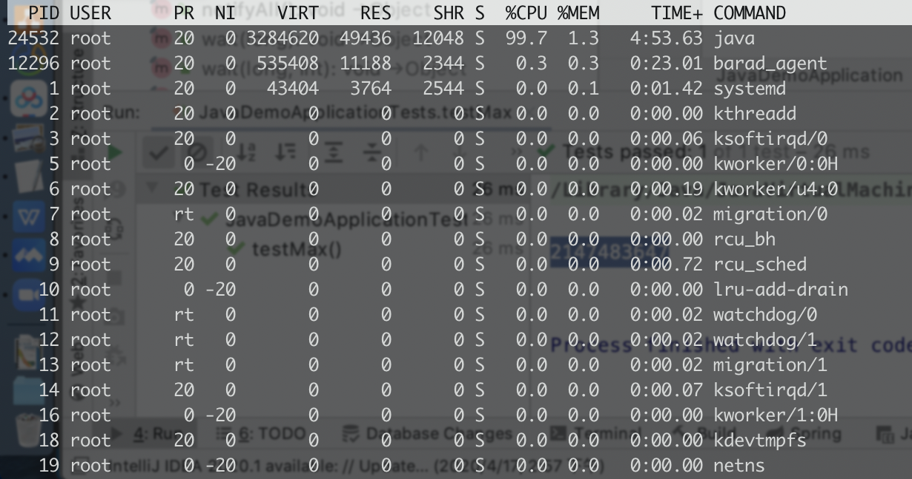
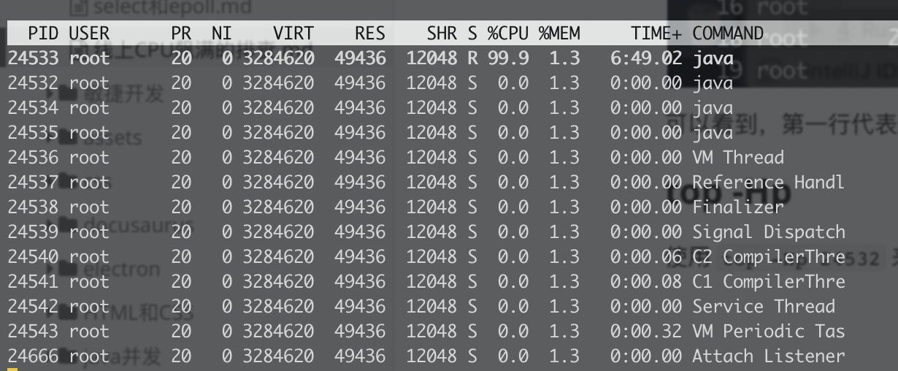
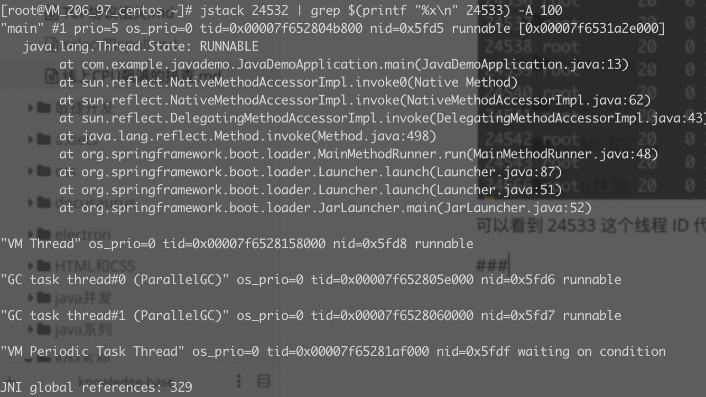

## 模拟一个死循环

```
    public static void main(String[] args) throws InterruptedException {
        while (true){

        }
    }
```


## 排查步骤

### top

执行 top 命令，查看 cpu 使用情况



可以看到，第一行代表的进程 24532 使用 CPU 接近 100%，command 是 java，也就是我们的 java 进程

### top -Hp

使用 `top -Hp 24532` 来查看这个进程里的线程占用 CPU 的情况



可以看到 24533 这个线程 ID 代表的线程占用了 100% 的 CPU

### jstack

使用 `jstack 24532 | grep $(printf "%x\n" 24533) -A 100` 查看线程堆栈，从中我们可以看到 

`JavaDemoApplication.java:13`

正好是我们死循环的那一行



这个命令的解释：

- 首先是 `jstack 24532` 查看 java 进程的线程堆栈（包含有所有线程）
- `$(printf "%x\n" 24533)` 是为了将线程 ID 转换成 16 进制，因为 java 线程的 nid 都是 16 进制的
- `grep $(printf "%x\n" 24533) -A 100`
  - 过滤出我们想要找的这个线程
  - 并且将它后面的 100 行的堆栈也打印出来

### 具体分析

后面就是去看堆栈去具体的分析了，是死锁了还是死循环了还是啥别的问题

